# 🚀 DevOps Introduction Course: Principles, Practices & Tooling

[](#-lab-based-learning-experience)
[](#-evaluation-framework)
[](#-lab-based-learning-experience)
[](#-course-roadmap)

Welcome to the **DevOps Introduction Course**, where you will gain a **solid foundation in DevOps principles and practical skills**.  
This course is designed to provide a comprehensive understanding of DevOps and its key components.  

Through **hands-on labs and lectures**, you’ll explore version control, software distribution, CI/CD, containerization, cloud computing, and beyond — the same workflows used by modern engineering teams.

---

## 📚 Course Roadmap

Practical modules designed for incremental skill development:

| #  | Module                              | Key Topics & Technologies                                                                                                 |
|----|-------------------------------------|--------------------------------------------------------------------------------------------------------------------------|
| 1  | **Introduction to DevOps**          | Core principles, essential tools, DevOps concepts                                                                        |
| 2  | **Version Control**                 | Collaborative development workflows, Git tooling                                                                         |
| 3  | **CI/CD**                           | Continuous integration/deployment practices                                                                              |
| 4  | **Networking & OS for DevOps**      | IP/DNS, firewalls, Linux fundamentals (shell/systemd/logs), permissions, troubleshooting, DevOps-friendly distros        |
| 5  | **Virtualization**                  | Virtualization concepts, benefits in modern IT infrastructures                                                           |
| 6  | **Containers**                      | Docker containerization, Kubernetes orchestration                                                                        |
| 7  | **GitOps & Progressive Delivery**   | Git as source of truth, Argo CD, canary/blue-green deployments, feature flags, rollbacks                                |
| 8  | **SRE & Resilience**                | SLOs/SLAs/SLIs, error budgets, incident management, chaos engineering, postmortems                                       |
| 9  | **Security in DevOps (DevSecOps)**  | Shift-left security, SAST/DAST, SBOM, container/image scanning (Trivy/Snyk), secret management                           |
| 10 | **Cloud Fundamentals**              | AWS/Azure/GCP basics, IaaS/PaaS/SaaS, regions/zones, pricing, core services (EC2/S3/IAM/VPC), cloud-native patterns      |
| 11 | **Bonus**                           | Web3 Infrastructure, decentralized storage, IPFS, Fleek                                                                 |

---

## 🗺️ DevOps Learning Journey

### 🌳 Skill Tree Structure

```mermaid
graph TB
    ROOT[🚀 DevOps Mastery] 
    
    %% Foundation Branch
    ROOT --- FOUND[🏗️ Foundation]
    FOUND --- A[📚 DevOps Intro<br/>• Principles<br/>• Culture<br/>• Tools Overview]
    FOUND --- B[🔄 Version Control<br/>• Git Workflows<br/>• Collaboration<br/>• PR/MR Process]
    
    %% Development Branch  
    ROOT --- DEV[👨‍💻 Development]
    DEV --- C[⚙️ CI/CD<br/>• GitHub Actions<br/>• Pipelines<br/>• Automation]
    DEV --- D[🖥️ Networking & OS<br/>• Linux Fundamentals<br/>• DNS/TCP/IP<br/>• System Analysis]
    
    %% Infrastructure Branch
    ROOT --- INFRA[🏗️ Infrastructure]
    INFRA --- E[💻 Virtualization<br/>• Hypervisors<br/>• VMs<br/>• Resource Management]
    INFRA --- F[📦 Containers<br/>• Docker<br/>• Kubernetes<br/>• Orchestration]
    
    %% Advanced Branch
    ROOT --- ADV[🎯 Advanced]
    ADV --- G[🚀 GitOps<br/>• ArgoCD<br/>• Progressive Delivery<br/>• Rollback Strategies]
    ADV --- H[🛡️ SRE<br/>• SLOs/SLIs<br/>• Incident Management<br/>• Chaos Engineering]
    
    %% Production Branch
    ROOT --- PROD[🌐 Production]
    PROD --- I[🔐 DevSecOps<br/>• Security Scanning<br/>• SAST/DAST<br/>• Secret Management]
    PROD --- J[☁️ Cloud<br/>• AWS/Azure/GCP<br/>• IaaS/PaaS/SaaS<br/>• Cloud-Native]
    
    %% Bonus Branch
    ROOT --- BONUS[⭐ Bonus]
    BONUS --- K[🌐 Web3<br/>• IPFS<br/>• Decentralized Storage<br/>• Fleek]
    
    %% Styling
    classDef rootStyle fill:#1a1a1a,stroke:#ffffff,stroke-width:3px,color:#ffffff
    classDef branchStyle fill:#2c3e50,stroke:#3498db,stroke-width:2px,color:#ffffff
    classDef foundationModule fill:#e8f8f5,stroke:#16a085,stroke-width:2px,color:#2c3e50
    classDef devModule fill:#fdf2e9,stroke:#e67e22,stroke-width:2px,color:#2c3e50
    classDef infraModule fill:#eaf2f8,stroke:#3498db,stroke-width:2px,color:#2c3e50
    classDef advModule fill:#f4ecf7,stroke:#9b59b6,stroke-width:2px,color:#2c3e50
    classDef prodModule fill:#fdedec,stroke:#e74c3c,stroke-width:2px,color:#2c3e50
    classDef bonusModule fill:#f0f3bd,stroke:#f1c40f,stroke-width:2px,color:#2c3e50
    
    class ROOT rootStyle
    class FOUND,DEV,INFRA,ADV,PROD,BONUS branchStyle
    class A,B foundationModule
    class C,D devModule
    class E,F infraModule
    class G,H advModule
    class I,J prodModule
    class K bonusModule
```


### 🏗️ Technology Stack Layers

```mermaid
flowchart LR
    subgraph "🌐 Production & Cloud"
        direction LR
        I[🔐 DevSecOps<br/>Security Integration]
        J[☁️ Cloud Platforms<br/>AWS/Azure/GCP]
        K[⭐ Web3 Technologies<br/>IPFS & Decentralized]
    end
    
    subgraph "🎯 Advanced DevOps"
        direction LR
        G[🚀 GitOps<br/>Progressive Delivery]
        H[🛡️ SRE<br/>Reliability Engineering]
    end
    
    subgraph "🏗️ Infrastructure Layer"
        direction LR
        E[💻 Virtualization<br/>VMs & Hypervisors]
        F[📦 Containers<br/>Docker & Kubernetes]
    end
    
    subgraph "🔧 Development Layer"
        direction LR
        C[⚙️ CI/CD<br/>Automation Pipelines]
        D[🖥️ Systems & Network<br/>Linux Fundamentals]
    end
    
    subgraph "🏗️ Foundation Layer"
        direction LR
        A[📚 DevOps Principles<br/>Culture & Mindset]
        B[🔄 Version Control<br/>Git & Collaboration]
    end
    
    A --> C
    B --> C
    C --> E
    D --> E
    D --> F
    E --> F
    F --> G
    F --> H
    G --> I
    H --> I
    I --> J
    J --> K
    
    classDef foundation fill:#e8f6f3,stroke:#1abc9c,stroke-width:3px,color:#2c3e50
    classDef development fill:#fef9e7,stroke:#f39c12,stroke-width:3px,color:#2c3e50
    classDef infrastructure fill:#eaf2f8,stroke:#3498db,stroke-width:3px,color:#2c3e50
    classDef advanced fill:#f4ecf7,stroke:#9b59b6,stroke-width:3px,color:#2c3e50
    classDef production fill:#fdedec,stroke:#e74c3c,stroke-width:3px,color:#2c3e50
    
    class A,B foundation
    class C,D development
    class E,F infrastructure
    class G,H advanced
    class I,J,K production
```


---

## 🛠 Lab-Based Learning Experience

**80% of your grade comes from hands-on labs** — each designed to build real-world skills:

1. **Lab Structure**

   * Task-oriented challenges with clear objectives
   * Safe environments using containers or local VMs

2. **Submission Workflow**

   * Fork course repository → Create lab branch → Complete tasks
   * Push to fork → Open PR to **course repo main branch** → Copy PR URL
   * **Submit PR link via Moodle before deadline** → Receive feedback & evaluation

3. **Grading Advantage**

   * **Perfect Lab Submissions (10/10)**: Exam exemption + bonus points
   * **On-Time Submissions (≥6/10)**: Guaranteed pass (C or higher)
   * **Late Submissions**: Maximum 6/10

4. **Detailed Submission Process**

   ```bash
   # 1. Fork the course repository to your GitHub account
   # 2. Clone your fork locally
   git clone https://github.com/YOUR_USERNAME/REPO_NAME.git
   cd REPO_NAME
   
   # 3. Create and work on your lab branch
   git switch -c feature/labX
   # Complete lab tasks, create submission files
   git add labs/submissionX.md
   git commit -m "docs: add labX submission"
   git push -u origin feature/labX
   
   # 4. Open PR from your fork → course repository main branch
   # 5. Copy the PR URL and submit via Moodle before deadline
   ```

   **Important:** PRs must target the **course repository's main branch**, not your fork's main branch.

---

## 📊 Evaluation Framework

*Transparent assessment for skill validation*

### Grade Composition

* Labs (10 × 8 points each): **80%**
* Final Exam (comprehensive): **20%**

### Performance Tiers

* **A (90-100)**: Mastery of core concepts, innovative solutions
* **B (75-89)**: Consistent completion, minor improvements needed
* **C (60-74)**: Basic competency, needs reinforcement
* **D (0-59)**: Fundamental gaps, re-attempt required

---

## ✅ Success Path

> *"Complete all labs with ≥6/10 to pass. Perfect lab submissions grant exam exemption and bonus points toward an A."*

---
