```mermaid
flowchart LR
    subgraph "🌐 Production & Cloud"
        direction LR
        I[🔐 Week 9: DevSecOps<br/>OWASP ZAP & Trivy]
        J[☁️ Week 10: Cloud<br/>AWS/Azure/GCP]
    end
    
    subgraph "⭐ Bonus: Cutting Edge"
        direction LR
        K[🌐 IPFS/4EVERLAND<br/>Decentralized Web]
        L[⚡ WASM Containers<br/>Performance & Edge]
    end
    
    subgraph "🎯 Advanced DevOps"
        direction LR
        G[🚀 Week 7: GitOps<br/>Reconciliation & Drift]
        H[🛡️ Week 8: SRE<br/>Monitoring & Reliability]
    end
    
    subgraph "🏗️ Infrastructure Layer"
        direction LR
        E[💻 Week 5: Virtualization<br/>VirtualBox & VMs]
        F[📦 Week 6: Containers<br/>Docker Fundamentals]
    end
    
    subgraph "🔧 Development Layer"
        direction LR
        C[⚙️ Week 3: CI/CD<br/>GitHub Actions]
        D[🖥️ Week 4: Systems<br/>Linux & Networking]
    end
    
    subgraph "🏗️ Foundation Layer"
        direction LR
        A[📚 Week 1: DevOps<br/>Principles & Git]
        B[🔄 Week 2: Git Advanced<br/>Version Control Mastery]
    end
    
    A --> C
    B --> C
    C --> E
    D --> E
    D --> F
    E --> F
    F --> G
    F --> H
    G --> I
    H --> I
    I --> J
    J -.-> K
    J -.-> L
    
    classDef foundation fill:#e8f6f3,stroke:#1abc9c,stroke-width:3px,color:#2c3e50
    classDef development fill:#fef9e7,stroke:#f39c12,stroke-width:3px,color:#2c3e50
    classDef infrastructure fill:#eaf2f8,stroke:#3498db,stroke-width:3px,color:#2c3e50
    classDef advanced fill:#f4ecf7,stroke:#9b59b6,stroke-width:3px,color:#2c3e50
    classDef production fill:#fdedec,stroke:#e74c3c,stroke-width:3px,color:#2c3e50
    classDef bonus fill:#fff3cd,stroke:#f1c40f,stroke-width:3px,color:#2c3e50
    
    class A,B foundation
    class C,D development
    class E,F infrastructure
    class G,H advanced
    class I,J production
    class K,L bonus
```

# 🚀 DevOps Introduction Course: Principles, Practices & Tooling

[](#-lab-based-learning-experience)
[](#-evaluation-framework)
[](#-lab-based-learning-experience)
[](#-course-roadmap)

Welcome to the **DevOps Introduction Course**, where you will gain a **solid foundation in DevOps principles and practical skills**.  
This course is designed to provide a comprehensive understanding of DevOps and its key components.  

Through **hands-on labs and lectures**, you'll explore version control, software distribution, CI/CD, containerization, cloud computing, and beyond — the same workflows used by modern engineering teams.

---

## 📚 Course Roadmap

**10-week intensive course** with practical modules designed for incremental skill development:

| Week | Lab | Module                              | Key Topics & Technologies                                                                                                 |
|------|-----|-------------------------------------|--------------------------------------------------------------------------------------------------------------------------|
| 1    | 1   | **Introduction to DevOps**          | Core principles, Git workflow, SSH commit signing, PR templates                                                          |
| 2    | 2   | **Version Control & Advanced Git**  | Object model, reset/reflog, history visualization, tagging, modern Git commands                                          |
| 3    | 3   | **CI/CD with GitHub Actions**       | Workflow creation, triggers, logs, system information, automation pipelines                                              |
| 4    | 4   | **Networking & OS for DevOps**      | System analysis, boot performance, networking diagnostics, DNS, packet capture                                           |
| 5    | 5   | **Virtualization**                  | VirtualBox setup, VM deployment, system information discovery                                                            |
| 6    | 6   | **Containers with Docker**          | Container lifecycle, image management, networking, volumes, persistence                                                  |
| 7    | 7   | **GitOps Fundamentals**             | Reconciliation loops, drift detection, health monitoring, declarative configuration                                      |
| 8    | 8   | **SRE & Monitoring**                | System metrics, SLAs, website monitoring (Checkly), alerting, reliability engineering                                    |
| 9    | 9   | **DevSecOps Tools**                 | OWASP ZAP, Trivy scanning, vulnerability analysis, security integration                                                  |
| 10   | 10  | **Cloud Computing Fundamentals**    | Artifact registries (AWS/GCP/Azure), serverless platforms comparison                                                     |
| —    | 11  | **🎁 Bonus: Web3 Infrastructure**   | IPFS node setup, decentralized storage, 4EVERLAND deployment, content addressing                                         |
| —    | 12  | **🎁 Bonus: WASM Containers**       | WebAssembly containers, performance comparison, Spin framework, edge computing                                           |

> **Note:** Labs 11-12 are **optional bonus labs** for extra credit. Complete them to boost your grade or explore cutting-edge technologies!

---

## 🗺️ DevOps Learning Journey

```mermaid
graph TB
    ROOT[🚀 DevOps Mastery] 
    
    %% Foundation Branch
    ROOT --- FOUND[🏗️ Foundation]
    FOUND --- A[📚 Week 1: DevOps Intro<br/>• Principles<br/>• Git Workflow<br/>• PR Templates]
    FOUND --- B[🔄 Week 2: Version Control<br/>• Advanced Git<br/>• History Management<br/>• Modern Commands]
    
    %% Development Branch  
    ROOT --- DEV[👨‍💻 Development]
    DEV --- C[⚙️ Week 3: CI/CD<br/>• GitHub Actions<br/>• Pipelines<br/>• Automation]
    DEV --- D[🖥️ Week 4: Networking & OS<br/>• Linux Fundamentals<br/>• DNS/TCP/IP<br/>• System Analysis]
    
    %% Infrastructure Branch
    ROOT --- INFRA[🏗️ Infrastructure]
    INFRA --- E[💻 Week 5: Virtualization<br/>• VirtualBox<br/>• VMs<br/>• System Discovery]
    INFRA --- F[📦 Week 6: Containers<br/>• Docker<br/>• Networking<br/>• Volumes]
    
    %% Advanced Branch
    ROOT --- ADV[🎯 Advanced]
    ADV --- G[🚀 Week 7: GitOps<br/>• Reconciliation<br/>• Drift Detection<br/>• Health Monitoring]
    ADV --- H[🛡️ Week 8: SRE<br/>• Monitoring<br/>• SLAs/SLOs<br/>• Reliability]
    
    %% Production Branch
    ROOT --- PROD[🌐 Production]
    PROD --- I[🔐 Week 9: DevSecOps<br/>• OWASP ZAP<br/>• Trivy<br/>• Security Scanning]
    PROD --- J[☁️ Week 10: Cloud<br/>• AWS/Azure/GCP<br/>• Registries<br/>• Serverless]
    
    %% Bonus Branch
    ROOT --- BONUS[⭐ Bonus Labs]
    BONUS --- K[🌐 Lab 11: IPFS/4EVERLAND<br/>• Decentralized Storage<br/>• Web3 Hosting<br/>• Content Addressing]
    BONUS --- L[⚡ Lab 12: WASM Containers<br/>• WebAssembly<br/>• Performance<br/>• Edge Computing]
    
    %% Styling
    classDef rootStyle fill:#1a1a1a,stroke:#ffffff,stroke-width:3px,color:#ffffff
    classDef branchStyle fill:#2c3e50,stroke:#3498db,stroke-width:2px,color:#ffffff
    classDef foundationModule fill:#e8f8f5,stroke:#16a085,stroke-width:2px,color:#2c3e50
    classDef devModule fill:#fdf2e9,stroke:#e67e22,stroke-width:2px,color:#2c3e50
    classDef infraModule fill:#eaf2f8,stroke:#3498db,stroke-width:2px,color:#2c3e50
    classDef advModule fill:#f4ecf7,stroke:#9b59b6,stroke-width:2px,color:#2c3e50
    classDef prodModule fill:#fdedec,stroke:#e74c3c,stroke-width:2px,color:#2c3e50
    classDef bonusModule fill:#fff3cd,stroke:#f1c40f,stroke-width:2px,color:#2c3e50
    
    class ROOT rootStyle
    class FOUND,DEV,INFRA,ADV,PROD,BONUS branchStyle
    class A,B foundationModule
    class C,D devModule
    class E,F infraModule
    class G,H advModule
    class I,J prodModule
    class K,L bonusModule
```

<details>
<summary>🌳 View Skill Tree Structure</summary>



</details>

<details>
<summary>🏗️ View Technology Stack Layers</summary>



</details>

---

## 🛠 Lab-Based Learning Experience

**Your grade comes from labs and exam** — with flexible paths to success.

> **Key Points:**
> - **10 required labs** provide 80% of possible grade points
> - **Bonus labs (11-12)** can add up to 22 extra points maximum
> - **Labs 11 and 12 can substitute for the exam** if completed
> - **Completing only 10 required labs = 80% maximum** (without exam or bonus)

### Lab Structure

* **Required Labs (1-10):** Core curriculum covering essential DevOps skills
* **Bonus Labs (11-12):** Optional advanced topics for extra credit
* **Task-oriented challenges** with clear objectives and deliverables
* **Safe environments** using containers, local VMs, or cloud platforms
* **Real-world workflows** mirroring professional DevOps practices
* **Progressive difficulty** building on previous labs

### Lab Overview

<details>
<summary>📋 View All Lab Topics</summary>

**Required Labs (Weeks 1-10):**

1. **Introduction to DevOps** — Git workflow, SSH signing, PR templates
2. **Version Control & Advanced Git** — Object model, reset/reflog, modern commands
3. **CI/CD with GitHub Actions** — Workflows, triggers, automation
4. **Networking & OS** — System analysis, diagnostics, packet capture
5. **Virtualization** — VirtualBox, VM deployment, system discovery
6. **Containers** — Docker lifecycle, networking, volumes, persistence
7. **GitOps Fundamentals** — Reconciliation, drift detection, monitoring
8. **SRE & Monitoring** — Metrics, SLAs, Checkly, reliability engineering
9. **DevSecOps Tools** — OWASP ZAP, Trivy, vulnerability scanning
10. **Cloud Computing** — AWS/GCP/Azure registries, serverless platforms

**Bonus Labs (Optional):**

11. **🎁 IPFS & 4EVERLAND** — Decentralized storage, Web3 hosting, content addressing
12. **🎁 WASM Containers** — WebAssembly performance, Spin framework, edge computing

> **Bonus Lab Benefits:**
> - Extra credit toward final grade
> - Explore cutting-edge technologies
> - Gain competitive advantage in job market
> - Optional but highly recommended for A-grade students

</details>

### Submission Workflow


<details>
<summary>📋 Detailed Submission Process</summary>

**Step-by-Step Guide:**

1. **Fork the course repository** to your GitHub account

2. **Clone your fork locally:**
   ```bash
   git clone https://github.com/YOUR_USERNAME/REPO_NAME.git
   cd REPO_NAME
   ```

3. **Create and work on your lab branch:**
   ```bash
   git switch -c feature/labX
   # Complete lab tasks, create submission files
   git add labs/submissionX.md
   git commit -m "docs: add labX submission"
   git push -u origin feature/labX
   ```

4. **Open PR from your fork → course repository main branch**
   - Navigate to the course repository on GitHub
   - Click "New Pull Request"
   - Select: `base: course-repo/main` ← `compare: your-fork/feature/labX`
   - Fill in the PR template with task completion checklist

5. **Copy the PR URL and submit via Moodle before deadline**

**⚠️ Important:** PRs must target the **course repository's main branch**, not your fork's main branch.

</details>

### Grading Policy

<details>
<summary>🎯 Lab Grading Breakdown</summary>

**Each required lab (1-10) is worth 10 points:**

* **Perfect Submissions (10/10):**
  - All tasks completed with thorough documentation
  - Clear analysis and understanding demonstrated
  - Code/commands work correctly
  - Submitted on time
  - **Benefit:** Counts toward exam exemption

* **Strong Submissions (8-9/10):**
  - All tasks completed with minor issues
  - Good documentation and analysis
  - Minor improvements needed

* **Passing Submissions (6-7/10):**
  - Core tasks completed
  - Basic documentation present
  - Some areas need improvement

* **Below Passing (<6/10):**
  - Incomplete tasks
  - Insufficient documentation
  - Major gaps in understanding

**Bonus Labs (11-12):**
- Worth up to **12 points each**
- **Maximum 22 bonus points total** (capped to maintain grade scale)
- **Can replace the exam requirement** if both completed
- Same quality standards as required labs
- No penalty for not completing them

**Late Submissions (Required Labs Only):**
- Maximum score: 6/10
- Accepted within 1 week after deadline
- No credit after 1 week
- Does not apply to bonus labs

</details>

<details>
<summary>🏆 Exam Exemption Policy</summary>

**Path 1: Exam Exemption (Traditional)**

Qualify by:
1. Submitting **all 10 required labs on time**
2. Scoring **8/8 on at least 8 required labs**
3. Minimum average of **7.0/8 across required labs**

**Result:** Skip exam, receive full 20 exam points

**Path 2: Bonus Labs Replace Exam**

Complete **both Lab 11 AND Lab 12** with passing scores:
- No exam requirement
- Bonus points replace the 20 exam points
- Must still complete all 10 required labs

**Path 3: Maximum Score Strategy**

Combine all components:
- Complete 10 required labs (80 pts)
- Take exam (20 pts)
- Complete bonus labs (22 pts)
- Total: 122 pts available (capped at 100 for final grade)

**Important Notes:**
- **Completing only 10 labs = 80% maximum** (B grade)
- Need exam OR bonus labs to reach A grade
- Bonus labs provide safety buffer for required lab scores
- Late required lab submissions max out at 6/8 points

</details>

---

## 📊 Evaluation Framework

### Grade Composition

| Component | Points | Details |
|-----------|--------|---------|
| **Required Labs (1-10)** | 80 points | 10 labs × 8 points each (80% of grade) |
| **Final Exam** | 20 points | Comprehensive assessment OR skip if both bonus labs completed |
| **Bonus Labs (11-12)** | +22 points max | Lab 11: 10 pts, Lab 12: 12 pts (capped at 22 total) |
| **Total Base** | 100 points | Required to pass: 60+ points |
| **Maximum Possible** | 122 points | With bonus labs (capped at 100% for final grade) |

### Performance Tiers

<details>
<summary>📈 Grading Scale</summary>

| Grade | Range | Description |
|-------|-------|-------------|
| **A** | 90-100+ | Mastery of core concepts, innovative solutions, exceptional documentation |
| **B** | 75-89 | Consistent completion, solid understanding, minor improvements needed |
| **C** | 60-74 | Basic competency demonstrated, needs reinforcement in some areas |
| **D** | 0-59 | Fundamental gaps, re-attempt required |

**Grade Calculation Examples:**

**Scenario 1: Standard Path (Labs + Exam)**
```
Required Labs: 72/80 points (9 labs at 8pts each)
Exam: 18/20 points
Total: 90/100 = A
```

**Scenario 2: Labs Only (80% Maximum)**
```
Required Labs: 80/80 points (perfect scores)
No Exam: 0/20 points
Total: 80/100 = B (cannot exceed 80% without exam/bonus)
```

**Scenario 3: Labs + Bonus (No Exam)**
```
Required Labs: 75/80 points
Bonus Lab 11: 12/12 points
Bonus Lab 12: 10/10 points
Total: 97/100 = A (bonus labs replace exam)
```

**Scenario 4: Maximum Score**
```
Required Labs: 80/80 points
Exam: 20/20 points
Bonus Labs: 22/22 points
Total: 122 points → capped at 100/100 = A+ with buffer
```

</details>

---

## ✅ Success Path

> **"Complete all 10 required labs to earn 80%. Add exam (20%) OR both bonus labs (22%) to reach higher grades. Maximum 122 points available, capped at 100% for final grade."**

<details>
<summary>💡 Tips for Success</summary>

**Lab Completion Strategy:**
1. **Weeks 1-10:** Focus on required labs first
2. **After Week 10:** Tackle bonus labs if time permits
3. Start each lab early - don't wait until the deadline
4. Read instructions thoroughly before beginning
5. Test all commands/code before documenting

**Prioritization:**
- **Must Do:** Labs 1-10 (required, gives 80% max)
- **Must Do One Of:**
  - Final exam (20 pts) OR
  - Both bonus labs (22 pts max)
- **Should Do:** Bonus labs to skip exam or boost grade
- **Nice to Have:** All components for maximum buffer

**Documentation Best Practices:**
1. Use clear Markdown formatting with headers
2. Include both outputs AND analysis
3. Explain WHY, not just WHAT you did
4. Screenshot key results for proof
5. Organize files logically in the lab folder

**Git Workflow:**
1. Always work on feature branches, never on main
2. Use descriptive commit messages (e.g., `docs: add lab1 submission`)
3. Push regularly to avoid losing work
4. Open PRs to the course repository, not your fork
5. Review the PR checklist before submitting

**Time Management:**
1. Allocate 3-5 hours per required lab
2. Allocate 4-6 hours per bonus lab (more complex)
3. Break labs into manageable tasks
4. Use lab deadlines visible in Moodle
5. Review previous labs before starting new ones

**Bonus Lab Strategy:**
- Complete if you have time after required labs
- Prioritize if aiming for exam exemption
- Excellent for portfolio building
- Great for learning cutting-edge tech

**Getting Help:**
1. Review lab guidelines and examples
2. Check course documentation and resources
3. Discuss concepts with classmates (collaboration encouraged)
4. Attend office hours or ask on course forum
5. Submit questions early - don't wait until deadline

</details>

<details>
<summary>📅 Recommended Study Schedule</summary>

**Weekly Pattern (10-week course):**

**Weeks 1-10 (Required Labs):**
- **Day 1-2:** Attend lecture, review materials
- **Day 3-5:** Complete hands-on lab
- **Day 6:** Document findings, take screenshots
- **Day 7:** Review, polish submission, submit PR

**After Week 10 (Bonus Labs - Optional):**
- **Week 11 equivalent:** Lab 11 - IPFS/4EVERLAND
- **Week 12 equivalent:** Lab 12 - WASM Containers
- Can be done during/after exam prep period

**Before Each Lab:**
1. Review previous lab concepts
2. Ensure development environment is ready
3. Read entire lab instructions first
4. Identify any prerequisites or installations needed

**After Each Lab:**
1. Reflect on key learnings
2. Note challenges for future reference
3. Review instructor feedback when provided
4. Connect concepts to real-world scenarios

**Exam Preparation (if needed):**
- Review all lab submissions
- Revisit key concepts from lectures
- Practice commands and workflows
- Focus on understanding, not memorization

</details>

---

## 📚 Additional Resources

<details>
<summary>🔗 Essential Links</summary>

**Course Materials:**
- [Moodle Course Page](https://moodle.innopolis.university/) - Lectures, deadlines, grades
- [Course Repository](https://github.com/your-org/devops-course) - Lab assignments and resources

**DevOps Fundamentals:**
- [The DevOps Handbook](https://itrevolution.com/product/the-devops-handbook/)
- [Site Reliability Engineering Book](https://sre.google/sre-book/table-of-contents/)
- [The Phoenix Project](https://itrevolution.com/product/the-phoenix-project/)

**Version Control:**
- [Pro Git Book](https://git-scm.com/book/en/v2)
- [GitHub Skills](https://skills.github.com/)
- [Git Branching Interactive](https://learngitbranching.js.org/)

**CI/CD:**
- [GitHub Actions Documentation](https://docs.github.com/en/actions)
- [CI/CD Best Practices](https://www.atlassian.com/continuous-delivery/principles/continuous-integration-vs-delivery-vs-deployment)

**Containers & Orchestration:**
- [Docker Documentation](https://docs.docker.com/)
- [Kubernetes Documentation](https://kubernetes.io/docs/home/)
- [Docker Curriculum](https://docker-curriculum.com/)

**Cloud Platforms:**
- [AWS Documentation](https://docs.aws.amazon.com/)
- [Google Cloud Documentation](https://cloud.google.com/docs)
- [Azure Documentation](https://docs.microsoft.com/azure/)

**Bonus Lab Technologies:**
- [IPFS Documentation](https://docs.ipfs.tech/)
- [4EVERLAND Docs](https://docs.4everland.org/)
- [WebAssembly Official Site](https://webassembly.org/)
- [Spin Framework](https://spin.fermyon.dev/)

</details>

<details>
<summary>🛠️ Required Tools & Software</summary>

**Core Tools (Needed for most labs):**
- Git (version control)
- Docker (containerization)
- Text editor (VS Code, Vim, etc.)
- Web browser (Chrome, Firefox)
- Terminal/Command line

**Platform-Specific:**
- **Windows:** WSL2, PowerShell, or Git Bash
- **macOS:** Homebrew, Terminal
- **Linux:** Native terminal, package manager (apt/yum)

**Lab-Specific Tools (install as needed):**
- **Lab 3:** GitHub account
- **Lab 5:** VirtualBox
- **Lab 8:** Checkly account (free tier)
- **Lab 9:** OWASP ZAP, Trivy
- **Lab 11 (Bonus):** 4EVERLAND account
- **Lab 12 (Bonus):** WasmEdge runtime

**Installation Guides:**
- Tools installation instructions provided in each lab
- Most tools run in Docker containers (minimal setup)
- Cloud services use free tiers (no payment required)

</details>

<details>
<summary>📖 Learning Resources by Topic</summary>

**Week 1-2: Git & Version Control**
- [Git Handbook](https://guides.github.com/introduction/git-handbook/)
- [GitHub Flow Guide](https://guides.github.com/introduction/flow/)
- [Atlassian Git Tutorials](https://www.atlassian.com/git/tutorials)

**Week 3: CI/CD**
- [GitHub Actions Quickstart](https://docs.github.com/en/actions/quickstart)
- [CI/CD Concepts](https://www.redhat.com/en/topics/devops/what-is-ci-cd)

**Week 4: OS & Networking**
- [Linux Journey](https://linuxjourney.com/)
- [Networking Basics](https://www.cloudflare.com/learning/network-layer/what-is-a-computer-network/)

**Week 5-6: Virtualization & Containers**
- [VirtualBox Manual](https://www.virtualbox.org/manual/)
- [Docker Get Started](https://docs.docker.com/get-started/)
- [Play with Docker](https://labs.play-with-docker.com/)

**Week 7: GitOps**
- [GitOps Principles](https://opengitops.dev/)
- [ArgoCD Tutorial](https://argo-cd.readthedocs.io/en/stable/getting_started/)

**Week 8: SRE**
- [Google SRE Book](https://sre.google/sre-book/table-of-contents/)
- [Monitoring Best Practices](https://sre.google/sre-book/monitoring-distributed-systems/)

**Week 9: DevSecOps**
- [OWASP Top 10](https://owasp.org/www-project-top-ten/)
- [Shift Left Security](https://www.devsecops.org/)

**Week 10: Cloud**
- [AWS Free Tier](https://aws.amazon.com/free/)
- [GCP Free Tier](https://cloud.google.com/free)
- [Azure Free Account](https://azure.microsoft.com/free/)

**Bonus: Web3 & WASM**
- [IPFS Concepts](https://docs.ipfs.tech/concepts/)
- [WebAssembly Concepts](https://webassembly.org/docs/high-level-goals/)

</details>

---

## 🎓 Course Completion

Upon successful completion of this course, you will have:

✅ **Practical DevOps Skills** — Hands-on experience with industry-standard tools  
✅ **Portfolio of Work** — 10+ documented lab projects showcasing your abilities  
✅ **Version Control Mastery** — Advanced Git workflows and collaboration practices  
✅ **CI/CD Experience** — Automated pipeline creation and deployment strategies  
✅ **Container Knowledge** — Docker and orchestration fundamentals  
✅ **Cloud Familiarity** — Understanding of major cloud platforms and services  
✅ **Security Awareness** — DevSecOps practices and vulnerability management  
✅ **SRE Principles** — Monitoring, reliability, and incident management skills  

**Bonus Achievements (if completed):**  
⭐ **Web3 Experience** — Decentralized storage and hosting knowledge  
⭐ **Edge Computing Skills** — WebAssembly and next-gen container technology  
