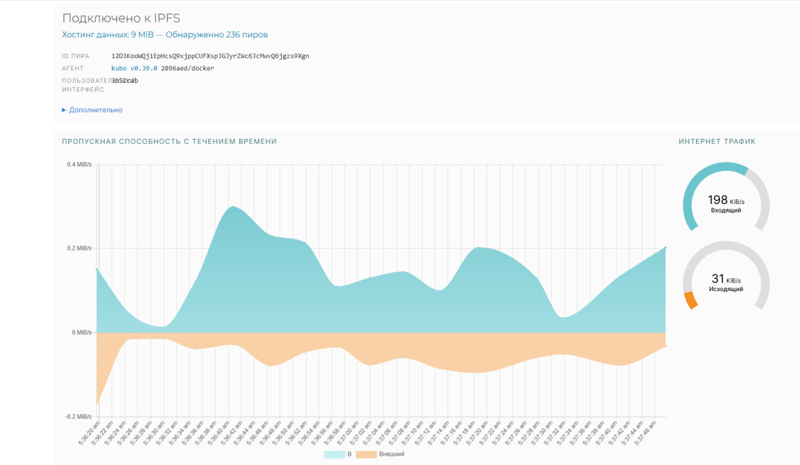
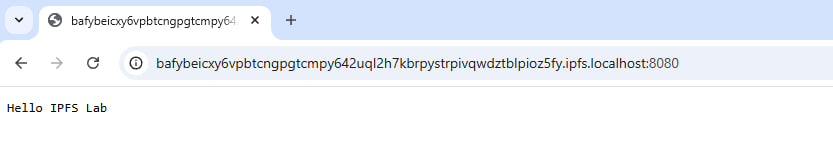
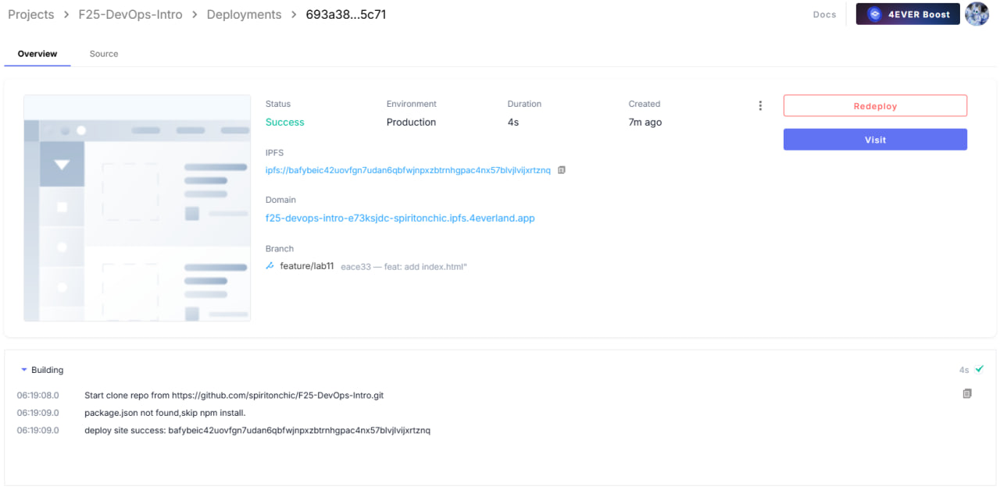

# Lab 11 — Decentralized Web Hosting with IPFS & 4EVERLAND

## Task 1 — Local IPFS Node Setup and File Publishing

### IPFS node peer count from Web UI

- 236 peers

### Network bandwidth statistics



### Test file CID

**Command(s):**
- echo "Hello IPFS Lab" > testfile.txt
- docker cp testfile.txt ipfs_node:/export/
- docker exec ipfs_node ipfs add /export/testfile.txt

**Output:**
```
spiriton@LAPTOP-TNLQNHEC:~$ echo "Hello IPFS Lab" > testfile.txt
spiriton@LAPTOP-TNLQNHEC:~$ docker cp testfile.txt ipfs_node:/export/
Successfully copied 2.05kB to ipfs_node:/export/
spiriton@LAPTOP-TNLQNHEC:~$ docker exec ipfs_node ipfs add /export/testfile.txt
 15 B / 15 B  100.00%added QmUFJmQRosK4Amzcjwbip8kV3gkJ8jqCURjCNxuv3bWYS1 testfile.txt
spiriton@LAPTOP-TNLQNHEC:~$
```

- **CID:** QmUFJmQRosK4Amzcjwbip8kV3gkJ8jqCURjCNxuv3bWYS1

### Screenshots of local gateway access

- Access from `http://localhost:8080/ipfs/QmUFJmQRosK4Amzcjwbip8kV3gkJ8jqCURjCNxuv3bWYS1`



### Public gateway URLs

- https://ipfs.io/ipfs/QmUFJmQRosK4Amzcjwbip8kV3gkJ8jqCURjCNxuv3bWYS1

- https://cloudflare-ipfs.com/ipfs/QmUFJmQRosK4Amzcjwbip8kV3gkJ8jqCURjCNxuv3bWYS1

### Analysis: How does IPFS's content addressing differ from traditional URLs?

IPFS uses **content addressing** instead of location-based addressing. Traditional URLs (e.g., `https://example.com/file.txt`) point to a specific server where the content is hosted. In contrast, IPFS assigns each file a **Content Identifier (CID)** derived from the file’s cryptographic hash. This means the CID represents the content itself, not its location. Anyone with the CID can retrieve the file from any IPFS node that has it, ensuring integrity and immutability. Changes to the file generate a new CID, preventing silent tampering.

### Reflection: Advantages and Disadvantages of Decentralized Storage

**Advantages:**  
- **Resiliency:** Content remains accessible even if individual nodes go offline.  
- **Integrity:** CIDs verify that content has not been tampered with.  
- **Censorship resistance:** No single server can unilaterally remove content.  
- **Efficiency:** Files are retrieved from the nearest node storing them, reducing latency and bandwidth.  

**Disadvantages:**  
- **Propagation delay:** Content may take time to become available across nodes.  
- **Storage redundancy:** Popular content requires multiple nodes to ensure availability.  
- **Performance variability:** Retrieval speed depends on the number and proximity of nodes.  
- **Learning curve:** Managing decentralized storage and integrating with applications can be more complex than traditional hosting.

## Task 2 — Static Site Deployment with 4EVERLAND


### 4EVERLAND project URL

- https://f25-devops-intro-13-glf6.ipfs.4everland.app

### GitHub repository used

- https://github.com/spiritonchic/F25-DevOps-Intro

### IPFS CID from 4EVERLAND dashboard

- bafybeic42uovfgn7udan6qbfwjnpxzbtrnhgpac4nx57blvjlvijxrtznq

### Screenshots

- 4EVERLAND deployment dashboard



- Site accessed through 4EVERLAND domain


- Site accessed through public IPFS gateway


### Analysis: How does 4EVERLAND simplify IPFS deployment compared to manual methods?

4EVERLAND automates the process of deploying websites to IPFS, removing the need to manually manage IPFS nodes, generate CIDs, and propagate content across the network. By integrating directly with GitHub, it provides a **CI/CD-like workflow**: changes pushed to the repository trigger automatic builds and redeployments to IPFS. The platform handles CID generation, build configuration, and hosting under a subdomain, significantly reducing setup time and potential errors compared to manual IPFS deployment.

### Comparison: What are the trade-offs between traditional web hosting and IPFS hosting?

**Advantages of IPFS Hosting:**  
- Decentralized and resilient: content remains available even if individual servers fail.  
- Content integrity: hashes (CIDs) verify that files are unmodified.  
- Censorship-resistant: no single entity controls the hosted content.  

**Disadvantages of IPFS Hosting:**  
- Initial propagation can be slower; content availability depends on nodes hosting it.  
- Dynamic content is harder to serve compared to traditional server-based hosting.  
- Performance may vary based on network and peer availability.  

**Advantages of Traditional Hosting:**  
- Fast and predictable content delivery through centralized servers or CDNs.  
- Easier to serve dynamic and interactive content.  
- Established tools and monitoring for uptime, security, and scaling.  

**Disadvantages of Traditional Hosting:**  
- Single point of failure; if the server goes down, content is unavailable.  
- Susceptible to censorship or takedown requests.  
- Users must trust the hosting provider to maintain data integrity and availability.

