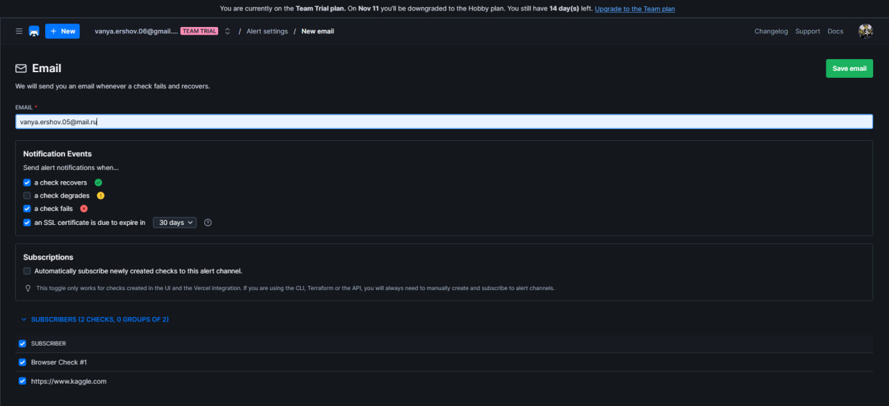

# Lab 8 — Site Reliability Engineering (SRE)

## Task 1 — Key Metrics for SRE and System Analysis

### Top 3 most consuming applications for CPU, memory, and I/O usage

**CPU**
- htop 6.6%
- /usr/bin/gnome-shell 2.6%
- /usr/libexec/gnome-terminal-server 0.7%

**MEM**
- /usr/bin/gnome-shell 5.2%
- /usr/libexec/mutter-x11-frames 1.2%
- /usr/libexec/gsd-xsettings 1.0%

**I/O usage**
- /usr/bin/pipewire 0 B/s
- /usr/bin/pipewire -c filter-chain.conf 0 B/s
- /usr/bin/wireplumber 0 B/s

### Command outputs showing resource consumption

**Command(s)**
- iostat -x 1 5

**Output:**
```
avg-cpu:  %user   %nice %system %iowait  %steal   %idle
           0.88    0.01    3.23    0.15    0.00   95.73
```

### Top 3 largest files in the `/var` directory

**Command(s)**
- sudo find /var -type f -exec du -h {} + | sort -rh | head -n 3

**Output:**
```
vboxuser@devOpsUbuntu:~$ sudo find /var -type f -exec du -h {} + | sort -rh | head -n 3
517M	/var/lib/snapd/seed/snaps/gnome-42-2204_202.snap
517M	/var/lib/snapd/cache/c3c38b9039608c596b7174b23d37e6cd1bbd7b13dae28ec1a17a31df34bb5598a7f9f69c4171304c7abac9a73e9d2357
250M	/var/lib/snapd/cache/7f09352b7cccdf2e44a8979f3eff8470f7bedde503dc2f76349f518effb6a84abb188388b8b05946899ef61e9799ed00
```

**Analysis:** Resource usage is concentrated in a few key applications, with GNOME Shell consuming the most memory and Snap packages taking up the largest disk space.

**Reflection:** To optimize resources, I would clean or remove unused Snap caches, disable unnecessary GNOME extensions, and monitor high-usage applications to reduce CPU and memory load.

## Task 2 — Practical Website Monitoring Setup

### Website URL you chose to monitor

- https://www.kaggle.com

### Screenshots of browser check configuration

**Frequency:** 5 minute


### Screenshots of successful check results

**Playwright test script**

```
/**
  * To learn more about Playwright Test visit:
  * https://checklyhq.com/docs/browser-checks/playwright-test/
  * https://playwright.dev/docs/writing-tests
  */

const { expect, test } = require('@playwright/test')

// Increase test timeout to allow full page load
test.setTimeout(210000)

// Limit each action (click, type, etc.) to 10s
test.use({ actionTimeout: 10000 })

test('Kaggle homepage interactive checks', async ({ page }) => {
  // Measure page load time
  const startTime = Date.now()
  const response = await page.goto('https://www.kaggle.com')
  const loadTime = Date.now() - startTime
  console.log(`Page load time: ${loadTime} ms`)

  // Assert page responded successfully
  expect(response.status(), 'should respond with correct status code').toBeLessThan(400)

  // Check main header is visible
  await expect(page.locator('text=Kaggle')).toBeVisible({ timeout: 10000 })

  // Check "Sign In" button is visible
  const signInButton = page.locator('text=Sign In')
  await expect(signInButton).toBeVisible({ timeout: 10000 })

  // Click "Sign In" button (just to trigger modal or redirect)
  await signInButton.click()

  // Wait for login modal or any visible overlay to appear
  // Kaggle uses SPA + OAuth, so we check for general modal text
  await expect(page.locator('text=Sign in with Google').first()).toBeVisible({ timeout: 15000 })
  await expect(page.locator('text=Sign in with Email').first()).toBeVisible({ timeout: 15000 })

  // Take screenshot of homepage + modal
  await page.screenshot({ path: 'kaggle-sign-in.png' })

  // Log success
  console.log('Browser checks completed successfully')
})
```


### Screenshots of alert settings




**Analysis:** I chose these checks and timeouts to ensure critical page elements load correctly and the login functionality works, reflecting real user interactions.

**Reflection:** This monitoring setup helps maintain website reliability by detecting downtime, broken elements, or slow responses before users are affected.