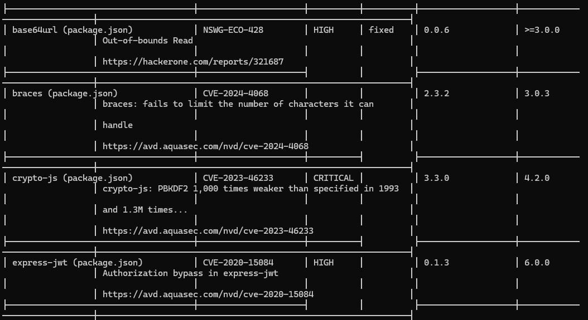

# Lab 9 — Introduction to DevSecOps Tools

## Task 1 — Web Application Scanning with OWASP ZAP

### Medium risks (2): 

- Content Security Policy (CSP) Header Not Set.

Description: Content Security Policy (CSP) is an added layer of security that helps to detect and mitigate certain types of attacks, including Cross Site Scripting (XSS) and data injection attacks. These attacks are used for everything from data theft to site defacement or distribution of malware. CSP provides a set of standard HTTP headers that allow website owners to declare approved sources of content that browsers should be allowed to load on that page — covered types are JavaScript, CSS, HTML frames, fonts, images and embeddable objects such as Java applets, ActiveX, audio and video files.

- Cross-Domain Misconfiguration

Description: Web browser data loading may be possible, due to a Cross Origin Resource Sharing (CORS) misconfiguration on the web server.

### Security status:

- Content Security Policy (CSP) Header Not Set — Medium — 11

Browsers do not have rules to restrict the sources of scripts, styles, or other resources. This increases the risk of XSS (Cross-Site Scripting) and content injection attacks.

- Cross-Domain Misconfiguration — Medium — 11

Other domains may be able to make unauthorized requests to the application, potentially exposing sensitive data to malicious websites.

- Cross-Domain JavaScript Source File Inclusion — Low — 10

If the external source is compromised, an attacker can inject malicious scripts into the application, leading to potential security risks.

- Deprecated Feature Policy Header Set — Low — 13

Browser features such as camera, microphone, geolocation, fullscreen, and payment APIs may not be properly restricted, increasing the attack surface.

- Insufficient Site Isolation Against Spectre Vulnerability — Low — 10

The application is more vulnerable to Spectre-type attacks, where malicious code in another context could read sensitive memory data.

- Timestamp Disclosure — Low — 9

Even though this is a low-risk issue, it may allow attackers to infer deployment or system information, which can be used in targeted attacks.

### What type of vulnerabilities are most common in web applications?

- Security misconfigurations (missing headers, deprecated headers)

- Cross-origin and script inclusion risks

- Information disclosure (timestamps, comments)

These fall into the broader category of Medium-risk web security issues, which are relatively easy to exploit but preventable with proper configuration and best practices.

## Task 2 — Container Vulnerability Scanning with Trivy

### Total count of CRITICAL and HIGH vulnerabilities

- **CRITICAL**: 8

- **HIGH**: 23 + 1 + 1 = 25

### List of 2 vulnerable packages with their CVE IDs

- **crypto-js** – CVE-2023-46233 – CRITICAL

- **jsonwebtoken** – CVE-2015-9235 – CRITICAL

### Most common vulnerability type found

Package-based vulnerabilities in Node.js libraries, including:

- Insecure cryptography (weak PBKDF2, RSA key exposure)

- Command injection

- Prototype pollution

- Denial of Service (DoS) via malformed input

### Why is container image scanning important before deploying to production?

Container image scanning detects vulnerabilities in application dependencies and embedded secrets before deployment. It helps:

- Prevent production systems from running software with known security flaws.

- Reduce risk of data breaches, code execution, or service downtime.

- Ensure compliance with security policies and industry standards.

### How would you integrate these scans into a CI/CD pipeline?

- Include automated image scanning as part of the build pipeline using tools like Trivy, Snyk, or Clair.

- Fail builds if CRITICAL or HIGH vulnerabilities are found.

- Regularly update base images and dependencies to minimize risk.

- Integrate secret scanning to catch exposed keys before deployment.