# 📌Lecture 1 - Introduction to DevOps

## 📍 Slide 1 – 🚀 What is DevOps?

* 🧩 **Definition**: DevOps = **Development (👨‍💻 Dev)** + **Operations (⚙️ Ops)**.
* 🎯 **Purpose**: A cultural and technical movement to deliver applications **faster**, **more reliable**, and **securely**.
* 🏗️ **Not only tools** → it is **culture, mindset, and practices**.
* 🔄 **Extension of Agile (⚡)** → applies Agile principles beyond coding into **deployment, monitoring, and feedback**.
* 💡 **Key idea**: Treat infrastructure and delivery pipelines as **products**, not afterthoughts.

**Mermaid Diagram:**

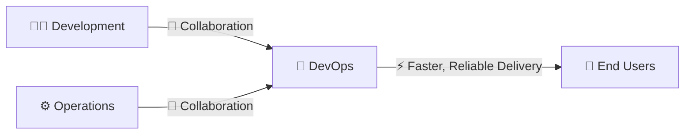

---

## 📍 Slide 2 – 📜 A Brief History of DevOps

* 🕰️ **Pre-2007**: “Wall of confusion” between **Dev teams (new features)** and **Ops teams (stability)**.
* 💡 **2007–2008**: Ideas of “Agile Infrastructure” and “Agile Systems Administration”.
* 🎤 **2009**: Patrick Debois organizes **first DevOpsDays** in Belgium.
* 🌍 **2010–2012**: DevOpsDays events spread globally, the word “DevOps” becomes mainstream.
* 🏢 Early adopters: **Amazon (📦)**, **Netflix (🎬)**, **Google (🔎)**.

⚡ **Historical fact**: At Amazon, a developer could take **weeks** to deploy. After adopting DevOps → **minutes**.

---

## 📍 Slide 3 – 🎯 Why DevOps? (Key Goals)

* ⏱️ **Faster delivery** → reduce **time-to-market** for features.
* 🔄 **Continuous improvement** → frequent, safe updates.
* 💡 **Higher innovation** → teams can experiment with less risk.
* 🔒 **Reliability & security** → stable releases, fewer failures.
* 👥 **Collaboration & trust** → developers + operations = **shared ownership**.

**Mermaid Diagram:**

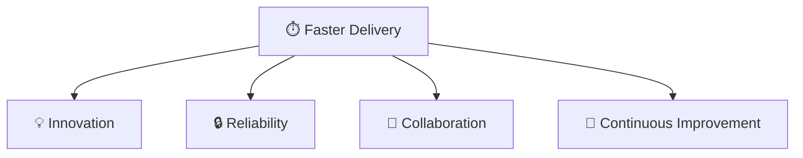

---

## 📍 Slide 4 – ⚖️ DevOps vs. Traditional IT

* 🐢 **Traditional (Waterfall)**:

  * Steps in sequence → **Requirements → Design → Build → Test → Deploy**.
  * Releases once every **months or years**.
* ⚡ **Agile + DevOps**:

  * Short iterations, feedback loops, automation.
  * Releases **daily or weekly**.
* 🔗 **DevOps bridges Agile & Operations** → **deployment is part of the development cycle**.

**Mermaid Diagram:**

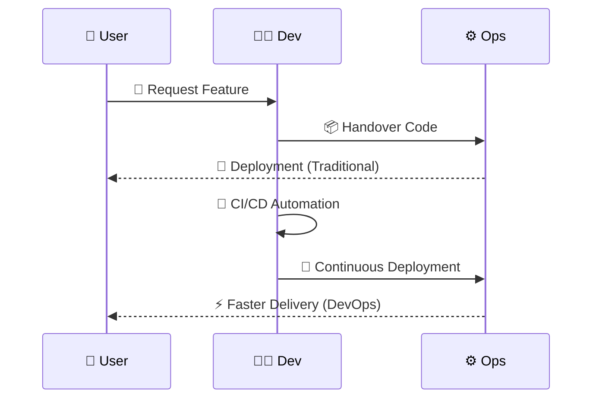

---

## 📍 Slide 5 – 🔑 Core Principles: The CAMS Model

* 🌱 **C = Culture** → trust, collaboration, shared responsibility.
* 🤖 **A = Automation** → eliminate manual, error-prone work.
* 📊 **M = Measurement** → track performance with metrics:

  * ⏱️ **MTTR = Mean Time to Recovery** (how fast systems recover).
  * ❌ **CFR = Change Failure Rate** (percentage of failed changes).
* 🔗 **S = Sharing** → knowledge, successes, and failures → **blameless postmortems**.

**Mermaid Diagram:**

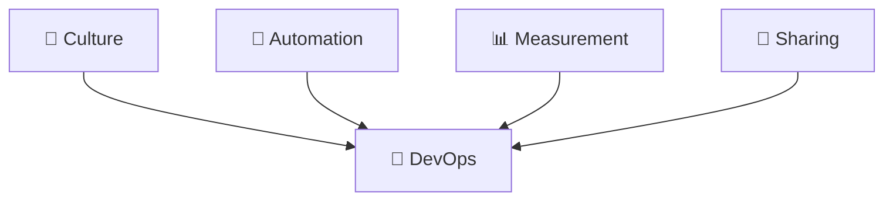

---

## 📍 Slide 6 – 🌱 Culture in DevOps

* 🤝 **Collaboration** → Dev, Ops, QA, Security = **one team**.
* 🔓 **Transparency** → clear communication, shared dashboards.
* 🧠 **Psychological safety** → people can experiment, fail, and learn without blame.
* 🎯 **Shared responsibility** → success/failure is **team-owned**.

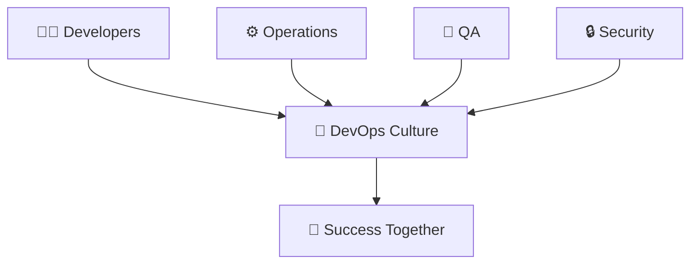

---

## 📍 Slide 7 – 🔄 Shift-Left Mindset

* ⏪ **Definition**: Moving testing & security **earlier** in the development cycle.
* 🧪 **Continuous testing** → run unit/integration tests at each commit.
* 🔒 **Security shift-left** → static analysis (SAST), dependency scans before deployment.
* 📊 **Benefits**: Catch bugs early, reduce fix cost, speed releases.

**YAML Example (GitHub Action – security scan):**

```yaml
name: Security Scan
on: [push]
jobs:
  scan:
    runs-on: ubuntu-latest
    steps:
      - uses: actions/checkout@v2
      - name: Run dependency check
        run: npm audit   # 🔒 Scans for vulnerabilities
```

---

## 📍 Slide 8 – 👥 Collaboration Between Teams

* 🧩 **Breaking silos** → Dev + Ops + QA + Security work **together**.
* 📡 **Tools**: Slack (💬), Jira (📑), Confluence (📚).
* 🏃 **DevOps + Agile** → combine Scrum ceremonies with continuous delivery.
* 📈 **Outcome**: Faster decisions, fewer blockers, stronger trust.

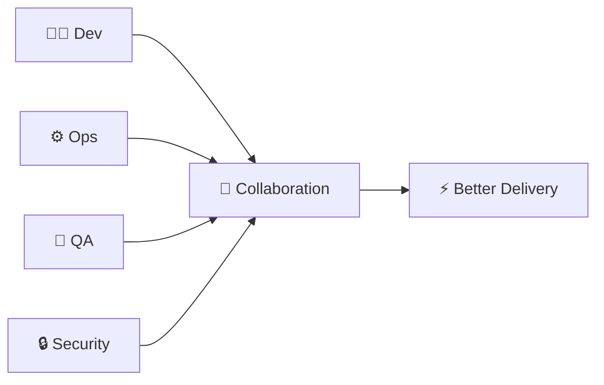

---

## 📍 Slide 9 – 🔔 Feedback Loops

* 📡 **Fast feedback** = quick alerts when issues occur.
* 🧑‍💻 **Examples**: Build fails, unit tests break, monitoring alerts.
* 🔄 **Continuous feedback** = improves product quality.
* 📊 **Best practice**: dashboards with real-time metrics (Grafana 📊, Prometheus 📈).

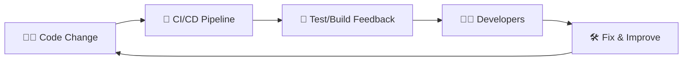

---

## 📍 Slide 10 – 📚 Continuous Learning & Blameless Postmortems

* 🎓 **Continuous learning** = retrospectives, improving processes.
* 🔎 **Blameless postmortems**:

  * ❌ Not about finding who to punish.
  * ✅ About preventing **future failures**.
* 📖 Teams share knowledge → collective intelligence grows.
* 📈 Example: **Google SRE** uses **blameless incident reviews**.

**Sample Postmortem Checklist (Markdown):**

```markdown
# 🔎 Incident Postmortem
- 📅 Date/Time:
- 📝 Summary:
- ⚡ Impact:
- 🧑‍💻 Root Cause:
- 🔄 Remediation Steps:
- 📚 Lessons Learned:
```

---

## 📍 Slide 11 – 🏗️ Infrastructure as Code (IaC)

* 📜 **Definition**: Manage servers, networks, infra using **code**.
* 🛠️ Tools: Terraform (🌍), Ansible (🧩), Pulumi (📦).
* 🎯 **Benefits**:

  * ✅ Reproducibility.
  * ✅ Scalability.
  * ✅ Git version control for infra.

**Terraform Example:**

```hcl
resource "aws_instance" "web" {
  ami           = "ami-0c55b159cbfafe1f0" # 📦 Amazon Linux
  instance_type = "t2.micro"
}
```

---

## 📍 Slide 12 – 🔄 Continuous Integration (CI) Basics

* 📜 **Definition**: Developers frequently merge code → shared repo.
* 🧪 Automated **tests/builds** run on each commit.
* ⏱️ **Goal**: detect issues **early**.
* 🛠️ Tools: Jenkins (☕), GitHub Actions (🐙), GitLab CI (🦊), CircleCI (🔵).

**YAML Example (GitHub Actions CI):**

```yaml
name: CI Pipeline
on: [push]
jobs:
  build:
    runs-on: ubuntu-latest
    steps:
      - uses: actions/checkout@v2  # 📥 Checkout repo
      - run: npm install            # 📦 Install deps
      - run: npm test               # 🧪 Run tests
```

---

## 📍 Slide 13 – 🚀 Continuous Delivery & Deployment (CD)

* 📜 **Continuous Delivery (CD)** = Code is always in a **deployable state**, but deployments may need **manual approval**.
* 🤖 **Continuous Deployment** = Every change that passes automated tests is **deployed automatically** → no human needed.
* 🎯 **Goal**: Faster time-to-market, fewer risks.
* ⚠️ **Difference**: *Delivery = ready, Deployment = automatic*.

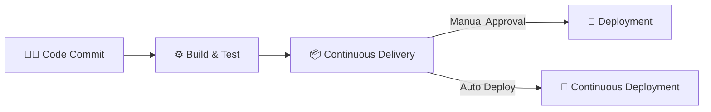

---

## 📍 Slide 14 – 🐮 Cattle vs. Pets (Immutable Infrastructure)

* 🐶 **Pets (Old model)**:

  * Servers are **unique**, manually maintained.
  * If broken → try to fix.
* 🐮 **Cattle (Modern model)**:

  * Servers are **identical, automated**.
  * If broken → replace with a new one.
* 🚀 **Immutable Infrastructure** = servers are never modified → they’re replaced.

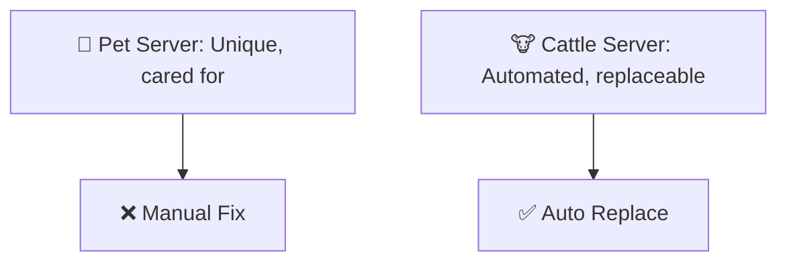

---

## 📍 Slide 15 – 📊 DevOps Metrics & KPIs

* 📏 **Key Metrics (from DORA Research)**:

  * ⏱️ **Lead Time** → time from commit → production.
  * 📦 **Deployment Frequency** → how often new releases happen.
  * ❌ **Change Failure Rate (CFR)** → % of changes causing failures.
  * 🛠️ **MTTR (Mean Time to Recovery)** → how fast incidents are fixed.
* 🎯 These metrics = **“DevOps Scorecard”** for performance.

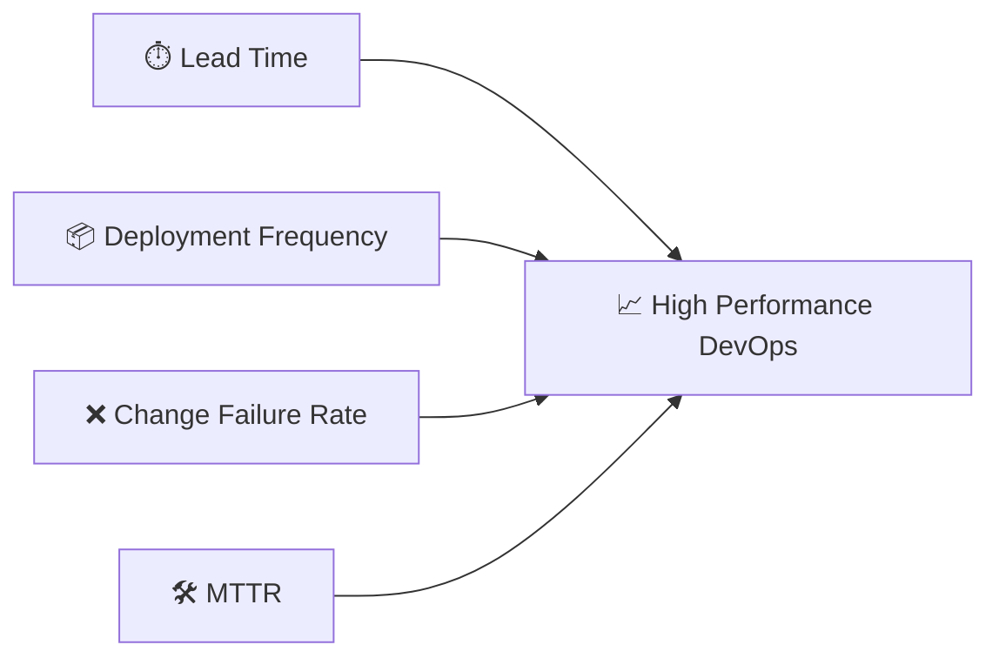

---

## 📍 Slide 16 – 🤖 Automation First Approach

* ⚡ **Principle**: Any manual, repeatable task should be **automated**.
* 🧑‍💻 Benefits:

  * ✅ Faster execution.
  * ✅ Fewer human errors.
  * ✅ Standardized processes.
* 🔧 Examples: CI pipelines, infrastructure provisioning, monitoring alerts.

**Bash Example – Automated Deployment Script:**

```bash
#!/bin/bash
# 🚀 Simple automated deployment script

echo "Building application..."
docker build -t myapp:latest .

echo "Deploying container..."
docker run -d -p 8080:80 myapp:latest

echo "✅ Deployment complete!"
```

---

## 📍 Slide 17 – ⚙️ Configuration Management

* 📜 **Definition**: Keep infrastructure and software in a **desired state**, automatically.
* 🛠️ Tools:

  * Ansible (🧩) → YAML playbooks.
  * Puppet (🎭) → Declarative language.
  * Chef (👨‍🍳) → Ruby DSL.
* 🎯 Benefits: Consistency, scalability, easy rollback.

**YAML Example (Ansible Playbook):**

```yaml
- name: 🧩 Install and start Nginx
  hosts: webservers
  become: yes
  tasks:
    - name: Install Nginx
      apt: name=nginx state=present
    - name: Start service
      service: name=nginx state=started
```

---

## 📍 Slide 18 – 📦 Containerization Basics

* 📜 **Containers** = lightweight, portable units for apps + dependencies.
* 🔧 Popular tool: Docker (🐳).
* 🎯 Benefits:

  * ✅ Consistent environments.
  * ✅ Faster startup than VMs.
  * ✅ Easier scaling.

**Dockerfile Example:**

```dockerfile
# 🐳 Simple Dockerfile
FROM nginx:latest
COPY index.html /usr/share/nginx/html
# Run: docker build -t mynginx . && docker run -p 8080:80 mynginx
```

---

## 📍 Slide 19 – 🗂️ Orchestration Basics (Kubernetes Preview)

* 📜 **Orchestration** = managing multiple containers at scale.
* 🌐 Kubernetes (☸️) → most popular orchestrator.
* 🎯 Features:

  * Auto-scaling.
  * Self-healing (restart failed pods).
  * Rolling updates.

**YAML Example (Kubernetes Deployment):**

```yaml
apiVersion: apps/v1
kind: Deployment
metadata:
  name: nginx-deployment
spec:
  replicas: 3   # 🔄 3 containers
  selector:
    matchLabels:
      app: nginx
  template:
    metadata:
      labels:
        app: nginx
    spec:
      containers:
      - name: nginx
        image: nginx:latest
        ports:
        - containerPort: 80
```

---

## 📍 Slide 20 – 🔍 Observability (Logs, Metrics, Tracing)

* 📜 **Observability** = ability to understand system state via **data signals**.
* 🔎 **Three pillars**:

  * 📖 **Logs** → detailed events (errors, transactions).
  * 📊 **Metrics** → numerical values (CPU, latency).
  * 🧵 **Tracing** → follow a request through multiple services.
* 🛠️ Tools: ELK Stack (📚), Prometheus (📈), Grafana (📊), Jaeger (🕵️).

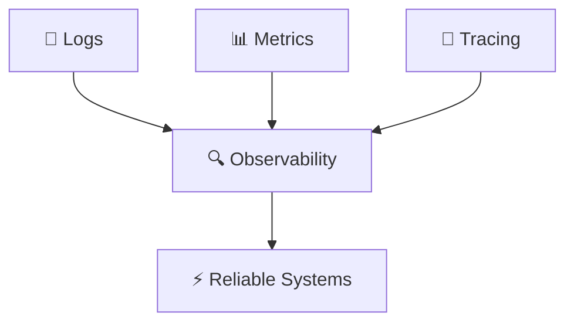

---

## 📍 Slide 21 – 📂 Version Control (Git Basics)

* 📜 **Version Control** = tracks code changes over time.
* 🛠️ **Git (🐙)** = most popular tool. Platforms: GitHub (🐙), GitLab (🦊), Bitbucket (🔷).
* 🎯 Benefits:

  * ✅ Collaboration.
  * ✅ Rollbacks.
  * ✅ Branching/merging.

**Git Example (CLI):**

```bash
# 📥 Clone repository
git clone https://github.com/example/repo.git

# 🌱 Create new branch
git checkout -b feature-login

# 💾 Commit changes
git add .
git commit -m "✨ Added login feature"

# 🚀 Push to remote
git push origin feature-login
```

---

## 📍 Slide 22 – ⚙️ CI/CD Tools Overview

* 🤖 **Continuous Integration / Continuous Delivery** tools:

  * Jenkins (☕) → popular, plugin-based.
  * GitHub Actions (🐙) → YAML workflows in GitHub.
  * GitLab CI (🦊) → integrated CI/CD in GitLab.
  * CircleCI (🔵) → cloud-native CI/CD.
* 🎯 Purpose: build, test, deploy code automatically.

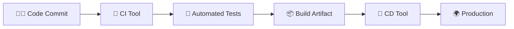

---

## 📍 Slide 23 – 📦 Artifact Repositories

* 📜 **Definition**: storage for **build artifacts** (compiled apps, packages, Docker images).
* 🛠️ Tools:

  * JFrog Artifactory (🐸).
  * Sonatype Nexus (📦).
  * GitHub Packages (🐙).
* 🎯 Benefits:

  * ✅ Centralized storage.
  * ✅ Versioning of builds.
  * ✅ Secure delivery.

**Example (Publish Docker Image):**

```bash
# 🐳 Build Docker image
docker build -t myapp:1.0 .

# 🔑 Login to registry
docker login registry.example.com

# 🚀 Push image
docker tag myapp:1.0 registry.example.com/myapp:1.0
docker push registry.example.com/myapp:1.0
```

---

## 📍 Slide 24 – 🏗️ Infrastructure as Code (IaC) Tools

* 📜 Tools for automating infra provisioning:

  * Terraform (🌍) → declarative cloud resources.
  * Pulumi (📦) → IaC with real programming languages.
  * AWS CloudFormation (☁️).
* 🎯 Benefits: reproducibility, automation, portability.

```hcl
# 🌍 Terraform AWS S3 bucket
resource "aws_s3_bucket" "devops_bucket" {
  bucket = "my-devops-bucket"
  acl    = "private"
}
```

---

## 📍 Slide 25 – ☁️ Cloud Providers

* 📜 **Cloud Computing** = rent servers/storage/services on-demand.
* 🛠️ Major providers:

  * AWS (☁️).
  * Google Cloud (🌐).
  * Microsoft Azure (🔷).
* 🎯 Benefits: scalability, flexibility, pay-as-you-go.

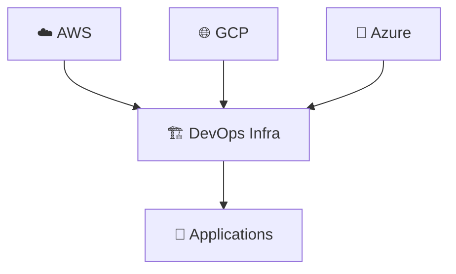

---

## 📍 Slide 26 – 💬 Collaboration Tools

* 📜 Tools that support DevOps culture:

  * Slack (💬) → instant communication.
  * Jira (📑) → issue tracking.
  * Confluence (📚) → documentation.
  * Teams (📞) → corporate communication.
* 🎯 Benefits: fast communication, transparency, documentation sharing.

**Slack Bot Example (CI Notification):**

```yaml
# 🤖 GitHub Actions step to send Slack message
- name: Notify Slack
  uses: slackapi/slack-github-action@v1.24.0
  with:
    payload: |
      {
        "text": "✅ Build Passed on main branch!"
      }
```

---

## 📍 Slide 27 – 🔄 Typical DevOps Pipeline Workflow

* 📜 **Stages** of a DevOps pipeline:

  1. 👨‍💻 Code commit.
  2. 🤖 Build & test.
  3. 📦 Package artifact.
  4. 🚀 Deploy to environment.
  5. 📊 Monitor & feedback.
* 🎯 Continuous loop of delivery + improvement.

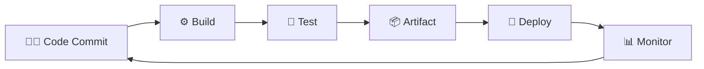

---

## 📍 Slide 28 – 🐙 Example: GitHub Actions CI/CD Workflow

* 📜 GitHub Actions (🐙) → automates builds, tests, deployments with **YAML workflows**.
* 🎯 Benefits:

  * ✅ Integrated with GitHub.
  * ✅ Easy setup for pipelines.
  * ✅ Large community marketplace.

**YAML Example (CI + Deploy):**

```yaml
name: CI/CD Pipeline
on: [push]
jobs:
  build:
    runs-on: ubuntu-latest
    steps:
      - uses: actions/checkout@v2
      - run: npm install      # 📦 Install dependencies
      - run: npm test         # 🧪 Run tests
  deploy:
    runs-on: ubuntu-latest
    needs: build
    steps:
      - run: echo "🚀 Deploying app..."
```

---

## 📍 Slide 29 – 🎬 Case Study: Netflix & Simian Army

* 🏢 Netflix (🎬) = early pioneer in **cloud-native DevOps**.
* 🐒 **Simian Army** = tools that randomly break services to test **resilience**.
* 🎯 Lesson: Build systems to **survive failure**, not just avoid it.

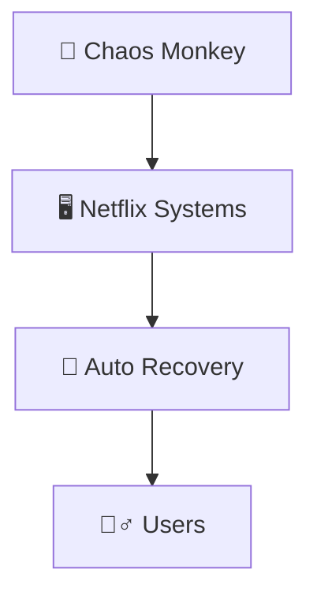

---

## 📍 Slide 30 – 📦 Case Study: Amazon’s “You Build It, You Run It”

* 📦 Amazon (AWS) developers own their code **end-to-end**.
* 🎯 Principle: If you **write the software**, you are responsible for running it.
* ⚡ Benefits:

  * ✅ Better accountability.
  * ✅ Faster incident resolution.
  * ✅ Higher quality software.

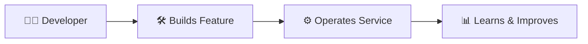

---

## 📍 Slide 31 – ⚠️ Challenges in DevOps Adoption

* 🧱 **Cultural resistance** → “we’ve always done it this way”.
* 🕰️ **Legacy systems** → hard to automate old tech.
* 🔒 **Security concerns** → fear of automating too much.
* 🧑‍💼 **Skill gaps** → need training & mindset shifts.

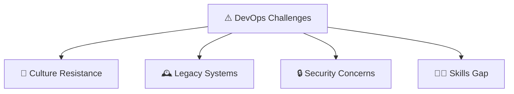

---

## 📍 Slide 32 – 🌟 Best Practices for DevOps Success

* 🤝 Foster **collaboration & trust**.
* 🤖 **Automate everything** repeatable.
* 📊 Use **metrics & monitoring** (DORA metrics).
* 🎓 Provide **training & continuous learning**.
* 🔄 Start small → pilot project → scale organization-wide.

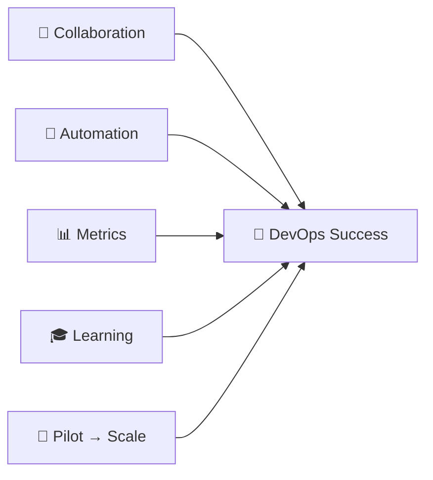

---

## 📍 Slide 33 – 🌀 DevOps Myths & Misconceptions

* ❌ **“DevOps is only about tools”** → Reality: culture + process + tools.
* ❌ **“We need a DevOps team”** → Reality: DevOps is a **shared responsibility**, not a separate silo.
* ❌ **“DevOps = faster but less stable”** → Reality: good DevOps **improves both speed and stability**.
* ❌ **“One toolchain fits all”** → Reality: every org tailors DevOps to its needs.

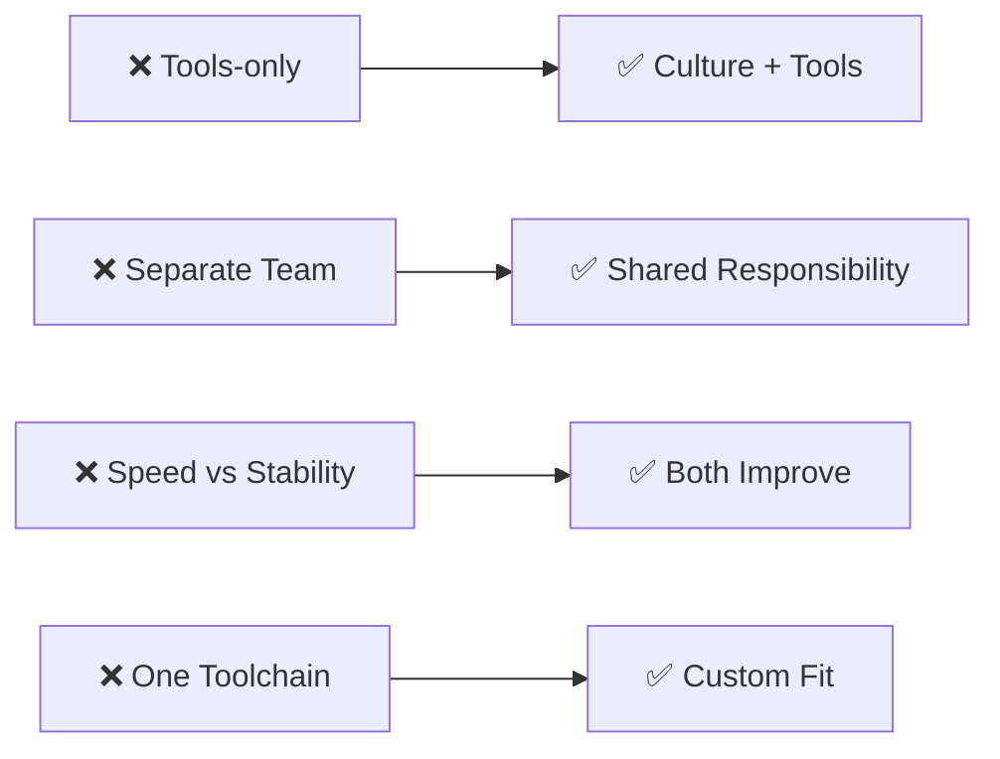

---

## 📍 Slide 34 – ⚖️ Balancing Speed vs Stability (DevOps vs SRE)

* ⚡ **DevOps** → focus on **speed of delivery**.
* 🛡️ **SRE (Site Reliability Engineering)** → focus on **stability & reliability**.
* 📊 Balance = deploy fast **without breaking production**.
* 🎯 Shared tools: monitoring, automation, error budgets.

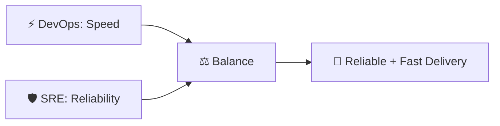

---

## 📍 Slide 35 – 📚 Summary of Key DevOps Concepts

* 🚀 **DevOps = Dev + Ops** → culture + tools + processes.
* 🌱 **Core principles**: CAMS (Culture, Automation, Measurement, Sharing).
* 🔄 **Practices**: CI (Continuous Integration), CD (Continuous Delivery/Deployment), IaC (Infrastructure as Code).
* 📊 **Metrics**: MTTR (Mean Time to Recovery), CFR (Change Failure Rate), Deployment Frequency, Lead Time.
* 📦 **Tools**: Git (🐙), Jenkins (☕), Docker (🐳), Kubernetes (☸️), Terraform (🌍).
* ⚡ **Case studies**: Amazon (📦), Netflix (🎬), Google (🔎).

```mermaid
graph TD
  DevOps[🚀 DevOps] --> CAMS[🌱 CAMS Principles]
  DevOps --> CI[🔄 CI/CD]
  DevOps --> IaC[🏗️ IaC]
  DevOps --> Metrics[📊 Metrics]
  DevOps --> Tools[🛠️ Tools]
```

---

## 📍 Slide 36 – 📖 Recommended Reading & Learning

* 📕 **Books**:

  * *The Phoenix Project* (🏢 IT transformation novel).
  * *The DevOps Handbook* (📘 practices & case studies).
  * *Accelerate* (📊 research-backed DevOps metrics).
* 🌐 **Web Resources**:

  * [devopsdays.org](https://devopsdays.org) (🎤 community events).
  * [opensource.com/devops](https://opensource.com/tags/devops) (📰 articles).
  * [Google SRE Book](https://sre.google/books/) (🛡️ reliability practices).

```mermaid
flowchart TD
  Books[📕 Books] --> Learning[🎓 DevOps Knowledge]
  Web[🌐 Online Resources] --> Learning
  Learning --> Practice[🛠️ Practice & Projects]
```

---

## 📍 Slide 37 – 🛠️ Hands-on Practice Resources

* 🧑‍💻 **Interactive labs**:

  * [Katacoda](https://www.katacoda.com) (🧩 scenarios for DevOps tools).
  * [Play with Docker](https://labs.play-with-docker.com) (🐳 Docker playground).
  * [Play with Kubernetes](https://labs.play-with-k8s.com) (☸️ Kubernetes playground).
* 📦 **GitHub Learning Lab** (🐙 tutorials with real repos).
* 🎯 Start small → e.g., build a simple **CI/CD pipeline for a web app**.

```mermaid
graph TD
  Labs[🧑‍💻 Interactive Labs] --> Skills[🛠️ DevOps Skills]
  GitHub[🐙 GitHub Learning Lab] --> Skills
  Playground[🐳 Play with Docker/K8s] --> Skills
  Skills --> Projects[🚀 Real Projects]
```

---
