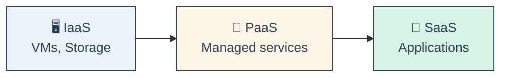
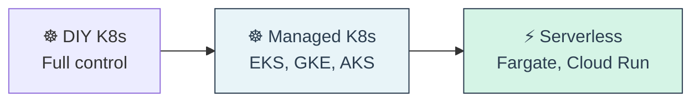
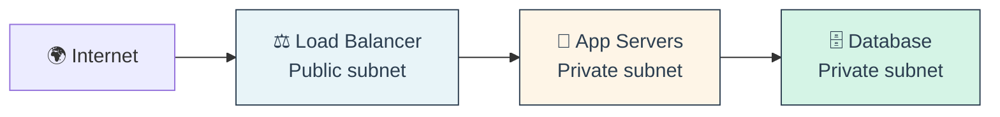
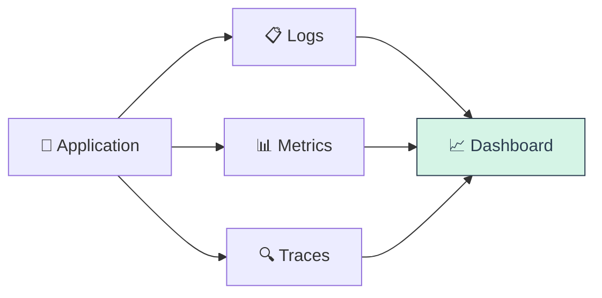
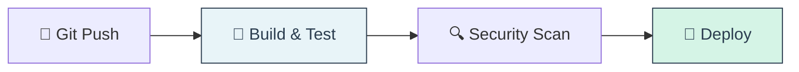
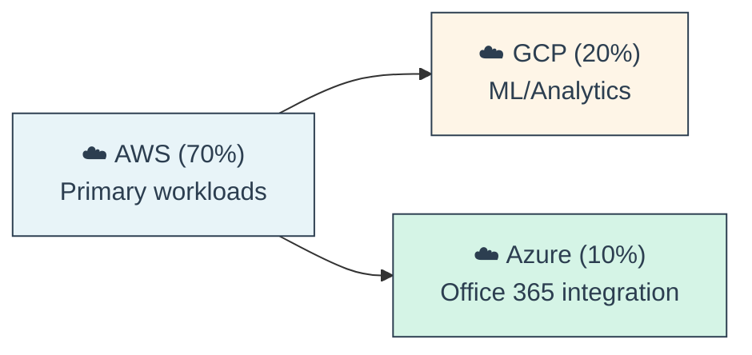
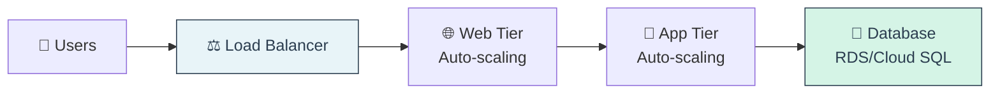

# 📌 Lecture 10 - Cloud Computing Fundamentals: Common Cloud Services (AWS/GCP/Azure)

## 📍 Slide 1 – ☁️ Cloud Computing Overview

* 🌍 **Cloud Computing = On-demand IT resources over the internet** (pay-as-you-go)
* 🎯 **Service Models**: IaaS → PaaS → SaaS
* 🏢 **Major Providers**: AWS (32%), Azure (23%), GCP (10%) - Gartner 2024

**Cloud Service Models**


* 💡 **Why Cloud**:
  * ✅ No upfront hardware costs
  * ✅ Scale on demand
  * ✅ Global reach in minutes
  * ✅ Pay only for what you use
  * ✅ Focus on code, not infrastructure

**Market Share**: AWS (32%) → Azure (23%) → GCP (10%) → Others (35%)

🔗 **Resources:**
* [AWS Global Infrastructure](https://aws.amazon.com/about-aws/global-infrastructure/)
* [Azure Regions](https://azure.microsoft.com/global-infrastructure/geographies/)
* [GCP Locations](https://cloud.google.com/about/locations)

---

## 📍 Slide 2 – 🖥️ Compute Services - VMs

* 🎯 **Virtual Machines = Traditional servers in the cloud**

| Feature | AWS EC2 | GCP Compute Engine | Azure VMs |
|---------|---------|-------------------|-----------|
| **Instance Types** | 500+ types | 40+ types | 300+ types |
| **Pricing** | $0.0047/hour (t3.micro) | $0.0050/hour (e2-micro) | $0.0052/hour (B1s) |
| **Free Tier** | 750 hours/month | 1 e2-micro | 750 hours/month |
| **Spot/Preemptible** | Up to 90% off | Up to 91% off | Up to 90% off |
| **Best For** | Widest selection | Custom machine types | Windows workloads |

**Common Instance Families**:
* 💻 **General Purpose**: t3/t2 (AWS), e2 (GCP), B-series (Azure)
* 🚀 **Compute Optimized**: c6 (AWS), c2 (GCP), F-series (Azure)
* 💾 **Memory Optimized**: r6 (AWS), m2 (GCP), E-series (Azure)
* 🎮 **GPU**: p4 (AWS), a2 (GCP), NC-series (Azure)

🔗 **Resources:**
* [EC2 Instance Types](https://aws.amazon.com/ec2/instance-types/)
* [GCP Machine Types](https://cloud.google.com/compute/docs/machine-types)
* [Azure VM Sizes](https://docs.microsoft.com/azure/virtual-machines/sizes)

---

## 📍 Slide 3 – 📦 Compute Services - Containers

* 🐳 **Container Orchestration = Managed Kubernetes & container runtimes**

| Feature | AWS | GCP | Azure |
|---------|-----|-----|-------|
| **Managed K8s** | EKS ($0.10/hour/cluster) | GKE (free control plane) | AKS (free control plane) |
| **Serverless Containers** | Fargate | Cloud Run | Container Apps |
| **Container Registry** | ECR | Artifact Registry | ACR |
| **Best For** | AWS ecosystem | GKE Autopilot | AKS + Azure DevOps |

**Kubernetes Options**:


* 💡 **Quick Comparison**:
  * **AWS EKS**: Most integrations, complex setup
  * **GCP GKE**: Easiest (Autopilot mode), best K8s experience
  * **Azure AKS**: Free control plane, Windows containers

🔗 **Resources:**
* [EKS Best Practices](https://aws.github.io/aws-eks-best-practices/)
* [GKE Documentation](https://cloud.google.com/kubernetes-engine/docs)
* [AKS Documentation](https://docs.microsoft.com/azure/aks/)

---

## 📍 Slide 4 – ⚡ Compute Services - Serverless

* ⚡ **Serverless = Run code without managing servers** (FaaS)

| Feature | AWS Lambda | GCP Cloud Run | Azure Functions |
|---------|-----------|---------------|-----------------|
| **Timeout** | 15 min | 60 min 🏆 | 10 min (Consumption) |
| **Memory** | 10 GB | 32 GB 🏆 | 1.5 GB (Consumption) |
| **Cold Start** | 100ms 🏆 | 200ms | 500ms |
| **Pricing** | $0.20/1M requests | $0.40/1M requests | $0.20/1M requests |
| **Free Tier** | 1M/month | 2M/month 🏆 | 1M/month |
| **Unique Feature** | Lambda@Edge | Containers | Durable Functions |

**When to Use**:
* ✅ Event-driven workloads
* ✅ Variable/unpredictable traffic
* ✅ Short execution times
* ❌ Long-running (>15 min)
* ❌ Stateful applications
* ❌ Consistent 24/7 load

🔗 **Resources:**
* [AWS Lambda](https://aws.amazon.com/lambda/)
* [GCP Cloud Run](https://cloud.google.com/run)
* [Azure Functions](https://azure.microsoft.com/services/functions/)

---

## 📍 Slide 5 – 💾 Storage Services - Object Storage

* 📦 **Object Storage = Store files as objects** (S3-compatible APIs)

| Feature | AWS S3 | GCP Cloud Storage | Azure Blob |
|---------|--------|-------------------|------------|
| **Pricing** | $0.023/GB/month | $0.020/GB/month | $0.018/GB/month |
| **Storage Classes** | 6 tiers | 4 tiers | 3 tiers |
| **Max Object Size** | 5 TB | 5 TB | 4.77 TB |
| **Durability** | 99.999999999% (11 9's) | 99.999999999% | 99.999999999% |
| **Free Tier** | 5 GB/month | 5 GB/month | 5 GB/month |

**Storage Classes**:
```
Hot (Frequent Access):
  S3 Standard → Cloud Storage Standard → Blob Hot
  $0.023/GB      $0.020/GB              $0.018/GB

Cool (Infrequent):
  S3 IA → Cloud Storage Nearline → Blob Cool
  $0.0125/GB   $0.010/GB              $0.010/GB

Cold (Archive):
  S3 Glacier → Cloud Storage Coldline → Blob Archive
  $0.004/GB    $0.004/GB               $0.002/GB
```

**Use Cases**:
* 📸 Media storage (images, videos)
* 📊 Data lakes (analytics)
* 🗄️ Backups and archives
* 🌐 Static website hosting

🔗 **Resources:**
* [S3 Storage Classes](https://aws.amazon.com/s3/storage-classes/)
* [Cloud Storage Pricing](https://cloud.google.com/storage/pricing)
* [Azure Blob Tiers](https://docs.microsoft.com/azure/storage/blobs/access-tiers-overview)

---

## 📍 Slide 6 – 💿 Storage Services - Block & File

* 💿 **Block Storage = Disk volumes for VMs**

| Feature | AWS EBS | GCP Persistent Disk | Azure Disk |
|---------|---------|-------------------|------------|
| **SSD (gp3)** | $0.08/GB/month | $0.17/GB/month | $0.12/GB/month |
| **HDD** | $0.045/GB/month | $0.04/GB/month | $0.05/GB/month |
| **Max IOPS** | 16,000 (gp3) | 100,000 | 20,000 |
| **Snapshots** | Incremental | Incremental | Incremental |

* 📁 **File Storage = Shared network file systems**

| Feature | AWS EFS | GCP Filestore | Azure Files |
|---------|---------|---------------|-------------|
| **Pricing** | $0.30/GB/month | $0.20/GB/month | $0.12/GB/month |
| **Protocol** | NFS | NFS | SMB + NFS |
| **Use Case** | Linux shared storage | GKE persistent volumes | Windows + Linux |

**Quick Decision**:
* **Block**: Single VM (databases, boot disks)
* **Object**: Scalable, shared (media, backups)
* **File**: Multi-VM shared (home directories, app data)

🔗 **Resources:**
* [AWS EBS vs EFS vs S3](https://aws.amazon.com/ebs/)
* [GCP Storage Options](https://cloud.google.com/storage/docs/storage-options)

---

## 📍 Slide 7 – 🗄️ Database Services - SQL

* 🗄️ **Managed SQL Databases = Automated backups, patching, HA**

| Feature | AWS RDS | GCP Cloud SQL | Azure SQL |
|---------|---------|---------------|-----------|
| **Engines** | MySQL, PostgreSQL, Oracle, SQL Server, MariaDB | MySQL, PostgreSQL, SQL Server | SQL Server, MySQL, PostgreSQL |
| **Pricing** | $0.017/hour (db.t3.micro) | $0.0150/hour (db-f1-micro) | $0.02/hour (Basic) |
| **Max Storage** | 64 TB | 64 TB | 4 TB |
| **Read Replicas** | Up to 15 | Up to 10 | Active Geo-Replication |
| **Unique** | Aurora (5x faster) | Spanner (global) | Hyperscale (100TB) |

**AWS Aurora** 🏆 (MySQL/PostgreSQL compatible):
* 5x faster than standard MySQL
* Auto-scaling storage (10GB → 128TB)
* 15 read replicas

**GCP Cloud Spanner** 🌍 (Global SQL):
* 99.999% availability
* Global transactions
* Auto-sharding
* $0.90/node/hour

**Azure SQL Database**:
* Serverless tier (auto-pause)
* Hyperscale (100TB+)
* Active geo-replication

🔗 **Resources:**
* [RDS Pricing](https://aws.amazon.com/rds/pricing/)
* [Cloud SQL Pricing](https://cloud.google.com/sql/pricing)
* [Azure SQL Pricing](https://azure.microsoft.com/pricing/details/sql-database/)

---

## 📍 Slide 8 – 📊 Database Services - NoSQL

* 📊 **NoSQL = Schemaless, scalable databases**

**Key-Value / Document Stores**:

| Feature | AWS DynamoDB | GCP Firestore | Azure Cosmos DB |
|---------|--------------|---------------|-----------------|
| **Type** | Key-value | Document | Multi-model |
| **Pricing** | $1.25/million writes | $0.18/100k writes | $0.25/million writes |
| **Read Pricing** | $0.25/million reads | $0.06/100k reads | $0.01/million reads |
| **Max Item Size** | 400 KB | 1 MB | 2 MB |
| **Unique** | DynamoDB Streams | Real-time sync | 5 consistency models |

**Other NoSQL Options**:
* 🔴 **Redis**: ElastiCache (AWS), Memorystore (GCP), Azure Cache
* 📊 **BigTable/HBase**: DynamoDB, Bigtable, Cosmos DB Cassandra API
* 🔍 **Search**: OpenSearch, Elasticsearch

**Quick Comparison**:
```
DynamoDB: Fast, predictable, AWS-native
Firestore: Real-time, mobile-friendly, Firebase integration
Cosmos DB: Multi-model (SQL, MongoDB, Cassandra APIs), global
```

🔗 **Resources:**
* [DynamoDB Guide](https://docs.aws.amazon.com/dynamodb/)
* [Firestore Documentation](https://firebase.google.com/docs/firestore)
* [Cosmos DB Documentation](https://docs.microsoft.com/azure/cosmos-db/)

---

## 📍 Slide 9 – 🌐 Networking - VPC & Load Balancers

* 🌐 **VPC (Virtual Private Cloud) = Isolated network in the cloud**

| Feature | AWS VPC | GCP VPC | Azure VNet |
|---------|---------|---------|------------|
| **Pricing** | Free (data transfer charged) | Free | Free |
| **Subnets** | Per AZ | Global | Per region |
| **Peering** | VPC Peering | VPC Peering | VNet Peering |
| **VPN** | $0.05/hour | $0.05/hour | $0.05/hour |

* ⚖️ **Load Balancers = Distribute traffic across instances**

| Type | AWS | GCP | Azure |
|------|-----|-----|-------|
| **Layer 7 (HTTP)** | ALB ($0.0225/hour) | HTTP(S) LB ($0.025/hour) | Application Gateway |
| **Layer 4 (TCP)** | NLB ($0.0225/hour) | Network LB ($0.012/hour) | Load Balancer |
| **Global** | CloudFront + ALB | Global HTTP(S) LB | Front Door |

**Networking Basics**:


🔗 **Resources:**
* [AWS VPC Guide](https://docs.aws.amazon.com/vpc/)
* [GCP VPC Documentation](https://cloud.google.com/vpc/docs)
* [Azure VNet Documentation](https://docs.microsoft.com/azure/virtual-network/)

---

## 📍 Slide 10 – 🌍 Content Delivery - CDN

* 🌍 **CDN (Content Delivery Network) = Cache content globally**

| Feature | AWS CloudFront | GCP Cloud CDN | Azure CDN |
|---------|---------------|---------------|-----------|
| **Edge Locations** | 450+ | 140+ | 120+ |
| **Pricing (per GB)** | $0.085 (first 10TB) | $0.08 (first 10TB) | $0.081 (first 10TB) |
| **Free Tier** | 1 TB/month (1 year) | 1 GB/month | 15 GB/month |
| **SSL** | Free (ACM) | Free (Google-managed) | Free (Azure-managed) |
| **Edge Compute** | Lambda@Edge | Cloud CDN + Cloud Functions | Azure Functions |

**Use Cases**:
* 📸 Static website hosting
* 🎬 Video streaming
* 🎮 Game downloads
* 🛒 E-commerce assets

**Performance Impact**:
```
Without CDN: 500ms latency (global users)
With CDN:     50ms latency (local edge cache)
10x faster!
```

🔗 **Resources:**
* [CloudFront Documentation](https://docs.aws.amazon.com/cloudfront/)
* [Cloud CDN Documentation](https://cloud.google.com/cdn/docs)
* [Azure CDN Documentation](https://docs.microsoft.com/azure/cdn/)

---

## 📍 Slide 11 – 📦 Artifact Registries

* 📦 **Container Registry = Store Docker/OCI images**

| Feature | AWS ECR | GCP Artifact Registry | Azure ACR |
|---------|---------|----------------------|-----------|
| **Storage** | $0.10/GB | $0.10/GB | $0.10/GB |
| **Vulnerability Scan** | ✅ ECR Scan | ✅ Container Analysis | ✅ Defender |
| **Formats** | Docker | Docker, Maven, npm, Python | Docker |
| **Geo-Replication** | Cross-region | Multi-region | Premium tier |
| **Free Tier** | 500 MB/month | Pay-as-you-go | None |

* 📚 **Package Registries**:
  * **AWS CodeArtifact**: npm, Maven, PyPI ($0.05/GB)
  * **GCP Artifact Registry**: All-in-one (multi-format)
  * **Azure Artifacts**: npm, Maven, NuGet (Azure DevOps)

**Security Best Practices**:
* ✅ Scan images on push
* ✅ Sign with Cosign/Notary
* ✅ Generate SBOM (Software Bill of Materials)
* ✅ Use immutable tags (v1.2.3, not latest)

🔗 **Resources:**
* [ECR Documentation](https://docs.aws.amazon.com/ecr/)
* [Artifact Registry Guide](https://cloud.google.com/artifact-registry/docs)
* [ACR Documentation](https://docs.microsoft.com/azure/container-registry/)

---

## 📍 Slide 12 – 📨 Messaging & Event Services

* 📨 **Message Queues = Async communication between services**

| Feature | AWS SQS | GCP Pub/Sub | Azure Service Bus |
|---------|---------|-------------|-------------------|
| **Pricing** | $0.40/million requests | $40/TB/month | $0.05/million ops |
| **Max Message** | 256 KB | 10 MB | 1 MB |
| **Retention** | 14 days | 7 days | 14 days |
| **Free Tier** | 1M requests/month | 10 GB/month | 1M ops/month |

* 🎯 **Event Buses = Route events to multiple targets**

| Feature | AWS EventBridge | GCP Eventarc | Azure Event Grid |
|---------|-----------------|--------------|------------------|
| **Pricing** | $1/million events | $0.40/million events | $0.60/million ops |
| **Integrations** | 100+ AWS services | GCP + 3rd party | Azure services |
| **Schema Registry** | ✅ | ❌ | ✅ |

**Use Cases**:
* 📧 **Queue**: Order processing, job scheduling
* 🎯 **Pub/Sub**: Fan-out notifications, event-driven
* 📡 **Event Bus**: Microservices communication

🔗 **Resources:**
* [SQS Best Practices](https://docs.aws.amazon.com/sqs/)
* [Pub/Sub Documentation](https://cloud.google.com/pubsub/docs)
* [Event Grid Documentation](https://docs.microsoft.com/azure/event-grid/)

---

## 📍 Slide 13 – 📊 Monitoring & Logging

* 📊 **Observability = Logs + Metrics + Traces**

| Feature | AWS | GCP | Azure |
|---------|-----|-----|-------|
| **Logs** | CloudWatch Logs | Cloud Logging | Log Analytics |
| **Metrics** | CloudWatch Metrics | Cloud Monitoring | Azure Monitor |
| **Tracing** | X-Ray | Cloud Trace | Application Insights |
| **Dashboards** | CloudWatch Dashboards | Cloud Monitoring | Azure Dashboards |
| **Pricing** | $0.50/GB ingested | $0.50/GB ingested | $2.76/GB ingested |

**Monitoring Stack**:


**Third-Party Options**:
* 🌊 Datadog (best UX, expensive)
* 📊 New Relic (APM focus)
* 🔍 Splunk (enterprise)
* 📈 Grafana + Prometheus (open-source)

🔗 **Resources:**
* [CloudWatch Documentation](https://docs.aws.amazon.com/cloudwatch/)
* [Cloud Operations Suite](https://cloud.google.com/products/operations)
* [Azure Monitor Documentation](https://docs.microsoft.com/azure/azure-monitor/)

---

## 📍 Slide 14 – 🔐 Security & IAM

* 🔐 **IAM (Identity & Access Management) = Who can do what**

| Feature | AWS IAM | GCP IAM | Azure AD |
|---------|---------|---------|----------|
| **Users** | IAM Users | Google Accounts | Azure AD Users |
| **Groups** | IAM Groups | ❌ (use roles) | Azure AD Groups |
| **Roles** | IAM Roles | IAM Roles | Azure Roles |
| **MFA** | ✅ Free | ✅ Free | ✅ Free |
| **SSO** | AWS SSO | Cloud Identity | Azure AD (Premium) |

**IAM Best Practices**:
* ✅ **Least Privilege**: Only permissions needed
* ✅ **No Root**: Don't use root account
* ✅ **MFA**: Enable for all users
* ✅ **Rotate Keys**: Change access keys regularly
* ✅ **Service Accounts**: Use roles, not user credentials

**Secrets Management**:
* 🔐 **AWS**: Secrets Manager, Parameter Store
* 🔐 **GCP**: Secret Manager
* 🔐 **Azure**: Key Vault

🔗 **Resources:**
* [AWS IAM Best Practices](https://docs.aws.amazon.com/IAM/latest/UserGuide/best-practices.html)
* [GCP IAM Documentation](https://cloud.google.com/iam/docs)
* [Azure AD Documentation](https://docs.microsoft.com/azure/active-directory/)

---

## 📍 Slide 15 – 🔄 CI/CD Services

* 🔄 **CI/CD = Automated build, test, deploy pipelines**

| Feature | AWS | GCP | Azure |
|---------|-----|-----|-------|
| **Source Control** | CodeCommit | Cloud Source Repositories | Azure Repos |
| **Build** | CodeBuild ($0.005/min) | Cloud Build (120 min/day free) | Azure Pipelines |
| **Deploy** | CodeDeploy | Cloud Deploy | Azure Pipelines |
| **Pipeline** | CodePipeline | Cloud Build | Azure Pipelines |
| **Free Tier** | 100 build minutes | 120 min/day | 1 free parallel job |

**Popular Third-Party**:
* 🦊 **GitLab CI/CD**: All-in-one (source + CI/CD)
* 🐙 **GitHub Actions**: 2000 min/month free
* ⭕ **CircleCI**: 6000 min/month free
* 🟢 **Jenkins**: Self-hosted, free

**Typical Pipeline**:


🔗 **Resources:**
* [AWS CodePipeline](https://aws.amazon.com/codepipeline/)
* [Cloud Build Documentation](https://cloud.google.com/build/docs)
* [Azure Pipelines Documentation](https://docs.microsoft.com/azure/devops/pipelines/)

---

## 📍 Slide 16 – 💰 Cost Management

* 💰 **Cost Optimization = Right-sizing + Reserved capacity + Monitoring**

**Cost Management Tools**:

| Feature | AWS | GCP | Azure |
|---------|-----|-----|-------|
| **Cost Explorer** | ✅ Free | ✅ Free | ✅ Free |
| **Budgets & Alerts** | ✅ Free | ✅ Free | ✅ Free |
| **Recommendations** | Trusted Advisor | Recommender | Advisor |
| **Reserved Instances** | 1-3 years (40-70% off) | Committed Use (30-57% off) | Reserved VMs (40-72% off) |
| **Spot Instances** | Up to 90% off | Up to 91% off | Up to 90% off |

**Cost Optimization Strategies**:
* 🎯 **Right-Size**: Match resources to actual usage
* 📅 **Reserved Capacity**: Commit 1-3 years for discounts
* 🎲 **Spot Instances**: Use for fault-tolerant workloads
* ⏰ **Auto-Shutdown**: Stop dev/test resources off-hours
* 📊 **Monitor**: Set budget alerts ($100, $500, $1000)

**Common Cost Pitfalls**:
* ❌ Idle resources (forgotten VMs)
* ❌ Over-provisioned (too much CPU/memory)
* ❌ Data transfer costs (cross-region)
* ❌ No reserved capacity (paying on-demand)

**Typical Savings**:
```
On-Demand:           $100/month
Reserved (1-year):    $60/month (40% off)
Spot Instances:       $10/month (90% off)
```

🔗 **Resources:**
* [AWS Cost Management](https://aws.amazon.com/aws-cost-management/)
* [GCP Cost Management](https://cloud.google.com/cost-management)
* [Azure Cost Management](https://azure.microsoft.com/services/cost-management/)

---

## 📍 Slide 17 – 🌍 Multi-Cloud Strategy

* 🌍 **Multi-Cloud = Using multiple cloud providers**

**Why Multi-Cloud**:
* ✅ **Avoid Lock-In**: Not dependent on single vendor
* ✅ **Best-of-Breed**: Use best service from each cloud
* ✅ **Resilience**: Failover to another cloud
* ✅ **Compliance**: Data residency requirements
* ✅ **Cost**: Leverage pricing differences

**Multi-Cloud Patterns**:



**Challenges**:
* ⚠️ **Complexity**: More platforms to manage
* ⚠️ **Skills**: Team needs multi-cloud expertise
* ⚠️ **Networking**: Cross-cloud connectivity
* ⚠️ **Cost**: Data transfer between clouds expensive

**Tools for Multi-Cloud**:
* ☸️ **Kubernetes**: Portable container orchestration
* 🔧 **Terraform**: Infrastructure as Code (all clouds)
* 📦 **Docker**: Containers run anywhere
* 🌐 **Service Mesh**: Istio, Consul

**Reality**: 63% of enterprises use 2+ clouds (Flexera 2024)

🔗 **Resources:**
* [Terraform Multi-Cloud](https://www.terraform.io/)
* [Kubernetes Documentation](https://kubernetes.io/docs/)
* [Multi-Cloud Architecture](https://cloud.google.com/architecture/multicloud)

---

## 📍 Slide 18 – 🆚 Cloud Provider Comparison

* 🎯 **Choosing the Right Cloud**:

| Aspect | AWS | GCP | Azure |
|--------|-----|-----|-------|
| **Market Share** | 32% 🏆 | 10% | 23% |
| **Services** | 200+ 🏆 | 100+ | 200+ |
| **Regions** | 30+ | 35+ 🏆 | 60+ 🏆 |
| **Free Tier** | 12 months + always-free | Always-free 🏆 | 12 months + always-free |
| **Best For** | Everything, mature ecosystem | K8s, ML, data analytics | .NET, Windows, enterprise |
| **Weakest** | Complexity, UI/UX | Fewer services, smaller community | Less mature (vs AWS) |

**When to Choose AWS**:
* ✅ Need widest service selection
* ✅ Mature ecosystem, most tutorials
* ✅ Startup credits available

**When to Choose GCP**:
* ✅ Kubernetes (GKE is best)
* ✅ ML/AI (Vertex AI, TensorFlow)
* ✅ Data analytics (BigQuery)
* ✅ Simplest pricing

**When to Choose Azure**:
* ✅ Microsoft stack (.NET, Windows)
* ✅ Enterprise (Active Directory integration)
* ✅ Hybrid cloud (on-prem + cloud)
* ✅ Office 365 integration

**Pricing Comparison** (similar VM: 2 vCPU, 8GB RAM):
```
AWS t3.large:     $60/month
GCP e2-standard-2: $55/month
Azure D2s_v3:     $62/month

Similar pricing across clouds!
```

🔗 **Resources:**
* [AWS vs Azure vs GCP](https://cloud.google.com/docs/compare/aws)
* [Cloud Comparison Calculator](https://cloudpricingcalculator.com/)

---

## 📍 Slide 19 – 🎯 Common Architecture Patterns

* 🏗️ **Cloud Architecture Patterns**:

**1. Three-Tier Web App**


**2. Serverless API**
* API Gateway → Lambda/Cloud Functions → DynamoDB/Firestore
* **Cost**: Pay per request (variable traffic)

**3. Microservices on Kubernetes**
* K8s (EKS/GKE/AKS) → Service Mesh → Managed DBs
* **Scale**: Independent scaling per service

**4. Data Lake Architecture**
* Ingest → S3/Cloud Storage → Process (Lambda/Dataflow) → Analytics (Athena/BigQuery)

**5. Event-Driven**
* Event Bus (EventBridge/Pub/Sub) → Multiple Lambdas → Fan-out processing

🔗 **Resources:**
* [AWS Architecture Center](https://aws.amazon.com/architecture/)
* [GCP Architecture Framework](https://cloud.google.com/architecture/framework)
* [Azure Architecture Center](https://docs.microsoft.com/azure/architecture/)

---

## 📍 Slide 20 – 🚀 Getting Started & Best Practices

* 🚀 **Cloud Journey Roadmap**:

**Phase 1: Learn (Month 1-2)**
* 📚 Take free tier accounts (AWS, GCP, Azure)
* 🎓 Complete tutorials (AWS re:Invent, GCP labs, Azure Learn)
* 🏆 Get certified (AWS Solutions Architect, GCP Associate, Azure Fundamentals)

**Phase 2: Build (Month 3-4)**
* 🔨 Deploy simple 3-tier app
* 📦 Use containers (Docker + K8s)
* ⚡ Build serverless API
* 💾 Set up CI/CD pipeline

**Phase 3: Optimize (Month 5-6)**
* 💰 Cost optimization (right-sizing, reserved instances)
* 🔒 Security hardening (IAM, encryption, VPC)
* 📊 Monitoring & alerting
* 🌍 Multi-region deployment

**Best Practices Checklist**:
* ✅ **Security**: Enable MFA, use IAM roles, encrypt data
* ✅ **Cost**: Set budget alerts, use spot instances, right-size
* ✅ **Reliability**: Multi-AZ deployment, automated backups
* ✅ **Performance**: Use CDN, caching, auto-scaling
* ✅ **Operations**: Infrastructure as Code (Terraform), CI/CD

**Certification Path**:
```
Beginner: AWS Cloud Practitioner / GCP Associate / Azure Fundamentals
Intermediate: AWS Solutions Architect / GCP Professional / Azure Administrator
Advanced: AWS DevOps / GCP DevOps Engineer / Azure DevOps Expert
```

**Free Learning Resources**:
* 🎓 [AWS Training](https://aws.amazon.com/training/)
* 🎓 [Google Cloud Skills Boost](https://www.cloudskillsboost.google/)
* 🎓 [Microsoft Learn](https://docs.microsoft.com/learn/azure/)
* 📺 [A Cloud Guru](https://acloudguru.com/)
* 📚 [Cloud Academy](https://cloudacademy.com/)

🔗 **Resources:**
* [AWS Well-Architected Framework](https://aws.amazon.com/architecture/well-architected/)
* [GCP Architecture Framework](https://cloud.google.com/architecture/framework)
* [Azure Well-Architected Framework](https://docs.microsoft.com/azure/architecture/framework/)

---

### 🎭 **Interactive Break: "Cloud Service Quiz"** 🎯

**Match the Use Case to the Service:**

**1. Store 10TB of images for a website**
<details>
<summary>Answer</summary>
✅ **S3 / Cloud Storage / Blob Storage** - Object storage for large files
</details>

**2. Run a web app that auto-scales from 1 to 1000 users**
<details>
<summary>Answer</summary>
✅ **Lambda / Cloud Run / Azure Functions** - Serverless auto-scales
</details>

**3. Host a MySQL database with automated backups**
<details>
<summary>Answer</summary>
✅ **RDS / Cloud SQL / Azure SQL** - Managed SQL databases
</details>

**4. Process 1 million events per second**
<details>
<summary>Answer</summary>
✅ **Kinesis / Pub/Sub / Event Hubs** - Stream processing
</details>

**5. Deploy microservices with orchestration**
<details>
<summary>Answer</summary>
✅ **EKS / GKE / AKS** - Managed Kubernetes
</details>

---

## 🎯 Summary & Quick Reference

**Compute**:
* VMs: EC2, Compute Engine, Azure VMs
* Containers: EKS, GKE, AKS
* Serverless: Lambda, Cloud Run, Functions

**Storage**:
* Object: S3, Cloud Storage, Blob
* Block: EBS, Persistent Disk, Azure Disk
* File: EFS, Filestore, Azure Files

**Database**:
* SQL: RDS (Aurora), Cloud SQL (Spanner), Azure SQL
* NoSQL: DynamoDB, Firestore, Cosmos DB

**Networking**:
* VPC: VPC, VPC, VNet
* Load Balancer: ALB/NLB, HTTPS LB, App Gateway
* CDN: CloudFront, Cloud CDN, Azure CDN

**Developer Services**:
* Registry: ECR, Artifact Registry, ACR
* CI/CD: CodePipeline, Cloud Build, Azure Pipelines
* Monitoring: CloudWatch, Cloud Monitoring, Azure Monitor

**Quick Decision Guide**:
```
Need most services → AWS
Need K8s/ML → GCP
Need Microsoft stack → Azure
Cost-sensitive → GCP (simpler pricing)
Enterprise/hybrid → Azure
```

---

**🎉 End of Lecture 10**

**Next Steps:**
* 🧪 Create free tier accounts (AWS, GCP, Azure)
* 💻 Deploy a simple app to each cloud
* 📚 Study for cloud certifications
* 🚀 Build multi-cloud portfolio project

---
