# 📌Lecture 2 - Version Control


## 📍 Slide 1 – 🧭 What is a Version Control System (VCS)?

* 🧠 **Version Control System (VCS)** = a tool that records changes to files over time so you can recall specific versions later.
* 🧩 Helps teams **collaborate**, track **who changed what and why**, and **recover** from mistakes.
* 🗂️ Stores a **history of snapshots** (commits) with unique identifiers (hashes).
* 📝 Think **Google Docs “version history”**, but for any files, with powerful branching & merging.
* 🔗 **Learn more:** [Official Git docs](https://git-scm.com/doc), [Pro Git (free book)](https://git-scm.com/book), [Atlassian VCS intro](https://www.atlassian.com/git/tutorials/what-is-version-control)

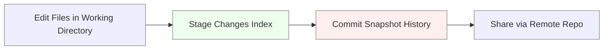

```bash
# 🛠️ Quick Git sanity check and initial setup
git --version                    # ✅ Verify Git is installed
git config --global user.name "Your Name"       # 🧾 Set commit author name
git config --global user.email "you@example.com" # ✉️ Set commit author email
git config --global init.defaultBranch main      # 🌿 Default branch name
```
---

## 📍 Slide 2 – 🔎 Why We Need Version Control

* ⚠️ Without VCS: **“final\_final\_really\_final.py”**, overwritten work, lost changes, no audit trail.
* 👥 With VCS: **parallel work** via branches, safe experimentation, easy **rollback**.
* 🔁 Enables **Continuous Integration (CI)** and disciplined **code review** practices.
* 🧯 Reduces “merge hell” by giving tools to **diff**, **merge**, and **resolve conflicts**.

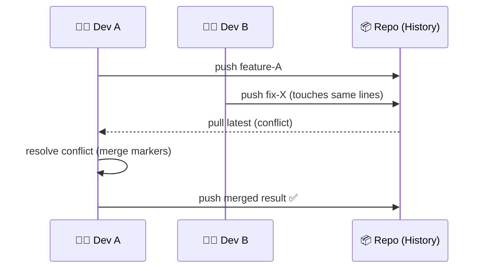

* 🔗 **Further reading:** [Git Basics](https://git-scm.com/book/en/v2/Getting-Started-Git-Basics), [Atlassian: Why VCS](https://www.atlassian.com/git/tutorials/what-is-version-control)
---

## 📍 Slide 3 – 🕰️ A Short History of VCS (to Understand Today)

* 🏛️ Early tools: **SCCS = Source Code Control System (1972)**, **RCS = Revision Control System (1982)**.
* 🧵 **CVS = Concurrent Versions System (1990)** → popular centralized model; successor **SVN = Subversion (2000)**.
* 🔗 **BitKeeper** used by Linux kernel (early 2000s) until licensing fallout in **2005**.
* 🚀 **Git (2005)** by Linus Torvalds & **Mercurial (2005)** → **DVCS = Distributed Version Control System** era.
* 🌐 **GitHub (2008)** accelerated open-source collaboration; later GitLab, Bitbucket, Gitea broadened the ecosystem.

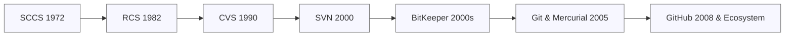

* 🔗 **Explore:** [Subversion](https://subversion.apache.org/), [Mercurial](https://www.mercurial-scm.org/), [Git timeline (Git-SCM)](https://git-scm.com/book/en/v2/Getting-Started-A-Short-History-of-Git)
---

## 📍 Slide 4 – 🧭 Centralized vs Distributed VCS

* 🏢 **Centralized VCS (e.g., SVN)**: one **central server**; clients commit directly to it; simpler mental model.
* 🛰️ **Distributed VCS (e.g., Git, Mercurial)**: **every clone is a full repository** with complete history; offline commits & rich workflows.
* 🧪 **Branching/Merging**: heavy & rare in many centralized setups vs **cheap & frequent** in DVCS.
* ⚖️ Trade-offs: centralized = easier control; distributed = **resilience**, **speed**, and **flexibility**.

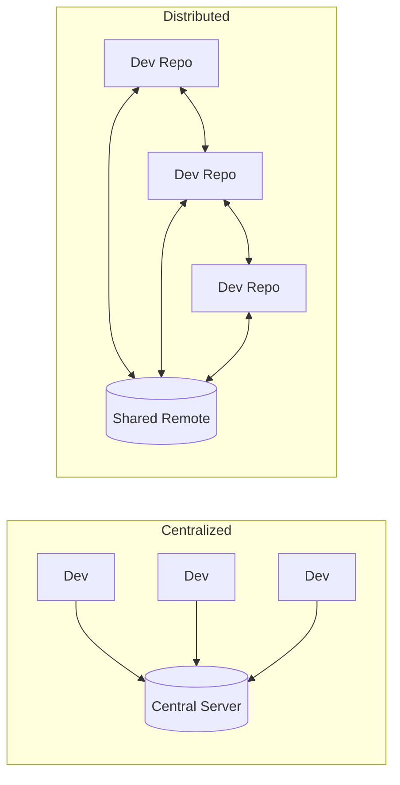

```bash
# 🧪 Centralized-style flow (SVN-ish mental model, for contrast)
# (Git can emulate central push-to-main, but branching is encouraged)
git clone https://host/repo.git
git commit -m "Change on main"     # ❌ Risky on teams without review
git push origin main               # 🔒 Better with branch protections

# 🛰️ Distributed flow (Git norm)
git switch -c feature/login        # 🌿 Create a feature branch
# ... work, stage, commit ...
git push -u origin feature/login   # 🚀 Publish branch for review
```
---

## 📍 Slide 5 – 🧰 The Git Ecosystem (What We’ll Use)

* 🧱 **Core Tool:** **Git (Distributed Version Control System)** via **CLI = Command Line Interface** (our focus).
* 🏗️ **Hosting:** **GitHub**, **GitLab**, **Bitbucket**, **Gitea** (self-host) — repos, issues, pull/merge requests, CI/CD.
* 🔌 **Integrations:** IDE plugins (e.g., VS Code GitLens), code scanning, secret detection, release automation.
* 🎯 **This course:** prioritize **Git CLI mastery**; platforms are interchangeable concepts-wise.

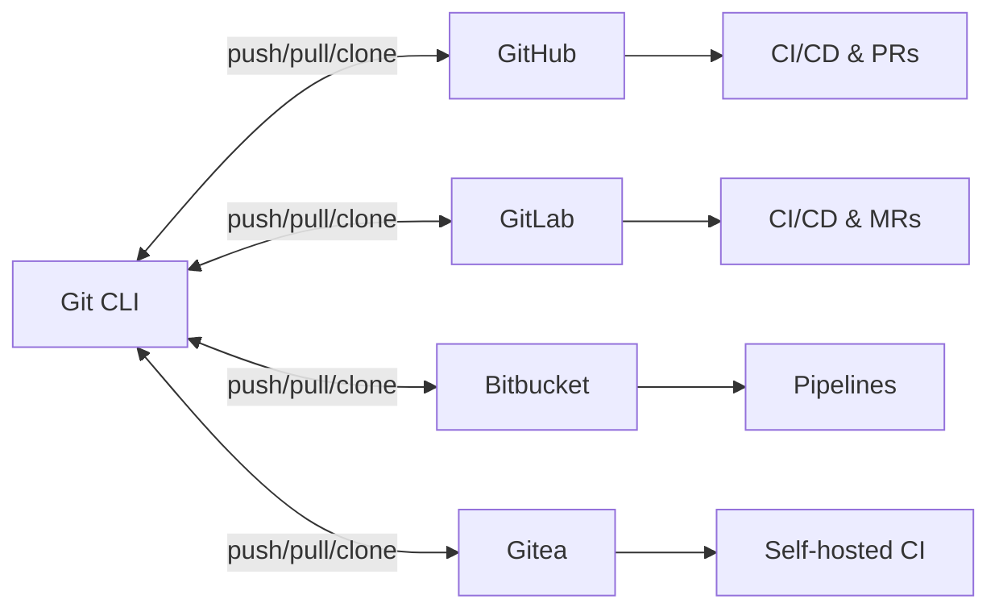

* 🔗 **Start here:** [Git Downloads](https://git-scm.com/downloads), [GitHub Docs](https://docs.github.com/), [GitLab Docs](https://docs.gitlab.com/), [Bitbucket Git Tutorials](https://www.atlassian.com/git)
---

## 📍 Slide 6 – 🏁 Getting Started with Git (Install & First Config)

* 💻 Install via package managers or installers; verify with `git --version`.
* 🧾 Set **identity** (name/email), **default branch** (e.g., `main`), and helpful **defaults** (safe line endings, colors).
* 🆘 Use `git help`, `git <cmd> -h`, and `man git-<cmd>` for built-in guidance.
* 🧪 Create a tiny repo to prove your setup: `git init`, `git add`, `git commit`.

```bash
# 💿 Install (choose your OS)
# macOS (Homebrew)
brew install git
# Ubuntu/Debian
sudo apt-get update && sudo apt-get install -y git
# Fedora
sudo dnf install -y git
# Windows
winget install --id Git.Git -e --source winget  # or download installer from git-scm.com

# 🧾 First-time configuration
git config --global user.name  "Your Name"           # 🧑 Author shown in history
git config --global user.email "you@example.com"     # ✉️ Used for commits
git config --global init.defaultBranch main          # 🌿 Default branch name
git config --global core.autocrlf input              # 🔧 Line endings (macOS/Linux)
# Windows alternative:
# git config --global core.autocrlf true
git config --global color.ui auto                    # 🎨 Colored output

# 🧪 Smoke test: create and commit
mkdir hello-git && cd hello-git
git init                                            # 🚩 New repository
echo "Hello VCS = Version Control System" > readme.txt
git add readme.txt                                  # 📥 Stage file
git commit -m "feat: initial commit with readme"    # 📸 Snapshot
git log --oneline                                   # 🕰️ View history
```

* 🔗 **Reference:** [git config](https://git-scm.com/docs/git-config), [First-time Git setup](https://git-scm.com/book/en/v2/Getting-Started-First-Time-Git-Setup)

---
## 📍 Slide 7 – 🧩 Git’s Mental Model: Working Tree, Staging (Index), Repository

* 🗂️ **Working Tree** = your real files on disk (you edit these).
* 📥 **Staging Area (Index)** = a “shopping cart” of changes you plan to commit.
* 🗄️ **Local Repository (Object Database)** = history of **commits (snapshots)** stored with hashes.
* 🛰️ **Remote Repository** = shared copy on a server (e.g., GitHub/GitLab) for collaboration.
* 🧠 Rule of thumb: **edit → stage → commit → push** (and **pull** to sync).
* 🔗 **Docs:** [Git Glossary](https://git-scm.com/docs/gitglossary), [Pro Git — Git Basics](https://git-scm.com/book/en/v2/Getting-Started-Git-Basics)

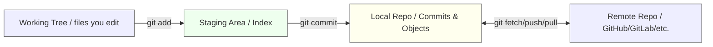

```bash
# 🧪 Map commands to the model
git status                      # 🔍 What changed? What’s staged?
git add app.py                  # ➕ Stage file for the next commit
git restore --staged app.py     # ↩️ Unstage (remove from Index, keep file)
git commit -m "feat: add API client"  # 📸 Record snapshot in local repo
git push origin main            # 🚀 Publish local commits to remote
```
---

## 📍 Slide 8 – 🧱 Commits, Trees & Hashes (SHA = Secure Hash Algorithm)

* 🧾 A **Commit** = snapshot + metadata (author, date, message, parent links).
* 🧮 Commits are identified by a **hash** (by default **SHA-1 = Secure Hash Algorithm 1**; **SHA-256** support also exists).
* 🌳 Each commit points to a **tree** (directory structure) and **blobs** (file contents).
* 🧬 History is a **DAG = Directed Acyclic Graph** of commits (parents → children).
* 🧭 Short hashes (e.g., `a1b2c3d`) are abbreviations of the full hash.
* 🔗 **Docs:** [git commit](https://git-scm.com/docs/git-commit), [git objects](https://git-scm.com/book/en/v2/Git-Internals-Git-Objects)

```bash
# 🔍 Inspect history & commit internals
git log --oneline --decorate --graph   # 🧭 Compact history with branches
git show HEAD                          # 🔬 Show latest commit diff & metadata
git cat-file -p HEAD                   # 🧠 Low-level view of commit object
```
---

## 📍 Slide 9 – 🌿 Branches & 🎯 HEAD (Current Position)

* 🌿 A **Branch** = a lightweight **pointer** (reference) to a commit; it moves as you commit.
* 🎯 **HEAD** = your current position; usually **points to a branch** (e.g., `refs/heads/main`).
* 🚧 **Detached HEAD** = HEAD points **directly to a commit** (not a branch) — safe for temporary checks, risky for long work.
* 🔁 Create, switch, and delete branches with simple commands; visualize movement in graphs.
* 🔗 **Docs:** [git branch](https://git-scm.com/docs/git-branch), [git switch](https://git-scm.com/docs/git-switch), [HEAD](https://git-scm.com/docs/gitglossary#def_HEAD)

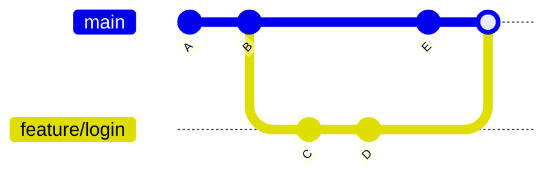

```bash
# 🌿 Branch basics
git branch                      # 📋 List local branches
git switch -c feature/login     # ➕ Create & switch to new branch
git switch main                 # 🔁 Switch back
git branch -d feature/login     # 🗑️ Delete merged branch

# 🎯 HEAD internals
git symbolic-ref HEAD           # 🧭 Usually refs/heads/<branch>
git rev-parse --abbrev-ref HEAD # 🏷️ Current branch name
```
---

## 📍 Slide 10 – 🧪 The Basic Local Workflow (Edit → Stage → Commit)

* ✍️ **Edit** files in the working tree; check `git status` often.
* 📥 **Stage** only what’s ready (`git add -p` for partial hunks; curate clean commits).
* 🧾 **Commit** with a clear message: **what** and **why** (consider Conventional Commits style).
* 🧼 Keep commits small & focused; use `--amend` to fix the last commit before pushing.
* 🔗 **Docs:** [git add](https://git-scm.com/docs/git-add), [git commit](https://git-scm.com/docs/git-commit), [Conventional Commits](https://www.conventionalcommits.org/)


```bash
# 🧪 Curate a focused commit
git add -p src/api.py                 # ✂️ Interactively stage parts (hunks)
git commit -m "feat(api): add GET /users endpoint
#
# why: needed for user list page; docs: ADR-12
"                                     # 🧾 Message captures what & why

# 🧼 Oops, forgot a file → amend before sharing
git add src/types.py
git commit --amend --no-edit          # 🧽 Fix last commit (local only)
```
---

## 📍 Slide 11 – 🔍 Exploring History (Logs, Shows, Blame, Search)

* 🧭 **View history:** `git log` with helpful flags for graphs, decorations, and file scopes.
* 🔬 **Inspect a commit:** `git show <hash>` to see patch + metadata.
* 🧩 **Who changed this line?** `git blame` (aka annotate) — use for context, not blame culture.
* 🧰 **Search history:** `git log -S 'symbol'` (pickaxe), `-G <regex>` for code pattern changes.
* 🔗 **Docs:** [git log](https://git-scm.com/docs/git-log), [git show](https://git-scm.com/docs/git-show), [git blame](https://git-scm.com/docs/git-blame)

```bash
# 🧭 Friendly log views
git log --oneline --graph --decorate --all        # 🗺️ Big-picture graph
git log --since="2 weeks ago" -- src/             # ⏱️ Scoped by time & path
git show HEAD~2                                   # 🔬 Inspect ancestor commit

# 🧩 Who touched that line?
git blame -L 10,40 src/api.py                     # 🔎 Lines 10..40 with authors
git log -S "UserRepository" -- src/               # 🪓 Find commits adding/removing token
```
---

## 📍 Slide 12 – 🧮 Understanding Diffs (Working, Staged, Commits, Ranges)

* 📝 **Working vs Index:** `git diff` shows unstaged changes; `git diff --staged` shows staged changes.
* 🧱 **Commit-to-commit/range:** `git diff <A>..<B>` compares two points; useful for reviews.
* 🧰 **Name-only/word diff:** `--name-only` for file list; `--word-diff` for prose/Markdown changes.
* 🧭 Use diffs to **self-review** before committing and before opening a Pull Request (PR).
* 🔗 **Docs:** [git diff](https://git-scm.com/docs/git-diff)

```bash
# 🧪 Local diffs
git diff                         # ✍️ What changed but not staged?
git diff --staged                # 📥 What’s staged for commit?

# 🧱 Compare commits/branches
git diff main..feature/login     # 🧭 Differences between two branches
git diff v1.0.0..v1.1.0          # 🏷️ Between release tags

# 🧰 Review-friendly flags
git diff --name-only             # 📄 Only filenames changed
git diff --word-diff README.md   # 🧩 Word-level changes for docs
```
---

## 📍 Slide 13 – 🔀 Rebase vs. Merge (and When to Use Each)

* 🧭 **Goal:** integrate work from one branch into another while keeping history understandable.
* 🌳 **Merge** = bring histories together, possibly creating a **merge commit** (keeps full context).
* 📏 **Rebase** = replay commits **on top of** a new base for a **linear history** (cleaner `git log`).
* ⚠️ **Rule:** avoid **rewriting published history** — do **not** `git rebase` branches that others already pulled.
* 🧩 **Heuristic:**

  * 🔧 *Feature branch → main*: prefer **rebase** before opening a Pull Request (PR = Pull Request) to reduce noise.
  * 🧱 *Integrating many contributors*: prefer **merge** to preserve true history.

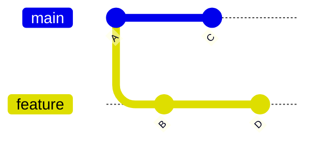

```bash
# 🔀 Merge (keeps branch structure)
git switch main
git merge feature                 # 🧱 Creates a merge commit if not fast-forward

# 📏 Rebase (linearizes your feature branch)
git switch feature
git fetch origin                  # ♻️ Update base
git rebase origin/main            # 📐 Replay feature commits atop latest main
# If conflicts: edit files → git add <file> → git rebase --continue
# Abort if needed: git rebase --abort

# 🧯 Safe alternative when history is public: merge instead of rebase
```

* 🔗 **Read more:** [git merge](https://git-scm.com/docs/git-merge), [git rebase](https://git-scm.com/docs/git-rebase), [Atlassian: Merging vs Rebasing](https://www.atlassian.com/git/tutorials/merging-vs-rebasing)
---

## 📍 Slide 14 – ♻️ Undo & Recovery (Without Tears)

* 🧾 **Change last commit (local):** `git commit --amend` (fix message or add staged files).
* 🧯 **Revert a bad commit (public-safe):** `git revert <hash>` (adds an “undo” commit).
* 🧳 **Reset (move branch pointer):**

  * 🧼 `--soft` (keep index & working tree),
  * 🧺 `--mixed` (default; unstage changes),
  * 🪣 `--hard` (discard local changes — **danger**).
* 🧭 **Restore files:** `git restore` (working tree) / `git restore --staged` (index).
* 🧙 **Time machine:** `git reflog` to recover **lost pointers** and branches.

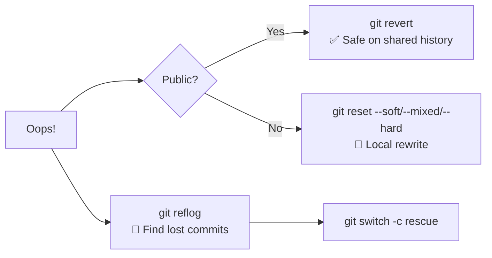

```bash
# 🧾 Amend last commit message or content
git add forgotten_file.py
git commit --amend -m "fix: handle edge case in parser"

# 🧯 Revert a public commit (creates new commit)
git revert a1b2c3d

# 🧺 Reset examples (local only!)
git reset --soft HEAD~1     # ↩️ Uncommit but keep staged
git reset --mixed HEAD~1    # 🔁 Uncommit & unstage
git reset --hard HEAD~1     # 💣 Discard changes (be sure!)

# 🧙 Recover with reflog
git reflog                  # 🗒️ See where HEAD has been
git switch -c rescue HEAD@{3}
```

* 🔗 **Docs:** [git revert](https://git-scm.com/docs/git-revert), [git reset](https://git-scm.com/docs/git-reset), [git restore](https://git-scm.com/docs/git-restore), [git reflog](https://git-scm.com/docs/git-reflog)
---

## 📍 Slide 15 – 🌐 Collaborating with Remotes (Clone, Fetch, Pull, Push)

* 📦 **Clone** = get a full copy: `git clone <url>`.
* 🛰️ **Remote** = named pointer to a server repo (e.g., **origin**, **upstream**).
* 🔄 **Fetch** = download new objects/refs; **Pull** = fetch **+** integrate (merge or rebase).
* 🚀 **Push** = upload local commits to the remote branch.
* 🍴 **Fork-and-pull** model: add **upstream** remote to sync with source project.

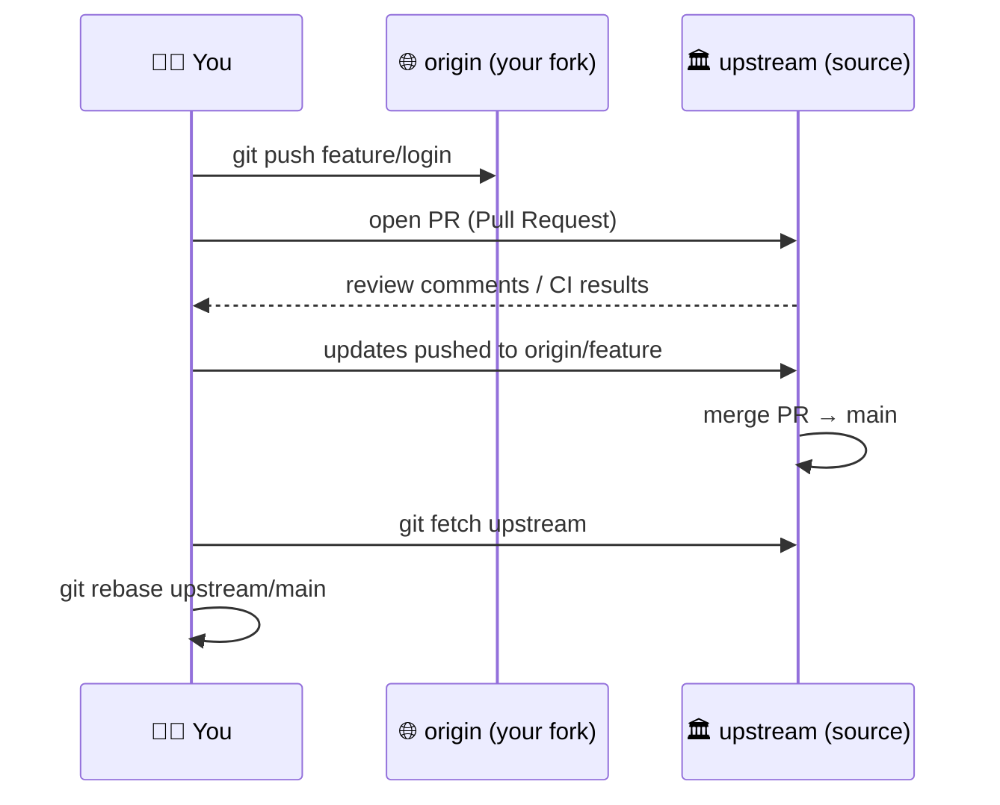

```bash
# 🌱 Start collaborating
git clone https://host/repo.git
git remote -v                     # 📜 See remotes
git fetch --prune                 # ✂️ Remove deleted remote branches

# 🔁 Sync your branch with latest main
git fetch origin
git rebase origin/main            # 📏 Keep linear local history

# 🍴 Fork workflow (add upstream)
git remote add upstream https://host/upstream.git
git fetch upstream
git rebase upstream/main          # 🧭 Rebase your feature onto upstream main
```

* 🔗 **Docs:** [git clone](https://git-scm.com/docs/git-clone), [git fetch](https://git-scm.com/docs/git-fetch), [git pull](https://git-scm.com/docs/git-pull), [Forking workflow](https://docs.github.com/en/get-started/quickstart/fork-a-repo)
---

## 📍 Slide 16 – 🛣️ Branching Strategies: GitFlow, GitHub Flow, Trunk-Based

* 🧭 **GitFlow** (release-driven products): **develop** + **main**, with **feature**, **release**, **hotfix** branches; structured but heavier.
* 🌊 **GitHub Flow** (web services, continuous deploy): branch off **main**, open PR (Pull Request), **deploy after merge**; simple & fast.
* 🌲 **Trunk-Based Development** (high cadence): very **short-lived branches** or direct commits to **main** behind **feature toggles**.
* 🧪 **Choose by context:**

  * 🏭 Enterprise/regulated: **GitFlow** or **GitLab Flow** variants.
  * 🌐 SaaS/continuous delivery: **GitHub Flow** or **Trunk-Based**.
  * 👥 Small teams/new repos: **GitHub Flow** often ideal.

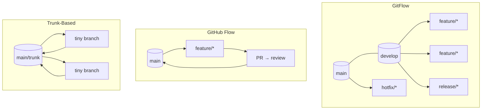

```bash
# 🧱 GitFlow helper (optional tool)
git flow init                         # 🧭 Adds commands: git flow feature start <x> ...
git flow feature finish <x>           # 🔀 Merge back to develop

# 🌊 GitHub Flow (lightweight)
git switch -c feature/signup
# code → commit → push
gh pr create --fill                   # 💬 Open PR via GitHub CLI
gh pr merge --squash                  # 🧼 Squash on merge (clean history)
```

* 🔗 **Learn more:** [Atlassian – Git workflows](https://www.atlassian.com/git/tutorials/comparing-workflows), [Original GitFlow](https://nvie.com/posts/a-successful-git-branching-model/), [Trunk-Based Development](https://trunkbaseddevelopment.com/), [GitLab Flow](https://docs.gitlab.com/ee/topics/gitlab_flow.html)
---

## 📍 Slide 17 – 👀 Pull Requests (PR) / Merge Requests (MR) & Code Review

* 📨 **PR/MR** = request to merge changes; enables **discussion**, **review**, **status checks** (CI = Continuous Integration).
* 🧪 **CI gates**: tests, linters, security scans run **automatically** on PR/MR.
* 🧑‍⚖️ **Review tips:** small, focused PRs; explain “why”; respond to feedback; prefer **suggested changes**.
* 🧹 **Merge strategies:**

  * 🧱 **Merge commit** (preserves branch),
  * ✂️ **Squash** (single commit),
  * 📏 **Rebase & merge** (linear history).
* 🪪 **Ownership & policy:** `CODEOWNERS`, required reviewers, **DCO = Developer Certificate of Origin** or **signed commits**.

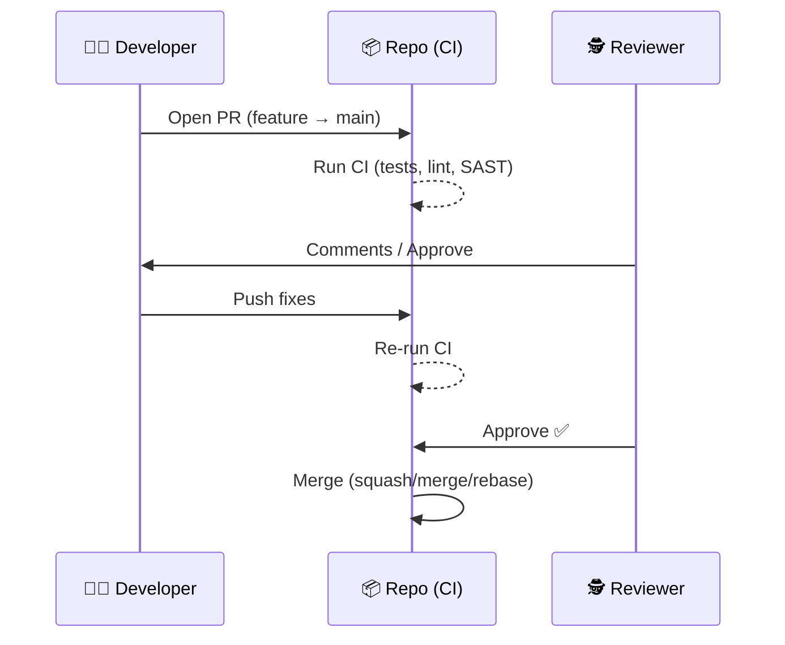

```yaml
# 🧪 .github/workflows/pr.yml — CI on Pull Requests
name: pr-checks
on:
  pull_request:
    branches: [ "main" ]
jobs:
  test:
    runs-on: ubuntu-latest
    steps:
      - uses: actions/checkout@v4        # 📥 Fetch code
      - uses: actions/setup-python@v5    # 🐍 Example runtime
        with: { python-version: "3.11" }
      - run: pip install -r requirements.txt
      - run: pytest -q                    # ✅ Tests must pass
```

* 🔗 **Resources:** [GitHub PRs](https://docs.github.com/pull-requests), [GitLab MRs](https://docs.gitlab.com/ee/user/project/merge_requests/), [CODEOWNERS](https://docs.github.com/repositories/managing-your-repositorys-settings-and-features/customizing-your-repository/about-code-owners)
---
## 📍 Slide 18 – 🏷️ Tags & Releases (Versioning for Humans and Machines)

* 🏷️ **Tag** = named pointer to a commit; **lightweight** vs **annotated** (message, author, date).
* 🧩 **Semantic Versioning (SemVer)**: **MAJOR.MINOR.PATCH** (e.g., `v1.4.2`).
* 🔐 **Signed tags/commits** (GPG) add authenticity & integrity.
* 🚀 **Releases**: attach notes/artifacts; CI/CD can **build/deploy** from tags.

```bash
# 🏷️ Create and push tags
git tag v1.0.0                      # 🪶 Lightweight
git tag -a v1.1.0 -m "Release 1.1"  # 📝 Annotated
git push origin --tags              # 🚀 Publish all local tags
git show v1.1.0                     # 🔬 See what was released

# 🔐 Signed tag (requires GPG setup)
git tag -s v1.2.0 -m "Signed release"
```

```yaml
# 🚀 Build on tag push (GitHub Actions)
name: release
on:
  push:
    tags:
      - "v*.*.*"
jobs:
  build:
    runs-on: ubuntu-latest
    steps:
      - uses: actions/checkout@v4
      - run: ./build.sh                 # 🏗️ Produce artifacts
  publish:
    needs: build
    runs-on: ubuntu-latest
    steps:
      - uses: softprops/action-gh-release@v2
        with:
          files: "dist/*"               # 📦 Upload release assets
```

* 🔗 **Docs:** [git tag](https://git-scm.com/docs/git-tag), [SemVer](https://semver.org/), [GitHub Releases](https://docs.github.com/repositories/releasing-projects-on-github/about-releases)

---
## 📍 Slide 19 – 🗃️ Stashing Work-in-Progress (WIP) with Git Stash

* 🧳 **Stash** = temporarily save **uncommitted** changes so you can switch branches without committing noise.
* 🧩 Useful for **context switches** (urgent bugfix) or to **pull/rebase** cleanly.
* 🧠 Stashes are **local** to your clone; name them for clarity; apply or pop later.
* ⚠️ Be careful with **binary** or **renamed** files; review before popping.
* 🔗 **Docs:** [git stash](https://git-scm.com/docs/git-stash)

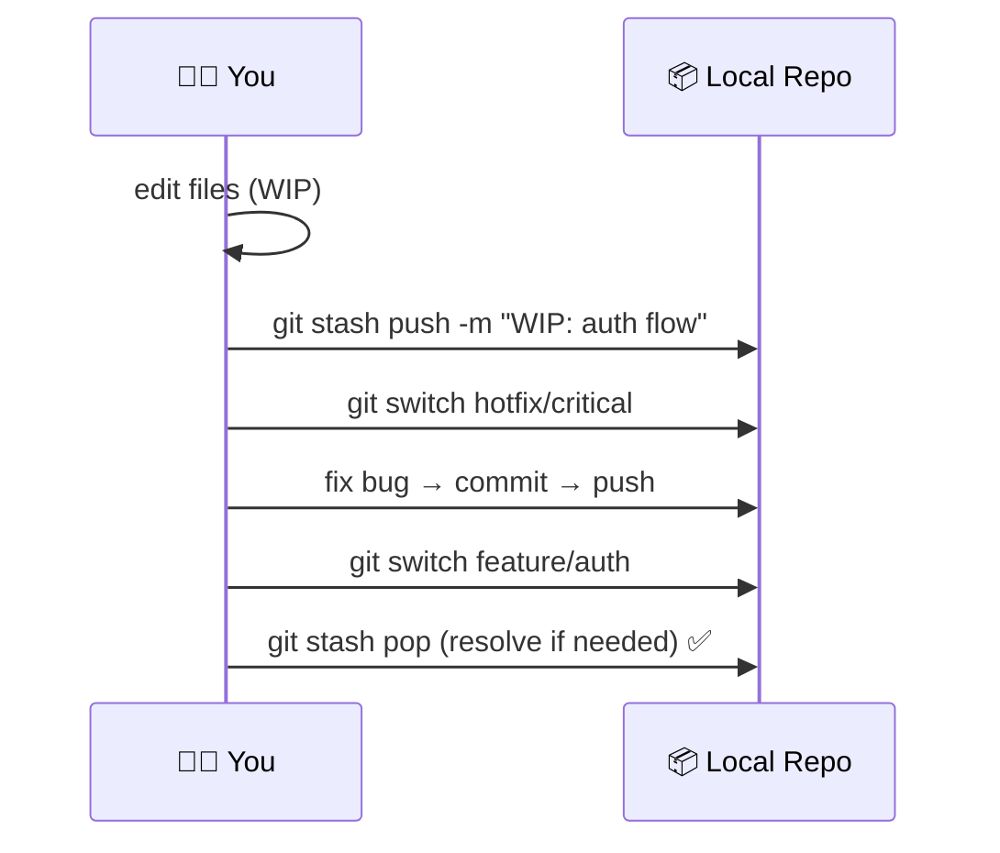

```bash
# 🧳 Basic usage
git status
git stash push -m "WIP: auth flow before meeting"  # 🏷️ Name the stash
git stash list                                      # 📜 See stashes
git switch hotfix/critical                          # 🔁 Context switch
# ... fix, commit, push ...

git switch feature/auth
git stash pop                                       # 🔄 Apply & drop
# If conflicts → resolve → git add → continue

# 🎯 Keep staged changes intact, stash only working tree
git stash push --keep-index -m "WIP: after staging unit tests"

# 🧹 Clean up
git stash drop stash@{0}                            # 🗑️ Remove a specific stash
```
---

## 📍 Slide 20 – 🤖 Git Hooks & Local Automation (Quality Gates)

* 🪝 **Hooks** = scripts Git runs on certain events (e.g., **pre-commit**, **commit-msg**, **pre-push**).
* 🧪 Enforce **lint/tests** before committing; standardize **commit message** format.
* 🧰 Server-side hooks (**pre-receive**, **update**) enforce policies in **central repos**.
* 🧱 For team-wide hooks, use **hook frameworks** (e.g., [pre-commit](https://pre-commit.com/)) or repo tooling.
* 🔗 **Docs:** [Git hooks](https://git-scm.com/docs/githooks), [commitlint](https://commitlint.js.org/), [Husky](https://typicode.github.io/husky/)

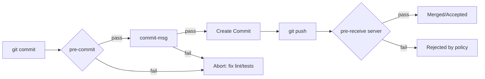

```bash
# 🧪 Example: local .git/hooks/pre-commit (make executable)
cat > .git/hooks/pre-commit <<'SH'
#!/usr/bin/env bash
set -e
echo "[pre-commit] running unit tests..."
pytest -q
echo "[pre-commit] running linter..."
flake8
SH
chmod +x .git/hooks/pre-commit

# 🧾 Example: enforce commit message via .git/hooks/commit-msg
cat > .git/hooks/commit-msg <<'SH'
#!/usr/bin/env bash
msg_file="$1"
grep -Eq '^(feat|fix|docs|chore|refactor|test)(\(.+\))?: .{1,}' "$msg_file" || {
  echo "Commit message must follow Conventional Commits (e.g., 'feat(api): add endpoint')" >&2
  exit 1
}
SH
chmod +x .git/hooks/commit-msg
```
---
## 📍 Slide 21 – 🪵 Large Files & Huge Repositories (LFS, Sparse, Partial)

* 🧱 Problem: Git stores **full snapshots**; **large binaries** bloat history and slow clones.
* 📦 **Git LFS = Git Large File Storage** stores binaries outside normal objects; pointers in the repo.
* ✂️ **Shallow clone** (`--depth`) and **sparse checkout** reduce what you download/checkout.
* 🔌 **Partial clone** & **filtering** fetch objects lazily; **submodules** isolate external deps.
* 🔗 **Docs:** [Git LFS](https://git-lfs.com/), [Sparse Checkout](https://git-scm.com/docs/git-sparse-checkout), [Partial Clone](https://git-scm.com/docs/partial-clone), [Submodules](https://git-scm.com/book/en/v2/Git-Tools-Submodules)

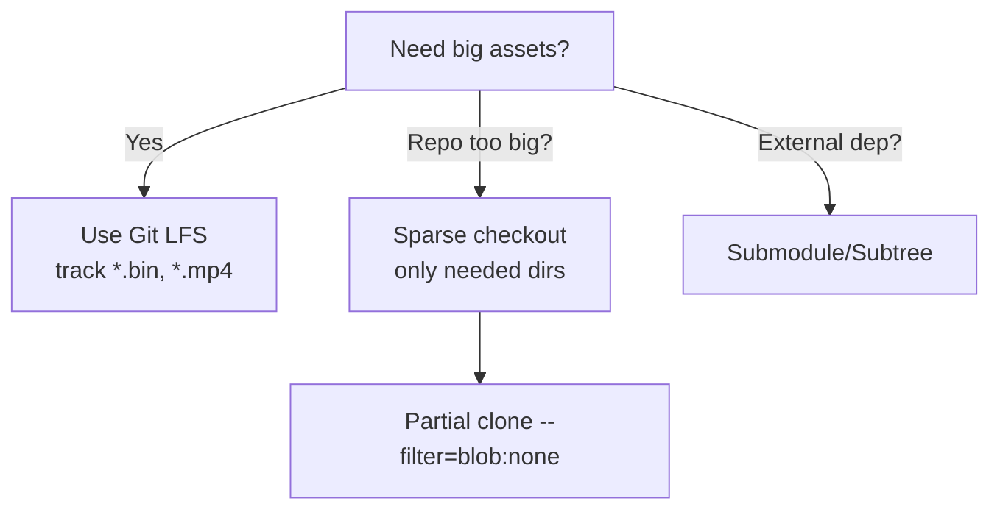

```bash
# 📦 Git LFS quickstart
git lfs install
git lfs track "*.mp4" "*.zip"              # 🏷️ Track patterns
echo "*.mp4 filter=lfs diff=lfs merge=lfs -text" >> .gitattributes
git add .gitattributes large_video.mp4
git commit -m "chore: track large assets with LFS"
git push

# ✂️ Shallow & sparse
git clone --depth=1 https://host/huge.git   # 🌱 Latest snapshot only
cd huge
git sparse-checkout init --cone             # 🔻 Cone mode
git sparse-checkout set app/ docs/          # 📂 Checkout only needed dirs

# 🔌 Partial clone (lazy blobs)
git clone --filter=blob:none https://host/huge.git
```
---
## 📍 Slide 22 – 🧭 Other Version Control Systems (Landscape & Use Cases)

* 🏢 **SVN = Subversion (centralized)**: simple mental model; common in legacy/regulated environments.
* 🛰️ **Mercurial (DVCS = Distributed Version Control System)**: similar to Git; different UX; used historically by Mozilla.
* 🧩 **Perforce Helix (centralized + locks)**: excels with **large binaries** and huge monorepos (games, media).
* 🧱 **TFVC = Team Foundation Version Control (centralized)**: older Microsoft stack; some enterprises still use it.
* 🎯 Choose based on **team workflows**, **asset types**, **toolchain integration**, **history**.
* 🔗 **Docs:** [Subversion](https://subversion.apache.org/), [Mercurial](https://www.mercurial-scm.org/), [Perforce](https://www.perforce.com/), [TFVC](https://learn.microsoft.com/azure/devops/repos/tfvc/what-is-tfvc)

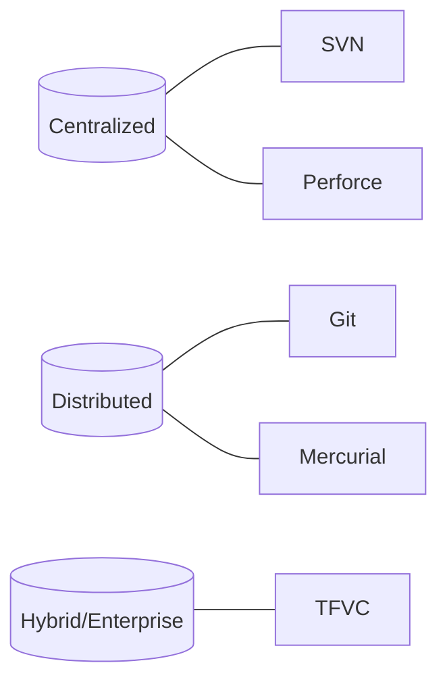
---
## 📍 Slide 23 – ⚖️ Git vs. SVN (Subversion) — Models & Workflows

* 🛰️ **Git (DVCS)**: every clone has **full history**; offline commits; **cheap branching/merging**.
* 🏢 **SVN (centralized)**: relies on **central server**; simpler model; heavier branching.
* 🔄 **Workflow**: Git encourages **feature branches** + PR; SVN often uses **trunk** commits + manual review.
* 🧬 **History**: Git’s **DAG = Directed Acyclic Graph**; SVN has linear revisions (r1, r2, …).
* 🧩 Migration trend: many teams moved from SVN → Git for flexibility; SVN remains in some regulated/legacy orgs.
* 🔗 **Learn:** [SVN Book](https://svnbook.red-bean.com/), [Atlassian Git vs SVN](https://www.atlassian.com/git/tutorials/migrating-overview)

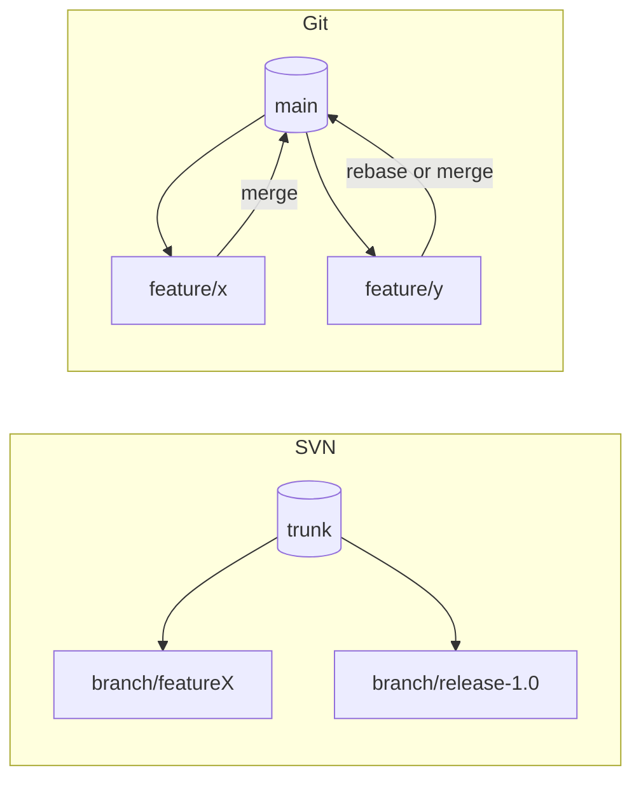

```bash
# 🔁 Typical SVN vs Git operations (rough analogies)
# SVN: checkout working copy, commit to server
svn checkout https://host/svn/project/trunk project
# edit...
svn commit -m "Fix issue #123 on trunk"

# Git: clone local repo, commit locally, then push
git clone https://host/git/project.git
# edit...
git add .
git commit -m "fix: issue #123 on main"
git push origin main
```
---
## 📍 Slide 24 – ⚖️ Git vs. Mercurial (Hg) — Same Goal, Different Feel

* 🛰️ **Both are DVCS** (full local history, offline work, branching).
* 🧱 **Staging area**: Git has **Index**; Mercurial typically **commits directly** (extensions exist).
* 🏷️ **Branching model**: Git uses lightweight **branches**; Mercurial has **named branches** & **bookmarks**.
* 🧰 **Commands**: Git (`git status`, `git log`, `git rebase`), Mercurial (`hg status`, `hg log`, `hg rebase`).
* 🌐 **Ecosystems**: Git’s network effect via **GitHub/GitLab**; Mercurial community is smaller but robust.
* 🔗 **Docs:** [Mercurial Guide](https://www.mercurial-scm.org/guide), [Hg Book](https://hgbook.red-bean.com/)

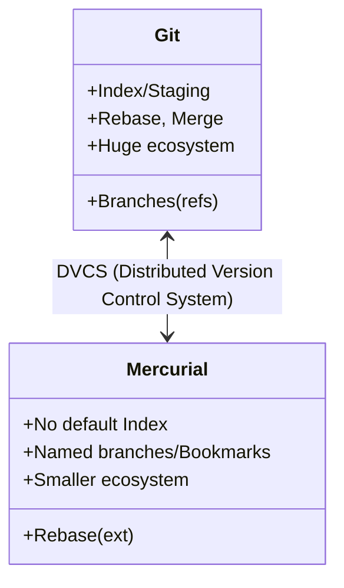

```bash
# 🔁 Side-by-side basics
# Git
git init && git add . && git commit -m "feat: init"
git branch -c feature/alpha
git rebase main

# Mercurial (Hg)
hg init && hg add && hg commit -m "feat: init"
hg bookmark feature/alpha         # 🏷️ Like a lightweight branch
hg rebase -d default              # 📏 Requires rebase extension enabled
```

---
## 📍 Slide 25 – ⚔️ War Stories & History Nuggets (Git vs the Old Guard)

* 🧨 **2005 turning point:** Linux kernel loses BitKeeper → Linus Torvalds creates **Git (Distributed Version Control System)** focused on speed and branching.
* 🗣️ **Opinionated design:** Torvalds pushed *cheap branching*, *content-addressed storage*, and *distributed trust* → culture shift away from centralized habits.
* 🧲 **Network effects:** **GitHub (2008)** and later **GitLab/Bitbucket/Gitea** made forking & Pull Requests mainstream → Git adoption explodes.
* 🧪 **Practice shift:** teams moved from “commit to trunk” to **feature branches + code review + Continuous Integration (CI)**.
* 📚 **Deep dives:** [Pro Git (free)](https://git-scm.com/book), [Linus talk on Git (video)](https://www.youtube.com/watch?v=4XpnKHJAok8), [Git history](https://git-scm.com/book/en/v2/Getting-Started-A-Short-History-of-Git)

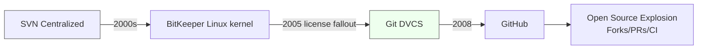
---
## 📍 Slide 26 – 🐧 Case Study: Linux Kernel Workflow at Scale

* 📨 **Email-driven patches:** contributors send patches via mailing lists; maintainers curate & merge.
* 🧱 **Signed-off-by (DCO = Developer Certificate of Origin):** asserts origin/permission to submit.
* 🌲 **Subsystem maintainers** keep topic branches; **Linus** integrates via pulls → stable **mainline**.
* 🧭 **git bisect** for fast regression hunts; **rerere** for recurring conflict resolution.
* 🔗 **Learn more:** [SubmittingPatches](https://www.kernel.org/doc/html/latest/process/submitting-patches.html), [DCO](https://developercertificate.org/)

```mermaid
sequenceDiagram
  participant Contrib as 👩‍💻 Contributor
  participant ML as ✉️ Mailing List
  participant Maint as 🧭 Subsystem Maintainer
  participant Linus as 🐧 Linus (Mainline)
  Contrib->>ML: send patch (git send-email)
  Maint->>Maint: review & apply (git am)
  Maint->>Linus: pull request (signed)
  Linus->>Linus: merge → mainline
```

```bash
# ✉️ Kernel-style patch flow
git checkout -b topic/fix-scheduler
git commit -s -m "sched: fix wakeup race\n\nSigned-off-by: Your Name <you@example.com>"
git format-patch -1                 # 📦 Create patch file
git send-email *.patch              # 📮 Requires email setup

# 🔎 Regression hunting
git bisect start
git bisect bad v6.11                # 🟥 Known bad tag
git bisect good v6.10               # 🟩 Known good tag
# run tests → mark good/bad until culprit found
```
---
## 📍 Slide 27 – 🏢 Case Study: Enterprise Migration & “Git at Scale”

* 🧱 **Problem:** monolithic repos, huge histories, binary assets → **slow clones**, **tool limits**.
* 🧰 **Solutions:** **Partial clone**, **sparse checkout**, **Git LFS (Large File Storage)**, and virtualized file systems (e.g., **VFS for Git**).
* 🧭 **Process:** staged migration (pilot teams), enforce **branch protection** + **CI gates**, train on **branching models**.
* 📈 **Outcome:** faster iteration, standardized reviews, automation hooks, and better auditability.
* 🔗 **Learn more:** [Partial Clone](https://git-scm.com/docs/partial-clone), [Sparse Checkout](https://git-scm.com/docs/git-sparse-checkout), [VFS for Git](https://github.com/microsoft/VFSForGit)

```mermaid
flowchart TB
  A[Legacy Centralized VCS] --> B[Pilot: Git mirror + training]
  B --> C[Adopt LFS/Partial/Sparse]
  C --> D[Branch protections + CI gates]
  D --> E[Org-wide rollout]
  E --> F[Metrics: lead time ↓, change fail rate ↓]
```

```bash
# 🪄 Scale helpers
git clone --filter=blob:none https://host/mono.git   # 🪶 Partial clone (lazy blobs)
git sparse-checkout init --cone
git sparse-checkout set src/service-a docs/          # 📂 Narrow working tree

# 🧳 Large binary handling
git lfs install
git lfs track "*.psd" "*.zip"
echo "*.psd filter=lfs diff=lfs merge=lfs -text" >> .gitattributes
```
---
## 📍 Slide 28 – 🧭 Team Best Practices (Day-to-Day Git Hygiene)

* 🧾 **Write great commits:** small, focused; message explains **what** & **why** (consider **Conventional Commits**).
* 🔒 **Protect main branch:** required reviews, **status checks (CI)**, no direct pushes.
* 🔁 **Keep branches fresh:** rebase/merge frequently to avoid drift and conflict storms.
* 🧰 **Automate quality:** pre-commit hooks, linters, tests, secret scanning in CI.
* 📜 **Ownership:** `CODEOWNERS` for clear reviewers; use templates for PRs and issues.

```bash
# ✅ Conventional commit examples
git commit -m "feat(auth): add OAuth2 login flow"
git commit -m "fix(api): handle 404 for missing user"

# 🗂️ .github/CODEOWNERS
# Owners by path (GitHub/GitLab similar)
*                 @org/core-team
api/**            @backend/maintainers
ui/**             @frontend/maintainers
docs/**           @tech-writers
```

```yaml
# 🧪 CI as a gate (GitHub Actions)
name: pr-quality
on: { pull_request: { branches: [ "main" ] } }
jobs:
  quality:
    runs-on: ubuntu-latest
    steps:
      - uses: actions/checkout@v4
      - run: pip install pre-commit && pre-commit run --all-files   # 🧹 Lint/format
      - run: pip install detect-secrets && detect-secrets scan      # 🔐 Secret scan
      - run: pytest -q                                              # ✅ Tests
```
---
## 📍 Slide 29 – 🧯 Common Pitfalls & Recovery Patterns

* 💣 **`git push --force` on shared branches:** prefer **`--force-with-lease`** or avoid entirely; coordinate with team.
* 🗂️ **Committing secrets:** rotate credentials **immediately**; scrub history with **git filter-repo** or **BFG Repo-Cleaner**; add detectors.
* 🧊 **Long-lived branches:** merge/rebase often; keep Pull Requests small.
* 🧵 **Line endings & perms:** set `.gitattributes`; configure `core.autocrlf` properly across OSes.
* 🕵️ **Lost work:** `git reflog` is your time machine.

```mermaid
flowchart LR
  S[Oops: secret in repo?] --> R1[Revoke/rotate keys NOW]
  R1 --> C1[Add detector in CI]
  C1 --> H1[History rewrite: filter-repo/BFG]
  H1 --> P1[Protect: pre-receive policy]
```

```bash
# 🛡️ Safer force
git push --force-with-lease

# 🧽 Remove secrets from history (install git-filter-repo first)
git filter-repo --path .env --invert-paths

# 🧰 BFG (alternative)
bfg --delete-files .env --delete-files id_rsa

# 📐 Normalize line endings
echo "* text=auto" > .gitattributes
git config --global core.autocrlf input    # macOS/Linux
# Windows:
# git config --global core.autocrlf true
```
---
## 📍 Slide 30 – 🔐 Security, Signing & Compliance (Trust Your History)

* 🪪 **Signed commits/tags** (GPG or SSH signing) → verify authorship & integrity (**“Verified”** badges on platforms).
* 📜 **DCO = Developer Certificate of Origin** and/or **CLA = Contributor License Agreement** for governance.
* 🛰️ **Server enforcement:** pre-receive hooks requiring signatures, branch protections, allowed authors.
* 🕵️ **Continuous scanning:** secrets, dependencies, and SAST = Static Application Security Testing on every PR.

```bash
# 🔏 GPG signing setup (example)
gpg --full-generate-key
gpg --list-secret-keys --keyid-format=long
git config --global user.signingkey <KEYID>
git config --global commit.gpgsign true
git commit -S -m "chore: signed commit"
git tag -s v1.0.0 -m "signed release"
git verify-commit HEAD
git verify-tag v1.0.0

# 🔑 SSH-based signing (Git ≥2.34)
ssh-keygen -t ed25519 -C "signing key"
git config --global gpg.format ssh
git config --global user.signingkey ~/.ssh/id_ed25519.pub
```

```bash
# 🧱 Server-side pre-receive hook (enforce signatures) — sample
cat > hooks/pre-receive <<'SH'
#!/usr/bin/env bash
set -euo pipefail
while read old new ref; do
  # verify all new commits are signed
  if ! git rev-list $old..$new --not --all | xargs -r -n1 git verify-commit --raw >/dev/null 2>&1; then
    echo "❌ Rejected: unsigned commit detected on $ref" >&2
    exit 1
  fi
done
SH
chmod +x hooks/pre-receive
```

---
## 📍 Slide 31 – 🧱 Beyond Code: Everything-as-Code & 🚢 GitOps

* 🧩 **Everything-as-Code** = express **Infrastructure as Code (IaC)**, **Configuration as Code (CaC)**, **Policy as Code (PaC)**, and **Docs as Code** in repositories for reviewable, auditable change.
* 🧭 **GitOps** = use **Git (single source of truth)** for desired state; **controllers** (e.g., Argo CD, Flux) **pull** from Git and **reconcile** clusters/environments.
* 🔁 **Reconciliation loop** detects **drift** between desired (Git) and actual (runtime) state and **converges** automatically.
* 🔐 Integrate **secrets management** (Sealed Secrets, SOPS) and **branch protection + PR review** for safe changes.
* 🧪 Typical pattern: **PR → review → merge → controller sync → environment updated** (no kubectl on prod).

```mermaid
sequenceDiagram
  participant Dev as 👩‍💻 Developer
  participant Git as 📚 Git Repo (desired state)
  participant Ctrl as 🤖 GitOps Controller (Argo CD/Flux)
  participant Clu as ☸️ Cluster/Env (actual state)
  Dev->>Git: PR with k8s manifests / kustomize
  Git-->>Dev: Reviews & CI checks
  Dev->>Git: Merge to main
  Ctrl->>Git: Poll/Watch repo for changes
  Ctrl->>Clu: Apply changes to reach desired state
  Clu-->>Ctrl: Report status (health/sync)
```

```bash
# 🧱 Example repo layout (Everything-as-Code)
repo/
├─ infra/                 # 🏗️ Terraform, modules, backends
├─ apps/
│  └─ web/
│     ├─ k8s/             # ☸️ K8s manifests/kustomize
│     └─ dev/ prod/       # 🌱 Envs as overlays
├─ policies/              # 🧑‍⚖️ PaC (OPA/Conftest/Rego)
├─ .github/workflows/     # 🤖 CI for validate/plan/test
└─ docs/                  # 📘 Docs-as-code (Markdown)
```

```yaml
# ☸️ Minimal Deployment (kustomize-ready)
apiVersion: apps/v1
kind: Deployment
metadata:
  name: web
spec:
  replicas: 3  # 🔁 Scales via Git change & reconciliation
  selector: { matchLabels: { app: web } }
  template:
    metadata: { labels: { app: web } }
    spec:
      containers:
        - name: web
          image: ghcr.io/org/web:1.2.3 # 🏷️ Tag from release
          ports: [ { containerPort: 8080 } ]
```

* 🔗 **Learn more:** [Argo CD](https://argo-cd.readthedocs.io/), [Flux](https://fluxcd.io/), [Kustomize](https://kubectl.docs.kubernetes.io/guides/introduction/kustomize/), [Mozilla SOPS](https://github.com/getsops/sops), [Sealed Secrets](https://github.com/bitnami-labs/sealed-secrets)
---

## 📍 Slide 32 – 🧭 Learning Resources & 🎯 Practice Playground

* 📘 **Official docs:** **Git** ([git-scm.com/docs](https://git-scm.com/docs)), **Pro Git (free book)**, **GitHub Docs**, **GitLab Docs**, **Atlassian Git Tutorials**.
* 🧪 **Interactive practice:** **learngitbranching.js.org**, **GitHub Learning Lab**, **Git Katas**, **Oh My Git!** game, **Katacoda/Codecademy** tracks.
* 🛫 **Flight rules:** **Git Flight Rules** for troubleshooting real-world issues.
* 🧰 **Tools:** **GitLens** (VS Code), **gh** (GitHub CLI), **pre-commit**, **commitlint**.
* 🧪 **Your practice plan:** simulate feature branches, rebases, conflicts, and PRs locally, then push to a private repo.

```bash
# 🧪 Local practice script (creates history, branches, a conflict)
mkdir git-play && cd git-play && git init
echo "v1" > app.txt
git add app.txt && git commit -m "feat: seed app v1"
git switch -c feature/a
echo "line A" >> app.txt && git commit -am "feat: add A"
git switch -c feature/b main
echo "line B" >> app.txt && git commit -am "feat: add B"
git switch feature/a
git merge feature/b          # 💥 Likely conflict → resolve → git add → git commit
git log --oneline --graph --decorate --all
```

* 🔗 **Links:** [Pro Git](https://git-scm.com/book), [GitHub Docs](https://docs.github.com/), [GitLab Docs](https://docs.gitlab.com/), [Atlassian Git](https://www.atlassian.com/git), [learngitbranching](https://learngitbranching.js.org/), [Git Flight Rules](https://github.com/k88hudson/git-flight-rules)
---

## 📍 Slide 33 – 🧾 Summary & ✅ Next Steps (Hands-On)

* 🧠 **Key takeaways:** you learned **VCS = Version Control System** basics, **Git’s mental model** (working tree → index → repo), **branches & HEAD**, **merge vs rebase**, **PR/MR review + CI checks**, **tags/releases**, **LFS/large repo tactics**, **hooks/automation**, and **security/signing**.
* 🧭 **Workflow choice:** pick **GitHub Flow** (simple), **GitFlow/GitLab Flow** (release-driven), or **Trunk-Based** (high cadence) based on **team size, risk, and compliance**.
* 🧰 **Habits:** **small commits**, clear messages (**Conventional Commits**), keep branches fresh, protect **main**, automate checks, and scan for secrets.
* 🚀 **Hands-on:** build a toy service; practice **feature branch → PR → review → CI → merge → tag/release**; try **stash**, **rebase**, **revert**, **reflog** recovery drills.
* 📚 **Recommended:** re-read **Pro Git**, complete **learngitbranching** levels, and set up a **pre-commit** pipeline in your repos.

```mermaid
flowchart LR
  A[Edit & Test Locally] --> B[Stage & Commit]
  B --> C[Push Feature Branch]
  C --> D[PR/MR → Review + CI gates]
  D --> E[Merge squash/rebase/merge]
  E --> F[Tag & Release]
  F --> G[GitOps/Deploy to Env]
  G --> H[Observe & Iterate]
```

```yaml
# ✅ Starter CI (lint + test on PR), extend with security scans
name: pr-basics
on: { pull_request: { branches: [ "main" ] } }
jobs:
  ci:
    runs-on: ubuntu-latest
    steps:
      - uses: actions/checkout@v4
      - run: pip install -r requirements.txt
      - run: pre-commit run --all-files || true   # 🧹 Show warnings first
      - run: pytest -q                              # ✅ Must pass
```

* 🔗 **Further reading & drills:**

  * **Signing:** [GPG/SSH commit signing](https://git-scm.com/book/en/v2/Git-Tools-Signing-Your-Work)
  * **Workflows:** [Atlassian comparison](https://www.atlassian.com/git/tutorials/comparing-workflows), [Trunk-Based Development](https://trunkbaseddevelopment.com/)
  * **Large repos:** [Git LFS](https://git-lfs.com/), [Partial clone](https://git-scm.com/docs/partial-clone), [Sparse checkout](https://git-scm.com/docs/git-sparse-checkout)

---
## 📍 Slide 34 – 🔭 Trends in Version Control: Decentralization & Content Addressing

* 🌐 **Peer-to-Peer (P2P = Peer to Peer)** code collaboration is rising to reduce reliance on single providers and improve **resilience/censorship-resistance**. ([radicle.xyz][1])
* 🧬 **Content addressing** with **Merkle Directed Acyclic Graphs (DAGs = Directed Acyclic Graphs)** underpins modern systems; **Git** and **IPFS = InterPlanetary File System** both leverage Merkle DAGs for immutable, verifiable histories. ([docs.ipfs.tech][2])
* 🪐 **IPFS** provides a **content-addressed** global storage layer (Content Identifiers = CIDs); ideal for mirroring, archival, and tamper-evidence. ([docs.ipfs.tech][2])
* 🕸️ **Radicle** and **Gitopia** exemplify two approaches: **P2P Git-based** and **blockchain-backed** collaboration platforms. ([radicle.xyz][1], [docs.gitopia.com][3], [gitopia.com][4])
* 🧾 **Blockchain anchoring** (e.g., **OpenTimestamps**) can timestamp Git commits/tags on public chains for extra auditability. ([opentimestamps.org][5], [GitHub][6])

```mermaid
flowchart LR
  A[Local Git Repo] --> B[Content Addressed Objects \ Merkle DAG]
  B --> C[Sync/Share via P2P Radicle]
  B --> D[Store/Pin via IPFS CID]
  B --> E[Anchor Timestamp via Blockchain OpenTimestamps]
```

---

## 📍 Slide 35 – 🧊 Using IPFS with Git (CIDs, Pinning, Remotes)

* 📦 **IPFS = InterPlanetary File System** stores objects by **CID = Content Identifier**; any change yields a new CID → **immutable history**. ([docs.ipfs.tech][2])
* 🔌 **git-remote-ipfs** is a Git remote helper to **push/pull** repos to/from IPFS using a custom `ipfs::` or `ipfs://` URL scheme. ([GitHub][7])
* 🧪 Practical flow: **install helper**, **push** to IPFS (get a CID), **pin** the CID (keep it available), **clone** via CID. ([GitHub][8])
* ⚠️ Known caveat: some forks note **tag-related issues** when cloning repos containing tags; test before adopting for production. ([GitHub][8])

```bash
# 🧰 Install a helper (example project)
go install github.com/cryptix/git-remote-ipfs@latest   # 🔌 Remote helper (Go)  ← alt helper
# or via npm (another implementation)
npm install --global git-remote-ipfs                    # 📦 Remote helper (Node.js)
# (Have an IPFS daemon running: ipfs-desktop or go-ipfs)

# 🚀 Push your repo to IPFS, get back a CID
git push --tags ipfs:: master                           # 🏷️ Push master+tags and return a CID
# 📥 Clone by CID anywhere with an IPFS daemon/gateway
git clone ipfs::QmYourRepoCID my-repo                   # 📦 Retrieve from the network
```

*🔗 References: IPFS Merkle DAGs; git-remote-ipfs usage & examples.* ([docs.ipfs.tech][2], [GitHub][8])

```mermaid
sequenceDiagram
  participant Dev as 👩‍💻 Dev
  participant IPFS as 🪐 IPFS Network
  Dev->>IPFS: git push ipfs:: master
  IPFS-->>Dev: Return CID (content address)
  Dev->>IPFS: Pin CID (keep available)
  Dev->>IPFS: git clone ipfs::CID elsewhere
```

---

## 📍 Slide 36 – 🕸️ Radicle: P2P, Sovereign Code Collaboration (Built on Git)

* 🧭 **Radicle** is a **peer-to-peer stack** for code collaboration **built on Git**; no central owner; repos replicate via **gossip-based P2P**. ([radicle.xyz][1])
* 🔐 Every user has a **cryptographic identity**; **social artifacts** (issues, discussions, patches) are **Git objects** signed & replicated. ([radicle.xyz][1])
* 🧱 Components: **Radicle node**, **CLI = Command Line Interface** (`rad`), optional **HTTP daemon** and **desktop client**. ([radicle.xyz][1])
* 🚀 Quickstart: install, **authenticate**, **init** a project, **seed**, and collaborate peer-to-peer. ([radicle.xyz][9])

```bash
# 💿 Install & check (Linux/macOS/BSD)
curl -sSf https://radicle.xyz/install | sh          # 🧰 Installs rad, git-remote-rad, node, httpd
rad --version                                       # 🔎 Verify

# 🔑 Create your Radicle identity
rad auth                                            # 🪪 Generates keys, sets up ssh-agent

# 🌱 Publish an existing Git repo to Radicle
cd /path/to/your-repo
rad init                                            # 🧭 Creates Radicle project (RID shown)
git push                                            # 🚀 Push changes; peers can replicate (seed)

# 🔍 Node lifecycle
rad node status && rad node start                   # 🛰️ Run your P2P node and connect to peers
```

*🔗 Learn more & docs: Radicle homepage, user guide, protocol details.* ([radicle.xyz][1])

```mermaid
graph LR
  P1[👩‍💻 Peer A Node] --- P2[👨‍💻 Peer B Node]
  P2 --- P3[👩‍💻 Peer C Node]
  P1 --- S1[Seed Node]
  P2 --- S1
  P3 --- S1
  subgraph Data
  D1[Git Repo + Issues + Patches / Cryptographically signed]
  end
  P1-- replicate/gossip -->D1
  P2-- replicate/gossip -->D1
  P3-- replicate/gossip -->D1
```

---

## 📍 Slide 37 – ⛓️ Blockchain-Backed Collaboration: Gitopia & Timestamps

* 🏛️ **Gitopia**: a community-governed, decentralized platform for hosting **Git** repositories with a **git-remote-gitopia** helper and `gitopia://` transport. ([docs.gitopia.com][3])
* 💳 To push, you set up a **wallet**, authorize via **OS keyring**, add `gitopia://<owner>/<repo>` as a remote, then `git push`. ([docs.gitopia.com][10])
* 📜 **OpenTimestamps**: timestamp **PGP-signed Git commits/tags** on **Bitcoin** for proof-of-existence & audit trails. ([GitHub][6], [opentimestamps.org][5])
* ⚖️ Trade-offs: decentralized persistence & governance vs. **onboarding complexity** (keys/tokens), and **ecosystem maturity** compared to GitHub/GitLab.

```bash
# 🚀 Push to Gitopia (high level)
# 1) Install git-remote-gitopia & set keyring
git gitopia keys add <YOUR-KEY-NAME> --recover     # 🔑 Import 24-word mnemonic into OS keyring
git config --global gitopia.key <YOUR-KEY-NAME>    # 🧾 Configure helper
# 2) Add remote & push
git remote add origin gitopia://Alice/hello-world  # 🌐 Custom transport
git push origin master                             # 🚀 Publish code
```

*🔗 Gitopia docs (push, helper, keyring):* ([docs.gitopia.com][10])

```bash
# ⏱️ Add blockchain timestamps to signed commits/tags (OpenTimestamps)
pip install opentimestamps-client                   # 📦 Install client
# Sign a tag (GPG) then stamp the tag object file or the tag itself:
git tag -s v1.2.3 -m "signed release"
ots stamp .git/refs/tags/v1.2.3                     # ⛓️ Request timestamp (aggregated later)
# Verify later (after attestation is anchored)
git log --show-signature                            # 👀 Shows GPG + OTS status in log
```

*🔗 OpenTimestamps overview & Git integration details.* ([opentimestamps.org][5], [GitHub][11])

```mermaid
flowchart LR
  G[Git Commit/Tag] -->|Sign| S[🔏 GPG Signature]
  S -->|Stamp| B[⛓️ OpenTimestamps Bitcoin]
  G -->|Push| T[🌐 Gitopia Network]
  G -->|Mirror| I[🪐 IPFS optional]
```

---

[1]: https://radicle.xyz/ "Radicle: the sovereign forge"
[2]: https://docs.ipfs.tech/concepts/merkle-dag/ "Merkle Directed Acyclic Graphs (DAG) | IPFS Docs"
[3]: https://docs.gitopia.com/?utm_source=chatgpt.com "Introduction to Gitopia"
[4]: https://gitopia.com/?utm_source=chatgpt.com "Gitopia - Code Collaboration for Web3"
[5]: https://opentimestamps.org/?utm_source=chatgpt.com "OpenTimestamps"
[6]: https://github.com/opentimestamps/opentimestamps-client/blob/master/README.md?utm_source=chatgpt.com "opentimestamps-client/README.md at master - GitHub"
[7]: https://github.com/cryptix/git-remote-ipfs/ "GitHub - cryptix/git-remote-ipfs: git transport helper for ipfs"
[8]: https://github.com/zekariyasamdu/git-remote-ipfs "GitHub - zekariyasamdu/git-remote-ipfs: Git Remote Helper to Push/Fetch from IPFS"
[9]: https://radicle.xyz/guides/user "Radicle User Guide"
[10]: https://docs.gitopia.com/push-repository/index.html "Push Repository to Gitopia | Gitopia"
[11]: https://github.com/opentimestamps/opentimestamps-client/blob/master/doc/git-integration.md?utm_source=chatgpt.com "opentimestamps-client/doc/git-integration.md at master - GitHub"
