# 📌Lecture 3 - CI/CD

## 📍 Slide 1 – 🌍 What is CI/CD?

* 💡 **Continuous Integration (CI)**: Developers frequently merge their code into a shared Version Control System (VCS). Each integration is verified by an automated build and tests.
* 💡 **Continuous Delivery (CD)**: Every build is automatically prepared for release, ensuring the software is always in a deployable state.
* 💡 **Continuous Deployment (CD)**: Extends delivery by automatically releasing every passing build to production.
* 🔄 Together, CI/CD is like a **factory assembly line for software** — automated, repeatable, and reliable.
* 🤓 **Fun fact**: Some companies deploy thousands of times per day (Amazon reportedly every 11.7 seconds).

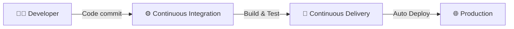

---

## 📍 Slide 2 – 🕰️ Short History of CI/CD

* 📀 **1990s**: Extreme Programming (XP) suggested integrating code daily to avoid “integration hell.”
* 🏗️ **2001**: CruiseControl becomes the first mainstream CI server.
* ☕ **2004**: Jenkins (originally Hudson) makes CI accessible, sparking community-driven plugins.
* ☁️ **2010s**: Cloud-native CI/CD tools emerge (GitLab CI, Travis CI, CircleCI).
* 🤖 **Today**: GitHub Actions and GitOps enable declarative, event-driven pipelines.
* 🤓 **Fun fact**: Jenkins was named after a British butler, symbolizing “automation that serves you.”

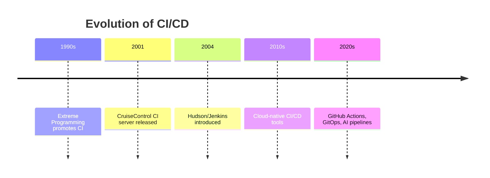

---

## 📍 Slide 3 – 📈 Why CI/CD Matters

* ⚡ **Speed**: Rapid feedback cycles, faster time-to-market.
* 🧪 **Quality**: Automated tests catch bugs early.
* 🔄 **Consistency**: Repeatable builds prevent “works on my machine” issues.
* 🤝 **Collaboration**: Developers share a stable codebase, reducing merge conflicts.
* 📊 **Business Impact**: Studies show high-performing DevOps teams deliver software **up to 46× more frequently** with **5× lower failure rates**.
* 🤓 **Fun fact**: Companies like Netflix pioneered the culture of “speed + safety” by automating everything.

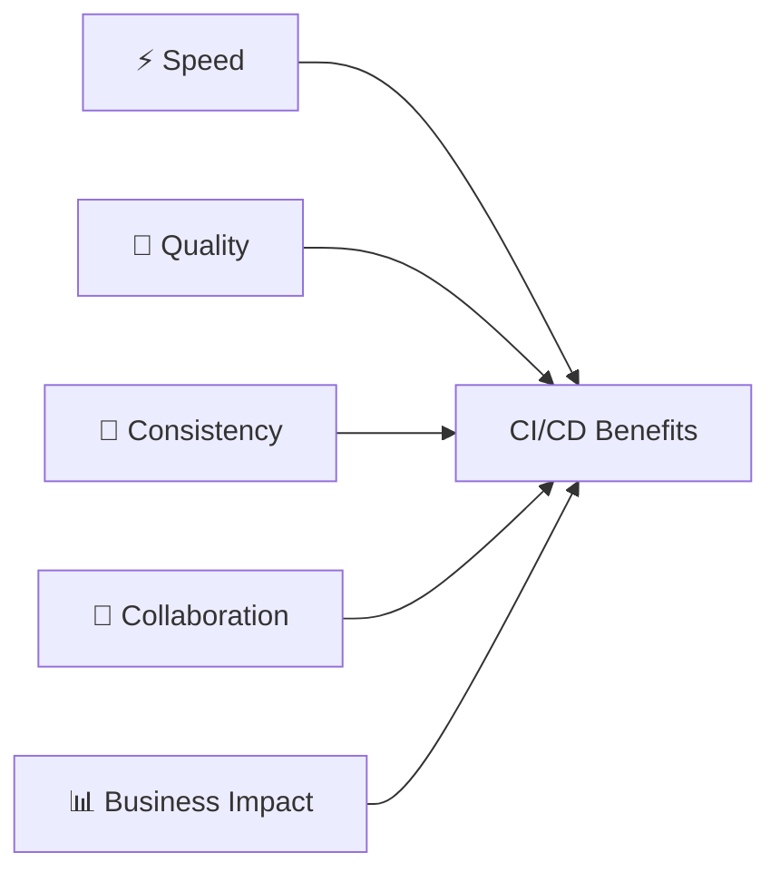

---

## 📍 Slide 4 – 🏗️ Core Principles of Continuous Integration

* 📝 **Commit early, commit often**: Small, frequent changes are easier to test.
* 🔄 **Automate builds & tests**: Every commit triggers an automated pipeline.
* 📂 **Single source of truth**: Code lives in a shared repository (e.g., Git).
* 🚨 **Fail fast**: If a build fails, it alerts the team immediately.
* 🧹 **Keep main branch clean**: Always ready to deploy.
* 🤓 **Fun fact**: The term “integration hell” described the pain of merging code once every few weeks — CI was born to fix this.

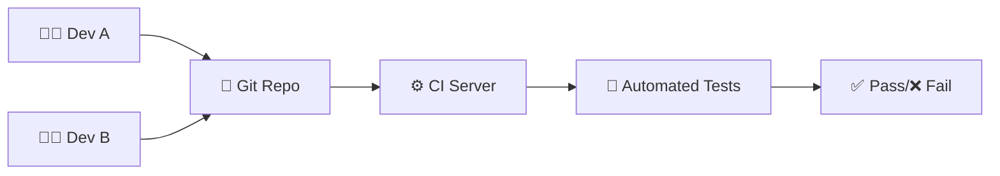

---

## 📍 Slide 5 – 🔄 CI Workflow (Commit → Build → Test → Package)

* 👨‍💻 Developer pushes commit to repository.
* 🔄 CI server detects change and **triggers pipeline**.
* ⚙️ **Build stage** compiles source code.
* 🧪 **Testing stage** runs unit/integration tests.
* 📦 **Packaging stage** produces deployable artifacts (e.g., Docker image, JAR file).
* 🤓 **Fun fact**: Google has one of the world’s largest CI systems, building **tens of thousands** of changes daily across a monorepo.

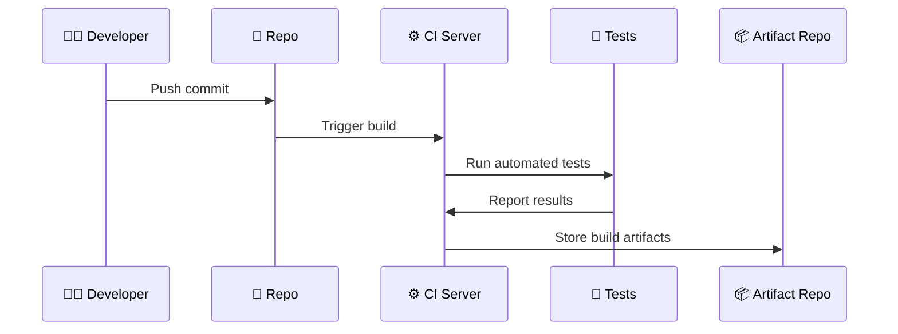

---

## 📍 Slide 6 – 📂 Build Automation Basics

* 🛠️ Early days: **Make** automated builds in C projects.
* ☕ Java era: **Apache Ant** (XML configs), then **Maven** with dependency management.
* 🚀 **Gradle** introduces flexible Groovy/Kotlin-based builds.
* 🐳 Modern: **Docker** ensures reproducible builds in isolated containers.
* 📦 Artifacts may be libraries (JAR/WAR), binaries, or container images.
* 🤓 **Fun fact**: NASA’s Mars Rover software used automated builds to test code before deployment to space.

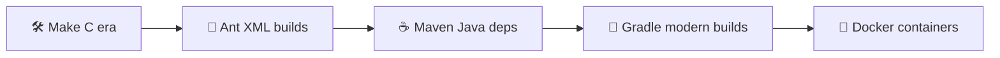

---

## 📍 Slide 7 – 🧪 Automated Testing in CI

* 🔍 **Unit tests**: Validate individual components.
* 🔗 **Integration tests**: Verify that modules work together.
* 📊 **Regression tests**: Ensure new changes don’t break old functionality.
* 🏎️ **Performance tests**: Check speed and scalability.
* 🕵️ **Security tests**: Spot vulnerabilities early (SAST = Static Application Security Testing).
* 🤓 **Fun fact**: Google’s testing system runs **billions of tests per day** to ensure reliability.

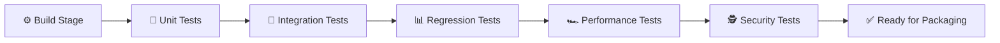

---

## 📍 Slide 8 – 🛠️ Popular CI Tools (1/2)

* 🏗️ **Jenkins** (2004): The “Swiss army knife” of CI. Plugin-based, highly customizable.
* 🐙 **GitHub Actions** (2019): Integrated with GitHub, YAML-based workflows.
* 🦊 **GitLab CI**: Built-in with GitLab, powerful pipeline-as-code model.
* 🌀 **CircleCI**: Cloud-first CI/CD with parallelism support.
* ☁️ **Travis CI**: Popular with open-source projects, simple configuration.
* 🤓 **Fun fact**: Jenkins plugins ecosystem has **1,800+ plugins** covering everything from Slack to Kubernetes.

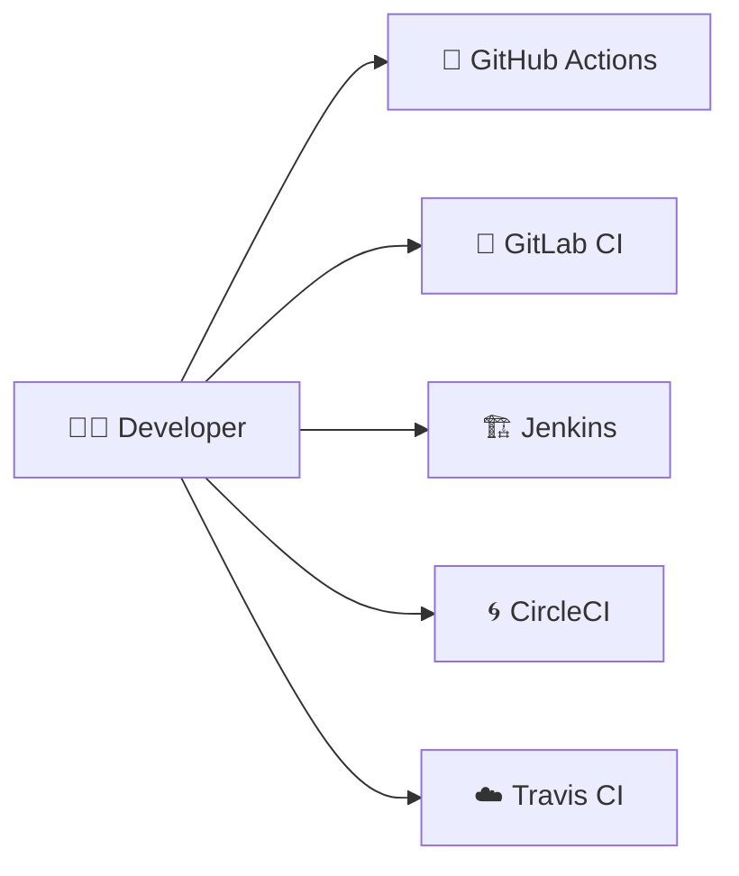

---

## 📍 Slide 9 – 🛠️ Popular CI Tools (2/2)

* ☁️ **Cloud-native CI/CD**:

  * **AWS CodePipeline** → deeply integrated with AWS services.
  * **Azure DevOps Pipelines** → strong enterprise integration.
  * **Google Cloud Build** → serverless, scales automatically.
* 🎯 Specialized tools:

  * **Drone CI**, **Buddy**, **Semaphore** → modern alternatives with simplicity.
* 🤓 **Fun fact**: GitHub Actions grew so fast that by 2022 it overtook Jenkins in adoption among new projects.

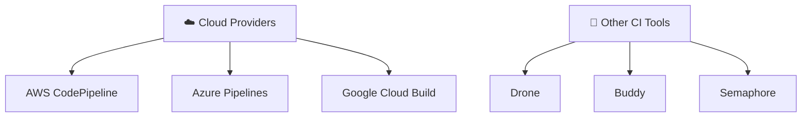

---

## 📍 Slide 10 – 🚚 Continuous Delivery vs Continuous Deployment

* 🚚 **Continuous Delivery**: Code is always in a **deployable state**, but human approval may be required to push to production.
* 🤖 **Continuous Deployment**: Every change that passes the pipeline is **automatically deployed** without human intervention.
* 📊 Key difference = “Who presses the button?”
* 🏢 In practice: Many enterprises use Delivery for **control**, startups often use Deployment for **speed**.
* 🤓 **Fun fact**: Facebook is famous for continuous deployment, releasing code **twice per day** for over a billion users.

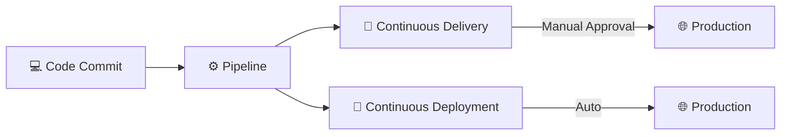

---

## 📍 Slide 11 – 🛤️ Release Pipeline Explained

* 🏗️ **Build Stage**: Compile and package code.
* 🧪 **Test Stage**: Unit, integration, regression, performance tests.
* 🧭 **Staging Environment**: Replica of production for final validation.
* 🌐 **Production Deployment**: Release to real users.
* 🔄 **Feedback Loop**: Monitor, collect metrics, and improve.
* 🤓 **Fun fact**: Netflix’s pipeline is so automated that engineers can push to production **without central approval**.

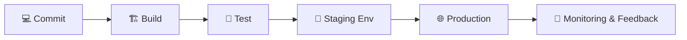

---

## 📍 Slide 12 – 🧩 Configuration Management & IaC in CD

* 🛠️ **Configuration Management**: Tools like **Ansible, Puppet, Chef** manage servers consistently.
* 🌍 **Infrastructure as Code (IaC)**: Define infrastructure in code (Terraform, Helm).
* 🐳 Used together with containers → reproducible environments.
* 📦 Example: Same Docker image runs in **dev → staging → prod** without change.
* 🤓 **Fun fact**: IaC made “cattle vs pets” metaphor famous — servers are now disposable “cattle” instead of unique “pets.”

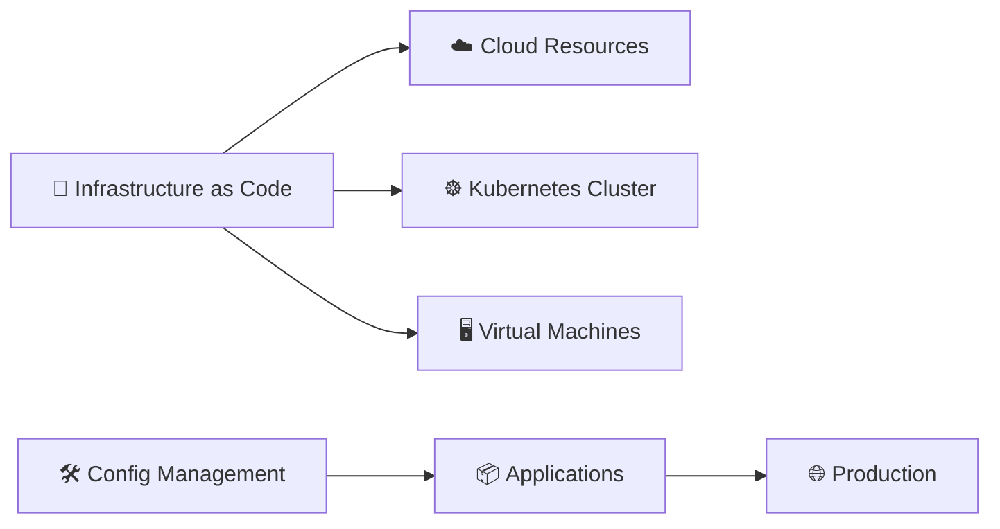

---

## 📍 Slide 13 – 🌱 Blue-Green Deployment (Concept & History)

* 🌱 **Two environments**: one “Blue” (active) and one “Green” (idle).
* 🔄 Traffic can switch instantly between them.
* 🏗️ Purpose: zero-downtime deployments.
* 📜 **Origin of the name**: First described in the book *Continuous Delivery* (2010).
* 🤓 **Fun fact**: Blue-Green is often compared to a “light switch” — flip users from old version to new version instantly.

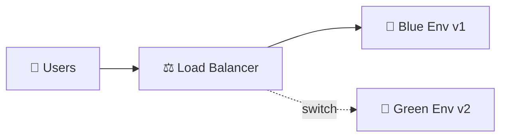

---

## 📍 Slide 14 – 🏢 Blue-Green Deployment (Real-World Use Cases)

* 📦 **E-commerce sites**: Release new versions without interrupting checkout flows.
* 🎬 **Netflix**: Uses Blue-Green to roll out streaming service updates globally.
* 🏥 **Healthcare apps**: Critical uptime means “no maintenance windows.”
* 🛑 Rollback is simple → just point traffic back to the Blue environment.
* ⚠️ Drawback: Requires **double infrastructure**.

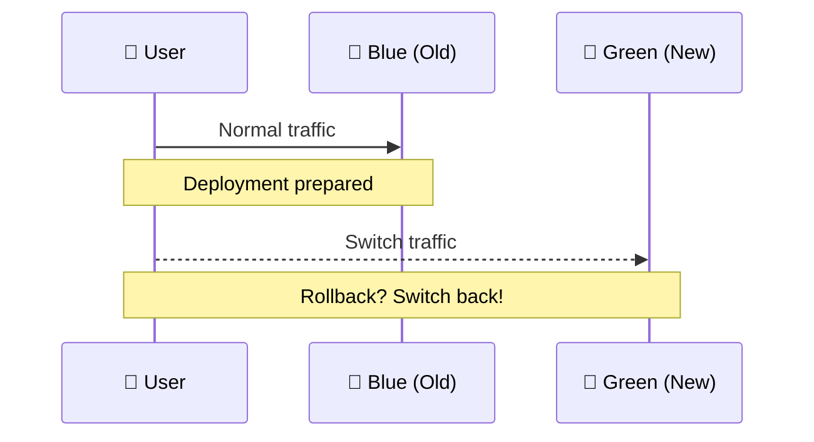

---

## 📍 Slide 15 – 🐤 Canary Deployment (Concept & History)

* 🐤 **Name origin**: Inspired by “canary in a coal mine” (used to detect danger early).
* 🔄 Deploy new version to **small % of users** first.
* 📊 Monitor performance and errors closely.
* ⚖️ If stable → gradually increase rollout to all users.
* 🤓 **Fun fact**: Google pioneered large-scale canary rollouts in Chrome updates.

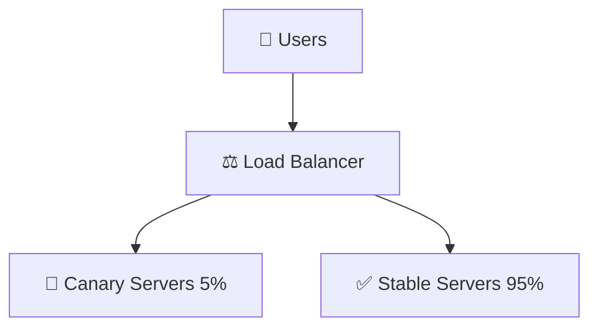

---

## 📍 Slide 16 – 🚏 Canary Deployment (Real-World Examples)

* 🔍 **Google**: Chrome browser rollouts — small group, then worldwide.
* 📱 **Mobile apps**: Canary updates allow staged rollouts in App Stores.
* 🎮 **Game servers**: Online games canary deploy to avoid massive failures.
* 🛑 If failure detected → rollout stops automatically.
* ⚠️ Drawback: Monitoring must be strong, or bad code still spreads.

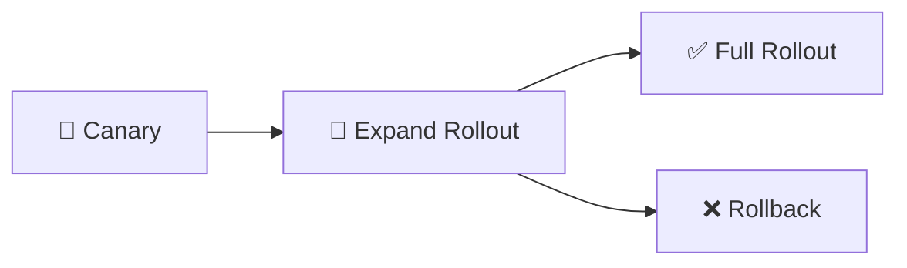

---

## 📍 Slide 17 – 🧪 A/B Testing (Concept & History)

* 🧪 **Origin**: Borrowed from marketing experiments (A vs B groups).
* 👥 Users are split into groups to test **different versions** simultaneously.
* 🎯 Goal: Compare user behavior → which version performs better?
* 🛠️ Often used for UI/UX changes, not just backend features.
* 🤓 **Fun fact**: Google once tested **41 shades of blue** to optimize link color.

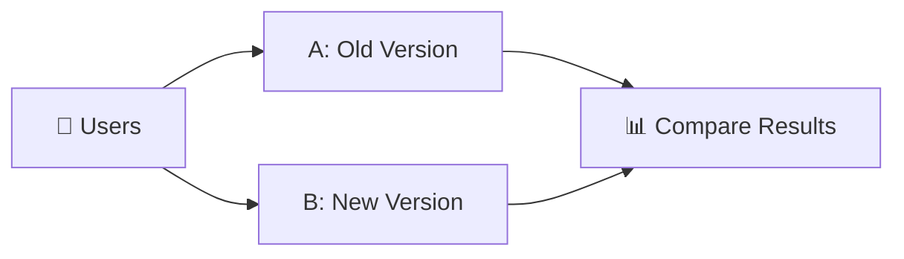

---

## 📍 Slide 18 – 🏆 A/B Testing (Real-World Use Cases)

* 🏢 **Facebook**: Runs continuous experiments for new features.
* 🛒 **Amazon**: Tests recommendation algorithms and checkout flows.
* 📰 **News sites**: Compare headlines to maximize clicks.
* 🛑 Drawback: Higher complexity — must manage multiple active versions.
* ✅ Benefit: Data-driven decisions → not just “gut feeling.”

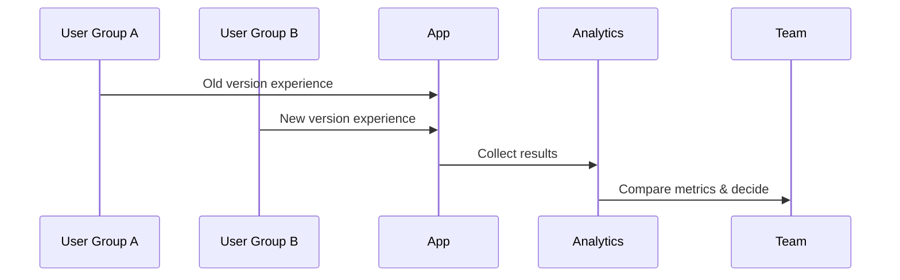

---

## 📍 Slide 19 – 🔄 Rolling & Shadow Deployments

* 🔄 **Rolling Deployment**: Gradually replace old servers with new ones, one batch at a time.
* 👻 **Shadow Deployment**: Deploy new version in parallel → receives real traffic but **responses are discarded**.
* 🎯 Purpose: Observe performance under real-world load.
* 🤓 **Fun fact**: Shadow deployments are sometimes called **“dark launches”** — users don’t know they’re happening.
* ⚠️ Rolling is safer than full switch, but slower to complete.

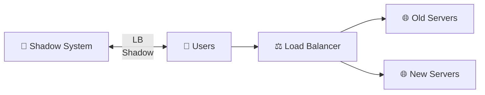

---


## 📍 Slide 20 – 📦 CI/CD Pipeline Stages Explained

* 🏗️ **Build**: Compile code and package artifacts.
* 🧪 **Test**: Automated checks — unit, integration, regression.
* 🧭 **Staging**: Deploy to staging environment for final validation.
* 🌐 **Production**: Release for end users.
* 🔄 **Feedback loop**: Monitoring and metrics feed back into pipeline improvements.
* 🤓 **Fun fact**: A “pipeline” is literally inspired by **factory assembly lines**.

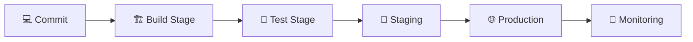

---

## 📍 Slide 21 – 🔄 Event-Driven Pipelines (Triggers)

* ⏰ **Commit triggers**: Push or PR initiates pipeline.
* 🛠️ **Manual triggers**: Developer clicks a button to run jobs.
* 🕵️ **Schedule triggers**: Cron-like jobs (nightly builds).
* 🌐 **Webhook triggers**: Events from external systems (e.g., Docker image update).
* 🔑 **Why important?** → Automation reduces human delays.
* 🤓 **Fun fact**: Some teams run **“shadow pipelines”** on every branch to test risky code.

```mermaid
sequenceDiagram
  Dev->>Repo: Push commit
  Repo->>CI: Trigger pipeline
  CI->>Jobs: Build & Test
  External->>CI: Webhook triggers
  Cron->>CI: Scheduled build
```

---

## 📍 Slide 22 – 📝 Pipelines as Code

* 🛠️ Pipelines defined in **configuration files** (`Jenkinsfile`, `.gitlab-ci.yml`, GitHub Actions YAML).
* 📂 Stored in **same repository** → version-controlled with code.
* 🔄 Changes to pipeline follow same workflow (PRs, reviews).
* 📦 Enables **reproducible, shareable, auditable** CI/CD workflows.
* 🤓 **Fun fact**: GitLab was the first major CI system to make pipelines *mandatory as code*.

```yaml
# Example: GitHub Actions workflow
name: CI Pipeline
on: [push, pull_request]

jobs:
  build:
    runs-on: ubuntu-latest
    steps:
      - uses: actions/checkout@v3   # Fetch code
      - run: npm install            # Install dependencies
      - run: npm test               # Run tests
```

```mermaid
graph TD
  Code[📂 Repo Code] --> Pipeline[📝 Pipeline Config File]
  Pipeline --> CI[⚙️ CI Server]
  CI --> Results[✅/❌ Results]
```

---

## 📍 Slide 23 – 🧑‍🤝‍🧑 Branching Models with CI/CD

* 🌱 **Feature branches**: Isolate new features, merged after review.
* 🌳 **GitFlow**: Structured model with develop + release + hotfix branches.
* 🚂 **Trunk-based development**: Everyone commits directly to main, small changes, CI ensures stability.
* ⚖️ Choice depends on **team size, risk tolerance, and release cadence**.
* 🤓 **Fun fact**: Google uses trunk-based dev with **single monorepo for all products**.

```mermaid
gitGraph
  commit id: "main"
  branch develop
  commit id: "feature-x"
  branch feature
  commit id: "work"
  checkout develop
  merge feature id: "merge feature-x"
  checkout main
  merge develop id: "release"
```

---

## 📍 Slide 24 – ⚡ Pipeline Optimization Techniques

* 🏎️ **Parallel jobs**: Run tests/builds simultaneously to save time.
* 💾 **Caching**: Reuse dependencies instead of reinstalling each build.
* 🎯 **Selective builds**: Only build/test parts of the project that changed.
* 🔄 **Reusable templates**: Share common pipeline steps across projects.
* 📊 **Monitoring performance**: Identify bottlenecks → optimize stages.
* 🤓 **Fun fact**: At scale, even **1-minute savings** per build can save **hundreds of developer hours per week**.

```mermaid
flowchart LR
  Code[💻 Code] --> CI[⚙️ CI Server]
  CI -->|Parallel| Job1[🧪 Test A]
  CI -->|Parallel| Job2[🧪 Test B]
  CI -->|Cache| Cache[💾 Dependencies]
  Job1 --> Merge[✅ Results]
  Job2 --> Merge
  Cache --> Merge
```

---

## 📍 Slide 25 – 🐳 CI/CD with Containers (Docker & Podman)

* 🐳 Containers make builds **reproducible** → “works everywhere.”
* 🔄 CI/CD pipelines build Docker images automatically after tests.
* 📦 Images are pushed to registries (Docker Hub, GitHub Container Registry).
* 🚀 Deployment uses the same image across dev → staging → prod.
* 🤓 **Fun fact**: Spotify built a CI/CD system to generate **1000s of Docker images daily** for microservices.

```yaml
# Example: GitHub Actions to build Docker image
jobs:
  docker-build:
    runs-on: ubuntu-latest
    steps:
      - uses: actions/checkout@v3
      - run: docker build -t myapp:latest .
      - run: docker push myorg/myapp:latest
```

```mermaid
flowchart LR
  Code[💻 Code] --> Build[⚙️ Build Image]
  Build --> Test[🧪 Test Container]
  Test --> Push[📦 Push to Registry]
  Push --> Deploy[🚀 Deploy to Env]
```

---

## 📍 Slide 26 – ☸️ CI/CD with Kubernetes (Helm, ArgoCD, Flux)

* ☸️ Kubernetes is the **standard platform** for container orchestration.
* 📝 Pipelines often build → package → deploy via **Helm charts**.
* 🔄 **GitOps tools** (ArgoCD, Flux) sync Git repos with Kubernetes clusters.
* 🎯 Benefits: Declarative, scalable, self-healing deployments.
* 🤓 **Fun fact**: ArgoCD is used by **Tesla** to manage autonomous driving software rollouts.

```yaml
# Example: K8s deployment snippet
apiVersion: apps/v1
kind: Deployment
metadata:
  name: myapp
spec:
  replicas: 3
  template:
    spec:
      containers:
      - name: app
        image: myorg/myapp:latest
```

```mermaid
flowchart LR
  Repo[📂 Git Repo] --> Argo[☸️ ArgoCD/Flux]
  Argo --> K8s[Kubernetes Cluster]
  K8s --> Pods[🚀 Pods Running App]
```

---

## 📍 Slide 27 – ☁️ Cloud-Native CI/CD Services

* ☁️ **AWS CodePipeline**: integrates with CodeBuild, CodeDeploy.
* ☁️ **Azure DevOps Pipelines**: supports Windows/Linux/containers, strong enterprise integration.
* ☁️ **Google Cloud Build**: serverless, scales automatically.
* ⚖️ Pros: No infra to manage, auto-scaling, cloud integrations.
* ⚠️ Cons: Vendor lock-in, costs grow with usage.
* 🤓 **Fun fact**: Netflix uses multi-cloud pipelines to avoid single-provider dependency.

```mermaid
flowchart TD
  Code[💻 Source Code] --> AWS[AWS CodePipeline]
  Code --> Azure[Azure DevOps]
  Code --> GCP[Google Cloud Build]
  AWS --> Deploy1[🌐 Deploy to AWS]
  Azure --> Deploy2[🌐 Deploy to Azure]
  GCP --> Deploy3[🌐 Deploy to GCP]
```

---

## 📍 Slide 28 – 🎯 Observability & Monitoring in CI/CD

* 📜 **Logs**: Capture pipeline steps for debugging.
* 📊 **Metrics**: Build duration, success/failure rates.
* 🕵️ **Tracing**: Track requests through pipeline stages.
* 📢 **Alerts**: Notify developers of failures instantly.
* 🎯 Goal: Ensure pipelines are **visible, measurable, and reliable**.
* 🤓 **Fun fact**: Some teams use Slack bots that “roast” developers when their build fails 😅.

```mermaid
flowchart LR
  Pipeline[⚙️ Pipeline] --> Logs[📜 Logs]
  Pipeline --> Metrics[📊 Metrics]
  Pipeline --> Tracing[🕵️ Tracing]
  Logs --> Alerts[📢 Alerts]
  Metrics --> Alerts
  Tracing --> Alerts
```

---

## 📍 Slide 29 – 🔄 Rollbacks & Recovery in CI/CD

* 🛑 If deployment fails → rollback to last known good version.
* 🌱 Blue-Green & Canary make rollbacks easy (switch traffic back).
* 📦 Container registries store old versions → redeploy quickly.
* 🚨 Incident playbooks help automate recovery.
* 🤓 **Fun fact**: Google calls this “Error Budgets” — accept some risk, but roll back fast if limits are hit.

```mermaid
graph LR
  New[🚀 New Version] --> Fail[❌ Failure Detected]
  Fail --> Rollback[🔄 Rollback Triggered]
  Rollback --> Old[✅ Previous Stable Version]
```

---

## 📍 Slide 30 – 🧯 Common Issues & Anti-Patterns

* 🧟 **Flaky tests**: Tests that pass/fail randomly block pipelines.
* 🐢 **Long pipelines**: Developers stop caring if builds take too long.
* 🧩 **Over-engineering**: Too many pipeline stages = complexity without value.
* 🔐 **Secrets in code**: Leaking API keys via pipelines.
* 🚧 **Single point of failure**: If CI server goes down, team is stuck.
* 🤓 **Fun fact**: Early Jenkins setups were jokingly called **“house of cards”** due to fragile pipelines.

```mermaid
flowchart TD
  Issues[⚠️ CI/CD Issues]
  Issues --> Flaky[🧟 Flaky Tests]
  Issues --> Slow[🐢 Long Builds]
  Issues --> Complex[🧩 Over-Engineering]
  Issues --> Secrets[🔐 Secrets in Code]
  Issues --> SPOF[🚧 CI Server Down]
```

---

## 📍 Slide 31 – 🔒 Security in CI/CD Pipelines

* 🕵️ **Shift Left Security**: Run security checks early, during build/test.
* 📦 **Dependency Scanning**: Detect vulnerable libraries (e.g., Log4Shell).
* 🔑 **Secrets Scanning**: Prevent leaking API keys, passwords in repos.
* 🧪 **Static Application Security Testing (SAST)**: Analyze source code for vulnerabilities.
* 🧪 **Dynamic Application Security Testing (DAST)**: Test running app for security issues.
* 🤓 **Fun fact**: GitHub auto-scans all public repos for secrets and notifies owners.

```mermaid
flowchart LR
  Code[💻 Source Code] --> SAST[🧪 SAST Scan]
  Code --> DepScan[📦 Dependency Scan]
  Pipeline[⚙️ CI/CD Pipeline] --> DAST[🧪 DAST Tests]
  Pipeline --> Secrets[🔑 Secret Scan]
  Secrets --> Alerts[🚨 Alerts to Devs]
```

---

## 📍 Slide 32 – 📜 Compliance, Audit & Governance in CI/CD

* 🏛️ **Compliance checks**: Ensure builds meet standards (ISO, SOC2, HIPAA, PCI-DSS).
* 🧾 **Audit trails**: Every build, deployment, and approval is logged.
* ✅ **Policy as Code**: Automate compliance rules (e.g., Open Policy Agent).
* 🧑‍⚖️ **Separation of duties**: No single person should control the whole release.
* 🔐 **Artifact signing**: Verify images/packages before deployment.
* 🤓 **Fun fact**: Financial companies often require a **two-person rule** before production releases.

```mermaid
flowchart TD
  Pipeline[⚙️ CI/CD Pipeline]
  Pipeline --> Logs[🧾 Audit Logs]
  Pipeline --> Policies[📜 Policy as Code]
  Pipeline --> Approvals[✅ Manual Approvals]
  Policies --> Compliance[🏛️ Compliance Check]
  Logs --> Compliance
  Approvals --> Compliance
```

---

## 📍 Slide 33 – 🛡️ Security Tools for CI/CD

* 🛡️ **OWASP Dependency-Check** → finds known vulnerable libraries.
* 🛡️ **Trivy** → scans containers for vulnerabilities and misconfigs.
* 🛡️ **Snyk** → developer-friendly dependency scanning & fixes.
* 🛡️ **GitGuardian** → secret detection in code/pipelines.
* 🛡️ **Grype** → fast vulnerability scanner for container images.
* 🎯 Best practice: Integrate these tools as pipeline steps, not optional extras.
* 🤓 **Fun fact**: Trivy was the first scanner adopted officially by the **CNCF (Cloud Native Computing Foundation)**.

```mermaid
flowchart LR
  Code[💻 Code] --> OWASP[🛡️ OWASP Dependency-Check]
  Code --> Snyk[🛡️ Snyk]
  Docker[🐳 Docker Image] --> Trivy[🛡️ Trivy]
  Docker --> Grype[🛡️ Grype]
  Repo[📂 Repo] --> GitGuardian[🛡️ GitGuardian]
```

---

## 📍 Slide 34 – 🧪 Case Study: GitHub Actions vs GitLab CI vs Jenkins

* 🔍 **GitHub Actions**

  * ✅ Easy setup, tightly integrated with GitHub.
  * ⚡ Huge marketplace of reusable actions.
  * ❌ Limited enterprise customization compared to Jenkins.
* 🔍 **GitLab CI**

  * ✅ Full DevOps platform (code, CI/CD, security).
  * 📜 Strong YAML pipelines with templates.
  * ❌ Self-hosted version can be resource-heavy.
* 🔍 **Jenkins**

  * ✅ Oldest, most flexible, massive plugin ecosystem.
  * ⚡ Can integrate with anything.
  * ❌ Requires lots of maintenance (“pets not cattle”).

```mermaid
graph TD
  GH[🐙 GitHub Actions] --> Devs
  GL[🦊 GitLab CI] --> Devs
  JJ[🏗️ Jenkins] --> Devs
  Devs[👨‍💻 Developers] --> Compare[📊 Comparison Table]
```

---

## 📍 Slide 35 – 🌐 Industry Adoption & Statistics of CI/CD

* 📈 **DORA (DevOps Research & Assessment)**:

  * Elite performers deploy **multiple times per day**.
  * 5× lower change failure rates.
* 🏢 **Adoption rate**: Over **80% of organizations** use CI/CD pipelines today.
* 🛠️ Popular tools: GitHub Actions, GitLab, Jenkins dominate the landscape.
* ⏳ Biggest blockers: test flakiness, pipeline speed, and culture change.
* 🤓 **Fun fact**: Some banks run **thousands of CI/CD jobs daily**, despite strict compliance rules.

```mermaid
pie showData
  "GitHub Actions" : 35
  "GitLab CI" : 30
  "Jenkins" : 25
  "Other Tools" : 10
```

---

## 📍 Slide 36 – 🔮 Emerging Trends in CI/CD

* 📜 **GitOps**: Manage deployments by syncing Git repos with environments.
* 🤖 **AI-assisted pipelines**: Suggest tests, detect flaky jobs, optimize workflows.
* 🧪 **Progressive delivery**: Blend canary, blue-green, A/B testing into smarter rollouts.
* 🔄 **Chaos testing**: Inject failures to test resilience (Netflix “Chaos Monkey”).
* 📦 **SBOM (Software Bill of Materials)**: Track dependencies for security and compliance.
* 🤓 **Fun fact**: AI-generated pipelines can now build configs faster than humans in some startups.

```mermaid
flowchart TD
  GitOps[📜 GitOps] --> Future[🔮 Future CI/CD]
  AI[🤖 AI Pipelines] --> Future
  Chaos[🔥 Chaos Testing] --> Future
  SBOM[📦 SBOM] --> Future
```

---

## 📍 Slide 37 – 🧵 Decentralized & P2P CI/CD Concepts

* 🌐 **Radicle**: Peer-to-peer code collaboration with built-in workflows.
* 🪐 **Gitopia**: Blockchain-based Git hosting & CI/CD.
* 🔗 **IPFS (InterPlanetary File System)**: Store artifacts in distributed networks.
* 🎯 Goal: **Remove central servers**, increase resilience and trust.
* ⚠️ Still experimental, adoption is small compared to GitHub/GitLab.
* 🤓 **Fun fact**: Some researchers are exploring CI/CD pipelines running entirely on **blockchain smart contracts**.

```mermaid
flowchart LR
  Devs[👨‍💻 Developers] --> P2P[🧵 Radicle/Gitopia]
  P2P --> Chain[🔗 Blockchain]
  P2P --> IPFS[🪐 IPFS Storage]
  Chain --> Deploy[🌐 Decentralized Deploy]
```

---

## 📍 Slide 38 – 🏆 Best Practices from Top Companies

* 🏢 **Google**: Trunk-based development, thousands of daily commits in a monorepo.
* 🎬 **Netflix**: “Automate everything” → pipelines, rollbacks, chaos testing.
* 🛒 **Amazon**: Microservice-first pipelines, deploy **every 11.7 seconds** on average.
* 📱 **Facebook (Meta)**: A/B testing at scale, thousands of experiments daily.
* 📊 **Microsoft**: Strong focus on security scans and compliance automation.
* 🤓 **Lesson**: **Speed + Safety = DevOps culture**.

```mermaid
flowchart TD
  Google[🌍 Google] --> Practice[🏆 Best Practices]
  Netflix[🎬 Netflix] --> Practice
  Amazon[🛒 Amazon] --> Practice
  Facebook[📱 Facebook] --> Practice
  Microsoft[💻 Microsoft] --> Practice
```

---

## 📍 Slide 39 – 📖 CI/CD Lifecycle in One Diagram

* 🔄 **Commit → Build → Test → Deploy → Monitor → Feedback**
* ⚡ Continuous Integration keeps code stable.
* 🚚 Continuous Delivery ensures deployable builds.
* 🤖 Continuous Deployment releases automatically.
* 🔍 Monitoring closes the loop → enabling improvement.

```mermaid
flowchart LR
  Commit[💻 Commit] --> Build[🏗️ Build]
  Build --> Test[🧪 Test]
  Test --> Deploy[🚚 Deploy]
  Deploy --> Monitor[🔍 Monitor]
  Monitor --> Feedback[🔄 Feedback Loop]
  Feedback --> Commit
```

---

## 📍 Slide 40 – 📚 Recommended Readings & Resources

* 📘 **Books**

  * “Continuous Delivery” by Jez Humble & David Farley.
  * “Accelerate” by Nicole Forsgren, Jez Humble, Gene Kim.
* 📰 **Research**

  * DORA (DevOps Research & Assessment) State of DevOps Reports.
* 🛠️ **Official Docs**

  * Jenkins, GitHub Actions, GitLab CI, CircleCI.
* 🎬 **Talks**

  * Netflix Chaos Engineering, Google SRE (Site Reliability Engineering).
* 🤓 **Tip**: Follow CNCF projects (ArgoCD, Flux, Tekton) to stay current.

```mermaid
graph TD
  Books[📘 Books] --> Resources[📚 Resources]
  Research[📰 Research] --> Resources
  Docs[🛠️ Docs] --> Resources
  Talks[🎬 Talks] --> Resources
  CNCF[☸️ CNCF Projects] --> Resources
```

---

## 📍 Slide 41 – 🖥️ Hands-On Practice Suggestions

* 🛠️ Build a pipeline in **GitHub Actions** to run tests on every push.
* 🐳 Extend it with **Docker build + push** to registry.
* ☸️ Deploy container to **Kubernetes** staging cluster.
* 🧪 Experiment with **Blue-Green or Canary** deployment strategy.
* 🔒 Add a **security scanning step** with Trivy or Snyk.
* 📊 Monitor pipeline speed and optimize with caching.

```mermaid
flowchart TD
  GH[🐙 GitHub Actions] --> Docker[🐳 Docker Build]
  Docker --> Push[📦 Push Image]
  Push --> K8s[☸️ Kubernetes Deploy]
  K8s --> Strategy[🌱 Blue-Green / 🐤 Canary]
  Strategy --> Scan[🔒 Security Scan]
  Scan --> Monitor[📊 Monitor & Improve]
```

---

## 📍 Slide 42 – ❓ Q\&A + Reflection

* 🤔 What challenges do you see when introducing CI/CD in a new team?
* ⚖️ Where is the balance between **speed** and **safety** in your context?
* 🧑‍🤝‍🧑 How does CI/CD change collaboration between developers, testers, and ops?
* 🔮 Which trends (GitOps, AI pipelines, decentralized CI/CD) excite you most?
* ✅ **Takeaway**: CI/CD is not just a toolchain → it’s a **culture of automation, feedback, and continuous improvement**.

```mermaid
flowchart LR
  Student[👩‍🎓 Student Questions] --> Discussion[🧑‍🏫 Discussion]
  Discussion --> Reflection[💡 Reflection & Takeaways]
```

---
