# 📌 Lecture 4 - Networking & OS for DevOps

## 📍 Slide 1 – 🌐 Introduction to Networking in DevOps

* 🧩 **DevOps Networking** = the foundation that connects all components in modern **infrastructure and applications**.
* 🔄 As applications evolve from **monolithic** → **microservices** → **serverless**, network complexity increases exponentially.
* 🛠️ DevOps engineers must understand networking to:
  * 🔍 Troubleshoot deployment issues
  * 🛡️ Implement proper security controls 
  * ⚡ Optimize application performance
  * 🏗️ Design scalable architectures
* 💡 **Network automation** is becoming essential as manual configurations can't scale with modern deployment speeds.
* 🌍 **Historical context**: Early DevOps focused on deployment; modern DevOps requires **"network as code"** principles.

**Evolution of Networking in DevOps**
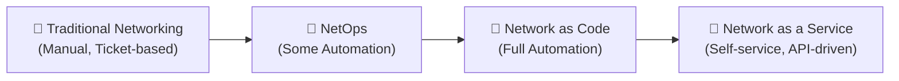

🔗 **Resources:**
* [Network Automation for DevOps](https://www.redhat.com/en/topics/automation/what-is-network-automation)
* [O'Reilly: Networking in the Age of DevOps](https://www.oreilly.com/library/view/network-programmability-and/9781491931240/)

---

## 📍 Slide 2 – 📡 OSI Model & TCP/IP Stack

* 🧩 **OSI Model** = Open Systems Interconnection Model, a conceptual framework with **7 layers** that standardizes network functions.
* 🔄 **TCP/IP Stack** = The practical implementation used in real-world networks, with **4 layers** that map to OSI layers.
* 🎯 **Why it matters**: Understanding these models helps DevOps engineers **troubleshoot issues** at the correct layer.
* 📚 **Historical context**: OSI Model was developed in 1984 but TCP/IP (created in the 1970s) became dominant due to its use in ARPANET and early internet.

**OSI vs TCP/IP Layers:**

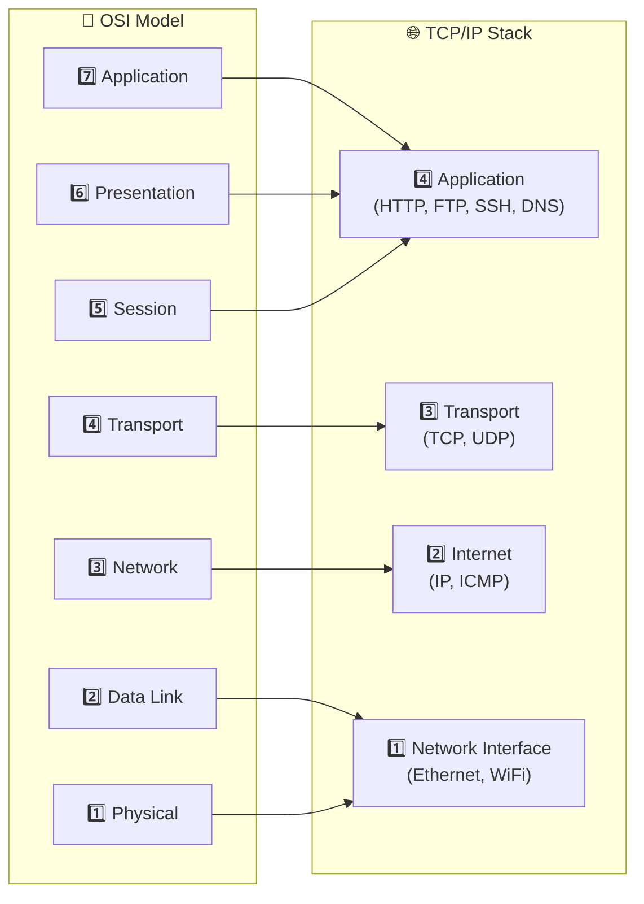

* 🛠️ **DevOps use cases by layer**:
  * **Application Layer**: API gateway configuration, HTTP headers, service discovery
  * **Transport Layer**: Load balancer tuning, port management, TCP optimization
  * **Internet/Network Layer**: IP allocation, routing, security groups, firewalls
  * **Network Interface**: Hardware configurations, NICs, virtualization

🔗 **Resources:**
* [Cloudflare: What is the OSI Model?](https://www.cloudflare.com/learning/ddos/glossary/open-systems-interconnection-model-osi/)
* [RFC 1122: Requirements for Internet Hosts](https://datatracker.ietf.org/doc/html/rfc1122)

---

## 📍 Slide 3 – 🔢 IP Addressing & Subnetting

* 🌐 **IP Address** = numerical label assigned to network devices, enables communication across networks.
* 🧩 **IPv4** = 32-bit address (e.g., `192.168.1.1`), limited to ~4.3 billion addresses, now exhausted.
* 🔄 **IPv6** = 128-bit address (e.g., `2001:0db8:85a3:0000:0000:8a2e:0370:7334`), practically unlimited (~340 undecillion addresses).
* 📚 **CIDR Notation** = Classless Inter-Domain Routing (e.g., `192.168.1.0/24`), combines IP address with prefix length to define network range.
* 📝 **Subnet Mask** = Defines which portion of an IP address refers to the network vs. the host (e.g., `255.255.255.0` = `/24`).

**Subnetting Example**
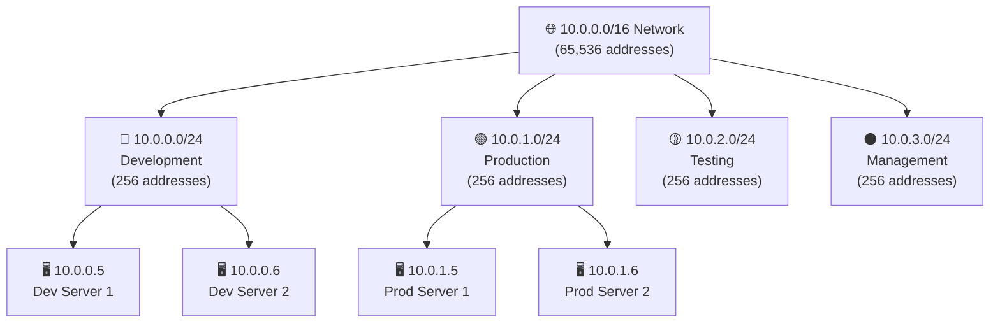

* 🛠️ **Common Subnet Sizes in DevOps**:
  * `/16` (Class B): 65,536 IP addresses - Often used for entire cloud VPCs
  * `/24` (Class C): 256 IP addresses - Common for network segments
  * `/28`: 16 IP addresses - Small subnets for specialized services
  * `/32`: Single IP address - Used for individual resources

* 💡 **Subnet Calculation**:
  * Available hosts = 2^(32-prefix) - 2
  * Example: /24 network has 2^(32-24) - 2 = 254 usable addresses

🔗 **Resources:**
* [IP Subnet Calculator](https://www.site24x7.com/tools/ipv4-subnetcalculator.html)
* [AWS VPC Subnetting](https://docs.aws.amazon.com/vpc/latest/userguide/vpc-subnets-commands-example.html)
* [RFC 4632: CIDR Architecture](https://datatracker.ietf.org/doc/html/rfc4632)

---

## 📍 Slide 4 – 🌐 DNS (Domain Name System)

* 🔍 **DNS** = Domain Name System, the internet's "phone book" that translates human-readable domain names to IP addresses.
* 🧩 **Key Components**:
  * **Name Servers**: Store DNS records and respond to queries
  * **Resolvers**: Client-side components that query name servers
  * **Zones**: Administrative spaces within DNS hierarchy
  * **Root Servers**: Top of DNS hierarchy, direct to TLD servers
* 🔄 **Resolution Process**: When you access a website, your computer uses DNS to find its IP address through a multi-step lookup process.
* ⏱️ **Caching**: DNS responses are cached at multiple levels to improve performance.

**DNS Resolution Process**
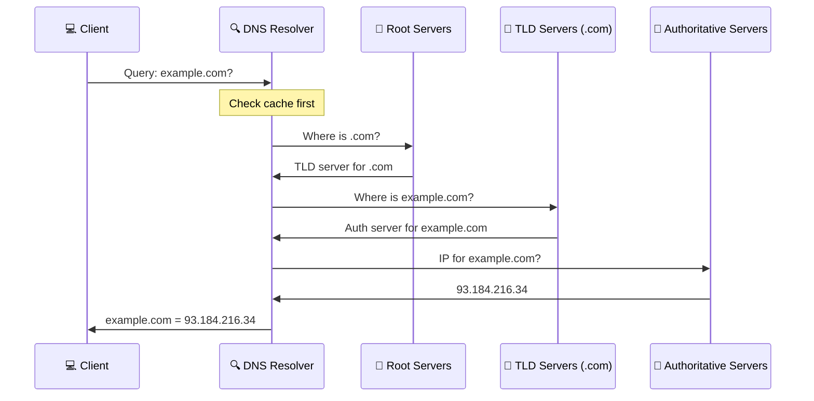

* 🧰 **Common DNS Record Types**:
  * **A**: Maps hostname to IPv4 address
  * **AAAA**: Maps hostname to IPv6 address
  * **CNAME**: Creates an alias from one domain to another
  * **MX**: Specifies mail servers for a domain
  * **TXT**: Stores text information (often used for verification)
  * **SRV**: Service records for specific services
  * **NS**: Delegates a DNS zone to specific name servers

* 🛠️ **DevOps DNS Applications**:
  * **Service Discovery**: Finding services in microservice architectures
  * **Canary Deployments**: Gradually shifting traffic using DNS weights
  * **Disaster Recovery**: Failover to backup infrastructure
  * **Geographic Routing**: Directing users to nearest data center

```bash
# 🧪 DNS command line tools
# Query A record
dig example.com A

# Query all records
dig example.com ANY

# Reverse DNS lookup
dig -x 93.184.216.34

# Trace DNS resolution path
dig +trace example.com
```

🔗 **Resources:**
* [Cloudflare DNS Learning](https://www.cloudflare.com/learning/dns/what-is-dns/)
* [DNS for Rocket Scientists](http://www.zytrax.com/books/dns/)
* [AWS Route 53 Documentation](https://docs.aws.amazon.com/Route53/latest/DeveloperGuide/Welcome.html)

---

## 📍 Slide 5 – 🌍 HTTP & HTTPS

* 🌐 **HTTP** = HyperText Transfer Protocol, the foundation of data communication on the web.
* 🔒 **HTTPS** = HTTP Secure, encrypted version of HTTP using TLS (Transport Layer Security).
* 📚 **Historical Context**: HTTP was created by Tim Berners-Lee in 1989, HTTPS added in 1994 by Netscape.
* 🔄 **Request-Response Model**: Client sends request, server sends back response with status code and data.

**HTTP vs HTTPS**
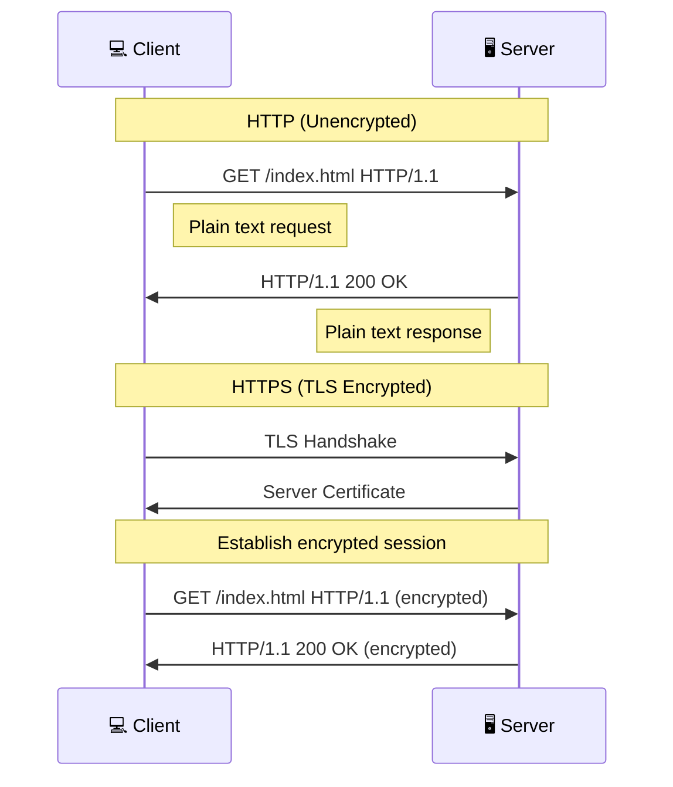

* 📋 **HTTP Methods**:
  * **GET**: Retrieve data
  * **POST**: Submit data
  * **PUT**: Update/replace data
  * **DELETE**: Remove data
  * **PATCH**: Partially update data
  * **OPTIONS**: Get supported methods
  * **HEAD**: Get headers only

* 📊 **Common Status Codes**:
  * **2xx**: Success (200 OK, 201 Created, 204 No Content)
  * **3xx**: Redirection (301 Moved Permanently, 302 Found)
  * **4xx**: Client Error (400 Bad Request, 401 Unauthorized, 404 Not Found)
  * **5xx**: Server Error (500 Internal Server Error, 503 Service Unavailable)

* 🛠️ **DevOps Applications**:
  * **API Design**: RESTful services, microservices communication
  * **Health Checks**: Monitoring endpoint availability
  * **Load Balancing**: Distribution based on HTTP paths
  * **Security**: TLS configuration, headers, CORS policies

```bash
# 🧪 HTTP request examples with curl
# Basic GET request
curl -v https://example.com

# POST request with JSON data
curl -X POST -H "Content-Type: application/json" \
  -d '{"key":"value"}' https://api.example.com/data

# Testing with specific HTTP headers
curl -H "Authorization: Bearer token123" https://api.example.com/protected
```

🔗 **Resources:**
* [MDN HTTP Documentation](https://developer.mozilla.org/en-US/docs/Web/HTTP)
* [RESTful API Design Best Practices](https://restfulapi.net/)
* [OWASP HTTPS Best Practices](https://cheatsheetseries.owasp.org/cheatsheets/Transport_Layer_Protection_Cheat_Sheet.html)

---

## 📍 Slide 6 – 🔌 Load Balancing

* ⚖️ **Load Balancer** = a device or service that distributes network traffic across multiple servers to ensure reliability, availability, and optimal performance.
* 🔄 **Benefits**:
  * **High Availability**: Prevents single points of failure
  * **Scalability**: Handles increased traffic by adding servers
  * **Flexibility**: Enables maintenance without downtime
  * **Health Monitoring**: Detects and routes around failed servers

**Load Balancer Types**
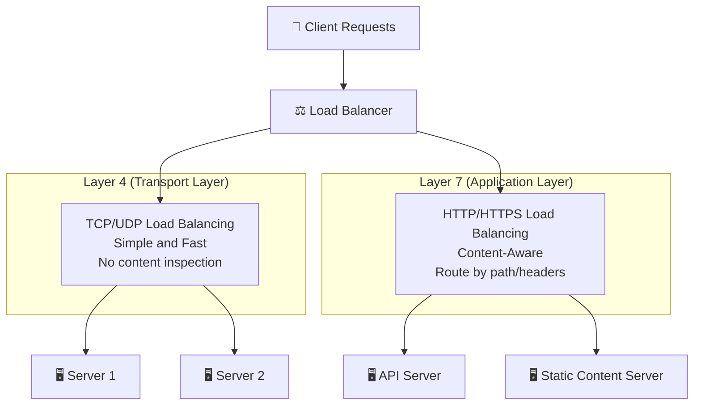

* 🧮 **Load Balancing Algorithms**:
  * **Round Robin**: Cycles through servers sequentially
  * **Least Connections**: Sends to server with fewest active connections
  * **Weighted**: Assigns traffic based on server capacity
  * **IP Hash**: Routes based on client IP address (session persistence)
  * **URL Hash**: Routes based on requested URL (content consistency)

* 🛠️ **Popular Load Balancer Solutions**:
  * **Hardware**: F5 BIG-IP, Citrix ADC
  * **Software**: HAProxy, Nginx, Traefik
  * **Cloud Services**: AWS ELB/ALB/NLB, Google Cloud Load Balancing, Azure Load Balancer

* 💡 **DevOps Considerations**:
  * **Automation**: Define load balancers as code (Infrastructure as Code)
  * **Auto-Scaling**: Dynamically adjust server pools based on load
  * **Blue/Green Deployments**: Shift traffic between environments
  * **Canary Releases**: Gradually increase traffic to new versions
  * **SSL Termination**: Offload encryption/decryption to save server resources

🔗 **Resources:**
* [NGINX Load Balancing Guide](https://www.nginx.com/resources/glossary/load-balancing/)
* [HAProxy Documentation](https://www.haproxy.com/documentation/hapee/latest/)
* [AWS Elastic Load Balancing](https://aws.amazon.com/elasticloadbalancing/)

---

## 📍 Slide 7 – 🧩 Network Segmentation

* 🧱 **Network Segmentation** = dividing a network into smaller, isolated sections to improve security, performance, and manageability.
* 🔒 **Zero Trust Principle**: "Never trust, always verify" — treat all network traffic as potentially hostile.
* 🎯 **Key Benefits**:
  * **Security**: Limits lateral movement during breaches
  * **Performance**: Reduces broadcast traffic and congestion
  * **Compliance**: Helps meet regulatory requirements (PCI-DSS, HIPAA)
  * **Isolation**: Separates development, testing, and production environments

**Network Segmentation in Cloud Architecture**
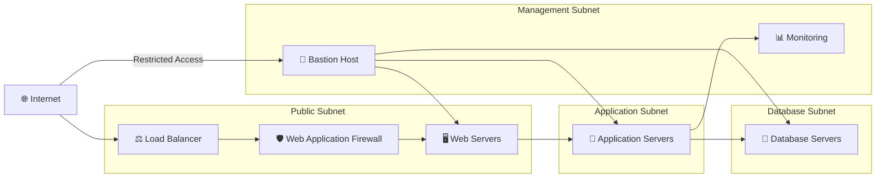

* 🧩 **Common Segmentation Technologies**:
  * **VLANs** = Virtual Local Area Networks, segmentation at Layer 2
  * **Subnets** = IP-based segmentation at Layer 3
  * **VRFs** = Virtual Routing and Forwarding, isolated routing tables
  * **VPCs** = Virtual Private Clouds, isolated cloud networks
  * **Security Groups/NACLs** = Traffic filtering at instance/subnet level
  * **Microsegmentation** = Fine-grained policies at workload level

* 🛠️ **DevOps Implementation Examples**:
  * **Multi-tier Application**: Web servers in public subnet, application servers in private subnet, databases in isolated subnet
  * **Microservices Architecture**: Each service in its own segment with controlled communication
  * **Development Environments**: Separate VPCs or subnets for dev, staging, production
  * **Compliance Zones**: Isolated segments for PCI/HIPAA workloads


🔗 **Resources:**
* [NIST Network Segmentation Guidelines](https://csrc.nist.gov/publications/detail/sp/800-207/final)
* [AWS VPC Design Best Practices](https://docs.aws.amazon.com/vpc/latest/userguide/vpc-design-patterns.html)
* [Zero Trust Architecture](https://www.ncsc.gov.uk/collection/zero-trust-architecture)

---

## 📍 Slide 8 – 🔒 Firewalls & Network Security

* 🛡️ **Firewall** = a network security device or software that monitors and filters incoming and outgoing network traffic based on predefined rules.
* 🔄 **Evolution**: From simple packet filters to sophisticated next-generation firewalls with deep packet inspection.
* 📝 **Types of Firewalls**:
  * **Packet Filtering**: Examines packets against rules (IP, port, protocol)
  * **Stateful Inspection**: Tracks active connections, more context-aware
  * **Application Layer (Layer 7)**: Understands application protocols, can filter specific content
  * **Next-Gen Firewalls (NGFW)**: Combines traditional with IDS/IPS, deep inspection
  * **Web Application Firewalls (WAF)**: Specifically protects web applications from attacks

**Firewall Implementation in Modern Architecture**
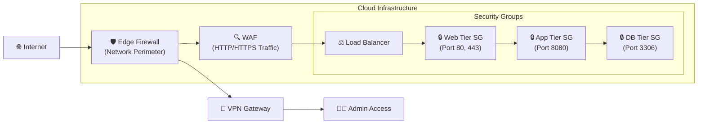

* 🧰 **Key Concepts**:
  * **Access Control Lists (ACLs)**: Rules defining allowed/denied traffic
  * **Default Deny**: Safest policy - block everything not explicitly allowed
  * **Defense in Depth**: Multiple security layers for better protection
  * **Egress Filtering**: Restricting outbound traffic to prevent data exfiltration

* 🛠️ **DevOps Implementation**:
  * **Infrastructure as Code (IaC)**: Define firewall rules in code (Terraform, CloudFormation)
  * **CI/CD Pipeline Security**: Scan infrastructure code for security misconfigurations
  * **Automated Compliance Checks**: Ensure firewall rules meet security standards
  * **Logging & Monitoring**: Track and alert on suspicious traffic patterns

* 🔍 **Common Security Testing Tools**:
  * **nmap**: Network discovery and security auditing
  * **OpenVAS**: Vulnerability scanning
  * **AWS Config**: Continuous auditing of AWS resources
  * **Cloud Security Posture Management (CSPM)**: Automated security assessment

* ⚠️ **Common Firewall Misconfigurations**:
  * Overly permissive rules (e.g., 0.0.0.0/0)
  * Excessive open ports
  * Lack of egress filtering
  * Inconsistent rule management across environments

🔗 **Resources:**
* [NIST Firewall Guidelines](https://nvlpubs.nist.gov/nistpubs/Legacy/SP/nistspecialpublication800-41r1.pdf)
* [AWS Network Firewall](https://aws.amazon.com/network-firewall/)
* [OWASP Web Application Firewall Guide](https://owasp.org/www-community/Web_Application_Firewall)

---

## 📍 Slide 9 – 🔑 TLS & Certificate Management

* 🔐 **TLS** = Transport Layer Security, cryptographic protocol that secures communications over networks (successor to SSL).
* 📜 **Digital Certificate** = electronic document that uses a digital signature to bind a public key with an identity.
* 🏗️ **PKI** = Public Key Infrastructure, framework that manages digital keys and certificates for secure communications.
* 📚 **Historical Context**: SSL was developed by Netscape in 1994, TLS 1.0 was released in 1999, TLS 1.3 became standard in 2018.

**TLS Handshake Process**
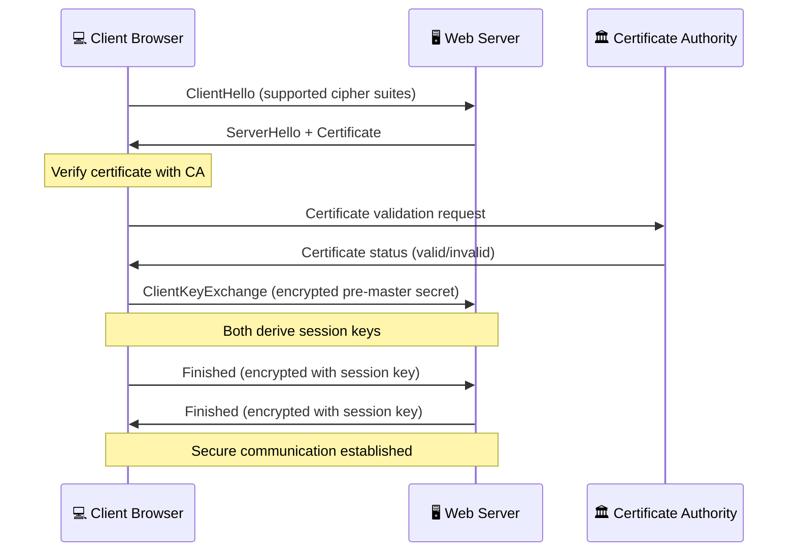

* 🧩 **Certificate Components**:
  * **Subject**: Entity the certificate identifies (domain name, organization)
  * **Public Key**: Used for encryption and digital signatures
  * **Issuer**: Certificate Authority that signed the certificate
  * **Validity Period**: Start and expiration dates
  * **Digital Signature**: CA's signature proving authenticity
  * **Subject Alternative Names (SAN)**: Additional domains covered by certificate

* 🛠️ **DevOps Certificate Management**:
  * **Automation**: Use tools like cert-bot, AWS Certificate Manager, Let's Encrypt
  * **Rotation**: Regularly replace certificates before expiration
  * **Monitoring**: Alert on certificate expiration dates
  * **Wildcard Certificates**: Cover multiple subdomains (*.example.com)

🔗 **Resources:**
* [Let's Encrypt Documentation](https://letsencrypt.org/docs/)
* [OWASP TLS Configuration Guide](https://cheatsheetseries.owasp.org/cheatsheets/Transport_Layer_Protection_Cheat_Sheet.html)
* [RFC 8446: TLS 1.3 Specification](https://datatracker.ietf.org/doc/html/rfc8446)

---

## 📍 Slide 10 – 🕵️ Network Monitoring & Troubleshooting

* 📊 **Network Monitoring** = continuous observation of network performance, availability, and security to ensure optimal operations.
* 🔍 **Key Metrics to Monitor**:
  * **Latency**: Time for data to travel from source to destination
  * **Throughput**: Amount of data transferred per unit time
  * **Packet Loss**: Percentage of packets that fail to reach destination
  * **Bandwidth Utilization**: How much of available capacity is being used
  * **Error Rates**: Network errors, retransmissions, and failures

**Network Monitoring Architecture**
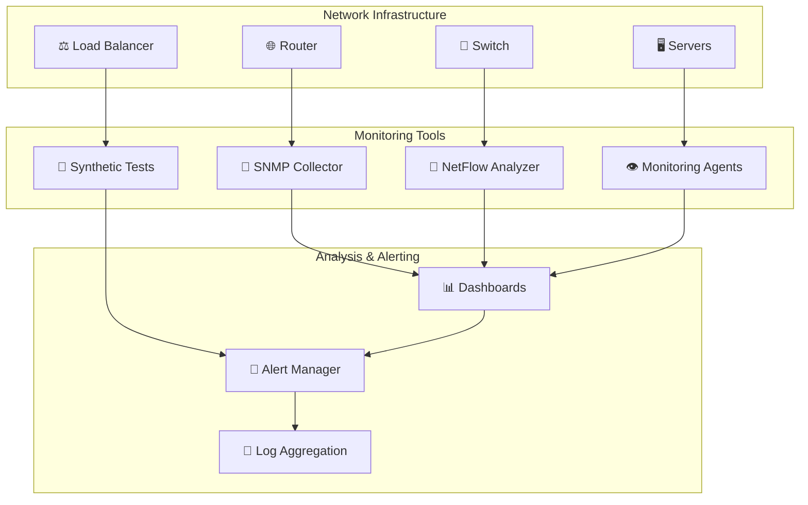

* 🛠️ **Popular Monitoring Tools**:
  * **Open Source**: Nagios, Zabbix, LibreNMS, Cacti, Pandora FMS
  * **Commercial**: SolarWinds, PRTG, ManageEngine OpManager
  * **Cloud-based**: DataDog, New Relic, AWS CloudWatch, Azure Monitor
  * **Specialized**: Wireshark (packet analysis), ntopng (traffic analysis)

* 🔍 **Advanced Troubleshooting Techniques**:
  * **Packet Capture**: Use tcpdump or Wireshark to analyze traffic
  * **MTU Discovery**: Test maximum transmission unit issues
  * **Bandwidth Testing**: Use iperf3 for throughput testing
  * **Latency Analysis**: Measure round-trip times and jitter

* 📈 **DevOps Monitoring Integration**:
  * **Prometheus + Grafana**: Metrics collection and visualization
  * **ELK Stack**: Elasticsearch, Logstash, Kibana for log analysis
  * **Infrastructure as Code**: Define monitoring configurations in code
  * **Automated Remediation**: Trigger actions based on alerts

🔗 **Resources:**
* [Wireshark Documentation](https://www.wireshark.org/docs/)
* [Prometheus Network Monitoring](https://prometheus.io/docs/guides/network-monitoring/)
* [AWS Network Monitoring](https://docs.aws.amazon.com/vpc/latest/userguide/vpc-monitoring.html)

---

## 📍 Slide 11 – 🛡️ VPNs & Secure Tunneling

* 🔒 **VPN** = Virtual Private Network, creates secure, encrypted connections over public networks.
* 🌐 **Purpose**: Extend private networks across public infrastructure while maintaining security and privacy.
* 📚 **Historical Context**: VPNs emerged in 1990s as businesses needed secure remote access; became essential for remote work.

**VPN Types and Architecture**
```mermaid
flowchart TB
    subgraph "Site-to-Site VPN"
        Office1["🏢 Main Office\nNetwork: 10.1.0.0/16"]
        Office2["🏢 Branch Office\nNetwork: 10.2.0.0/16"]
        Office1 <--> |"🔒 Encrypted Tunnel"| Office2
    end
    
    subgraph "Remote Access VPN"
        Remote["💻 Remote Worker"]
        VPNServer["🔐 VPN Server"]
        Corporate["🏢 Corporate Network"]
        Remote --> |"🔒 Encrypted Connection"| VPNServer
        VPNServer --> Corporate
    end
    
    subgraph "Cloud VPN"
        OnPrem["🏢 On-Premises"]
        CloudGW["☁️ Cloud VPN Gateway"]
        VPC["☁️ Virtual Private Cloud"]
        OnPrem <--> |"🔒 IPsec Tunnel"| CloudGW
        CloudGW --> VPC
    end
```

* 🧩 **VPN Types**:
  * **Site-to-Site VPN**: Connects entire networks (office-to-office, office-to-cloud)
  * **Remote Access VPN**: Individual users connect to corporate network
  * **SSL/TLS VPN**: Browser-based access, no client software required
  * **IPsec VPN**: Network layer encryption, typically for site-to-site
  * **WireGuard**: Modern, lightweight VPN protocol with improved performance

* 🛠️ **Popular VPN Solutions**:
  * **Open Source**: OpenVPN, strongSwan, WireGuard, SoftEther
  * **Commercial**: Cisco AnyConnect, Palo Alto GlobalProtect, Fortinet FortiClient
  * **Cloud Services**: AWS VPN, Azure VPN Gateway, Google Cloud VPN
  * **Managed Services**: NordLayer, Perimeter 81, Twingate

* 🔐 **VPN Protocols Comparison**:
  * **OpenVPN**: Highly configurable, works over TCP/UDP, wide platform support
  * **IPsec**: Industry standard, built into many devices, excellent security
  * **WireGuard**: Modern, fast, simple configuration, smaller codebase
  * **SSTP**: Microsoft's SSL-based protocol, good for Windows environments

* 🔍 **VPN Security Best Practices**:
  * **Strong Authentication**: Multi-factor authentication, certificate-based auth
  * **Regular Key Rotation**: Replace certificates and pre-shared keys periodically
  * **Split Tunneling Control**: Carefully configure which traffic uses VPN
  * **Monitoring**: Log and monitor VPN connections for security events
  * **Keep Updated**: Regular updates for VPN software and firmware

🔗 **Resources:**
* [OpenVPN Documentation](https://openvpn.net/community-resources/)
* [WireGuard Whitepaper](https://www.wireguard.com/papers/wireguard.pdf)
* [AWS VPN Documentation](https://docs.aws.amazon.com/vpn/)

---

## 📍 Slide 12 – 🐧 Linux History & Distributions

* 🌟 **Linux** = open-source Unix-like operating system kernel created by Linus Torvalds in 1991.
* 📚 **Historical Timeline**:
  * **1969**: Unix created at Bell Labs by Ken Thompson and Dennis Ritchie
  * **1983**: GNU Project started by Richard Stallman (free Unix-like system)
  * **1991**: Linux kernel (0.02) released by Linus Torvalds
  * **1992**: Linux combined with GNU tools creates complete OS
  * **1993**: Debian founded, **1994**: Red Hat founded
  * **2004**: Ubuntu released, making Linux more user-friendly

**Linux Family Tree**
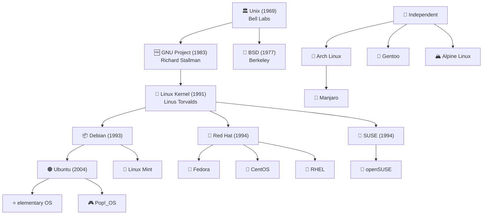

* 🧩 **Major Distribution Families**:
  * **Debian-based**: Debian, Ubuntu, Linux Mint, elementary OS
    * Package Manager: APT (Advanced Package Tool)
    * File format: .deb
  * **Red Hat-based**: RHEL, Fedora, CentOS, Rocky Linux
    * Package Manager: YUM/DNF (Yellowdog Updater Modified/Dandified YUM)
    * File format: .rpm
  * **SUSE-based**: openSUSE, SUSE Linux Enterprise
    * Package Manager: Zypper
    * File format: .rpm
  * **Arch-based**: Arch Linux, Manjaro
    * Package Manager: Pacman
    * File format: .pkg.tar.xz

* 🛠️ **DevOps-Friendly Distributions**:
  * **Ubuntu LTS**: Most popular for servers, extensive documentation, long support
  * **CentOS/Rocky Linux**: Enterprise stability, RHEL compatibility
  * **Alpine Linux**: Minimal, security-focused, popular for containers
  * **Amazon Linux**: Optimized for AWS, includes AWS CLI and tools
  * **CoreOS/Flatcar**: Container-optimized, immutable infrastructure

* 🏗️ **Choosing a Linux Distribution for DevOps**:
  * **Stability**: LTS versions for production (Ubuntu LTS, RHEL, SLES)
  * **Package Availability**: Consider software ecosystem and third-party support
  * **Documentation**: Community size and enterprise support
  * **Security Updates**: Frequency and reliability of security patches
  * **Container Support**: Docker, Podman, containerd compatibility
  * **Cloud Integration**: Native cloud provider tools and optimizations

* 💡 **Modern Trends**:
  * **Immutable Infrastructure**: CoreOS, Flatcar Linux, NixOS
  * **Container-Optimized**: Minimal distributions for container workloads
  * **Cloud-Native**: Distributions designed for cloud environments
  * **Hybrid Approaches**: Traditional distributions with container/cloud enhancements

🔗 **Resources:**
* [Linux Foundation](https://www.linuxfoundation.org/)
* [DistroWatch](https://distrowatch.com/) - Linux distribution tracking
* [Ubuntu Server Documentation](https://ubuntu.com/server/docs)
* [Red Hat Enterprise Linux Documentation](https://access.redhat.com/documentation/en-us/red_hat_enterprise_linux/)

---

## 📍 Slide 13 – 💻 Linux File System Hierarchy

* 🗂️ **File System Hierarchy Standard (FHS)** = standardized directory structure for Unix and Linux systems, ensuring consistency across distributions.
* 🌳 **Everything is a File**: In Linux, devices, processes, and system information are represented as files in the filesystem.
* 📚 **Historical Context**: FHS was created to standardize Unix systems, current version 3.0 released in 2015.

**Linux Directory Structure**
```mermaid
flowchart TD
    Root["/  🌳 Root Directory"]
    
    Root --> bin["📦 /bin\nEssential user binaries"]
    Root --> boot["🚀 /boot\nBoot loader files"]
    Root --> dev["⚡ /dev\nDevice files"]
    Root --> etc["⚙️ /etc\nSystem configuration"]
    Root --> home["🏠 /home\nUser directories"]
    Root --> lib["📚 /lib\nShared libraries"]
    Root --> media["💿 /media\nRemovable media"]
    Root --> mnt["🔧 /mnt\nTemporary mounts"]
    Root --> opt["📦 /opt\nOptional software"]
    Root --> proc["🔍 /proc\nProcess information"]
    Root --> root["👑 /root\nRoot user home"]
    Root --> run["🏃 /run\nRuntime data"]
    Root --> sbin["🔧 /sbin\nSystem binaries"]
    Root --> srv["🌐 /srv\nService data"]
    Root --> sys["💻 /sys\nSystem information"]
    Root --> tmp["🗑️ /tmp\nTemporary files"]
    Root --> usr["👥 /usr\nUser programs"]
    Root --> var["📊 /var\nVariable data"]
    
    usr --> usrbin["📦 /usr/bin\nUser binaries"]
    usr --> usrlib["📚 /usr/lib\nUser libraries"]
    usr --> usrlocal["🏠 /usr/local\nLocal software"]
    
    var --> varlog["📝 /var/log\nSystem logs"]
    var --> varwww["🌐 /var/www\nWeb content"]
    var --> varlib["💾 /var/lib\nApplication data"]
```

* 📂 **Key Directory Purposes**:
  * **/bin**: Essential command binaries (ls, cp, mv, bash)
  * **/boot**: Boot loader files, kernel images, initrd
  * **/dev**: Device files (hard drives, USB devices, terminals)
  * **/etc**: System-wide configuration files and scripts
  * **/home**: User home directories (/home/username)
  * **/lib**: Shared libraries needed by binaries in /bin and /sbin
  * **/media**: Mount points for removable media (CD-ROM, USB drives)
  * **/mnt**: Temporary mount point for filesystems
  * **/opt**: Optional application software packages
  * **/proc**: Virtual filesystem providing process and kernel information
  * **/root**: Root user's home directory
  * **/run**: Runtime data (PID files, sockets, locks)
  * **/sbin**: System binaries (administration commands)
  * **/srv**: Service data (web servers, FTP servers)
  * **/sys**: Virtual filesystem for system and hardware information
  * **/tmp**: Temporary files (cleared on reboot)
  * **/usr**: Secondary hierarchy for user programs
  * **/var**: Variable data (logs, caches, databases)

* 🛠️ **Important DevOps Directories**:
  * **/etc/**: Configuration files for services, network, users
    * `/etc/nginx/`, `/etc/apache2/`, `/etc/ssh/`, `/etc/systemd/`
  * **/var/log/**: System and application logs
    * `/var/log/messages`, `/var/log/nginx/`, `/var/log/auth.log`
  * **/var/www/**: Default web server document root
  * **/opt/**: Third-party applications (Docker, monitoring tools)
  * **/usr/local/**: Locally compiled software and scripts
  * **/home/**: User-specific configurations and data

* 📁 **Mount Points and Filesystems**:
  * **Root Filesystem (/)**: Contains the entire directory hierarchy
  * **Separate Partitions**: Common to separate `/var`, `/tmp`, `/home`
  * **Network Filesystems**: NFS, CIFS/SMB mounts
  * **Virtual Filesystems**: `/proc`, `/sys`, `/dev` - not stored on disk

* 🔍 **DevOps File System Monitoring**:
  * **Disk Usage**: Monitor `/var/log`, `/tmp`, database directories
  * **Inode Usage**: Track file count limits
  * **Mount Point Availability**: Ensure critical mounts are accessible
  * **Permission Issues**: Check ownership and permissions

🔗 **Resources:**
* [Filesystem Hierarchy Standard](https://refspecs.linuxfoundation.org/FHS_3.0/fhs/index.html)
* [Linux Directory Structure Explained](https://www.geeksforgeeks.org/linux-directory-structure/)
* [Ubuntu Filesystem Layout](https://help.ubuntu.com/community/LinuxFilesystemTreeOverview)

---

## 📍 Slide 14 – 👨‍💻 Shell Environments & Scripting

* 🐚 **Shell** = command-line interface that interprets and executes user commands, acts as bridge between user and operating system kernel.
* 💻 **Popular Shells**:
  * **Bash** = Bourne Again Shell (most common, default on most Linux distributions)
  * **Zsh** = Z Shell (feature-rich, popular with developers, default on macOS)
  * **Fish** = Friendly Interactive Shell (user-friendly, syntax highlighting)
  * **Dash** = Debian Almquist Shell (lightweight, POSIX-compliant)
* 📚 **Historical Context**: Original shell (sh) created in 1971, Bash released in 1989, became GNU replacement for Bourne shell.

**Shell Environment Architecture**
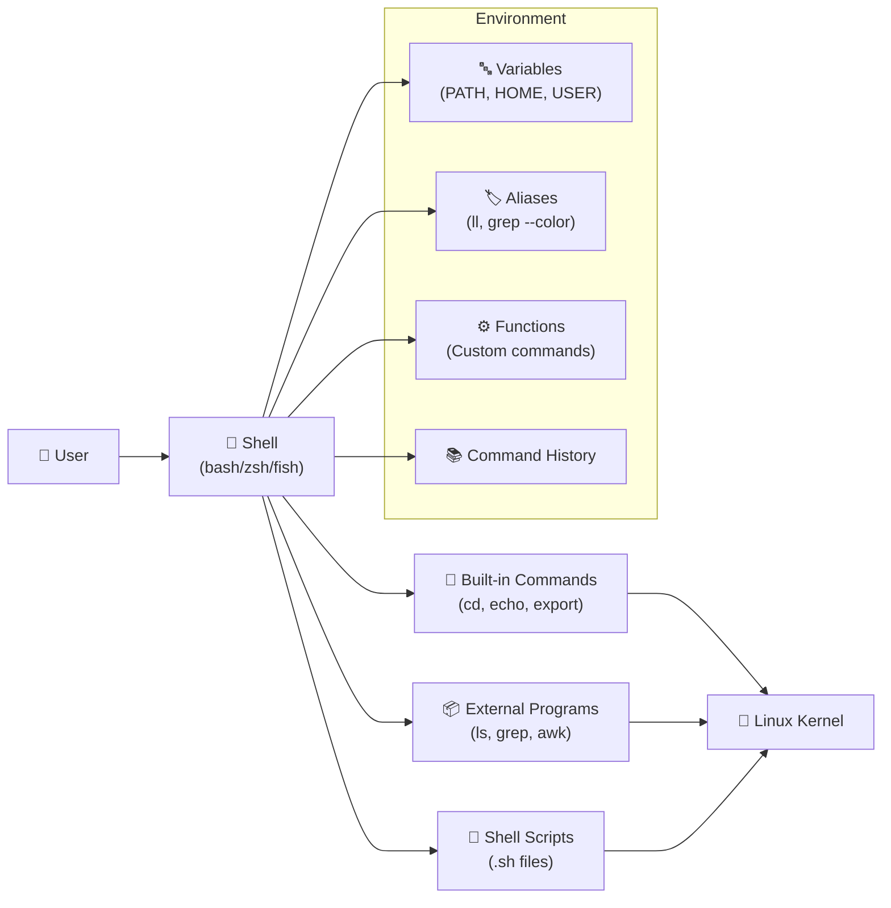

* 🛠️ **Shell Configuration Files**:
  * **System-wide**: `/etc/bash.bashrc`, `/etc/profile`, `/etc/environment`
  * **User-specific**: `~/.bashrc`, `~/.bash_profile`, `~/.zshrc`, `~/.profile`
  * **Login vs Non-login**: Different files loaded based on session type
  * **Interactive vs Non-interactive**: Scripts may behave differently than interactive sessions

```bash
# 🧪 Shell environment management
# View current shell
echo $SHELL
echo $0

# View environment variables
env                               # All environment variables
echo $PATH                        # PATH variable
echo $HOME                        # Home directory
echo $USER                        # Current user

# Set variables
export MY_VAR="Hello World"        # Environment variable
MY_LOCAL_VAR="Local only"          # Shell variable

# View shell options
set -o                            # Show all options
set -e                            # Exit on error
set -u                            # Exit on undefined variable
set -x                            # Debug mode (print commands)

# Command history
history                           # Show command history
!123                              # Run command 123 from history
!!                                # Run last command
Ctrl+R                            # Search history interactively
```

* 🛡️ **Shell Security Best Practices**:
  * **Quote Variables**: Always quote variables to prevent word splitting
  * **Validate Input**: Check user input and command-line arguments
  * **Use Full Paths**: Specify full paths for critical commands
  * **Set Safe Options**: Use `set -euo pipefail` for robust scripts
  * **Avoid eval**: Don't use `eval` with untrusted input

🔗 **Resources:**
* [Bash Manual](https://www.gnu.org/software/bash/manual/)
* [ShellCheck - Shell Script Linter](https://www.shellcheck.net/)
* [Advanced Bash-Scripting Guide](https://tldp.org/LDP/abs/html/)
* [Oh My Zsh Framework](https://ohmyz.sh/)

---

## 📍 Slide 15 – 📂 File Management & Text Processing

* 📁 **File Operations** = fundamental Linux skills for managing files, directories, and text content efficiently.
* 🔍 **Text Processing** = Linux provides powerful command-line tools for searching, filtering, and manipulating text data.
* 📚 **Unix Philosophy**: "Do one thing and do it well" - combine simple tools to solve complex problems.

**File Operations Workflow**
```mermaid
flowchart LR
    Create["📝 Create\n(touch, mkdir)"] --> View["👁️ View\n(cat, less, head, tail)"]
    View --> Edit["✏️ Edit\n(nano, vim, sed)"]
    Edit --> Copy["📋 Copy\n(cp, rsync)"]
    Copy --> Move["🚚 Move\n(mv, rename)"]
    Move --> Search["🔍 Search\n(find, grep, locate)"]
    Search --> Process["⚙️ Process\n(awk, sort, uniq)"]
    Process --> Archive["📦 Archive\n(tar, gzip, zip)"]
    Archive --> Permissions["🔐 Permissions\n(chmod, chown)"]
    Permissions --> Delete["🗑️ Delete\n(rm, rmdir)"]
```

🔗 **Resources:**
* [GNU Coreutils Manual](https://www.gnu.org/software/coreutils/manual/)
* [Advanced Linux Commands Guide](https://www.cyberciti.biz/tips/top-linux-monitoring-tools.html)

---

## 📍 Slide 16 – 👤 User & Group Management

* 👥 **User Management** = creating, modifying, and controlling user accounts and their access to system resources.
* 🏢 **Group Management** = organizing users into groups for easier permission management and resource sharing.
* 🔐 **Authentication vs Authorization**: Authentication verifies identity, authorization determines access rights.
* 📚 **Historical Context**: Unix multi-user design from 1970s, where multiple users shared expensive mainframe computers.

**Linux User and Group Architecture**
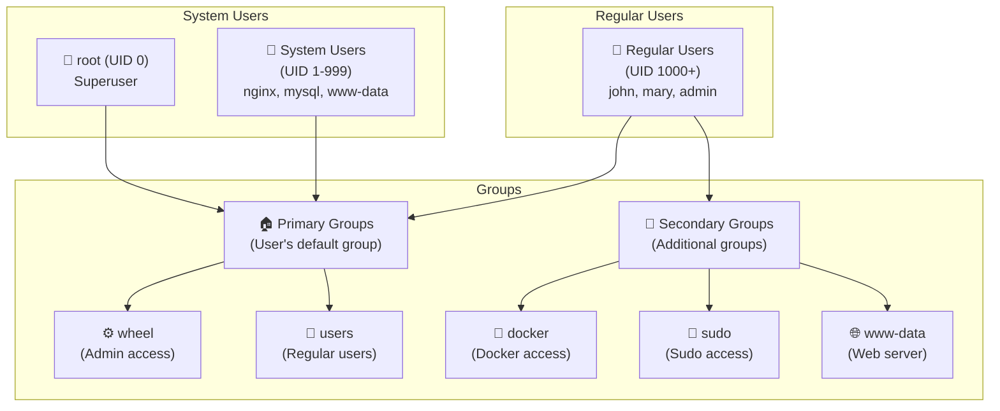

* 🗂️ **Key Files and Databases**:
  * **/etc/passwd**: User account information (username, UID, GID, home directory, shell)
  * **/etc/shadow**: Encrypted passwords and password policies
  * **/etc/group**: Group information (group name, GID, group members)
  * **/etc/gshadow**: Encrypted group passwords and administrators
  * **/etc/sudoers**: Sudo access configuration
  * **/etc/login.defs**: Default settings for user accounts

* 🔢 **UID and GID Ranges**:
  * **0**: Root user (superuser)
  * **1-99**: System accounts (reserved)
  * **100-999**: System users and groups (services, daemons)
  * **1000-65533**: Regular users and groups
  * **65534**: `nobody` user (unprivileged operations)

* 🛠️ **DevOps User Management Best Practices**:
  * **Service Accounts**: Create dedicated users for applications and services
  * **Principle of Least Privilege**: Grant minimal necessary permissions
  * **Group-based Access**: Use groups for permission management, not individual users
  * **Password Policies**: Enforce strong passwords and regular rotation
  * **SSH Key Authentication**: Prefer keys over passwords for automation
  * **Monitoring**: Track user activities and login attempts

* ⚠️ **Common Security Considerations**:
  * **Disable unused accounts**: Lock or remove accounts no longer needed
  * **Regular audits**: Review user accounts and permissions regularly
  * **Strong authentication**: Implement multi-factor authentication where possible
  * **Account expiration**: Set expiration dates for temporary accounts
  * **Home directory permissions**: Secure user home directories

🔗 **Resources:**
* [Linux User Management Guide](https://www.digitalocean.com/community/tutorials/how-to-add-and-delete-users-on-ubuntu-16-04)
* [Sudo Manual](https://www.sudo.ws/docs/man/1.8.17/sudoers.man.html)
* [Red Hat User Management](https://access.redhat.com/documentation/en-us/red_hat_enterprise_linux/8/html/configuring_basic_system_settings/managing-users-and-groups_configuring-basic-system-settings)

---

## 📍 Slide 17 – 🔄 Process Management in Linux

* ⚙️ **Process** = an instance of a running program with its own memory space, file descriptors, and execution context.
* 🔄 **Process Lifecycle**: Created → Running → Waiting/Sleeping → Zombie → Terminated
* 📊 **Process Hierarchy**: All processes descend from `init` (PID 1), forming a tree structure.
* 📚 **Historical Context**: Process concept introduced in early Unix (1970s), foundation of multitasking operating systems.

**Process States and Transitions**
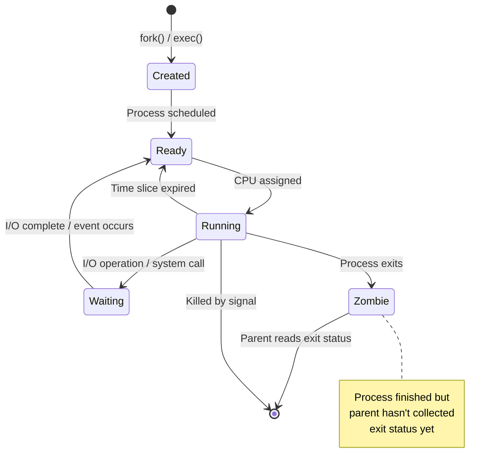

* 📊 **Common Linux Signals**:
  * **SIGTERM (15)**: Polite termination request (default for `kill`)
  * **SIGKILL (9)**: Force termination (cannot be ignored)
  * **SIGHUP (1)**: Hangup, often used to reload configuration
  * **SIGINT (2)**: Interrupt (Ctrl+C)
  * **SIGSTOP (19)**: Pause process (cannot be ignored)
  * **SIGCONT (18)**: Continue paused process
  * **SIGUSR1/SIGUSR2 (10/12)**: User-defined signals

**Process Management Tools Ecosystem**
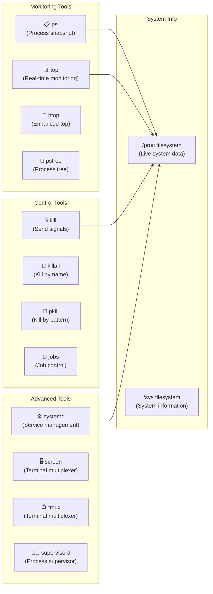

* 🔧 **Advanced Process Management**:
  * **Process Groups**: Related processes grouped together for signal handling
  * **Sessions**: Collection of process groups, typically associated with terminal
  * **Daemons**: Background processes that run independently of terminals
  * **Init Systems**: Modern systems use systemd, older systems use SysV init
  * **Cgroups**: Control groups for resource limitation and monitoring

* ⚠️ **Common Issues and Troubleshooting**:
  * **Zombie Processes**: Dead processes whose parent hasn't collected exit status
  * **Process Leaks**: Applications creating too many child processes
  * **Resource Exhaustion**: Processes consuming too much CPU/memory
  * **Runaway Processes**: Infinite loops or recursive process creation
  * **Signal Handling**: Processes not responding to termination signals

🔗 **Resources:**
* [Linux Process Management Guide](https://www.kernel.org/doc/html/latest/admin-guide/process-management.html)
* [Understanding Linux Processes](https://www.digitalocean.com/community/tutorials/how-to-use-ps-kill-and-nice-to-manage-processes-in-linux)
* [Advanced Programming in Unix Environment](http://www.apue.com/) (Stevens & Rago)

---

## 📍 Slide 18 – 🛠️ Systemd & Service Management

* ⚙️ **systemd** = modern init system and service manager for Linux, replacing traditional SysV init.
* 🎯 **Features**: Parallel service startup, on-demand service activation, dependency management, logging integration.
* 📚 **Historical Context**: Created by Lennart Poettering (2010), adopted by major distributions since 2011, controversy due to "Unix philosophy" violations.
* 🔄 **Boot Process**: BIOS/UEFI → bootloader → kernel → systemd (PID 1) → services and targets

**Systemd Architecture**
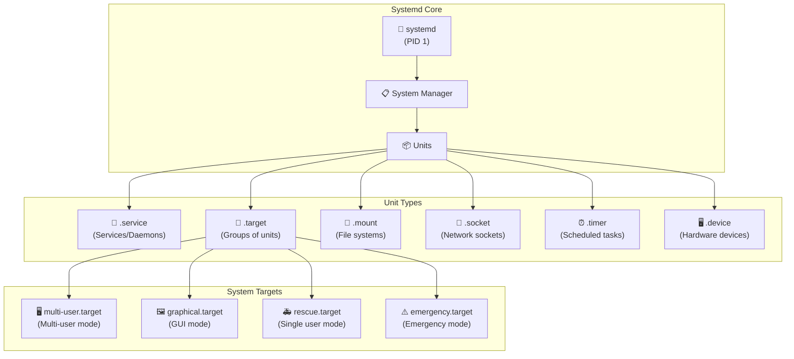

* 🗂️ **Systemd Directory Structure**:
  * **/lib/systemd/system/**: Distribution-provided unit files
  * **/etc/systemd/system/**: System administrator unit files (override distribution)
  * **/run/systemd/system/**: Runtime unit files
  * **/home/user/.config/systemd/user/**: User-specific unit files

* 🎯 **System Targets (Runlevels)**:
  * **poweroff.target** (runlevel 0): System shutdown
  * **rescue.target** (runlevel 1): Single-user mode
  * **multi-user.target** (runlevel 3): Multi-user, no GUI
  * **graphical.target** (runlevel 5): Multi-user with GUI
  * **reboot.target** (runlevel 6): System restart

🔗 **Resources:**
* [systemd Documentation](https://www.freedesktop.org/wiki/Software/systemd/)
* [systemd for Administrators Series](http://0pointer.de/blog/projects/systemd-for-admins-1.html)
* [Red Hat systemd Guide](https://access.redhat.com/documentation/en-us/red_hat_enterprise_linux/8/html/configuring_basic_system_settings/managing-services-with-systemd_configuring-basic-system-settings)

---

## 📍 Slide 19 – 📊 Resource Monitoring & Performance

* 📈 **System Monitoring** = continuous observation of system resources to ensure optimal performance and identify bottlenecks.
* 🎯 **Key Resources to Monitor**: CPU utilization, memory usage, disk I/O, network throughput, process counts.
* 📚 **Performance Metrics**: Load average, response time, throughput, error rates, resource saturation.
* 💡 **Historical Context**: System monitoring evolved from simple `ps` and `top` commands to sophisticated monitoring stacks like ELK, Prometheus/Grafana.

**Linux Performance Monitoring Stack**
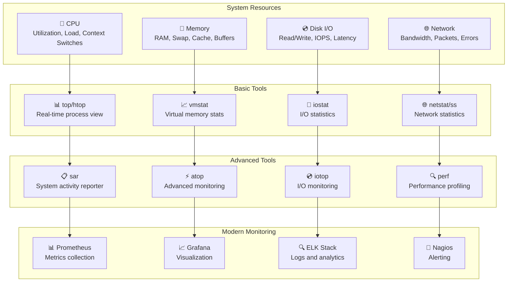

* 📊 **Modern Monitoring Integration**:
  * **Metrics Collection**: node_exporter, collectd, Telegraf
  * **Time Series Databases**: Prometheus, InfluxDB, Graphite
  * **Visualization**: Grafana, Kibana, custom dashboards
  * **Alerting**: AlertManager, PagerDuty, Slack integration
  * **Log Aggregation**: ELK stack, Fluentd, Loki

🔗 **Resources:**
* [Linux Performance Tools](http://www.brendangregg.com/linuxperf.html)
* [Systems Performance by Brendan Gregg](http://www.brendangregg.com/systems-performance-2nd-edition-book.html)
* [Prometheus Monitoring Guide](https://prometheus.io/docs/guides/)

---

## 📍 Slide 20 – 📝 Logging Systems

* 📋 **System Logging** = structured recording of system events, errors, and activities for debugging, auditing, and monitoring.
* 🔄 **Modern Linux Logging**: Traditional syslog evolved to systemd journal, offering binary logs with rich metadata.
* 📚 **Historical Context**: Syslog protocol created in 1980s at UC Berkeley, RFC 3164 (2001), modern RFC 5424 (2009).
* 🎯 **Log Levels**: Emergency, Alert, Critical, Error, Warning, Notice, Info, Debug (RFC 5424 severity levels).

**Linux Logging Architecture**
```mermaid
flowchart TB
    subgraph "Log Sources"
        kernel["🧠 Kernel\n(dmesg, /dev/kmsg)"]
        systemd["⚙️ systemd services\n(journal)"]
        apps["📱 Applications\n(custom logs)"]
        syslog["📋 Syslog\n(/dev/log socket)"]
    end
    
    subgraph "Log Processing"
        journald["📖 systemd-journald\n(Binary logs)"]
        rsyslog["📜 rsyslog\n(Text logs)"]
        logrotate["🔄 logrotate\n(Log rotation)"]
    end
    
    subgraph "Storage"
        journal_storage["💾 /var/log/journal/\n(Binary format)"]
        text_logs["📄 /var/log/\n(Text files)"]
        remote["🌐 Remote syslog\n(Centralized)"]
    end
    
    subgraph "Analysis Tools"
        journalctl["🔍 journalctl\n(Journal viewer)"]
        grep_tools["🔎 grep/awk/sed\n(Text processing)"]
        elk["📊 ELK Stack\n(Elasticsearch)"]
        splunk["💼 Splunk\n(Log analysis)"]
    end
    
    kernel --> journald
    systemd --> journald
    apps --> rsyslog
    syslog --> rsyslog
    
    journald --> journal_storage
    rsyslog --> text_logs
    rsyslog --> remote
    
    logrotate --> text_logs
    
    journal_storage --> journalctl
    text_logs --> grep_tools
    remote --> elk
    remote --> splunk
```

* 🔧 **DevOps Logging Best Practices**:
  * **Structured Logging**: Use JSON format for easier parsing
  * **Log Levels**: Use appropriate severity levels
  * **Correlation IDs**: Track requests across microservices
  * **Centralization**: Aggregate logs from all systems
  * **Retention Policies**: Define how long to keep logs
  * **Security**: Protect logs from unauthorized access, avoid logging sensitive data

🔗 **Resources:**
* [systemd Journal Documentation](https://www.freedesktop.org/software/systemd/man/systemd-journald.service.html)
* [Rsyslog Documentation](https://www.rsyslog.com/doc/)
* [ELK Stack Guide](https://www.elastic.co/what-is/elk-stack)
* [RFC 5424: The Syslog Protocol](https://tools.ietf.org/html/rfc5424)

---

## 📍 Slide 21 – 📆 Scheduling & Automation

* ⏰ **Task Scheduling** = automated execution of commands, scripts, or programs at predetermined times or intervals.
* 🔄 **Evolution**: From traditional cron to modern systemd timers, offering better integration and logging.
* 🎯 **Use Cases**: System maintenance, backups, log rotation, monitoring, data processing, deployment automation.

**Linux Scheduling Systems**
```mermaid
flowchart TB
    subgraph "Traditional Scheduling"
        cron["⏰ Cron Daemon\n(crond)"]
        crontab["📋 Crontab Files\n(/etc/crontab, user crontabs)"]
        anacron["🔄 Anacron\n(catch up missed jobs)"]
    end
    
    subgraph "Modern Scheduling"
        systemd_timers["⚙️ Systemd Timers\n(timer units)"]
        systemd_services["🔧 Systemd Services\n(service units)"]
    end
    
    subgraph "Specialized Tools"
        at["📅 at\n(one-time scheduling)"]
        batch["📦 batch\n(load-dependent execution)"]
        fcron["🎯 fcron\n(advanced cron)"]
    end
    
    subgraph "Enterprise Solutions"
        jenkins["🏗️ Jenkins\n(CI/CD scheduling)"]
        airflow["🌊 Apache Airflow\n(workflow scheduling)"]
        kubernetes["☸️ Kubernetes CronJobs\n(container scheduling)"]
    end
    
    cron --> crontab
    cron --> anacron
    systemd_timers --> systemd_services
    
    crontab --> jenkins
    systemd_timers --> kubernetes
    at --> airflow
```

🔗 **Resources:**
* [Cron Expression Generator](https://crontab.guru/)
* [systemd.timer Manual](https://www.freedesktop.org/software/systemd/man/systemd.timer.html)

---

## 📍 Slide 22 – 🔐 File Permissions & Ownership

* 🛡️ **File Permissions** = access control mechanism that determines who can read, write, or execute files and directories.
* 👥 **Ownership Model**: Every file has an owner (user) and a group, forming the basis of Linux security.
* 📚 **Historical Context**: Unix permission system designed in 1970s, based on military security requirements, still fundamental to modern systems.
* 🎯 **Permission Types**: Read (r/4), Write (w/2), Execute (x/1) for User, Group, and Others.

**Linux Permission Structure**
```mermaid
flowchart TB
    subgraph "File Attributes"
        file["📄 File: example.txt\n-rw-r--r-- 1 alice developers 1024 Jan 15 10:30"]
    end
    
    subgraph "Permission Breakdown"
        filetype["-\n(Regular file)"]
        owner_perms["rw-\n(Owner: read+write)"]
        group_perms["r--\n(Group: read only)"]
        other_perms["r--\n(Others: read only)"]
        links["1\n(Hard links)"]
        owner["alice\n(Owner)"]
        group["developers\n(Group)"]
        size["1024\n(Size in bytes)"]
        time["Jan 15 10:30\n(Modification time)"]
    end
    
    subgraph "Numeric Representation"
        owner_num["6 (4+2+0)\nrw-"]
        group_num["4 (4+0+0)\nr--"]
        other_num["4 (4+0+0)\nr--"]
        combined["644\n(Full permission)"]
    end
    
    file --> filetype
    file --> owner_perms
    file --> group_perms
    file --> other_perms
    file --> links
    file --> owner
    file --> group
    file --> size
    file --> time
    
    owner_perms --> owner_num
    group_perms --> group_num
    other_perms --> other_num
    
    owner_num --> combined
    group_num --> combined
    other_num --> combined
```

* 📊 **Understanding Permission Bits**:
```bash
# 🧪 Permission examples and explanations
# ls -l output breakdown
-rw-r--r-- 1 alice developers  1024 Jan 15 10:30 document.txt
drwxr-xr-x 2 bob   staff       4096 Jan 15 10:30 my_directory
-rwxr-xr-x 1 root  root         755 Jan 15 10:30 script.sh
-rw------- 1 alice alice        512 Jan 15 10:30 private.txt

# File type indicators (first character)
# -  Regular file
# d  Directory
# l  Symbolic link
# b  Block device
# c  Character device
# p  Named pipe (FIFO)
# s  Socket

# Permission values
# r (read)    = 4
# w (write)   = 2
# x (execute) = 1
# - (no permission) = 0

# Common permission combinations
# 755 = rwxr-xr-x (executable files, directories)
# 644 = rw-r--r-- (regular files)
# 600 = rw------- (private files)
# 777 = rwxrwxrwx (full permissions - avoid!)
# 000 = --------- (no permissions)
```

* ⚠️ **Security Best Practices**:
  * **Principle of Least Privilege**: Grant minimum necessary permissions
  * **Avoid 777**: Never use full permissions unless absolutely necessary
  * **Regular Audits**: Check for unusual SUID/SGID files
  * **Group Management**: Use groups for shared access instead of broad permissions
  * **Sensitive Files**: Protect configuration files, keys, and credentials
  * **Executable Scripts**: Be careful with execute permissions on scripts

🔗 **Resources:**
* [Linux File Permissions Guide](https://www.redhat.com/sysadmin/linux-file-permissions-explained)
* [Understanding umask](https://www.cyberciti.biz/tips/understanding-linux-unix-umask-value-usage.html)
* [Access Control Lists Tutorial](https://www.redhat.com/sysadmin/linux-access-control-lists)
* [Linux Security Best Practices](https://linux-audit.com/linux-file-permissions-101/)

---

## 📍 Slide 23 – 💪 Sudo & Privilege Escalation

* 🛡️ **sudo** = "substitute user do" or "super user do", allows authorized users to run commands with elevated privileges.
* 🔑 **Principle of Least Privilege**: Grant users only the minimum permissions needed for their tasks.
* 📚 **Historical Context**: sudo created in 1980 by Bob Coggeshall and Cliff Spencer at SUNY/Buffalo, designed as safer alternative to su.
* ⚖️ **Benefits**: Detailed logging, granular control, accountability, time-limited escalation, reduces need for shared root passwords.

**Sudo Architecture and Flow**
```mermaid
flowchart TB
    subgraph "User Request"
        user["👤 Regular User\n(alice)"]
        command["💻 sudo systemctl restart nginx"]
    end
    
    subgraph "Sudo Process"
        sudo_binary["🔧 /usr/bin/sudo"]
        sudoers_check["📋 Check /etc/sudoers"]
        auth["🔐 Authentication\n(password/key)"]
        execution["⚡ Execute as root"]
    end
    
    subgraph "Security Checks"
        user_perms["✅ User authorized?"]
        command_allowed["✅ Command allowed?"]
        host_match["✅ Host matches?"]
        time_valid["✅ Within time limit?"]
    end
    
    subgraph "Logging"
        auth_log["📝 /var/log/auth.log"]
        sudo_log["📝 /var/log/sudo.log"]
        syslog["📝 Syslog facility"]
    end
    
    user --> command
    command --> sudo_binary
    sudo_binary --> sudoers_check
    
    sudoers_check --> user_perms
    sudoers_check --> command_allowed
    sudoers_check --> host_match
    sudoers_check --> time_valid
    
    user_perms --> auth
    command_allowed --> auth
    host_match --> auth
    time_valid --> auth
    
    auth --> execution
    
    execution --> auth_log
    execution --> sudo_log
    execution --> syslog
```

* 📋 **Sudoers File Structure**:
```bash
# 🧪 Basic sudoers syntax
# Edit safely with visudo
sudo visudo

# Basic syntax: user host=(runas) command
# user ALL=(ALL:ALL) ALL
# ↑    ↑   ↑     ↑   ↑
# │    │   │     │   └─ Commands
# │    │   │     └───── Run as group
# │    │   └─────────── Run as user
# │    └───────────── Host
# └────────────────── User/Group

# Examples
root    ALL=(ALL:ALL) ALL                    # Root can do everything
%admin  ALL=(ALL) ALL                        # Admin group can do everything
%sudo   ALL=(ALL:ALL) ALL                    # Sudo group (Ubuntu default)

# User-specific permissions
alice   ALL=(ALL) NOPASSWD: /usr/bin/systemctl
bob     ALL=(www-data) /usr/local/bin/deploy.sh
charlie ALL=(ALL) /usr/bin/apt, /usr/bin/systemctl

# Group permissions
%developers ALL=(ALL) NOPASSWD: /usr/bin/docker, /usr/bin/kubectl
%dbadmin    ALL=(postgres) NOPASSWD: /usr/bin/psql, /usr/bin/pg_dump

# Host-specific rules
devops  webserver=(ALL) /usr/bin/systemctl restart nginx
backup  backupserver=(ALL) NOPASSWD: /usr/local/bin/backup.sh
```

* 🚨 **Common Security Issues and Solutions**:
  * **Overprivileged Access**: Use specific command lists instead of ALL
  * **NOPASSWD Overuse**: Only use for automated scripts and trusted operations
  * **Wildcard Commands**: Be careful with * in command specifications
  * **Path Manipulation**: Use full paths and secure_path option
  * **Shell Escapes**: Avoid commands that can launch shells (vim, less with !)
  * **Regular Audits**: Review sudo permissions quarterly

* 🔄 **Alternative Privilege Escalation Methods**:
  * **doas**: OpenBSD's simpler alternative to sudo
  * **su**: Switch user (traditional method, requires target user's password)
  * **pkexec**: PolicyKit's command-line tool
  * **sudo-rs**: Rust implementation of sudo (modern alternative)

🔗 **Resources:**
* [Sudo Manual](https://www.sudo.ws/docs/man/1.8.17/sudoers.man.html)
* [Red Hat Sudo Guide](https://access.redhat.com/documentation/en-us/red_hat_enterprise_linux/8/html/configuring_basic_system_settings/managing-sudo-access_configuring-basic-system-settings)
* [Sudo Security Best Practices](https://blog.compass-security.com/2012/10/dangerous-sudoers-entries/)

---

## 📍 Slide 24 – 🛡️ SELinux & AppArmor

* 🔒 **Mandatory Access Control (MAC)** = security mechanism that enforces access policies defined by system administrators, going beyond traditional file permissions.
* 🛡️ **SELinux** = Security-Enhanced Linux, developed by NSA, implements MAC through labels and policies.
* 🍎 **AppArmor** = Application Armor, Ubuntu's preferred MAC system, uses path-based security profiles.
* 📚 **Historical Context**: SELinux introduced in 2003, AppArmor started by Immunix (2000), acquired by Novell/SUSE.

**MAC Systems Comparison**
```mermaid
flowchart TB
    subgraph "Traditional Security (DAC)"
        dac_users["👤 Users"]
        dac_groups["👥 Groups"]
        dac_perms["📋 File Permissions\n(rwx)"]
        dac_limit["⚠️ Limited Protection\nRoot bypasses all"]
    end
    
    subgraph "SELinux (Label-based MAC)"
        selinux_subjects["👤 Subjects\n(Processes with contexts)"]
        selinux_objects["📁 Objects\n(Files with labels)"]
        selinux_policy["📋 SELinux Policy\n(Type enforcement)"]
        selinux_contexts["🏷️ Security Contexts\nuser:role:type:level"]
    end
    
    subgraph "AppArmor (Path-based MAC)"
        apparmor_profiles["📄 Profiles\n(Per-application)"]
        apparmor_paths["📂 Path Rules\n(/etc/passwd r)"]
        apparmor_caps["⚡ Capabilities\n(Network, file access)"]
        apparmor_modes["🔧 Modes\n(Enforce/Complain)"]
    end
    
    subgraph "Security Benefits"
        confinement["🔒 Process Confinement"]
        privilege_sep["🏗️ Privilege Separation"]
        damage_limit["🛡️ Damage Limitation"]
        compliance["📊 Compliance Support"]
    end
    
    dac_users --> dac_perms
    dac_groups --> dac_perms
    dac_perms --> dac_limit
    
    selinux_subjects --> selinux_policy
    selinux_objects --> selinux_policy
    selinux_policy --> selinux_contexts
    
    apparmor_profiles --> apparmor_paths
    apparmor_paths --> apparmor_caps
    apparmor_caps --> apparmor_modes
    
    selinux_contexts --> confinement
    apparmor_modes --> privilege_sep
    confinement --> damage_limit
    privilege_sep --> compliance
```

* ⚖️ **Best Practices**:
  * **Start with Permissive/Complain**: Learn application behavior before enforcing
  * **Use Standard Profiles**: Leverage existing profiles when possible
  * **Regular Updates**: Keep MAC systems and policies updated
  * **Monitor Logs**: Regular review of denial logs
  * **Test Thoroughly**: Test applications with MAC enabled before production
  * **Documentation**: Document custom policies and exceptions
  * **Layered Security**: MAC complements, doesn't replace, traditional security

🔗 **Resources:**
* [Red Hat SELinux User Guide](https://access.redhat.com/documentation/en-us/red_hat_enterprise_linux/8/html/using_selinux/)
* [Ubuntu AppArmor Documentation](https://ubuntu.com/server/docs/security-apparmor)
* [NSA SELinux Documentation](https://www.nsa.gov/what-we-do/research/selinux/)
* [AppArmor Core Policy Reference](https://gitlab.com/apparmor/apparmor/-/wikis/Documentation)

---

## 📍 Slide 25 – 🔒 Hardening Linux Systems

* 🛡️ **System Hardening** = process of securing a system by reducing vulnerabilities, minimizing attack surface, and implementing security controls.
* 🎯 **Defense in Depth**: Multiple layers of security controls to protect against various attack vectors.
* 📚 **Historical Context**: System hardening practices evolved from military security requirements, formalized in standards like STIGs, CIS Benchmarks.
* 🔍 **Attack Surface Reduction**: Disable unnecessary services, remove unused software, limit network exposure.

**Linux System Hardening Layers**
```mermaid
flowchart TB
    subgraph "Physical Security"
        datacenter["🏢 Data Center\nPhysical access control"]
        boot_security["🔐 Boot Security\nBIOS/UEFI passwords"]
    end
    
    subgraph "Network Security"
        firewall["🔥 Firewall\niptables/firewalld"]
        network_services["🌐 Network Services\nSSH hardening, disable unused"]
        monitoring["👁️ Network Monitoring\nIntrusion detection"]
    end
    
    subgraph "System Security"
        user_mgmt["👥 User Management\nStrong passwords, sudo"]
        file_perms["📁 File Permissions\nPrinciple of least privilege"]
        mac_systems["🛡️ MAC Systems\nSELinux/AppArmor"]
    end
    
    subgraph "Application Security"
        service_config["⚙️ Service Configuration\nSecure defaults"]
        updates["📦 Updates\nPatch management"]
        logging["📝 Logging\nAudit trails"]
    end
    
    subgraph "Data Security"
        encryption["🔐 Encryption\nData at rest and in transit"]
        backups["💾 Backups\nSecure and tested"]
        integrity["✅ Integrity\nFile integrity monitoring"]
    end
    
    datacenter --> firewall
    boot_security --> user_mgmt
    firewall --> service_config
    network_services --> file_perms
    user_mgmt --> encryption
    service_config --> backups
    mac_systems --> integrity
```

* 🎯 **Hardening Checklist**:
  * ✅ **System Updates**: Regular patches and security updates
  * ✅ **User Management**: Strong passwords, limited privileges
  * ✅ **SSH Security**: Key-based auth, non-standard port
  * ✅ **Firewall**: Restrictive rules, only necessary ports
  * ✅ **Service Reduction**: Disable unnecessary services
  * ✅ **File Permissions**: Proper ownership and permissions
  * ✅ **Audit Logging**: Comprehensive system monitoring
  * ✅ **Intrusion Detection**: Fail2ban or similar tools
  * ✅ **File Integrity**: AIDE or similar monitoring
  * ✅ **Compliance**: Regular security assessments

🔗 **Resources:**
* [CIS Benchmarks](https://www.cisecurity.org/cis-benchmarks/)
* [NIST Cybersecurity Framework](https://www.nist.gov/cyberframework)
* [Red Hat Security Guide](https://access.redhat.com/documentation/en-us/red_hat_enterprise_linux/8/html/security_hardening/)
* [Ubuntu Security Documentation](https://ubuntu.com/security)

---

## 📍 Slide 26 – 🌐 Network Interface Configuration

* 🔌 **Network Interface** = hardware or software component that connects a computer to a network (Ethernet, Wi-Fi, loopback).
* 📡 **Interface Management**: Modern Linux uses NetworkManager, systemd-networkd, or traditional ifconfig/ip commands.
* 📚 **Historical Context**: Traditional ifconfig being replaced by iproute2 (ip command), more powerful and feature-rich.
* 🔄 **Dynamic vs Static**: DHCP for automatic configuration vs static IP for servers and critical infrastructure.

**Network Interface Architecture**
```mermaid
flowchart TB
    subgraph "Physical Layer"
        ethernet["🔌 Ethernet NIC\n(eth0, enp0s3)"]
        wifi["📶 Wi-Fi Adapter\n(wlan0, wlp2s0)"]
        loopback["🔄 Loopback\n(lo)"]
    end
    
    subgraph "Network Stack"
        kernel["🧠 Linux Kernel\nNetwork Stack"]
        drivers["🔧 Device Drivers"]
        protocols["📋 Protocols\n(TCP/IP, IPv6)"]
    end
    
    subgraph "Configuration Tools"
        traditional["🗂️ Traditional\nifconfig, route"]
        modern["💎 Modern\nip, ss"]
        managers["🎛️ Network Managers\nNetworkManager, systemd-networkd"]
    end
    
    subgraph "Configuration Files"
        debian_style["📄 Debian/Ubuntu\n/etc/network/interfaces"]
        rhel_style["📄 RHEL/CentOS\n/etc/sysconfig/network-scripts/"]
        systemd_style["📄 systemd\n/etc/systemd/network/"]
    end
    
    ethernet --> drivers
    wifi --> drivers
    loopback --> drivers
    
    drivers --> kernel
    kernel --> protocols
    
    protocols --> traditional
    protocols --> modern
    protocols --> managers
    
    managers --> debian_style
    managers --> rhel_style
    managers --> systemd_style
```

* ⚠️ **Best Practices**:
  * **Backup Configuration**: Always backup network configs before changes
  * **Test Thoroughly**: Test network changes in non-production first
  * **Use Consistent Naming**: Use predictable interface naming schemes
  * **Monitor Interfaces**: Set up monitoring for interface status
  * **Document Changes**: Keep records of network configuration changes
  * **Security**: Use VLANs and proper network segmentation
  * **Redundancy**: Configure bonding/teaming for critical connections

🔗 **Resources:**
* [iproute2 Documentation](https://www.kernel.org/doc/Documentation/networking/)
* [systemd-networkd Manual](https://www.freedesktop.org/software/systemd/man/systemd-networkd.html)
* [NetworkManager Documentation](https://networkmanager.dev/docs/)
* [Red Hat Networking Guide](https://access.redhat.com/documentation/en-us/red_hat_enterprise_linux/8/html/configuring_and_managing_networking/)

---

## 📍 Slide 27 – 🔄 DHCP & DNS Setup

* 🏷️ **DHCP** = Dynamic Host Configuration Protocol, automatically assigns IP addresses and network configuration to devices.
* 🌐 **DNS** = Domain Name System, translates human-readable domain names to IP addresses and provides name resolution services.
* 🔄 **Integration**: DHCP and DNS work together to provide seamless network configuration and name resolution.
* 📚 **Historical Context**: DHCP standardized in RFC 2131 (1997), replacing BOOTP; DNS defined in RFC 1035 (1987).

**DHCP and DNS Service Architecture**
```mermaid
sequenceDiagram
    participant Client as 💻 DHCP Client
    participant DHCP as 🏷️ DHCP Server
    participant DNS as 🌐 DNS Server
    participant Internet as 🌍 Internet
    
    Note over Client,DHCP: DHCP Process (DORA)
    Client->>DHCP: DHCP Discover (Broadcast)
    DHCP->>Client: DHCP Offer (IP + Config)
    Client->>DHCP: DHCP Request (Accept offer)
    DHCP->>Client: DHCP ACK (Lease confirmed)
    
    Note over Client,DNS: DNS Registration (Dynamic)
    DHCP->>DNS: Register hostname → IP mapping
    DNS->>DHCP: Registration confirmed
    
    Note over Client,Internet: Normal Operation
    Client->>DNS: Query: example.com?
    DNS->>Internet: Forward query (if not cached)
    Internet->>DNS: Response: 93.184.216.34
    DNS->>Client: Response: 93.184.216.34
    
    Note over Client,DHCP: Lease Renewal
    Client->>DHCP: DHCP Request (Renew lease)
    DHCP->>Client: DHCP ACK (Lease extended)
```

* ⚖️ **Best Practices**:
  * **Backup Configurations**: Regular backups of DHCP and DNS configs
  * **Monitor Lease Usage**: Track DHCP pool utilization
  * **Secure DNS**: Use TSIG keys, restrict zone transfers
  * **Redundancy**: Deploy secondary DNS and DHCP servers
  * **Log Analysis**: Regular review of DHCP/DNS logs
  * **Update Serial Numbers**: Increment DNS zone serials after changes
  * **Test Changes**: Always test DNS changes before production

🔗 **Resources:**
* [ISC DHCP Documentation](https://www.isc.org/dhcp/)
* [BIND9 Administrator Reference Manual](https://bind9.readthedocs.io/)
* [RFC 2131 - DHCP](https://tools.ietf.org/html/rfc2131)
* [RFC 1035 - DNS](https://tools.ietf.org/html/rfc1035)

---

## 📍 Slide 28 – 🌍 Web Servers: Apache & Nginx

* 🗺️ **Web Server** = software that serves web pages and applications over HTTP/HTTPS protocols to client browsers.
* ⚔️ **Apache vs Nginx**: Apache (process-based, highly configurable) vs Nginx (event-driven, high performance, reverse proxy).
* 📚 **Historical Context**: Apache HTTP Server released 1995, dominated web serving for decades. Nginx created 2004 by Igor Sysoev to solve C10K problem (10,000 concurrent connections).
* 📈 **Market Share**: Nginx leads in high-traffic websites, Apache popular for shared hosting and complex configurations.

**Web Server Architecture Comparison**
```mermaid
flowchart TB
    subgraph "Apache Architecture"
        apache_client["👥 Client Requests"]
        apache_main["🔧 Main Process"]
        apache_workers["👥 Worker Processes\n(Prefork/Worker/Event)"]
        apache_modules["🧩 Modules\n(mod_ssl, mod_rewrite)"]
        apache_content["📁 Static/Dynamic Content"]
        
        apache_client --> apache_main
        apache_main --> apache_workers
        apache_workers --> apache_modules
        apache_modules --> apache_content
    end
    
    subgraph "Nginx Architecture"
        nginx_client["👥 Client Requests"]
        nginx_master["🏆 Master Process"]
        nginx_workers["⚡ Worker Processes\n(Event-driven)"]
        nginx_upstream["🔄 Upstream Servers\n(Proxy/Load Balance)"]
        nginx_content["📁 Static Content"]
        
        nginx_client --> nginx_master
        nginx_master --> nginx_workers
        nginx_workers --> nginx_upstream
        nginx_workers --> nginx_content
    end
    
    subgraph "Use Cases"
        apache_use["🏢 Apache Best For:\n• Shared hosting\n• Complex .htaccess\n• Many modules\n• Traditional PHP sites"]
        
        nginx_use["⚡ Nginx Best For:\n• High concurrency\n• Reverse proxy\n• Load balancing\n• Static content serving"]
    end
```

* 🔎 **Apache HTTP Server**:
  * **📈 Multi-Processing Modules (MPMs)**:
    * **Prefork**: One process per request (safe for non-thread-safe modules)
    * **Worker**: Hybrid multi-process and multi-threaded
    * **Event**: Optimized for high-traffic sites (default in Apache 2.4+)
  * **🧩 Modular Architecture**: Extensive module system (mod_ssl, mod_rewrite, mod_php)
  * **📁 .htaccess Files**: Directory-level configuration overrides
  * **🌐 Virtual Hosts**: Multiple websites on single server

* ⚡ **Nginx Web Server**:
  * **🚀 Event-Driven Architecture**: Handles thousands of connections efficiently
  * **🔄 Reverse Proxy**: Excellent for proxying to application servers
  * **⚖️ Load Balancing**: Built-in load balancing capabilities
  * **📁 Static Content**: Exceptionally fast static file serving
  * **📊 Low Resource Usage**: Minimal memory and CPU footprint

**Reverse Proxy Setup**
```mermaid
flowchart LR
    client["👥 Client"] --> nginx["⚡ Nginx\n(Reverse Proxy)"]
    
    nginx --> app1["🖥️ App Server 1\n(Port 3001)"]
    nginx --> app2["🖥️ App Server 2\n(Port 3002)"]
    nginx --> app3["🖥️ App Server 3\n(Port 3003)"]
    
    subgraph "Load Balancing Methods"
        round_robin["🔄 Round Robin\n(Default)"]
        least_conn["🔗 Least Connections\n(least_conn;)"]
        ip_hash["🏷️ IP Hash\n(ip_hash;)"]
    end
    
    subgraph "Benefits"
        ssl_term["🔒 SSL Termination"]
        compression["🗃️ Gzip Compression"]
        caching["💾 Static Caching"]
        security["🛡️ Security Filtering"]
    end
```

* 📊 **Performance Optimization**:
  * **📁 Static Content Caching**: Browser caching headers, CDN integration
  * **🗃️ Compression**: Gzip/Brotli compression for text content
  * **🚀 HTTP/2**: Modern protocol support for better performance
  * **⚡ Connection Pooling**: Reuse connections to backend servers
  * **💾 Content Delivery**: Edge caching and geographic distribution

* 🔒 **Security Best Practices**:
  * **🛡️ Security Headers**: HSTS, X-Frame-Options, CSP
  * **🔐 SSL/TLS**: Strong cipher suites, certificate management
  * **🚨 Rate Limiting**: Prevent abuse and DDoS attacks
  * **🗺️ Access Control**: IP whitelisting, authentication
  * **🔍 Log Analysis**: Monitor access and error logs

* 🐳 **Containerization and Modern Deployment**:
  * **🐳 Docker Integration**: Containerized web servers
  * **☸️ Kubernetes Ingress**: Nginx Ingress Controller
  * **🛠️ Infrastructure as Code**: Automated deployment
  * **📊 Monitoring**: Prometheus metrics, health checks
  * **🔄 Blue-Green Deployment**: Zero-downtime updates

* 📝 **Log Management and Monitoring**:
  * **📊 Access Logs**: Request patterns, performance metrics
  * **⚠️ Error Logs**: Troubleshooting and debugging
  * **🗺️ Log Rotation**: Prevent disk space issues
  * **🔍 Centralized Logging**: ELK stack integration
  * **🚨 Real-time Monitoring**: Alerting on errors and performance

🔗 **Resources:**
* [Apache HTTP Server Documentation](https://httpd.apache.org/docs/)
* [Nginx Documentation](https://nginx.org/en/docs/)
* [Mozilla SSL Configuration Generator](https://ssl-config.mozilla.org/)
* [Web Server Performance Testing](https://www.nginx.com/blog/testing-the-performance-of-nginx-and-nginx-plus-web-servers/)

---

## 📍 Slide 29 – 🔄 Proxies & Reverse Proxies

* 🔄 **Proxy Server** = intermediary server that forwards client requests to other servers and returns responses back to clients.
* ↔️ **Forward vs Reverse Proxy**: Forward proxy serves clients (hiding client identity), reverse proxy serves servers (hiding server infrastructure).
* 📚 **Historical Context**: Proxy servers emerged in early 1990s for caching and security; reverse proxies became popular with web application scaling needs.
* 🎯 **Modern Usage**: Load balancing, SSL termination, caching, security filtering, API gateway functionality.

**Proxy Types and Data Flow**
```mermaid
flowchart TB
    subgraph "Forward Proxy Setup"
        fclient1["💻 Client 1"]
        fclient2["💻 Client 2"]
        fproxy["🔄 Forward Proxy\n(Corporate/ISP)"]
        finternet["🌍 Internet Servers"]
        
        fclient1 --> fproxy
        fclient2 --> fproxy
        fproxy --> finternet
    end
    
    subgraph "Reverse Proxy Setup"
        rclient["🌐 Internet Clients"]
        rproxy["⚡ Reverse Proxy\n(Nginx/HAProxy)"]
        rserver1["🗺️ Web Server 1"]
        rserver2["🗺️ Web Server 2"]
        rserver3["🗺️ Web Server 3"]
        
        rclient --> rproxy
        rproxy --> rserver1
        rproxy --> rserver2
        rproxy --> rserver3
    end
    
    subgraph "Proxy Benefits"
        caching["💾 Caching\nReduce bandwidth"]
        security["🛡️ Security\nFilter content"]
        anonymity["😷 Anonymity\nHide IP addresses"]
        balancing["⚖️ Load Balancing\nDistribute traffic"]
    end
```

* 🔍 **Forward Proxy Use Cases**:
  * **🏢 Corporate Networks**: Internet access control, content filtering
  * **💾 Web Caching**: Reduce bandwidth usage, improve performance
  * **🛡️ Security Filtering**: Block malicious sites, malware protection
  * **😷 Privacy Protection**: Hide client IP addresses from servers
  * **🌍 Geographic Access**: Bypass geo-restrictions

* ⚡ **Reverse Proxy Use Cases**:
  * **⚖️ Load Balancing**: Distribute traffic across multiple servers
  * **🔐 SSL Termination**: Handle encryption/decryption centrally
  * **💾 Caching**: Store frequently requested content
  * **🛡️ Security**: Web Application Firewall (WAF), DDoS protection
  * **🔄 API Gateway**: Single entry point for microservices

**Reverse Proxy Architecture Benefits**
```mermaid
flowchart LR
    client["👥 Client Request"] --> proxy["⚡ Reverse Proxy"]
    
    subgraph "Proxy Functions"
        ssl["🔒 SSL Termination"]
        auth["🔑 Authentication"]
        rate["🚦 Rate Limiting"]
        cache["💾 Response Caching"]
        compress["🗃️ Compression"]
    end
    
    proxy --> ssl
    proxy --> auth
    proxy --> rate
    proxy --> cache
    proxy --> compress
    
    ssl --> backend["🗺️ Backend Servers"]
    auth --> backend
    rate --> backend
    cache --> backend
    compress --> backend
    
    subgraph "Backend Pool"
        app1["🖥️ App Server 1"]
        app2["🖥️ App Server 2"]
        app3["🖥️ App Server 3"]
        db["💾 Database"]
    end
    
    backend --> app1
    backend --> app2
    backend --> app3
    app1 --> db
    app2 --> db
    app3 --> db
```

* 🛠️ **Popular Proxy Solutions**:

| **Solution** | **Type** | **Strengths** | **Best For** |
|--------------|----------|---------------|-------------|
| **Nginx** | Reverse | 🚀 High performance, 📁 Static content | Web serving, load balancing |
| **HAProxy** | Both | ⚖️ Advanced load balancing, 📊 Analytics | TCP/HTTP load balancing |
| **Apache HTTP** | Both | 🧩 Modular, 📄 Flexible config | Traditional web hosting |
| **Squid** | Forward | 💾 Advanced caching, 🔍 Content filtering | Corporate proxy |
| **Traefik** | Reverse | 🐳 Container-native, 🔄 Auto-discovery | Docker/Kubernetes |
| **Cloudflare** | Both | 🌍 Global CDN, 🛡️ DDoS protection | Web performance |

**Microservices API Gateway Pattern**
```mermaid
flowchart TB
    client["📱 Mobile App"]
    web["🌐 Web App"]
    gateway["🛊 API Gateway\n(Kong/Ambassador)"]
    
    subgraph "Gateway Features"
        auth["🔑 Authentication"]
        rate["🚦 Rate Limiting"]
        monitor["📊 Monitoring"]
        transform["🔄 Request Transform"]
    end
    
    subgraph "Microservices"
        user["👤 User Service"]
        product["📦 Product Service"]
        order["📋 Order Service"]
        payment["💳 Payment Service"]
        notify["📧 Notification Service"]
    end
    
    client --> gateway
    web --> gateway
    
    gateway --> auth
    gateway --> rate
    gateway --> monitor
    gateway --> transform
    
    auth --> user
    rate --> product
    monitor --> order
    transform --> payment
    gateway --> notify
```

* ⚠️ **Common Challenges and Solutions**:
  * **📍 Single Point of Failure**: Deploy multiple proxy instances
  * **📊 SSL Performance**: Use hardware acceleration, session resumption
  * **🔄 Session Stickiness**: Balance between load distribution and session persistence
  * **📋 Configuration Complexity**: Use configuration management tools
  * **📈 Monitoring Blind Spots**: Comprehensive logging and metrics collection

* 🎯 **Best Practices**:
  * **🔄 Health Checks**: Implement robust health checking mechanisms
  * **📋 Graceful Degradation**: Handle backend failures elegantly
  * **📁 Configuration Management**: Version control proxy configurations
  * **📊 Regular Updates**: Keep proxy software updated for security
  * **🔍 Performance Testing**: Regular load testing of proxy setup
  * **💾 Capacity Planning**: Monitor and plan for traffic growth

🔗 **Resources:**
* [HAProxy Documentation](https://www.haproxy.org/download/2.4/doc/configuration.txt)
* [Nginx Reverse Proxy Guide](https://docs.nginx.com/nginx/admin-guide/web-server/reverse-proxy/)
* [Squid Proxy Server](http://www.squid-cache.org/Doc/)
* [Traefik Documentation](https://doc.traefik.io/traefik/)

---

## 📍 Slide 30 – 🔐 SSH & Remote Administration

* 🔒 **SSH (Secure Shell)** = cryptographic network protocol for secure remote administration and file transfer over unsecured networks.
* 🔑 **Key-Based Authentication**: More secure than passwords, enables automation and eliminates password-based attacks.
* 📚 **Historical Context**: SSH developed by Tatu Ylönen (1995) to replace insecure protocols like Telnet, rlogin, and rsh.
* 🌐 **Modern Usage**: Essential for DevOps automation, container management, cloud infrastructure, and secure remote access.

**SSH Connection Process and Security**
```mermaid
sequenceDiagram
    participant Client as 💻 SSH Client
    participant Server as 🗺️ SSH Server
    
    Note over Client,Server: Connection Establishment
    Client->>Server: TCP Connection (Port 22)
    Server->>Client: Server Version & Host Key
    Client->>Server: Client Version
    
    Note over Client,Server: Key Exchange (Diffie-Hellman)
    Client->>Server: Key Exchange Init
    Server->>Client: Key Exchange Reply
    
    Note over Client,Server: Authentication Phase
    alt Public Key Authentication
        Client->>Server: Public Key Offer
        Server->>Client: Accept/Reject
        Client->>Server: Signed Challenge
        Server->>Client: Authentication Success
    else Password Authentication
        Client->>Server: Username/Password
        Server->>Client: Authentication Result
    end
    
    Note over Client,Server: Secure Channel Established
    Client->>Server: Encrypted Commands
    Server->>Client: Encrypted Responses
```

* 🔑 **SSH Key Management**:
  * **🔐 Key Generation**: RSA, ECDSA, Ed25519 algorithms
  * **📁 Key Storage**: Private keys (~/.ssh/), public keys (authorized_keys)
  * **🔄 Key Rotation**: Regular key updates for security
  * **🛡️ Key Security**: Passphrases, secure storage, limited permissions
  * **🏗️ Certificate Authority**: SSH-CA for large-scale key management

* ⚙️ **SSH Server Hardening**:
  * **🚪 Port Changes**: Use non-standard port (security through obscurity)
  * **🔒 Authentication**: Disable password auth, enforce key-based
  * **🚑 Root Access**: Prohibit direct root login
  * **🚦 Rate Limiting**: Prevent brute force attacks
  * **🌐 Network Restrictions**: Limit source IPs and interfaces

**SSH Tunneling and Port Forwarding**
```mermaid
flowchart TB
    subgraph "Local Port Forwarding"
        lclient["💻 Local Client\n(Port 8080)"]
        lssh["🔄 SSH Tunnel"]
        lserver["🗺️ Remote Server\n(Port 80)"]
        
        lclient --> |"-L 8080:server:80"| lssh
        lssh --> lserver
    end
    
    subgraph "Remote Port Forwarding"
        rclient["👥 Remote Client"]
        rssh["🔄 SSH Tunnel"]
        rlocal["💻 Local Service\n(Port 3000)"]
        
        rclient --> |"-R 8080:localhost:3000"| rssh
        rssh --> rlocal
    end
    
    subgraph "Dynamic Port Forwarding (SOCKS)"
        sclient["🌐 Browser"]
        sssh["🔄 SSH SOCKS Proxy"]
        sinternet["🌍 Internet"]
        
        sclient --> |"-D 1080"| sssh
        sssh --> sinternet
    end
    
    subgraph "Jump Host / Bastion"
        jclient["💻 Client"]
        jbastion["🛡️ Bastion Host"]
        jtarget["📛 Internal Server"]
        
        jclient --> |"ProxyJump"| jbastion
        jbastion --> jtarget
    end
```

* 🔄 **SSH Tunneling and Port Forwarding**:
  * **🔗 Local Port Forwarding**: Access remote services through SSH tunnel
  * **🔙 Remote Port Forwarding**: Expose local services to remote networks
  * **🌐 Dynamic Port Forwarding**: SOCKS proxy for web browsing
  * **🛡️ Jump Hosts**: Secure access through bastion servers
  * **🔌 X11 Forwarding**: Run GUI applications remotely

* 🛠️ **DevOps SSH Automation**:
  * **🐍 Ansible**: Agentless automation over SSH
  * **📦 Deployment Scripts**: Automated application deployment
  * **📊 Monitoring**: Remote system monitoring and management
  * **📋 Log Collection**: Centralized log gathering
  * **🐳 Container Management**: Docker and Kubernetes remote management

* 📊 **SSH Monitoring and Logging**:
  * **📋 Connection Logging**: Track SSH sessions and commands
  * **🚨 Failed Login Alerts**: Monitor brute force attempts
  * **🔍 Session Recording**: Audit trail for compliance
  * **📈 Performance Monitoring**: Connection times and reliability
  * **🛡️ Security Analysis**: Detect suspicious activities

**SSH in DevOps Workflow**
```mermaid
flowchart LR
    subgraph "Development"
        dev["👨‍💻 Developer"]
        git["🎨 Git Repository"]
        ide["💻 Local IDE"]
    end
    
    subgraph "CI/CD Pipeline"
        ci["🔄 CI Server\n(Jenkins/GitLab)"]
        deploy["🚀 Deployment\nScripts"]
        ansible["🔧 Ansible\nPlaybooks"]
    end
    
    subgraph "Infrastructure"
        bastion["🛡️ Bastion Host"]
        web["🌐 Web Servers"]
        db["💾 Database"]
        monitor["📊 Monitoring"]
    end
    
    dev --> |"SSH Git Push"| git
    git --> |"Webhook"| ci
    ci --> |"SSH Deploy"| deploy
    deploy --> |"SSH/Ansible"| ansible
    
    ansible --> |"SSH Tunnel"| bastion
    bastion --> web
    bastion --> db
    bastion --> monitor
    
    dev --> |"SSH Access"| bastion
```

🔗 **Resources:**
* [OpenSSH Documentation](https://www.openssh.com/manual.html)
* [SSH Security Best Practices](https://infosec.mozilla.org/guidelines/openssh)
* [SSH Tunneling Guide](https://www.ssh.com/academy/ssh/tunneling)
* [Teleport SSH Documentation](https://goteleport.com/docs/)

---

## 📍 Slide 31 – 🔍 Network Troubleshooting Tools

* 🔧 **Network Troubleshooting** = systematic approach to identify, diagnose, and resolve network connectivity and performance issues.
* 🎯 **Layered Approach**: Follow OSI model - Physical → Data Link → Network → Transport → Application layers.
* 📚 **Historical Context**: Tools evolved from simple ping (1983) to sophisticated packet analyzers and network mappers.
* 🛠️ **DevOps Integration**: Network troubleshooting is essential for containerized applications, microservices, and cloud infrastructure.

**Network Troubleshooting Methodology**
```mermaid
flowchart TB
    problem["⚠️ Network Problem\nReported"]
    
    subgraph "Layer 1: Physical"
        cable["🔌 Check Cables\nethtool, link status"]
        interface["🖥️ Interface Status\nip link, ifconfig"]
    end
    
    subgraph "Layer 2: Data Link"
        arp["🏷️ ARP Tables\narp -a, ip neigh"]
        switch["🔌 Switch Issues\nMAC addresses"]
    end
    
    subgraph "Layer 3: Network"
        ping["🎨 Connectivity\nping, traceroute"]
        routing["🗺️ Routing\nip route, netstat -r"]
    end
    
    subgraph "Layer 4: Transport"
        ports["🔌 Port Status\nss, netstat, nmap"]
        firewall["🛡️ Firewall Rules\niptables, firewalld"]
    end
    
    subgraph "Layer 7: Application"
        dns["🌐 DNS Resolution\ndig, nslookup"]
        http["🌍 HTTP Testing\ncurl, wget"]
    end
    
    problem --> cable
    cable --> interface
    interface --> arp
    arp --> switch
    switch --> ping
    ping --> routing
    routing --> ports
    ports --> firewall
    firewall --> dns
    dns --> http
```

* 🎨 **Basic Connectivity Tools**:
  * **📍 ping**: Test basic IP connectivity and measure latency
    * **ICMP Echo**: Round-trip time measurement
    * **Packet Loss**: Network reliability indicator
    * **MTU Discovery**: Maximum transmission unit testing
  * **🗺️ traceroute**: Trace packet path through network
    * **Hop Analysis**: Identify routing bottlenecks
    * **Latency per Hop**: Pinpoint slow network segments
    * **Route Changes**: Detect routing instabilities


* 🔌 **Port and Service Analysis**:
  * **🔍 ss (Socket Statistics)**: Modern replacement for netstat
    * **Listening Services**: Identify open ports and services
    * **Active Connections**: Current network sessions
    * **Process Mapping**: Link sockets to processes
  * **🎯 nmap**: Network discovery and security scanning
    * **Port Scanning**: Service discovery and availability
    * **OS Detection**: System fingerprinting
    * **Service Enumeration**: Detailed service information

**Port Scanning and Service Discovery**
```mermaid
flowchart LR
    scanner["🔍 Network Scanner\n(nmap/masscan)"] --> target["🎯 Target System"]
    
    subgraph "Scan Types"
        tcp["🔗 TCP Connect\n-sT (full connection)"]
        syn["⚡ SYN Scan\n-sS (half-open)"]
        udp["📦 UDP Scan\n-sU (stateless)"]
        stealth["😷 Stealth Scans\n-sF, -sX, -sN"]
    end
    
    subgraph "Information Gathered"
        ports["🔌 Open Ports\nService availability"]
        services["⚙️ Service Versions\nApplication details"]
        os["🖥️ OS Detection\nSystem fingerprint"]
        vulns["⚠️ Vulnerabilities\nSecurity assessment"]
    end
    
    scanner --> tcp
    scanner --> syn
    scanner --> udp
    scanner --> stealth
    
    tcp --> ports
    syn --> services
    udp --> os
    stealth --> vulns
```

* 🔍 **Packet Analysis Tools**:
  * **🧪 tcpdump**: Command-line packet analyzer
    * **Live Capture**: Real-time traffic analysis
    * **Filter Expressions**: Targeted packet capture
    * **Protocol Decoding**: Layer 2-4 analysis
  * **🌊 Wireshark**: GUI-based protocol analyzer
    * **Deep Inspection**: Complete protocol analysis
    * **Flow Reconstruction**: Session-level view
    * **Statistical Analysis**: Traffic patterns and trends

* 🌐 **DNS Troubleshooting**:
  * **🔍 dig**: Flexible DNS lookup tool
    * **Query Types**: A, AAAA, MX, TXT, NS records
    * **Authority Tracing**: Follow delegation chain
    * **Performance Testing**: Response time measurement
  * **🗺️ nslookup**: Interactive DNS debugging
    * **Reverse Lookups**: IP to domain resolution
    * **Server Testing**: Query specific DNS servers
    * **Zone Transfers**: DNS database replication

**DNS Resolution Troubleshooting Flow**
```mermaid
sequenceDiagram
    participant Client as 💻 Client
    participant Local as 🏠 Local DNS
    participant Root as 🌱 Root Servers
    participant TLD as 🏢 TLD Servers
    participant Auth as 🔐 Authoritative
    
    Client->>Local: dig example.com
    Note over Local: Check cache first
    
    alt Cache Miss
        Local->>Root: Query for .com
        Root->>Local: TLD server address
        Local->>TLD: Query for example.com
        TLD->>Local: Authoritative server
        Local->>Auth: Query for example.com
        Auth->>Local: IP address
    else Cache Hit
        Note over Local: Return cached result
    end
    
    Local->>Client: IP address response
    
    Note over Client,Auth: Troubleshooting Points
    Note right of Client: • Client DNS config\n• Local resolver\n• Network connectivity\n• Firewall rules
```

* 📊 **Performance Monitoring Tools**:
  * **📈 iftop**: Real-time bandwidth usage by connection
  * **📊 nload**: Network interface load monitoring
  * **⚡ iperf3**: Network throughput and performance testing
  * **🔍 vnStat**: Historical network statistics
  * **🌊 bmon**: Bandwidth monitor with graphical output

* 🛡️ **Security-Focused Tools**:
  * **🎯 nmap**: Security scanning and enumeration
  * **🔍 masscan**: High-speed port scanner
  * **⚡ zmap**: Internet-wide network scanner
  * **🗺️ netcat**: Network Swiss Army knife
  * **🔐 openvas**: Vulnerability assessment scanner

**Network Security Assessment Workflow**
```mermaid
flowchart TB
    start["🎯 Security Assessment\nStarted"]
    
    subgraph "Discovery Phase"
        ping_sweep["📍 Host Discovery\nping, nmap -sn"]
        port_scan["🔌 Port Scanning\nnmap -sS"]
        service_enum["⚙️ Service Enumeration\nnmap -sV"]
    end
    
    subgraph "Analysis Phase"
        vuln_scan["⚠️ Vulnerability Scanning\nOpenVAS, Nessus"]
        traffic_analysis["🗺️ Traffic Analysis\nWireshark, tcpdump"]
        config_review["📋 Config Review\nManual inspection"]
    end
    
    subgraph "Reporting"
        findings["📄 Findings Report"]
        remediation["🔧 Remediation Plan"]
        monitoring["👁️ Ongoing Monitoring"]
    end
    
    start --> ping_sweep
    ping_sweep --> port_scan
    port_scan --> service_enum
    service_enum --> vuln_scan
    vuln_scan --> traffic_analysis
    traffic_analysis --> config_review
    config_review --> findings
    findings --> remediation
    remediation --> monitoring
```

* 🐳 **Container Networking Troubleshooting**:
  * **🔍 Docker Network Inspection**:
    * `docker network ls`: List container networks
    * `docker network inspect`: Detailed network configuration
    * `docker exec`: Access container network namespace
  * **☸️ Kubernetes Network Debugging**:
    * `kubectl get pods -o wide`: Pod IP assignments
    * `kubectl describe service`: Service endpoint details
    * `kubectl port-forward`: Direct pod access

* ☁️ **Cloud Network Troubleshooting**:
  * **🛡️ Security Groups**: AWS/Azure firewall rules
  * **🌐 Load Balancer Health**: Target group status
  * **🗺️ VPC Flow Logs**: Network traffic analysis
  * **📊 Cloud Monitoring**: CloudWatch, Azure Monitor metrics
  * **🔍 Service Mesh**: Istio, Linkerd network policies

* 🛠️ **Automated Troubleshooting**:
  * **📋 Scripted Diagnostics**: Automated network health checks
  * **📊 Monitoring Integration**: Prometheus, Grafana alerting
  * **🚑 Incident Response**: Automated remediation triggers
  * **📈 Trend Analysis**: Historical performance patterns
  * **🤖 AI-Powered Diagnostics**: Machine learning anomaly detection

* 🎯 **Troubleshooting Best Practices**:
  * **📋 Document Everything**: Keep detailed logs of issues and solutions
  * **🔍 Systematic Approach**: Follow OSI layers methodically
  * **📊 Baseline Establishment**: Know normal network behavior
  * **🚑 Escalation Procedures**: Clear paths for complex issues
  * **🔄 Post-Incident Review**: Learn from network problems

🔗 **Resources:**
* [Wireshark User Guide](https://www.wireshark.org/docs/wsug_html_chunked/)
* [nmap Network Scanning](https://nmap.org/book/)
* [Linux Network Troubleshooting](https://www.redhat.com/sysadmin/network-troubleshooting-linux)
* [Brendan Gregg's Network Performance Tools](http://www.brendangregg.com/networkperflinux.html)

---

## 📍 Slide 32 – 🔬 System Diagnostics

* 🔍 **System Diagnostics** = comprehensive analysis of system health, performance bottlenecks, and resource utilization patterns.
* 🎯 **Holistic Approach**: CPU, memory, disk I/O, network, and application-level analysis combined.
* 📚 **Historical Context**: System diagnosis evolved from simple `top` commands to sophisticated observability platforms.
* 🔧 **DevOps Integration**: Essential for maintaining SLA compliance, capacity planning, and incident response.

**System Performance Analysis Framework**
```mermaid
flowchart TB
    subgraph "Performance Metrics"
        cpu["🧠 CPU Metrics\n• Utilization %\n• Load Average\n• Context Switches\n• Interrupts"]
        memory["💾 Memory Metrics\n• Used/Free RAM\n• Buffer/Cache\n• Swap Usage\n• Page Faults"]
        disk["💿 Disk I/O Metrics\n• Read/Write IOPS\n• Throughput MB/s\n• Queue Depth\n• Latency ms"]
        network["🌐 Network Metrics\n• Bandwidth Usage\n• Packet Rate\n• Error Rate\n• Connection Count"]
    end
    
    subgraph "Analysis Tools"
        realtime["⚡ Real-time\ntop, htop, atop"]
        historical["📈 Historical\nsar, collectd"]
        profiling["🔍 Profiling\nperf, strace"]
        monitoring["📊 Monitoring\nPrometheus, Grafana"]
    end
    
    subgraph "Bottleneck Identification"
        cpu_bound["🧠 CPU Bound\nHigh CPU usage"]
        memory_bound["💾 Memory Bound\nSwap thrashing"]
        io_bound["💿 I/O Bound\nDisk queue depth"]
        network_bound["🌐 Network Bound\nBandwidth saturation"]
    end
    
    cpu --> realtime
    memory --> historical
    disk --> profiling
    network --> monitoring
    
    realtime --> cpu_bound
    historical --> memory_bound
    profiling --> io_bound
    monitoring --> network_bound
```

* 🧠 **CPU Performance Analysis**:
  * **📊 Load Average**: System load over 1, 5, and 15-minute intervals
    * **Interpretation**: Values below CPU count = good, above = queuing
    * **Context Switching**: High values indicate process thrashing
    * **CPU Steal Time**: Hypervisor overhead in virtual environments
  * **🔍 Process Analysis**: Identify CPU-intensive processes
  * **⚡ CPU Affinity**: Core utilization distribution

* 💾 **Memory Subsystem Diagnostics**:
  * **📊 Memory Hierarchy**: RAM, cache, swap analysis
    * **Buffer Cache**: File system caching effectiveness
    * **Page Cache**: Application data caching
    * **Swap Usage**: Memory pressure indicators
  * **🔍 Memory Leaks**: Process memory growth over time
  * **🧮 NUMA Effects**: Non-uniform memory access patterns

**Memory Management Analysis**
```mermaid
flowchart TB
    subgraph "Memory Layers"
        cpu_cache["⚡ CPU Cache\nL1, L2, L3"]
        main_memory["💾 Main Memory\nRAM"]
        swap["📋 Swap Space\nDisk-based"]
    end
    
    subgraph "Memory Types"
        kernel["🧠 Kernel Memory\nNon-swappable"]
        buffer["📋 Buffer Cache\nDisk metadata"]
        page_cache["📁 Page Cache\nFile data"]
        application["📱 Application\nProcess memory"]
    end
    
    subgraph "Performance Issues"
        thrashing["🔄 Memory Thrashing\nExcessive swapping"]
        fragmentation["🧩 Fragmentation\nMemory layout issues"]
        leaks["💧 Memory Leaks\nGradual exhaustion"]
        pressure["⚠️ Memory Pressure\nLow available memory"]
    end
    
    cpu_cache --> main_memory
    main_memory --> swap
    
    main_memory --> kernel
    main_memory --> buffer
    main_memory --> page_cache
    main_memory --> application
    
    swap --> thrashing
    application --> fragmentation
    application --> leaks
    kernel --> pressure
```

* 💿 **Storage I/O Performance**:
  * **📈 IOPS Analysis**: Input/Output operations per second
    * **Random vs Sequential**: Access pattern identification
    * **Read vs Write**: Workload characterization
    * **Queue Depth**: I/O concurrency levels
  * **📊 Latency Metrics**: Response time analysis
  * **🔍 Filesystem Performance**: Mount options, filesystem type impact

* 🌐 **Network Performance Diagnostics**:
  * **📈 Bandwidth Utilization**: Link capacity usage
  * **📦 Packet Analysis**: Loss, retransmission, fragmentation
  * **🔌 Connection Metrics**: Active connections, socket states
  * **⚡ Protocol Performance**: TCP window scaling, buffer tuning

* 🔧 **Advanced Diagnostic Tools**:
  * **🔍 perf**: Linux performance analysis toolkit
    * **CPU Profiling**: Function-level performance analysis
    * **Cache Analysis**: L1/L2/L3 cache hit rates
    * **Branch Prediction**: CPU pipeline efficiency
  * **🧪 strace**: System call tracing
    * **Application Behavior**: System interaction patterns
    * **Performance Bottlenecks**: Slow system calls
    * **Security Analysis**: Privilege escalation attempts

**Performance Profiling Workflow**
```mermaid
sequenceDiagram
    participant Admin as 👨‍💼 System Admin
    participant Tool as 🔧 Profiling Tool
    participant System as 🖥️ System
    participant Analysis as 📊 Analysis Engine
    
    Admin->>Tool: Start profiling session
    Tool->>System: Attach to process/system
    
    loop Continuous Monitoring
        System->>Tool: Performance data
        Tool->>Analysis: Raw metrics
        Analysis->>Tool: Processed insights
    end
    
    Tool->>Admin: Performance report
    
    Note over Admin,Analysis: Profiling Types
    Note right of Tool: • CPU sampling\n• Memory tracking\n• I/O monitoring\n• Network analysis
```

* 📊 **System Resource Monitoring**:
  * **📈 Real-time Monitoring**: Live system state visualization
  * **📋 Historical Trending**: Long-term performance patterns
  * **🚨 Threshold Alerting**: Automated problem detection
  * **🔍 Root Cause Analysis**: Correlate multiple metrics

* 🐳 **Container Performance Analysis**:
  * **📈 Container Metrics**: CPU, memory, I/O per container
  * **🔍 Resource Limits**: Constraint analysis and optimization
  * **☸️ Kubernetes Diagnostics**: Pod and node performance
  * **📊 Service Performance**: End-to-end application metrics

* ☁️ **Cloud System Diagnostics**:
  * **📊 Cloud Metrics**: Provider-specific monitoring (CloudWatch, Azure Monitor)
  * **🔍 Auto-scaling Analysis**: Resource adjustment effectiveness
  * **💰 Cost Optimization**: Performance vs cost correlation
  * **🌍 Multi-region Performance**: Geographic performance variations

* 🤖 **Automated Diagnostics**:
  * **📊 Anomaly Detection**: Machine learning-based problem identification
  * **🚑 Self-healing Systems**: Automated remediation actions
  * **📝 Predictive Analysis**: Proactive capacity planning
  * **🔄 Continuous Optimization**: Performance tuning automation

* 📊 **Performance Optimization Strategies**:
  * **🎯 Bottleneck Elimination**: Address highest-impact constraints
  * **🚀 Caching Strategies**: Reduce I/O and computation overhead
  * **⚖️ Load Balancing**: Distribute workload effectively
  * **🔧 System Tuning**: Kernel parameters, application settings
  * **📈 Capacity Planning**: Proactive resource provisioning

* 🎯 **Best Practices for System Diagnostics**:
  * **📋 Establish Baselines**: Know normal system behavior patterns
  * **🔄 Regular Health Checks**: Scheduled system assessment
  * **📊 Comprehensive Monitoring**: Multiple metric correlation
  * **📄 Documentation**: Record findings and optimizations
  * **👥 Team Training**: Ensure diagnostic skill distribution

🔗 **Resources:**
* [Linux Performance Analysis Tools](http://www.brendangregg.com/linuxperf.html)
* [Systems Performance Book](http://www.brendangregg.com/systems-performance-2nd-edition-book.html)
* [Red Hat Performance Tuning Guide](https://access.redhat.com/documentation/en-us/red_hat_enterprise_linux/8/html/monitoring_and_managing_system_status_and_performance/)
* [Container Performance Analysis](https://kubernetes.io/docs/tasks/debug-application-cluster/resource-usage-monitoring/)

---

## 📍 Slide 33 – 🧰 Log Analysis

* 📄 **Log Analysis** = systematic examination of system, application, and security logs to identify patterns, troubleshoot issues, and gain operational insights.
* 🔍 **Modern Approach**: Centralized logging, real-time analysis, and machine learning-powered anomaly detection.
* 📚 **Historical Context**: Log analysis evolved from manual grep commands to sophisticated SIEM platforms and observability tools.
* 🚀 **DevOps Value**: Essential for debugging, performance optimization, security monitoring, and compliance auditing.

**Comprehensive Log Analysis Pipeline**
```mermaid
flowchart LR
    subgraph "Log Sources"
        apps["📱 Applications\n• Error logs\n• Access logs\n• Debug traces"]
        system["🖥️ System\n• Syslog\n• Kernel logs\n• Auth logs"]
        security["🛡️ Security\n• Firewall logs\n• IDS alerts\n• Audit trails"]
        infra["🏗️ Infrastructure\n• Load balancer\n• Database\n• Container logs"]
    end
    
    subgraph "Collection & Processing"
        collectors["📎 Log Collectors\nFluentd, Filebeat"]
        parsers["🧪 Log Parsers\nGrok, JSON"]
        enrichment["✨ Enrichment\nGeoIP, User-Agent"]
    end
    
    subgraph "Storage & Index"
        elasticsearch["🔍 Elasticsearch\nFull-text search"]
        timeseries["📈 Time Series\nInfluxDB, Prometheus"]
        warehouse["🏗️ Data Warehouse\nBigQuery, Snowflake"]
    end
    
    subgraph "Analysis & Visualization"
        kibana["📊 Kibana\nDashboards"]
        grafana["📈 Grafana\nMetrics"]
        alerts["🚨 Alerting\nElastAlert, Watcher"]
        ai["🤖 AI Analysis\nAnomaly detection"]
    end
    
    apps --> collectors
    system --> collectors
    security --> collectors
    infra --> collectors
    
    collectors --> parsers
    parsers --> enrichment
    
    enrichment --> elasticsearch
    enrichment --> timeseries
    enrichment --> warehouse
    
    elasticsearch --> kibana
    timeseries --> grafana
    elasticsearch --> alerts
    warehouse --> ai
```

* 📊 **Log Types and Categories**:
  * **📱 Application Logs**: Error messages, performance metrics, user activities
  * **🖥️ System Logs**: Kernel events, service status, hardware issues
  * **🛡️ Security Logs**: Authentication attempts, access controls, intrusion detection
  * **🌐 Network Logs**: Traffic patterns, connection attempts, protocol analysis
  * **💾 Database Logs**: Query performance, transaction logs, error conditions

* 🔍 **Log Analysis Techniques**:
  * **🔎 Pattern Recognition**: Identify recurring issues and anomalies
  * **📈 Trend Analysis**: Time-based pattern identification
  * **🔗 Correlation Analysis**: Connect related events across systems
  * **📊 Statistical Analysis**: Baseline establishment and deviation detection
  * **🤖 Machine Learning**: Automated anomaly and threat detection

**Log Analysis Workflow for Incident Response**
```mermaid
sequenceDiagram
    participant Alert as 🚨 Alert System
    participant Analyst as 🔍 Analyst
    participant Logs as 📄 Log Platform
    participant Tools as 🛠️ Analysis Tools
    participant Team as 👥 Response Team
    
    Alert->>Analyst: Incident detected
    Analyst->>Logs: Query relevant time range
    
    loop Investigation Process
        Logs->>Analyst: Log entries
        Analyst->>Tools: Apply filters/analysis
        Tools->>Analyst: Processed insights
        
        alt Pattern Found
            Analyst->>Logs: Expand search scope
        else No Clear Pattern
            Analyst->>Tools: Try different approach
        end
    end
    
    Analyst->>Team: Share findings
    Team->>Analyst: Request additional analysis
    Analyst->>Logs: Deep dive investigation
    Logs->>Analyst: Detailed results
    Analyst->>Team: Final report
```

* 🛠️ **Essential Log Analysis Tools**:

| **Tool** | **Purpose** | **Strengths** | **Use Cases** |
|----------|-------------|---------------|---------------|
| **ELK Stack** | Full platform | 🔍 Search, visualization | Centralized logging |
| **Splunk** | Enterprise SIEM | 📊 Advanced analytics | Security, compliance |
| **Graylog** | Open source | ⚡ Real-time processing | Cost-effective SIEM |
| **Fluentd** | Log collector | 🔄 Flexible routing | Container environments |
| **Loki** | Grafana logs | 📈 Metrics integration | Kubernetes logging |

* 🐳 **Container Log Analysis**:
  * **🐳 Docker Logs**: Container-specific log collection and analysis
  * **☸️ Kubernetes Logging**: Pod, service, and cluster-level log aggregation
  * **📊 Distributed Tracing**: Request flow across microservices
  * **🔍 Service Mesh Logs**: Istio, Linkerd communication analysis

* 🛡️ **Security Log Analysis**:
  * **🔑 Authentication Logs**: Failed login attempts, privilege escalation
  * **🌐 Network Security**: Firewall blocks, intrusion attempts
  * **💾 Data Access**: Unauthorized file access, data exfiltration
  * **🚨 Threat Intelligence**: IOC matching, behavioral analysis

**Security Event Correlation**
```mermaid
flowchart TB
    subgraph "Security Events"
        auth_fail["🚫 Failed Login\n192.168.1.100"]
        port_scan["🔍 Port Scan\n192.168.1.100"]
        file_access["📁 File Access\n/etc/passwd"]
        privilege["⬆️ Privilege Escalation\nsudo attempts"]
    end
    
    subgraph "Correlation Engine"
        timeline["⏱️ Timeline Analysis"]
        ip_correlation["🌐 IP Correlation"]
        user_behavior["👤 User Behavior"]
        threat_intel["🛡️ Threat Intel"]
    end
    
    subgraph "Risk Assessment"
        low_risk["🟢 Low Risk\nIsolated events"]
        medium_risk["🟡 Medium Risk\nSuspicious pattern"]
        high_risk["🔴 High Risk\nActive attack"]
        critical["⚠️ Critical\nBreach detected"]
    end
    
    auth_fail --> timeline
    port_scan --> ip_correlation
    file_access --> user_behavior
    privilege --> threat_intel
    
    timeline --> medium_risk
    ip_correlation --> high_risk
    user_behavior --> low_risk
    threat_intel --> critical
```

* 📊 **Performance Log Analysis**:
  * **🚀 Application Performance**: Response times, throughput, error rates
  * **💾 Database Performance**: Query execution times, lock contention
  * **🌐 Network Performance**: Latency patterns, bandwidth utilization
  * **🖥️ Infrastructure Performance**: Resource utilization trends

* 🤖 **Automated Log Analysis**:
  * **📊 Anomaly Detection**: Statistical and ML-based outlier identification
  * **🚨 Smart Alerting**: Context-aware notification systems
  * **🔗 Event Correlation**: Automatic relationship discovery
  * **📈 Predictive Analysis**: Forecast potential issues

* 🔍 **Log Analysis Best Practices**:
  * **🏷️ Structured Logging**: Use consistent formats (JSON, key-value pairs)
  * **🕰️ Timestamp Synchronization**: Ensure accurate time correlation
  * **📋 Log Retention**: Balance storage costs with compliance requirements
  * **🔒 Secure Logging**: Protect sensitive information in logs
  * **📊 Regular Review**: Periodic log analysis workflow optimization

* 📈 **Key Performance Indicators (KPIs)**:
  * **🚨 Mean Time to Detection (MTTD)**: How quickly issues are identified
  * **🚑 Mean Time to Resolution (MTTR)**: How quickly issues are resolved
  * **📉 Error Rate Trends**: Application and system error frequency
  * **📊 Log Processing Latency**: Real-time analysis performance
  * **👥 False Positive Rate**: Alert accuracy and relevance

* ☁️ **Cloud Log Analysis**:
  * **📊 Cloud-Native Tools**: AWS CloudWatch, Azure Monitor, GCP Logging
  * **🔍 Multi-Cloud Correlation**: Unified analysis across providers
  * **💰 Cost Optimization**: Log ingestion and storage cost management
  * **🔒 Compliance Automation**: Regulatory requirement adherence

🔗 **Resources:**
* [Elastic Stack Documentation](https://www.elastic.co/guide/index.html)
* [Splunk Search Reference](https://docs.splunk.com/Documentation/Splunk/latest/SearchReference/)
* [Log Analysis Best Practices](https://www.loggly.com/ultimate-guide/log-analysis/)
* [NIST Cybersecurity Framework](https://www.nist.gov/cyberframework)

---

## 📍 Slide 34 – ⚠️ Common DevOps Network/System Issues

* 🚑 **Common Issues** = recurring problems in DevOps environments that impact application availability, performance, and security.
* 🔄 **Prevention vs Resolution**: Proactive monitoring and automation reduce incident frequency and impact.
* 📚 **Historical Context**: As infrastructure complexity grew, common failure patterns emerged requiring systematic approaches.
* 🎯 **DevOps Impact**: Network and system issues directly affect deployment pipelines, user experience, and business operations.

**DevOps Issue Categories and Impact**
```mermaid
flowchart TB
    subgraph "Network Issues"
        connectivity["🔌 Connectivity\n• DNS failures\n• Routing loops\n• Firewall blocks"]
        performance["📉 Performance\n• Bandwidth limits\n• High latency\n• Packet loss"]
        security["🛡️ Security\n• DDoS attacks\n• Port scans\n• SSL issues"]
    end
    
    subgraph "System Issues"
        resources["📊 Resource\n• Memory leaks\n• Disk full\n• CPU spikes"]
        services["⚙️ Services\n• Failed starts\n• Crashes\n• Dependencies"]
        config["📋 Config\n• Misconfigurations\n• Version conflicts\n• Permission errors"]
    end
    
    subgraph "Application Issues"
        deployment["🚀 Deployment\n• Failed rollouts\n• Version conflicts\n• Database migrations"]
        integration["🔗 Integration\n• API failures\n• Service mesh\n• Load balancer"]
        monitoring["📊 Monitoring\n• Alert fatigue\n• Blind spots\n• False positives"]
    end
    
    subgraph "Business Impact"
        downtime["⬇️ Downtime\nRevenue loss"]
        performance_deg["📉 Performance\nUser experience"]
        security_breach["🚨 Security\nData breach"]
        reputation["🏢 Reputation\nCustomer trust"]
    end
    
    connectivity --> downtime
    resources --> performance_deg
    deployment --> downtime
    security --> security_breach
    services --> downtime
    integration --> performance_deg
    config --> downtime
    monitoring --> reputation
```

* 🔌 **Network Connectivity Issues**:

| **Issue** | **Symptoms** | **Common Causes** | **Resolution** |
|-----------|--------------|-------------------|----------------|
| **DNS Resolution Failures** | 🚫 Cannot reach services by name | Misconfigured DNS, cache issues | Check /etc/resolv.conf, flush DNS cache |
| **Routing Problems** | 🔄 Intermittent connectivity | Incorrect routes, network loops | Verify routing tables, check for loops |
| **Firewall Blocks** | 🛡️ Connection timeouts | Restrictive rules, misconfigurations | Review firewall logs, adjust rules |
| **SSL/TLS Issues** | 🔒 Certificate errors | Expired certs, wrong CN, chain issues | Renew certificates, verify chain |
| **Load Balancer Failures** | ⚖️ Uneven traffic distribution | Health check failures, config errors | Check backend health, review config |

* 📊 **System Resource Issues**:

| **Issue** | **Symptoms** | **Detection** | **Resolution** |
|-----------|--------------|---------------|----------------|
| **Memory Exhaustion** | 💾 Slow performance, OOM kills | `free -h`, process memory usage | Identify memory leaks, increase RAM |
| **Disk Space Full** | 💿 Write failures, log issues | `df -h`, large file identification | Clean logs, archive data, add storage |
| **CPU Saturation** | 🧠 High load, slow response | `top`, load average monitoring | Identify CPU-intensive processes |
| **I/O Bottlenecks** | 💿 Slow file operations | `iostat`, disk queue depth | Optimize disk access, add storage |
| **Network Bandwidth** | 🌐 Slow data transfers | `iftop`, bandwidth monitoring | Traffic shaping, upgrade links |

**Incident Response Workflow**
```mermaid
sequenceDiagram
    participant Monitor as 📊 Monitoring
    participant Alert as 🚨 Alert System
    participant OnCall as 👥 On-Call Engineer
    participant Team as 👨‍💼 Response Team
    participant System as 🖥️ System
    
    Monitor->>Alert: Threshold exceeded
    Alert->>OnCall: Page/notification
    
    OnCall->>System: Initial assessment
    System->>OnCall: Status information
    
    alt Critical Issue
        OnCall->>Team: Escalate to team
        Team->>System: Coordinated response
        System->>Team: System restored
        Team->>Monitor: Update monitoring
    else Minor Issue
        OnCall->>System: Apply fix
        System->>OnCall: Issue resolved
        OnCall->>Alert: Close incident
    end
    
    Team->>Team: Post-incident review
    Team->>System: Implement prevention
```

**Root Cause Analysis Process**
```mermaid
flowchart TB
    incident["🚨 Incident Reported"]
    
    subgraph "Data Collection"
        logs["📋 Collect Logs"]
        metrics["📊 Gather Metrics"]
        timeline["⏱️ Build Timeline"]
        interviews["👥 Interview Stakeholders"]
    end
    
    subgraph "Analysis Techniques"
        five_whys["❓ 5 Whys Analysis"]
        fishbone["🐟 Fishbone Diagram"]
        fault_tree["🌳 Fault Tree Analysis"]
        timeline_analysis["📈 Timeline Analysis"]
    end
    
    subgraph "Root Causes"
        technical["🔧 Technical\nCode bugs, config errors"]
        process["📋 Process\nProcedure failures"]
        human["👤 Human\nTraining, communication"]
        environmental["🌍 Environmental\nHardware, network"]
    end
    
    subgraph "Prevention Measures"
        automation["🤖 Automation\nReduce manual errors"]
        monitoring["📊 Monitoring\nEarlier detection"]
        training["🎓 Training\nSkill improvement"]
        redundancy["🔄 Redundancy\nFailure tolerance"]
    end
    
    incident --> logs
    incident --> metrics
    incident --> timeline
    incident --> interviews
    
    logs --> five_whys
    metrics --> fishbone
    timeline --> fault_tree
    interviews --> timeline_analysis
    
    five_whys --> technical
    fishbone --> process
    fault_tree --> human
    timeline_analysis --> environmental
    
    technical --> automation
    process --> monitoring
    human --> training
    environmental --> redundancy
```

* 🛠️ **Troubleshooting Methodologies**:
  * **🔍 Systematic Approach**: Layer-by-layer analysis (OSI model)
  * **📊 Data-Driven**: Metrics, logs, and evidence-based decisions
  * **🔗 Divide and Conquer**: Isolate components to identify root cause
  * **📄 Documentation**: Record findings and solutions for future reference

* 🚑 **Incident Management Best Practices**:
  * **🚨 Rapid Response**: Clear escalation procedures and communication
  * **📋 Post-Incident Reviews**: Learn from failures, improve processes
  * **🔄 Automation**: Reduce human error through automation
  * **📊 Monitoring**: Proactive detection and alerting
  * **🎓 Training**: Regular practice and skill development

* 📊 **Prevention Strategies**:
  * **🤖 Infrastructure as Code**: Consistent, repeatable deployments
  * **🔄 CI/CD Pipelines**: Automated testing and validation
  * **🐳 Container Security**: Image scanning, runtime protection
  * **📊 Comprehensive Monitoring**: End-to-end observability
  * **🔒 Security by Design**: Built-in security controls

* 📈 **Key Metrics to Track**:
  * **⏱️ MTTR (Mean Time to Recovery)**: Incident resolution efficiency
  * **💥 MTBF (Mean Time Between Failures)**: System reliability
  * **📊 Availability**: System uptime percentage
  * **🚀 Deployment Frequency**: Release velocity and reliability
  * **🔄 Change Failure Rate**: Quality of changes deployed

🔗 **Resources:**
* [Site Reliability Engineering Book](https://sre.google/sre-book/table-of-contents/)
* [Incident Response Best Practices](https://www.atlassian.com/incident-management/incident-response)
* [DevOps Troubleshooting Guide](https://www.redhat.com/en/topics/devops/devops-troubleshooting)
* [NIST Cybersecurity Incident Handling](https://nvlpubs.nist.gov/nistpubs/SpecialPublications/NIST.SP.800-61r2.pdf)

---

## 📍 Slide 35 – 🚀 Current Trends in DevOps Networking

* 🌐 **Cloud-Native Networking** = networking designed specifically for cloud environments and containerized applications.
* 🔄 **Service Mesh Revolution**: Istio, Linkerd, and Consul Connect transforming microservices communication.
* 🤖 **AI-Powered Operations**: Machine learning for network optimization, anomaly detection, and predictive maintenance.
* 🗺️ **Edge Computing Growth**: 5G, IoT, and edge deployments changing network architecture patterns.

**Modern DevOps Networking Trends**
```mermaid
flowchart TB
    subgraph "Cloud Native"
        kubernetes["☸️ Kubernetes\nContainer Orchestration"]
        servicemesh["🕸️ Service Mesh\nIstio, Linkerd, Consul"]
        serverless["⚡ Serverless\nAWS Lambda, Google Functions"]
        gitops["🔄 GitOps\nArgo CD, Flux"]
    end
    
    subgraph "Observability 3.0"
        otel["🔍 OpenTelemetry\nUnified observability"]
        ebpf["🔌 eBPF\nKernel-level monitoring"]
        chaos["🌀 Chaos Engineering\nResilience testing"]
        sli_slo["🎯 SLI/SLO\nReliability engineering"]
    end
    
    subgraph "Security Evolution"
        zero_trust["🛡️ Zero Trust\nNever trust, always verify"]
        policy_as_code["📋 Policy as Code\nOPA, Gatekeeper"]
        supply_chain["🔗 Supply Chain Security\nSigstore, SLSA"]
        devsecops["🔐 DevSecOps\nShift-left security"]
    end
    
    subgraph "Edge & AI"
        edge["🌐 Edge Computing\n5G, IoT, CDN"]
        aiops["🤖 AIOps\nML for operations"]
        quantum["🔬 Quantum-Ready\nPost-quantum cryptography"]
        green["🌱 Green Computing\nSustainable infrastructure"]
    end
```

* 🕸️ **Service Mesh Adoption**:
  * **Traffic Management**: Advanced routing, canary deployments, circuit breaking
  * **Security**: mTLS everywhere, zero-trust networking
  * **Observability**: Distributed tracing, metrics collection
  * **Multi-cluster**: Cross-cloud service communication

* 🔌 **eBPF Revolution**:
  * **Kernel Programmability**: Custom networking logic without kernel modules
  * **Performance**: High-speed packet processing and filtering
  * **Security**: Runtime security monitoring and enforcement
  * **Observability**: Deep system and network insights

* ⚡ **Serverless Networking**:
  * **Function-as-a-Service**: AWS Lambda, Google Cloud Functions, Azure Functions
  * **Event-Driven Architecture**: Pub/sub, event sourcing, reactive systems
  * **Cold Start Optimization**: Container reuse, warm pools, custom runtimes
  * **Multi-Cloud Functions**: Portable serverless across providers

* 🌱 **Sustainable DevOps**:
  * **Carbon-Aware Computing**: Optimize for renewable energy usage
  * **Efficient Resource Usage**: Right-sizing, auto-scaling, resource optimization
  * **Green Metrics**: Track and reduce carbon footprint of infrastructure
  * **Sustainable Architectures**: Design for energy efficiency

🔗 **Resources:**
* [CNCF Landscape](https://landscape.cncf.io/)
* [Service Mesh Comparison](https://servicemesh.es/)
* [eBPF Documentation](https://ebpf.io/)
* [OpenTelemetry](https://opentelemetry.io/)

---

## 📍 Slide 36 – 🔮 Bleeding Edge Tools & Technologies

* 🚀 **Next-Generation Infrastructure** = cutting-edge tools reshaping how we build, deploy, and manage systems.
* 🤖 **AI-Native Tools**: Intelligent automation, predictive scaling, and autonomous operations.
* 🔍 **Unified Platforms**: Single panes of glass for multi-cloud, multi-cluster management.
* 🔬 **Quantum Impact**: Preparing for post-quantum cryptography and quantum computing.

**Bleeding Edge Technology Stack**
```mermaid
flowchart TB
    subgraph "Infrastructure 3.0"
        pulumi["📜 Pulumi\nModern IaC with real languages"]
        crossplane["⚔️ Crossplane\nKubernetes as control plane"]
        talos["🔧 Talos Linux\nKubernetes-optimized OS"]
        wasm["🌐 WebAssembly\nWASM on server, WASI"]
    end
    
    subgraph "AI-Powered Operations"
        github_copilot["🤖 GitHub Copilot\nAI pair programming"]
        anthropic["🧠 Claude/GPT\nOperational assistance"]
        auto_scaling["📈 Predictive Scaling\nML-driven capacity planning"]
        root_cause["🔍 AI Root Cause\nAutomated incident analysis"]
    end
    
    subgraph "Next-Gen Security"
        sigstore["✍️ Sigstore\nKeyless signing"]
        falco["🦅 Falco + eBPF\nRuntime security"]
        opal["📋 OPAL\nReal-time policy updates"]
        spiffe["🏆 SPIFFE/SPIRE\nWorkload identity"]
    end
    
    subgraph "Developer Experience"
        devspace["🚀 DevSpace\nKubernetes development"]
        telepresence["📞 Telepresence\nLocal-to-cluster dev"]
        earthly["🌍 Earthly\nReproducible builds"]
        dagger["⚙️ Dagger\nPipelines as code"]
    end
```

* 📜 **Modern Infrastructure as Code**:

| **Tool** | **Language** | **Key Features** | **Use Case** |
|----------|-------------|------------------|-------------|
| **Pulumi** | Python, TypeScript, Go | 🚀 Real programming languages | Complex infrastructure |
| **CDK** | TypeScript, Python, Java | ☁️ Cloud-native constructs | AWS-heavy workloads |
| **Crossplane** | YAML + Go | ☸️ Kubernetes-native | Multi-cloud management |
| **Wing** | Wing Language | 🛪 Cloud-first language | Serverless applications |

**Experimental Technologies to Watch**
```mermaid
flowchart LR
    subgraph "Emerging Patterns"
        micro_vms["💻 Micro-VMs\nFirecracker, gVisor"]
        gitops_v2["🔄 GitOps v2\nPull-based deployments"]
        policy_engines["📋 Policy Engines\nOPA, Gatekeeper, Kustomize"]
    end
    
    subgraph "Next-Gen Languages"
        rust["🦀 Rust\nSystem programming"]
        zig["⚡ Zig\nC alternative"]
        carbon["💸 Carbon\nC++ evolution"]
    end
    
    subgraph "Future Platforms"
        web3["🌐 Web3\nDecentralized infrastructure"]
        quantum_cloud["🔬 Quantum Cloud\nQuantum as a service"]
        neural_arch["🧠 Neuromorphic\nBrain-inspired computing"]
    end
```

🔗 **Resources:**
* [CNCF Technology Radar](https://radar.cncf.io/)
* [ThoughtWorks Technology Radar](https://www.thoughtworks.com/radar)
* [GitHub State of the Octoverse](https://octoverse.github.com/)
* [InfoQ Trends](https://www.infoq.com/articles/)

---

## 📍 Slide 37 – 🔮 Future of DevOps: 2024-2030

* 🚀 **Platform Engineering Era**: Internal developer platforms (IDPs) becoming standard
* 🤖 **AI-First Operations**: Autonomous systems managing themselves
* 🌍 **Sustainable Computing**: Carbon awareness built into every decision
* 🔬 **Quantum Integration**: Post-quantum cryptography and quantum advantage

**The Future DevOps Landscape**
```mermaid
flowchart TB
    subgraph "2024-2025: Platform Engineering"
        backstage["🎭 Backstage\nDeveloper portals"]
        score["🎯 Score\nWorkload specifications"]
        humanitec["🚀 Humanitec\nPlatform orchestration"]
    end
    
    subgraph "2025-2027: AI-Native Operations"
        autonomous["🤖 Autonomous Systems\nSelf-healing infrastructure"]
        predictive["🔮 Predictive Analytics\nPrevent issues before occurrence"]
        natural_lang["🗣️ Natural Language Ops\nConversational infrastructure"]
    end
    
    subgraph "2027-2030: Quantum & Beyond"
        quantum_secure["🔒 Quantum-Secure\nPost-quantum cryptography"]
        quantum_compute["🔬 Quantum Computing\nOptimization algorithms"]
        neural_ops["🧠 Neural Operations\nBrain-inspired automation"]
    end
    
    subgraph "Continuous Evolution"
        green_first["🌱 Green-First\nSustainability by design"]
        edge_everywhere["🌐 Edge Everywhere\n5G/6G distributed computing"]
        digital_twins["🗺️ Digital Twins\nVirtual infrastructure models"]
    end
```

* 🎭 **Platform Engineering Movement**:
  * **Internal Developer Platforms (IDPs)**: Self-service infrastructure for developers
  * **Golden Paths**: Opinionated, well-lit trails for common use cases
  * **Developer Experience (DevEx)**: Focus on productivity and satisfaction metrics
  * **Platform Teams**: Dedicated teams building internal platforms
  * **Standardization**: Reduced cognitive load through consistent interfaces

* 🤖 **AI-Driven Future**:
  * **Autonomous Remediation**: Systems that fix themselves without human intervention
  * **Predictive Operations**: ML models preventing issues before they occur
  * **Natural Language Interfaces**: Conversational infrastructure management
  * **Code Generation**: AI writing infrastructure and deployment code
  * **Intelligent Scaling**: Context-aware resource allocation

* 🔬 **Quantum Computing Impact**:
  * **Cryptographic Transition**: Migration to post-quantum algorithms
  * **Optimization Problems**: Route optimization, scheduling, resource allocation
  * **Machine Learning**: Quantum advantage in specific ML algorithms
  * **Simulation**: Complex system modeling and network simulation
  * **Security**: Quantum key distribution for ultra-secure communications

* 🌱 **Sustainability Integration**:
  * **Carbon-Aware Computing**: Workloads scheduled based on renewable energy availability
  * **Efficiency Metrics**: Carbon intensity as a first-class operational metric
  * **Green Software Patterns**: Design patterns optimized for energy efficiency
  * **Circular Computing**: Hardware lifecycle management and reuse
  * **Sustainable by Default**: Green choices as the path of least resistance

* 🌐 **Edge Computing Evolution**:
  * **5G/6G Integration**: Ultra-low latency applications
  * **Distributed Kubernetes**: Multi-cluster, multi-region management
  * **Edge-Cloud Continuum**: Seamless workload placement
  * **IoT Integration**: Massive scale device management
  * **Real-Time Processing**: Stream processing at the edge

**Skills for the Future DevOps Engineer**
```mermaid
flowchart LR
    subgraph "Technical Skills"
        platform["🎭 Platform Design\nBackstage, Score, Crossplane"]
        ai_ops["🤖 AI/ML Operations\nMLOps, AIOps"]
        quantum["🔬 Quantum Awareness\nPost-quantum crypto"]
        sustainability["🌱 Green Computing\nCarbon optimization"]
    end
    
    subgraph "Soft Skills"
        product["📊 Product Thinking\nPlatform as product"]
        collaboration["🤝 Collaboration\nCross-functional teams"]
        communication["🗣️ Communication\nTechnical writing"]
        learning["📚 Continuous Learning\nAdapt to change"]
    end
    
    subgraph "Emerging Areas"
        policy["📋 Policy as Code\nOPA, compliance"]
        finops["💰 FinOps\nCost optimization"]
        security["🔐 DevSecOps\nShift-left security"]
        observability["🔍 Observability\nTelemetry, SRE"]
    end
```

* 🎯 **Key Predictions 2024-2030**:
  * **Platform Engineering** becomes mainstream by 2025
  * **AI Copilots** for infrastructure management standard by 2026
  * **Quantum-safe cryptography** mandatory for government/finance by 2027
  * **Carbon metrics** integrated into all major cloud platforms by 2025
  * **Natural language infrastructure** management available by 2028
  * **Autonomous operations** handling 80% of routine tasks by 2030

* 📊 **Industry Transformation**:
  * **Developer Productivity**: 10x improvement through AI assistance
  * **Infrastructure Costs**: 50% reduction through intelligent optimization
  * **Security Posture**: Continuous compliance through automated policy
  * **Environmental Impact**: 70% reduction in carbon footprint
  * **Time to Market**: Days instead of months for new services

🔗 **Resources:**
* [Platform Engineering Maturity Model](https://platformengineering.org/)
* [CNCF Annual Survey](https://www.cncf.io/reports/)
* [State of DevOps Report](https://puppet.com/resources/report/state-of-devops-report/)
* [Gartner Technology Trends](https://www.gartner.com/en/information-technology)
