# 📌 Lecture 5 - Virtualization & Modern IT Infrastructure

## 📍 Slide 1 – 🌟 Introduction to Virtualization - What & Why

* 🖥️ **Virtualization** = technology that creates virtual (software-based) versions of physical computing resources like servers, storage devices, networks, and operating systems.
* 🎭 **The Magic Trick**: Run multiple operating systems simultaneously on a single physical machine, each thinking it has dedicated hardware.
* 📚 **Simple Analogy**: Like having multiple apartments in one building - each tenant has their own space, utilities, and privacy, but they share the building's foundation and infrastructure.
* 🎯 **Core Purpose**: Maximize hardware utilization, reduce costs, and increase flexibility in IT infrastructure management.
* 💡 **Real-World Impact**: Enables cloud computing, reduces data center footprint by 80%, and allows businesses to respond faster to changing demands.

**Virtualization Concept Overview**
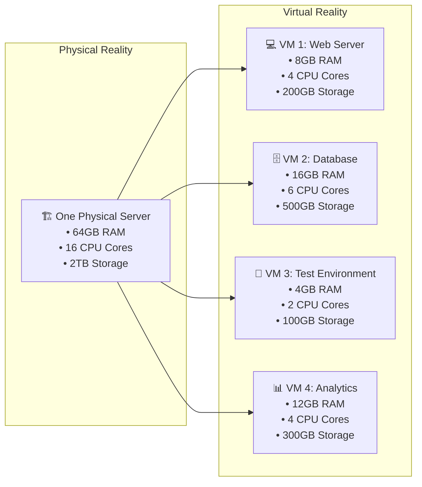
```mermaid
flowchart LR
    subgraph "Physical Reality"
        physical["🏗️ One Physical Server<br/>• 64GB RAM<br/>• 16 CPU Cores<br/>• 2TB Storage"]
    end
    
    subgraph "Virtual Reality"
        vm1["💻 VM 1: Web Server<br/>• 8GB RAM<br/>• 4 CPU Cores<br/>• 200GB Storage"]
        vm2["🗄️ VM 2: Database<br/>• 16GB RAM<br/>• 6 CPU Cores<br/>• 500GB Storage"]
        vm3["🧪 VM 3: Test Environment<br/>• 4GB RAM<br/>• 2 CPU Cores<br/>• 100GB Storage"]
        vm4["📊 VM 4: Analytics<br/>• 12GB RAM<br/>• 4 CPU Cores<br/>• 300GB Storage"]
    end
    
    physical --> vm1
    physical --> vm2
    physical --> vm3
    physical --> vm4
```

* 🌍 **Industry Statistics**: 
  * 📈 **75%** of enterprise workloads are now virtualized
  * 💰 Companies save **40-60%** on hardware costs through virtualization
  * ⚡ **10:1** average server consolidation ratio achieved
* 🚀 **Modern Applications**: Cloud computing, disaster recovery, software testing, legacy application support
* 🎯 **Why Learn This**: Essential foundation for cloud computing, DevOps, and modern IT infrastructure management

🔗 **Resources:**
* [VMware Virtualization Basics](https://www.vmware.com/topics/glossary/content/virtualization.html)
* [Microsoft Virtualization Guide](https://docs.microsoft.com/en-us/virtualization/)
* [Red Hat Virtualization Overview](https://www.redhat.com/en/topics/virtualization)

---

## 📍 Slide 2 – 📚 History of Virtualization (1960s IBM Mainframes → Modern Cloud)

* 🏛️ **1960s - The Beginning**: IBM created the first virtual machines on System/370 mainframes to maximize expensive hardware utilization.
* 🎯 **Original Problem**: Mainframe computers cost millions but were underutilized - often running at only 10-15% capacity.
* 📈 **Historical Timeline**:
  * **1967**: IBM CP-40 - first true hypervisor
  * **1972**: IBM VM/370 - commercial virtual machine system
  * **1980s-1990s**: Virtualization dormant due to cheap x86 hardware
  * **1998**: VMware founded - brings virtualization to x86 architecture
  * **2001**: VMware GSX/ESX launched - server virtualization revolution
  * **2006**: Amazon EC2 launches - cloud computing era begins
  * **2013**: Docker containers - lightweight virtualization mainstream

**Evolution of Virtualization Technology**
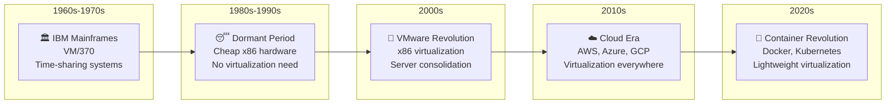
```mermaid
flowchart LR
    subgraph "1960s-1970s"
        mainframe["🏛️ IBM Mainframes<br/>VM/370<br/>Time-sharing systems"]
    end
    
    subgraph "1980s-1990s"
        dormant["😴 Dormant Period<br/>Cheap x86 hardware<br/>No virtualization need"]
    end
    
    subgraph "2000s"
        vmware["🚀 VMware Revolution<br/>x86 virtualization<br/>Server consolidation"]
    end
    
    subgraph "2010s"
        cloud["☁️ Cloud Era<br/>AWS, Azure, GCP<br/>Virtualization everywhere"]
    end
    
    subgraph "2020s"
        containers["🐳 Container Revolution<br/>Docker, Kubernetes<br/>Lightweight virtualization"]
    end
    
    mainframe --> dormant
    dormant --> vmware
    vmware --> cloud
    cloud --> containers
```

* 💡 **Fun Historical Facts**:
  * 🎭 The term "hypervisor" comes from "supervisor" - it supervises other supervisors (operating systems)
  * 💰 IBM's early VM systems allowed them to sell time-sharing services, pioneering the cloud business model
  * 🏆 VMware's founders were Stanford PhD students who figured out how to virtualize "unvirtualizable" x86 processors
  * 🌊 The "cloud" metaphor comes from network diagrams where the internet was drawn as a cloud shape
* 🔄 **Key Paradigm Shifts**:
  * **1960s**: Share expensive mainframes among users
  * **2000s**: Consolidate underutilized x86 servers
  * **2010s**: Elastic, on-demand computing resources
  * **2020s**: Lightweight, container-based microservices

🔗 **Resources:**
* [IBM History of Virtualization](https://www.ibm.com/topics/virtualization/history)
* [VMware Company History](https://www.vmware.com/company/history.html)
* [Computer History Museum - Virtual Machines](https://computerhistory.org/)
* [ACM Digital Library - Virtualization Papers](https://dl.acm.org/)

---

## 📍 Slide 3 – 💡 Core Concepts - Physical vs Virtual Resources

* 🏗️ **Physical Resources** = actual hardware components you can touch - processors, memory chips, hard drives, network cards.
* 👻 **Virtual Resources** = software-created abstractions that mimic physical hardware but exist only in software.
* 🎭 **Abstraction Layer**: Virtualization creates a layer between physical hardware and virtual machines, hiding hardware details from guest operating systems.
* 🧩 **Resource Pooling**: Physical resources are pooled together and dynamically allocated to virtual machines based on demand.
* 🔄 **Independence**: Virtual machines are independent of underlying hardware - can be moved, copied, and restored like files.

**Physical vs Virtual Resource Mapping**
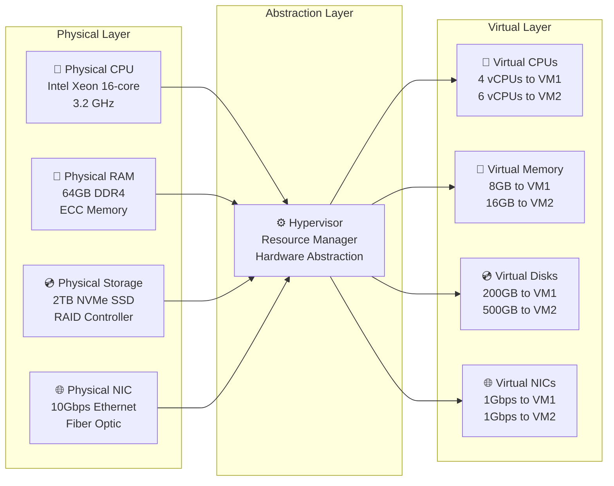
```mermaid
flowchart LR
    subgraph "Physical Layer"
        cpu["🧠 Physical CPU<br/>Intel Xeon 16-core<br/>3.2 GHz"]
        memory["💾 Physical RAM<br/>64GB DDR4<br/>ECC Memory"]
        storage["💿 Physical Storage<br/>2TB NVMe SSD<br/>RAID Controller"]
        network["🌐 Physical NIC<br/>10Gbps Ethernet<br/>Fiber Optic"]
    end
    
    subgraph "Abstraction Layer"
        hypervisor["⚙️ Hypervisor<br/>Resource Manager<br/>Hardware Abstraction"]
    end
    
    subgraph "Virtual Layer"
        vcpu["🧠 Virtual CPUs<br/>4 vCPUs to VM1<br/>6 vCPUs to VM2"]
        vmem["💾 Virtual Memory<br/>8GB to VM1<br/>16GB to VM2"]
        vdisk["💿 Virtual Disks<br/>200GB to VM1<br/>500GB to VM2"]
        vnic["🌐 Virtual NICs<br/>1Gbps to VM1<br/>1Gbps to VM2"]
    end
    
    cpu --> hypervisor
    memory --> hypervisor
    storage --> hypervisor
    network --> hypervisor
    
    hypervisor --> vcpu
    hypervisor --> vmem
    hypervisor --> vdisk
    hypervisor --> vnic
```

* 🔧 **Key Virtualization Concepts**:
  * **🎯 Abstraction**: Hide hardware complexity from virtual machines
  * **🔄 Multiplexing**: Share physical resources among multiple VMs
  * **🏠 Isolation**: Each VM operates independently, protected from others
  * **📦 Encapsulation**: VM state can be saved, copied, and restored
  * **🚚 Portability**: VMs can run on different physical hardware
* 📊 **Resource Allocation Examples**:
  * **CPU**: Physical cores shared among VMs using time-slicing
  * **Memory**: Physical RAM allocated to VMs with memory ballooning
  * **Storage**: Physical disks appear as virtual disk files
  * **Network**: Physical NICs shared through virtual switches
* 🎮 **Gaming Analogy**: Like running multiple games on your computer - each game thinks it has full access to your hardware, but the operating system manages sharing

🔗 **Resources:**
* [Understanding Virtualization Concepts](https://www.redhat.com/en/topics/virtualization/what-is-virtualization)
* [Virtualization Fundamentals](https://docs.microsoft.com/en-us/virtualization/)
* [NIST Definition of Cloud Computing](https://nvlpubs.nist.gov/nistpubs/Legacy/SP/nistspecialpublication800-145.pdf)

---

## 📍 Slide 4 – 🎯 Benefits of Virtualization (Cost, Efficiency, Flexibility)

* 💰 **Cost Reduction**: Massive savings through server consolidation, reduced hardware purchases, and lower operational expenses.
* ⚡ **Improved Efficiency**: Increase hardware utilization from 15% to 80%+, better resource allocation and management.
* 🔄 **Enhanced Flexibility**: Rapid provisioning, easy scaling, and quick response to changing business needs.
* 🛡️ **Better Security**: Isolated environments, easier backup and disaster recovery, and improved compliance.
* 🌱 **Environmental Benefits**: Reduced power consumption, cooling requirements, and data center footprint.

**Virtualization Benefits Breakdown**
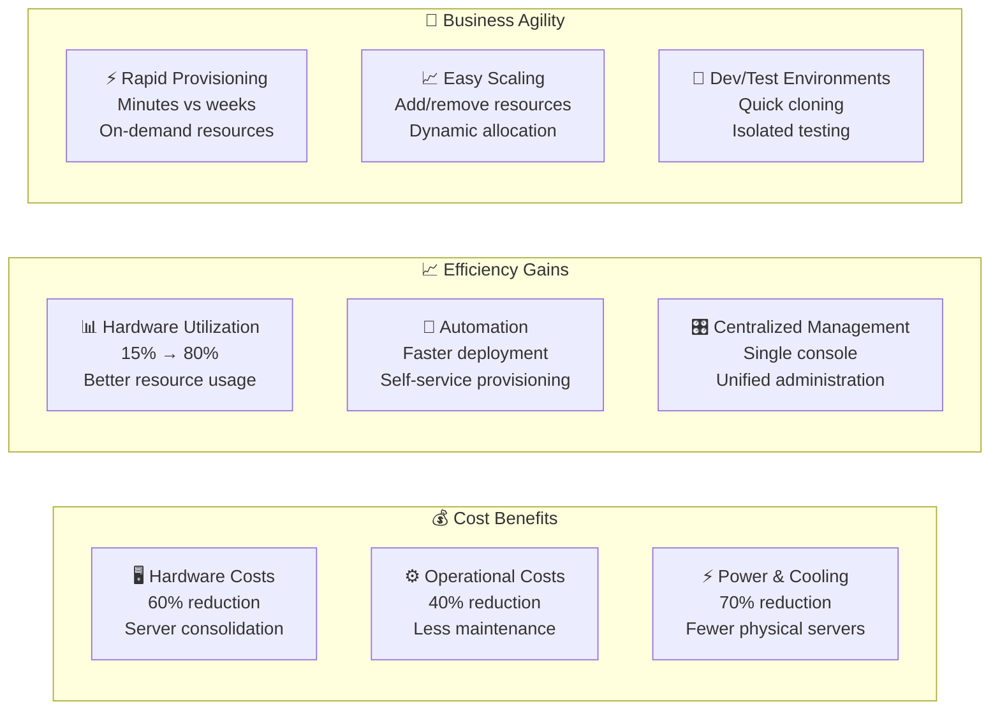
```mermaid
flowchart LR
    subgraph "💰 Cost Benefits"
        hardware_cost["🖥️ Hardware Costs<br/>60% reduction<br/>Server consolidation"]
        operational["⚙️ Operational Costs<br/>40% reduction<br/>Less maintenance"]
        power["⚡ Power & Cooling<br/>70% reduction<br/>Fewer physical servers"]
    end
    
    subgraph "📈 Efficiency Gains"
        utilization["📊 Hardware Utilization<br/>15% → 80%<br/>Better resource usage"]
        automation["🤖 Automation<br/>Faster deployment<br/>Self-service provisioning"]
        management["🎛️ Centralized Management<br/>Single console<br/>Unified administration"]
    end
    
    subgraph "🚀 Business Agility"
        provisioning["⚡ Rapid Provisioning<br/>Minutes vs weeks<br/>On-demand resources"]
        scaling["📈 Easy Scaling<br/>Add/remove resources<br/>Dynamic allocation"]
        testing["🧪 Dev/Test Environments<br/>Quick cloning<br/>Isolated testing"]
    end
```

* 📊 **Real-World Impact Statistics**:
  * 💰 **Total Cost of Ownership**: 50-70% reduction over 3 years
  * ⚡ **Power Consumption**: 80% less electricity usage
  * 🏗️ **Data Center Space**: 75% reduction in rack space needed
  * ⏱️ **Deployment Time**: From weeks to minutes for new servers
  * 🔄 **Hardware Refresh Cycles**: Extended from 3-4 years to 5-7 years
* 🎯 **Strategic Business Benefits**:
  * **🚀 Faster Time-to-Market**: Rapid application deployment
  * **🔄 Business Continuity**: Better disaster recovery capabilities
  * **📊 Improved SLAs**: Higher availability through redundancy
  * **🌍 Global Reach**: Easy replication across geographic locations
  * **🧪 Innovation Enablement**: Lower-cost experimentation and development

**Before vs After Virtualization**
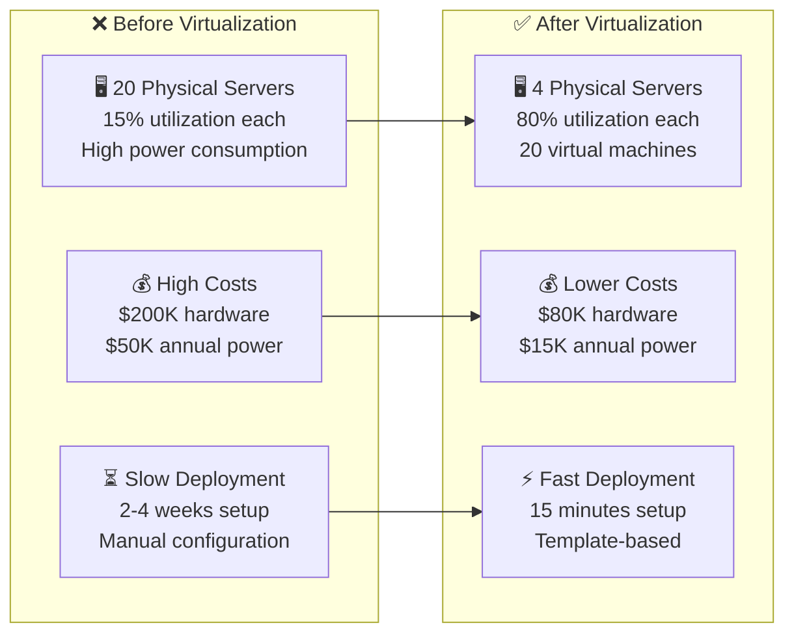
```mermaid
flowchart LR
    subgraph "❌ Before Virtualization"
        before_servers["🖥️ 20 Physical Servers<br/>15% utilization each<br/>High power consumption"]
        before_cost["💰 High Costs<br/>$200K hardware<br/>$50K annual power"]
        before_time["⏳ Slow Deployment<br/>2-4 weeks setup<br/>Manual configuration"]
    end
    
    subgraph "✅ After Virtualization"
        after_servers["🖥️ 4 Physical Servers<br/>80% utilization each<br/>20 virtual machines"]
        after_cost["💰 Lower Costs<br/>$80K hardware<br/>$15K annual power"]
        after_time["⚡ Fast Deployment<br/>15 minutes setup<br/>Template-based"]
    end
    
    before_servers --> after_servers
    before_cost --> after_cost
    before_time --> after_time
```

* ⚠️ **Important Considerations**:
  * 🔒 **Security**: Proper isolation and access controls essential
  * 📈 **Performance**: Some overhead compared to bare metal
  * 🧠 **Complexity**: Requires specialized skills and management tools
  * 💾 **Resource Contention**: Over-allocation can cause performance issues
  * 🔄 **Vendor Lock-in**: Dependency on hypervisor technology

🔗 **Resources:**
* [VMware ROI Calculator](https://www.vmware.com/products/vsphere/roi-calculator.html)
* [Gartner Virtualization Market Analysis](https://www.gartner.com/en/information-technology/insights/virtualization)
* [IDC Virtualization Economic Impact Study](https://www.idc.com/)

---

## 📍 Slide 5 – ⚠️ Challenges & Limitations of Virtualization

* 🐌 **Performance Overhead**: Hypervisor layer introduces 5-15% performance penalty compared to bare metal systems.
* 🧩 **Complexity Increase**: More layers mean more things that can go wrong - hypervisors, virtual networks, shared storage systems.
* 💰 **Licensing Costs**: Software licensing can become complex and expensive with per-core or per-socket models.
* 🔒 **Security Risks**: New attack vectors like VM escape, hypervisor vulnerabilities, and inter-VM attacks.
* 👨‍💻 **Skills Gap**: Requires specialized knowledge - traditional sysadmins need retraining on virtualization technologies.

**Common Virtualization Challenges**
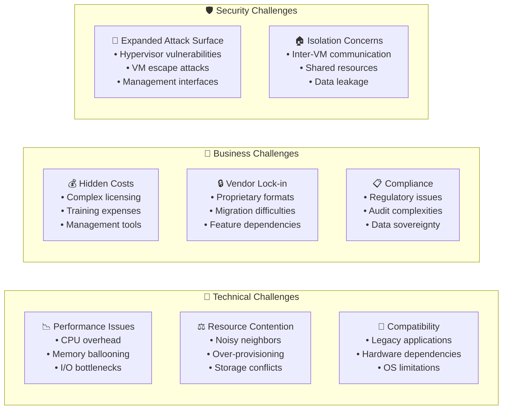
```mermaid
flowchart LR
    subgraph "🚫 Technical Challenges"
        performance["📉 Performance Issues<br/>• CPU overhead<br/>• Memory ballooning<br/>• I/O bottlenecks"]
        resource["⚖️ Resource Contention<br/>• Noisy neighbors<br/>• Over-provisioning<br/>• Storage conflicts"]
        compatibility["🔧 Compatibility<br/>• Legacy applications<br/>• Hardware dependencies<br/>• OS limitations"]
    end
    
    subgraph "💼 Business Challenges"
        cost["💰 Hidden Costs<br/>• Complex licensing<br/>• Training expenses<br/>• Management tools"]
        vendor_lock["🔒 Vendor Lock-in<br/>• Proprietary formats<br/>• Migration difficulties<br/>• Feature dependencies"]
        compliance["📋 Compliance<br/>• Regulatory issues<br/>• Audit complexities<br/>• Data sovereignty"]
    end
    
    subgraph "🛡️ Security Challenges"
        attack_surface["🎯 Expanded Attack Surface<br/>• Hypervisor vulnerabilities<br/>• VM escape attacks<br/>• Management interfaces"]
        isolation["🏠 Isolation Concerns<br/>• Inter-VM communication<br/>• Shared resources<br/>• Data leakage"]
    end
```

* 💔 **Real-World Virtualization Disasters**:
  * **🔥 The Great VM Sprawl of 2008**: Company deployed 500+ VMs, lost track, 60% were zombie VMs consuming resources
  * **💥 Storage Apocalypse**: Bank's shared storage failed, took down 200 VMs simultaneously - no isolation!
  * **🐛 The Hypervisor Bug**: Critical hypervisor vulnerability affected 70% of data centers worldwide in 2018
  * **⚡ Power Play Gone Wrong**: Data center power failure caused VM corruption due to improper storage configuration
* 📊 **Performance Impact Examples**:
  * **Database Workloads**: 10-20% performance penalty typical
  * **High I/O Applications**: Up to 30% slower on virtualized storage
  * **Real-time Systems**: Jitter and latency issues with hypervisor scheduling
  * **Graphics-Intensive Apps**: Limited GPU virtualization options until recently

**Virtualization Failure Points**
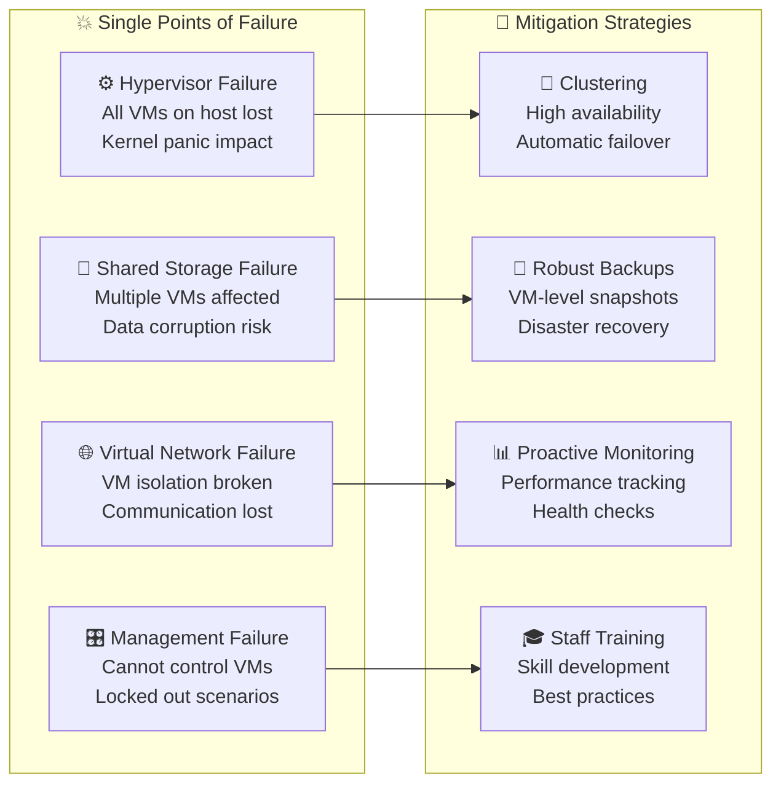
```mermaid
flowchart LR
    subgraph "💥 Single Points of Failure"
        hypervisor_fail["⚙️ Hypervisor Failure<br/>All VMs on host lost<br/>Kernel panic impact"]
        storage_fail["💾 Shared Storage Failure<br/>Multiple VMs affected<br/>Data corruption risk"]
        network_fail["🌐 Virtual Network Failure<br/>VM isolation broken<br/>Communication lost"]
        management_fail["🎛️ Management Failure<br/>Cannot control VMs<br/>Locked out scenarios"]
    end
    
    subgraph "🔧 Mitigation Strategies"
        clustering["🔄 Clustering<br/>High availability<br/>Automatic failover"]
        backup["💾 Robust Backups<br/>VM-level snapshots<br/>Disaster recovery"]
        monitoring["📊 Proactive Monitoring<br/>Performance tracking<br/>Health checks"]
        training["🎓 Staff Training<br/>Skill development<br/>Best practices"]
    end
    
    hypervisor_fail --> clustering
    storage_fail --> backup
    network_fail --> monitoring
    management_fail --> training
```

* 🎯 **When NOT to Virtualize**:
  * **🎮 High-Performance Computing**: CPU-intensive scientific applications
  * **⚡ Real-time Systems**: Industrial control systems requiring deterministic responses
  * **🛡️ Ultra-secure Applications**: Systems requiring hardware-based security modules
  * **📊 I/O Intensive Databases**: Applications requiring maximum storage performance
  * **🎨 Graphics Workstations**: CAD/CAM applications requiring dedicated GPU access
* 🔄 **Modern Solutions**:
  * **Container Technology**: Lightweight alternative for many use cases
  * **Hybrid Approaches**: Mix of physical, virtual, and containerized workloads
  * **Cloud-Native Design**: Applications built specifically for virtualized environments
  * **Performance Optimization**: Hardware-assisted virtualization (Intel VT-x, AMD-V)

---

### 🎭 **Interactive Break: "Virtualization Horror Stories"**

**👻 Share Your Virtualization Nightmares!**

*Time for some fun! Let's hear about virtualization disasters - either ones you've experienced or funny stories you've heard. Here are some conversation starters:*

* 😱 **"The VM that Ate Everything"**: Ever seen a VM consume all available resources?
* 🔥 **"Oops, I Deleted Production"**: Accidentally deleted the wrong VM template?
* 🐛 **"The Mystery of the Slow Database"**: Spent days troubleshooting only to find it was a virtualization issue?
* 🌪️ **"VM Sprawl Tornado"**: Discovered hundreds of forgotten VMs running in your environment?

**🎯 Discussion Questions:**
1. What's the most expensive virtualization mistake you've heard about?
2. Which sounds scarier: hardware failure or hypervisor failure? Why?
3. If you were CTO, what's your biggest concern about going "all virtual"?

*Remember: We learn more from failures than successes! These stories help us avoid the same mistakes.* 😄

---

🔗 **Resources:**
* [Virtualization Security Best Practices](https://www.nist.gov/publications/guide-security-full-virtualization-technologies)
* [Common Virtualization Mistakes](https://www.vmware.com/content/dam/digitalmarketing/vmware/en/pdf/whitepaper/virtualization-best-practices-wp.pdf)
* [Gartner Magic Quadrant for x86 Server Virtualization](https://www.gartner.com/en/documents/3989774)
* [Performance Tuning Guide](https://docs.vmware.com/en/VMware-vSphere/index.html)

---

## 📍 Slide 6 – 🧠 Hypervisor Fundamentals - The Virtual Machine Monitor

* 🎭 **Hypervisor** = Virtual Machine Monitor (VMM), the software layer that creates and manages virtual machines by controlling access to physical hardware.
* 🏗️ **Core Function**: Acts as a "traffic controller" between virtual machines and physical hardware, ensuring each VM gets its fair share of resources.
* 🛡️ **Isolation Provider**: Creates secure boundaries between VMs so they cannot interfere with each other or access each other's data.
* ⚙️ **Resource Manager**: Dynamically allocates CPU, memory, storage, and network resources among running virtual machines.
* 🎯 **Hardware Abstraction**: Presents a standardized "virtual hardware" interface to guest operating systems, hiding physical hardware details.

**Hypervisor Architecture Overview**
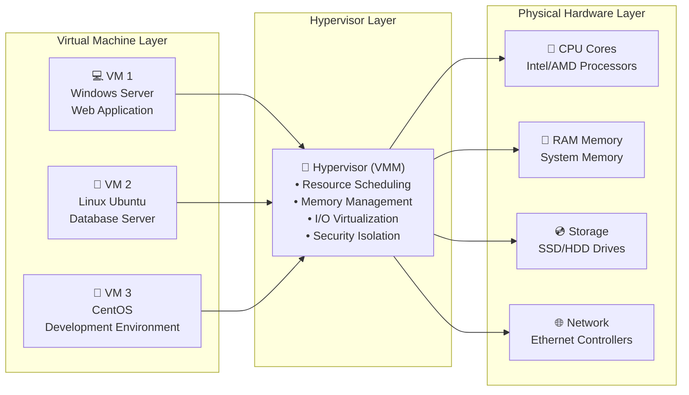
```mermaid
flowchart LR
    subgraph "Virtual Machine Layer"
        vm1["💻 VM 1<br/>Windows Server<br/>Web Application"]
        vm2["🐧 VM 2<br/>Linux Ubuntu<br/>Database Server"]
        vm3["🎯 VM 3<br/>CentOS<br/>Development Environment"]
    end
    
    subgraph "Hypervisor Layer"
        hypervisor["🧠 Hypervisor (VMM)<br/>• Resource Scheduling<br/>• Memory Management<br/>• I/O Virtualization<br/>• Security Isolation"]
    end
    
    subgraph "Physical Hardware Layer"
        cpu["🧠 CPU Cores<br/>Intel/AMD Processors"]
        memory["💾 RAM Memory<br/>System Memory"]
        storage["💿 Storage<br/>SSD/HDD Drives"]
        network["🌐 Network<br/>Ethernet Controllers"]
    end
    
    vm1 --> hypervisor
    vm2 --> hypervisor
    vm3 --> hypervisor
    
    hypervisor --> cpu
    hypervisor --> memory
    hypervisor --> storage
    hypervisor --> network
```

* 🔧 **Key Hypervisor Responsibilities**:
  * **📊 CPU Virtualization**: Time-slice physical cores among VMs, handle instruction translation
  * **💾 Memory Virtualization**: Manage virtual-to-physical memory mapping, prevent memory conflicts
  * **💿 Storage Virtualization**: Present virtual disks to VMs, manage actual storage allocation
  * **🌐 Network Virtualization**: Create virtual switches and network interfaces for VM communication
  * **🎛️ Device Emulation**: Provide virtual devices (graphics, sound, USB) that VMs can use
* 🎮 **Gaming Console Analogy**: Like a gaming console that runs multiple games - each game thinks it has full access to the console, but the system manages sharing the hardware
* 🏆 **Industry Standards**: Most hypervisors follow similar principles but implement them differently (VMware vSphere, Microsoft Hyper-V, Citrix Xen)
* 🔍 **Hardware Requirements**: Modern CPUs include virtualization extensions (Intel VT-x, AMD-V) to make hypervisors more efficient

🔗 **Resources:**
* [Intel Virtualization Technology](https://www.intel.com/content/www/us/en/virtualization/virtualization-technology/intel-virtualization-technology.html)
* [AMD Virtualization](https://www.amd.com/en/technologies/virtualization)
* [Hypervisor Comparison Guide](https://www.vmware.com/topics/glossary/content/hypervisor.html)

---

## 📍 Slide 7 – 🏗️ Type 1 Hypervisors (Bare Metal) - VMware ESXi, Hyper-V, Xen

* 🏗️ **Type 1 Hypervisor** = "Bare Metal" hypervisor that runs directly on physical hardware without needing a host operating system.
* ⚡ **Performance Advantage**: Direct hardware access provides better performance and lower overhead compared to Type 2 hypervisors.
* 🏢 **Enterprise Focus**: Designed for data centers and production environments where performance, reliability, and scalability are critical.
* 🛡️ **Enhanced Security**: Smaller attack surface since there's no underlying operating system that could be compromised.
* 💰 **Higher Cost**: Typically requires enterprise licensing but provides advanced features like live migration and clustering.

**Type 1 Hypervisor Architecture**
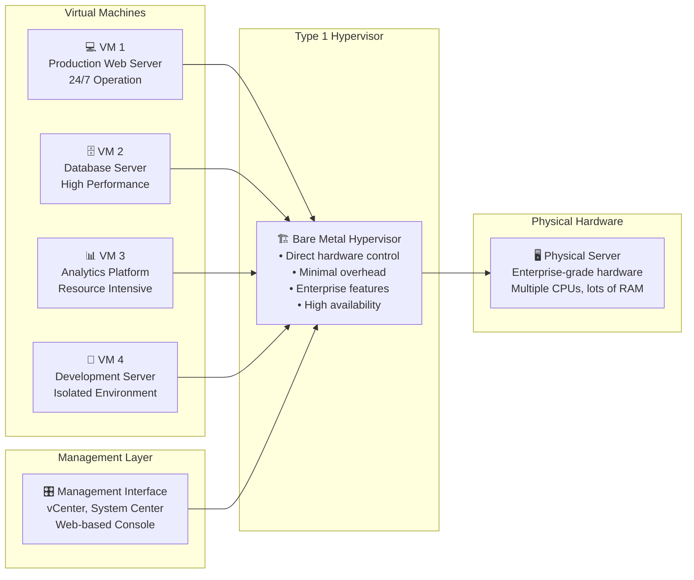
```mermaid
flowchart LR
    subgraph "Virtual Machines"
        vm1["💻 VM 1<br/>Production Web Server<br/>24/7 Operation"]
        vm2["🗄️ VM 2<br/>Database Server<br/>High Performance"]
        vm3["📊 VM 3<br/>Analytics Platform<br/>Resource Intensive"]
        vm4["🧪 VM 4<br/>Development Server<br/>Isolated Environment"]
    end
    
    subgraph "Management Layer"
        management["🎛️ Management Interface<br/>vCenter, System Center<br/>Web-based Console"]
    end
    
    subgraph "Type 1 Hypervisor"
        hypervisor["🏗️ Bare Metal Hypervisor<br/>• Direct hardware control<br/>• Minimal overhead<br/>• Enterprise features<br/>• High availability"]
    end
    
    subgraph "Physical Hardware"
        server["🖥️ Physical Server<br/>Enterprise-grade hardware<br/>Multiple CPUs, lots of RAM"]
    end
    
    vm1 --> hypervisor
    vm2 --> hypervisor
    vm3 --> hypervisor
    vm4 --> hypervisor
    
    management --> hypervisor
    hypervisor --> server
```

* 🏆 **Major Type 1 Hypervisors**:
  * **🚀 VMware vSphere ESXi**: Market leader, advanced features, enterprise-focused
    * 📊 **Market Share**: ~75% of enterprise virtualization
    * 🎯 **Strengths**: Mature ecosystem, excellent tools, high performance
    * 💰 **Licensing**: Per-processor, expensive but feature-rich
  * **🔷 Microsoft Hyper-V**: Integrated with Windows Server, cost-effective
    * 🏢 **Integration**: Deep Windows ecosystem integration
    * 💰 **Cost**: Included with Windows Server license
    * 🎯 **Target**: Windows-centric organizations
  * **🦎 Citrix XenServer/XCP-ng**: Open-source option, high performance
    * 🆓 **Open Source**: XCP-ng is free, community-supported
    * ⚡ **Performance**: Excellent for Linux workloads
    * 🎯 **Use Case**: Cost-conscious organizations, Linux-heavy environments

**Type 1 Hypervisor Comparison**
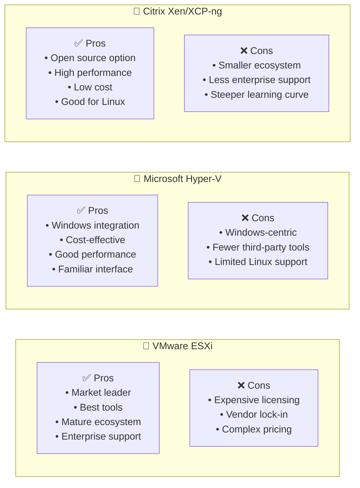
```mermaid
flowchart LR
    subgraph "🚀 VMware ESXi"
        vmware_pros["✅ Pros<br/>• Market leader<br/>• Best tools<br/>• Mature ecosystem<br/>• Enterprise support"]
        vmware_cons["❌ Cons<br/>• Expensive licensing<br/>• Vendor lock-in<br/>• Complex pricing"]
    end
    
    subgraph "🔷 Microsoft Hyper-V"
        hyperv_pros["✅ Pros<br/>• Windows integration<br/>• Cost-effective<br/>• Good performance<br/>• Familiar interface"]
        hyperv_cons["❌ Cons<br/>• Windows-centric<br/>• Fewer third-party tools<br/>• Limited Linux support"]
    end
    
    subgraph "🦎 Citrix Xen/XCP-ng"
        xen_pros["✅ Pros<br/>• Open source option<br/>• High performance<br/>• Low cost<br/>• Good for Linux"]
        xen_cons["❌ Cons<br/>• Smaller ecosystem<br/>• Less enterprise support<br/>• Steeper learning curve"]
    end
```

* 🎯 **When to Choose Type 1**:
  * **🏢 Production Environments**: Mission-critical applications requiring high availability
  * **📈 High Performance Needs**: Applications that cannot tolerate hypervisor overhead
  * **🔄 Large Scale Deployments**: Data centers with hundreds or thousands of VMs
  * **💼 Enterprise Requirements**: Need for advanced features like live migration, clustering
* 📊 **Typical Use Cases**:
  * **Cloud Service Providers**: AWS, Azure, Google Cloud use custom Type 1 hypervisors
  * **Enterprise Data Centers**: Large corporations running business-critical applications
  * **Hosting Providers**: Companies offering virtual private servers (VPS)
  * **High-Performance Computing**: Scientific computing clusters with virtualization needs

🔗 **Resources:**
* [VMware vSphere Documentation](https://docs.vmware.com/en/VMware-vSphere/index.html)
* [Microsoft Hyper-V Guide](https://docs.microsoft.com/en-us/windows-server/virtualization/hyper-v/)
* [XCP-ng Open Source Hypervisor](https://xcp-ng.org/)
* [Gartner Magic Quadrant x86 Server Virtualization](https://www.gartner.com/en/documents/3989774)

---

## 📍 Slide 8 – 🖥️ Type 2 Hypervisors (Hosted) - VirtualBox, VMware Workstation

* 🖥️ **Type 2 Hypervisor** = "Hosted" hypervisor that runs on top of a traditional operating system (Windows, macOS, Linux).
* 🏠 **Desktop Focused**: Designed for individual users, developers, and small-scale testing rather than enterprise production.
* 💡 **Easy to Use**: Simple installation and management - just install like any other application on your computer.
* 💰 **Cost Effective**: Many options are free or low-cost, making them perfect for learning and development.
* 🎯 **Flexibility**: Can run alongside regular desktop applications, making them ideal for development and testing.

**Type 2 Hypervisor Architecture**
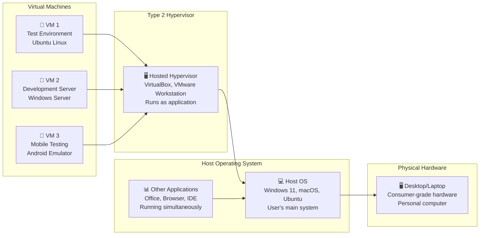
```mermaid
flowchart LR
    subgraph "Virtual Machines"
        vm1["🧪 VM 1<br/>Test Environment<br/>Ubuntu Linux"]
        vm2["🎯 VM 2<br/>Development Server<br/>Windows Server"]
        vm3["📱 VM 3<br/>Mobile Testing<br/>Android Emulator"]
    end
    
    subgraph "Type 2 Hypervisor"
        hypervisor["🖥️ Hosted Hypervisor<br/>VirtualBox, VMware Workstation<br/>Runs as application"]
    end
    
    subgraph "Host Operating System"
        host_os["💻 Host OS<br/>Windows 11, macOS, Ubuntu<br/>User's main system"]
        other_apps["📊 Other Applications<br/>Office, Browser, IDE<br/>Running simultaneously"]
    end
    
    subgraph "Physical Hardware"
        hardware["🖥️ Desktop/Laptop<br/>Consumer-grade hardware<br/>Personal computer"]
    end
    
    vm1 --> hypervisor
    vm2 --> hypervisor
    vm3 --> hypervisor
    
    hypervisor --> host_os
    other_apps --> host_os
    
    host_os --> hardware
```

* 🏆 **Popular Type 2 Hypervisors**:
  * **📦 Oracle VirtualBox**: Free, cross-platform, perfect for learning
    * 🆓 **Cost**: Completely free, open-source
    * 🌍 **Platform Support**: Windows, macOS, Linux, Solaris
    * 🎯 **Best For**: Students, developers, home users
    * 🔧 **Features**: Easy snapshots, shared folders, guest additions
  * **⚡ VMware Workstation Pro**: Professional features, excellent performance
    * 💰 **Cost**: ~$250, commercial license
    * 🚀 **Performance**: Better than VirtualBox for demanding workloads
    * 🛠️ **Advanced Features**: Multiple snapshots, cloning, team collaboration
    * 🎯 **Best For**: Professional developers, IT professionals
  * **🍎 Parallels Desktop**: macOS-focused, seamless integration
    * 🍎 **Platform**: macOS only, optimized for Mac hardware
    * 🎨 **User Experience**: Excellent Mac integration, "Coherence" mode
    * 💰 **Cost**: ~$100/year subscription model
    * 🎯 **Best For**: Mac users running Windows applications

**Type 2 Hypervisor Feature Comparison**
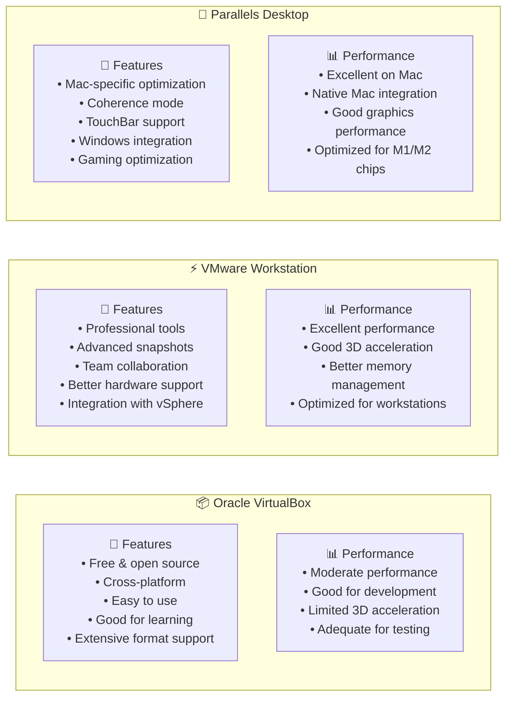
```mermaid
flowchart LR
    subgraph "📦 Oracle VirtualBox"
        vbox_features["🔧 Features<br/>• Free & open source<br/>• Cross-platform<br/>• Easy to use<br/>• Good for learning<br/>• Extensive format support"]
        vbox_performance["📊 Performance<br/>• Moderate performance<br/>• Good for development<br/>• Limited 3D acceleration<br/>• Adequate for testing"]
    end
    
    subgraph "⚡ VMware Workstation"
        vmware_features["🔧 Features<br/>• Professional tools<br/>• Advanced snapshots<br/>• Team collaboration<br/>• Better hardware support<br/>• Integration with vSphere"]
        vmware_performance["📊 Performance<br/>• Excellent performance<br/>• Good 3D acceleration<br/>• Better memory management<br/>• Optimized for workstations"]
    end
    
    subgraph "🍎 Parallels Desktop"
        parallels_features["🔧 Features<br/>• Mac-specific optimization<br/>• Coherence mode<br/>• TouchBar support<br/>• Windows integration<br/>• Gaming optimization"]
        parallels_performance["📊 Performance<br/>• Excellent on Mac<br/>• Native Mac integration<br/>• Good graphics performance<br/>• Optimized for M1/M2 chips"]
    end
```

* 🎯 **Common Use Cases for Type 2**:
  * **👨‍💻 Software Development**: Test applications on different operating systems
  * **🧪 Learning & Training**: Experiment with new operating systems safely
  * **🔒 Security Testing**: Isolated environment for testing suspicious software
  * **🏢 Legacy Applications**: Run old software that requires specific OS versions
  * **🎮 Gaming**: Run Windows games on Mac or Linux systems
  * **📚 Education**: Students learning system administration or cybersecurity
* ⚠️ **Limitations to Consider**:
  * **📉 Performance Overhead**: Host OS consumes resources, reducing VM performance
  * **🔧 Hardware Compatibility**: Limited access to specialized hardware
  * **📊 Scalability**: Not suitable for running many VMs simultaneously
  * **🛡️ Security**: Host OS vulnerabilities can affect all VMs

**Development Workflow Example**
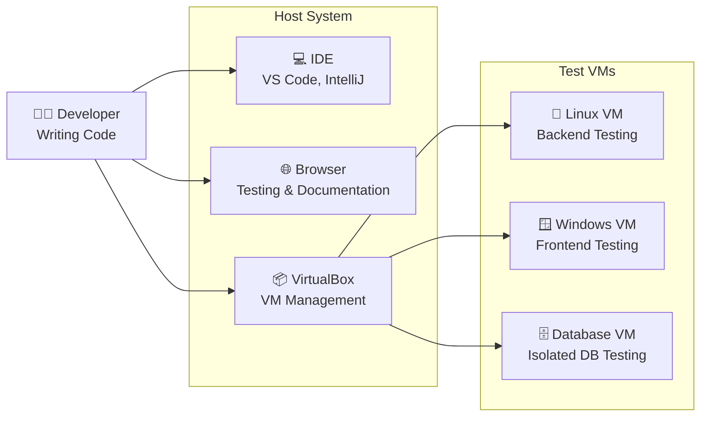
```mermaid
flowchart LR
    developer["👨‍💻 Developer<br/>Writing Code"]
    
    subgraph "Host System"
        ide["💻 IDE<br/>VS Code, IntelliJ"]
        browser["🌐 Browser<br/>Testing & Documentation"]
        vm_manager["📦 VirtualBox<br/>VM Management"]
    end
    
    subgraph "Test VMs"
        linux_vm["🐧 Linux VM<br/>Backend Testing"]
        windows_vm["🪟 Windows VM<br/>Frontend Testing"]
        db_vm["🗄️ Database VM<br/>Isolated DB Testing"]
    end
    
    developer --> ide
    developer --> browser
    developer --> vm_manager
    
    vm_manager --> linux_vm
    vm_manager --> windows_vm
    vm_manager --> db_vm
```

🔗 **Resources:**
* [Oracle VirtualBox Documentation](https://www.virtualbox.org/wiki/Documentation)
* [VMware Workstation User Guide](https://docs.vmware.com/en/VMware-Workstation-Pro/)
* [Parallels Desktop Support](https://www.parallels.com/products/desktop/)
* [Type 2 Hypervisor Comparison](https://www.vmware.com/topics/glossary/content/hypervisor.html)

---

## 📍 Slide 9 – ⚖️ Type 1 vs Type 2 Comparison & Use Cases

* 🏗️ **Architecture Difference**: Type 1 runs directly on hardware (bare metal), Type 2 runs on top of existing operating system.
* ⚡ **Performance Gap**: Type 1 provides better performance due to direct hardware access, Type 2 has overhead from host OS.
* 💰 **Cost Consideration**: Type 1 typically expensive enterprise solutions, Type 2 ranges from free to moderate cost.
* 🎯 **Target Audience**: Type 1 for enterprises and data centers, Type 2 for developers and desktop users.
* 🔧 **Complexity Level**: Type 1 requires dedicated hardware and expertise, Type 2 easy to install and manage.

**Direct Architecture Comparison**
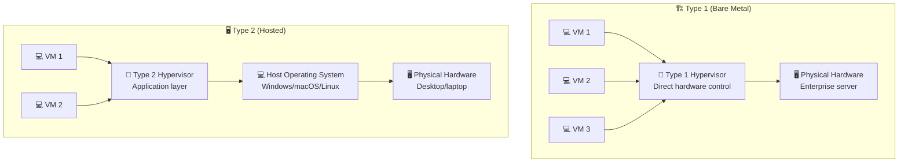
```mermaid
flowchart TD
    subgraph "🏗️ Type 1 (Bare Metal)"
        t1_vm1["💻 VM 1"]
        t1_vm2["💻 VM 2"]
        t1_vm3["💻 VM 3"]
        t1_hypervisor["🧠 Type 1 Hypervisor<br/>Direct hardware control"]
        t1_hardware["🖥️ Physical Hardware<br/>Enterprise server"]
        
        t1_vm1 --> t1_hypervisor
        t1_vm2 --> t1_hypervisor
        t1_vm3 --> t1_hypervisor
        t1_hypervisor --> t1_hardware
    end
    
    subgraph "🖥️ Type 2 (Hosted)"
        t2_vm1["💻 VM 1"]
        t2_vm2["💻 VM 2"]
        t2_hypervisor["🧠 Type 2 Hypervisor<br/>Application layer"]
        t2_hostos["💻 Host Operating System<br/>Windows/macOS/Linux"]
        t2_hardware["🖥️ Physical Hardware<br/>Desktop/laptop"]
        
        t2_vm1 --> t2_hypervisor
        t2_vm2 --> t2_hypervisor
        t2_hypervisor --> t2_hostos
        t2_hostos --> t2_hardware
    end
```

* 📊 **Detailed Comparison Matrix**:

| **Aspect** | **🏗️ Type 1 (Bare Metal)** | **🖥️ Type 2 (Hosted)** |
|------------|---------------------------|------------------------|
| **Performance** | ⚡ Excellent (5-10% overhead) | 📉 Good (15-25% overhead) |
| **Cost** | 💰 High ($1000s) | 💰 Low to Medium ($0-$300) |
| **Complexity** | 🔧 High (requires expertise) | 🔧 Low (easy install) |
| **Scalability** | 📈 Excellent (1000s of VMs) | 📉 Limited (5-10 VMs) |
| **Management** | 🎛️ Enterprise tools required | 🎛️ Simple GUI interface |
| **Hardware** | 🖥️ Dedicated server required | 🖥️ Existing desktop/laptop |
| **Reliability** | 🛡️ Enterprise-grade | 🛡️ Dependent on host OS |
| **Features** | 🚀 Advanced (HA, migration) | 🚀 Basic to moderate |

* 🎯 **Use Case Decision Tree**:

**When to Choose Type 1:**
- 🏢 **Production Environments**: Running business-critical applications 24/7
- 📈 **High Performance Requirements**: Database servers, web applications with heavy load
- 🔄 **Large Scale**: Need to run dozens or hundreds of VMs
- 💼 **Enterprise Features**: Require high availability, live migration, clustering
- 🛡️ **Maximum Security**: Need isolation and minimal attack surface
- 💰 **Budget Available**: Can afford enterprise licensing and dedicated hardware

**When to Choose Type 2:**
- 👨‍💻 **Development & Testing**: Creating and testing applications locally
- 🧪 **Learning Environment**: Students or professionals learning new technologies
- 🏠 **Desktop Use**: Running different OS on personal computer
- 💡 **Proof of Concept**: Quick testing of ideas or configurations
- 💰 **Budget Constrained**: Need cost-effective virtualization solution
- 🔧 **Simple Requirements**: Don't need advanced enterprise features

**Real-World Scenario Examples**
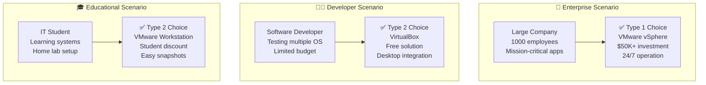
```mermaid
flowchart TD
    subgraph "🏢 Enterprise Scenario"
        enterprise["Large Company<br/>1000 employees<br/>Mission-critical apps"]
        enterprise_choice["✅ Type 1 Choice<br/>VMware vSphere<br/>$50K+ investment<br/>24/7 operation"]
        enterprise --> enterprise_choice
    end
    
    subgraph "👨‍💻 Developer Scenario"
        developer["Software Developer<br/>Testing multiple OS<br/>Limited budget"]
        developer_choice["✅ Type 2 Choice<br/>VirtualBox<br/>Free solution<br/>Desktop integration"]
        developer --> developer_choice
    end
    
    subgraph "🎓 Educational Scenario"
        student["IT Student<br/>Learning systems<br/>Home lab setup"]
        student_choice["✅ Type 2 Choice<br/>VMware Workstation<br/>Student discount<br/>Easy snapshots"]
        student --> student_choice
    end
```

* 🔄 **Hybrid Approaches**:
  * **📊 Development Pipeline**: Type 2 for development, Type 1 for testing/production
  * **🏢 Mixed Environment**: Type 1 for servers, Type 2 for desktop virtualization
  * **🌊 Cloud Integration**: Local Type 2 development, cloud Type 1 deployment
  * **📱 Container Hybrid**: Containers on Type 1 hypervisors for best of both worlds
* 🎯 **Migration Paths**:
  * **📈 Growth Path**: Start with Type 2 for learning, migrate to Type 1 for production
  * **🔄 P2V (Physical-to-Virtual)**: Convert physical servers to Type 1 VMs
  * **☁️ Cloud Migration**: Move Type 1 VMs to cloud platforms (AWS, Azure)
  * **🐳 Containerization**: Migrate VMs to container platforms for modern architectures

🔗 **Resources:**
* [VMware Type 1 vs Type 2 Comparison](https://www.vmware.com/topics/glossary/content/hypervisor.html)
* [Hypervisor Selection Guide](https://www.redhat.com/en/topics/virtualization/what-is-a-hypervisor)
* [Enterprise Virtualization Best Practices](https://docs.vmware.com/en/VMware-vSphere/7.0/com.vmware.vsphere.bestpractices.doc/GUID-E7EEF9A8-5154-4A5F-A50C-6B73C3BB7B2F.html)

---

## 📍 Slide 10 – 🔍 Hypervisor Architecture Deep Dive

* 🧠 **CPU Virtualization**: How hypervisors handle processor instruction translation and scheduling among multiple virtual machines.
* 💾 **Memory Management**: Advanced techniques like memory ballooning, transparent page sharing, and memory overcommitment.
* 🎛️ **I/O Virtualization**: How hypervisors manage storage and network access for multiple VMs efficiently.
* 🔒 **Security Isolation**: Hardware and software mechanisms that ensure VMs cannot interfere with each other.
* ⚙️ **Hardware Assistance**: Modern CPU features (Intel VT-x, AMD-V) that make virtualization more efficient.

**Complete Hypervisor Architecture Stack**
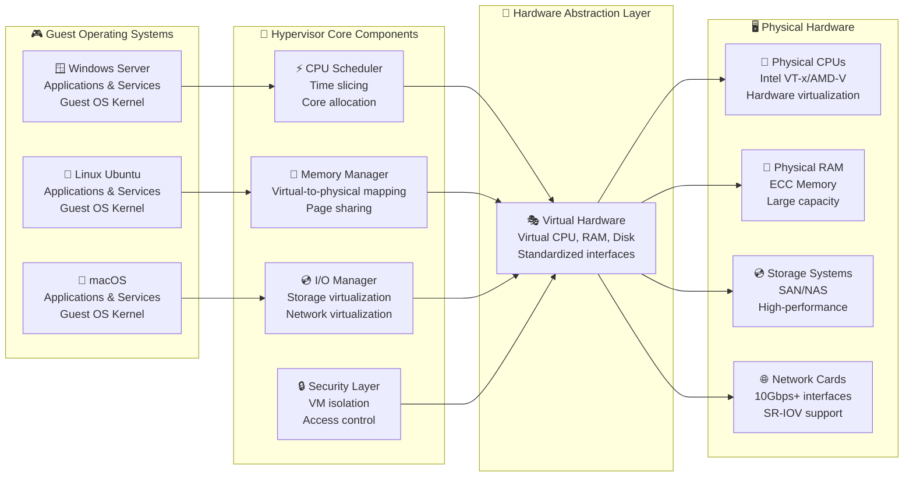
```mermaid
flowchart LR
    subgraph "🎮 Guest Operating Systems"
        guest_os1["🪟 Windows Server<br/>Applications & Services<br/>Guest OS Kernel"]
        guest_os2["🐧 Linux Ubuntu<br/>Applications & Services<br/>Guest OS Kernel"]
        guest_os3["🍎 macOS<br/>Applications & Services<br/>Guest OS Kernel"]
    end
    
    subgraph "🧠 Hypervisor Core Components"
        cpu_scheduler["⚡ CPU Scheduler<br/>Time slicing<br/>Core allocation"]
        memory_manager["💾 Memory Manager<br/>Virtual-to-physical mapping<br/>Page sharing"]
        io_manager["💿 I/O Manager<br/>Storage virtualization<br/>Network virtualization"]
        security_layer["🔒 Security Layer<br/>VM isolation<br/>Access control"]
    end
    
    subgraph "🔧 Hardware Abstraction Layer"
        virtual_hardware["🎭 Virtual Hardware<br/>Virtual CPU, RAM, Disk<br/>Standardized interfaces"]
    end
    
    subgraph "🖥️ Physical Hardware"
        cpu_hw["🧠 Physical CPUs<br/>Intel VT-x/AMD-V<br/>Hardware virtualization"]
        memory_hw["💾 Physical RAM<br/>ECC Memory<br/>Large capacity"]
        storage_hw["💿 Storage Systems<br/>SAN/NAS<br/>High-performance"]
        network_hw["🌐 Network Cards<br/>10Gbps+ interfaces<br/>SR-IOV support"]
    end
    
    guest_os1 --> cpu_scheduler
    guest_os2 --> memory_manager
    guest_os3 --> io_manager
    
    cpu_scheduler --> virtual_hardware
    memory_manager --> virtual_hardware
    io_manager --> virtual_hardware
    security_layer --> virtual_hardware
    
    virtual_hardware --> cpu_hw
    virtual_hardware --> memory_hw
    virtual_hardware --> storage_hw
    virtual_hardware --> network_hw
```

* ⚡ **CPU Virtualization Deep Dive**:
  * **🎯 Ring Compression**: Guest OS runs in non-privileged mode, hypervisor intercepts privileged instructions
  * **🔄 Binary Translation**: Convert x86 instructions on-the-fly for compatibility
  * **🚀 Hardware Acceleration**: Intel VT-x and AMD-V provide direct execution support
  * **📊 CPU Scheduling**: Fair-share scheduling ensures each VM gets appropriate CPU time
  * **🧮 NUMA Awareness**: Optimize memory access on multi-socket systems
* 💾 **Advanced Memory Management**:
  * **🎈 Memory Ballooning**: Dynamically reclaim unused memory from VMs
  * **📄 Transparent Page Sharing**: Deduplicate identical memory pages across VMs
  * **🗜️ Memory Compression**: Compress less-used memory pages to save space
  * **💫 Memory Overcommitment**: Allocate more virtual memory than physical memory
  * **🔄 NUMA Optimization**: Place VM memory close to assigned CPU cores

**Memory Virtualization Techniques**
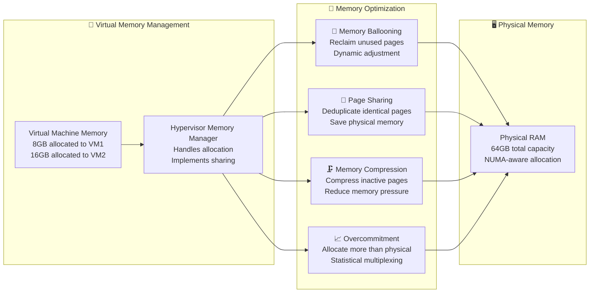
```mermaid
flowchart LR
    subgraph "💾 Virtual Memory Management"
        vm_memory["Virtual Machine Memory<br/>8GB allocated to VM1<br/>16GB allocated to VM2"]
        hypervisor_memory["Hypervisor Memory Manager<br/>Handles allocation<br/>Implements sharing"]
    end
    
    subgraph "🧠 Memory Optimization"
        ballooning["🎈 Memory Ballooning<br/>Reclaim unused pages<br/>Dynamic adjustment"]
        sharing["📄 Page Sharing<br/>Deduplicate identical pages<br/>Save physical memory"]
        compression["🗜️ Memory Compression<br/>Compress inactive pages<br/>Reduce memory pressure"]
        overcommit["📈 Overcommitment<br/>Allocate more than physical<br/>Statistical multiplexing"]
    end
    
    subgraph "🖥️ Physical Memory"
        physical_ram["Physical RAM<br/>64GB total capacity<br/>NUMA-aware allocation"]
    end
    
    vm_memory --> hypervisor_memory
    hypervisor_memory --> ballooning
    hypervisor_memory --> sharing
    hypervisor_memory --> compression
    hypervisor_memory --> overcommit
    
    ballooning --> physical_ram
    sharing --> physical_ram
    compression --> physical_ram
    overcommit --> physical_ram
```

* 🎛️ **I/O Virtualization Architecture**:
  * **🔌 Device Emulation**: Software emulation of standard devices (IDE, E1000 network)
  * **🚀 Paravirtualization**: Guest-aware drivers for better performance (VMXNET3, PVSCSI)
  * **⚡ SR-IOV**: Hardware-level I/O virtualization for near-native performance
  * **🎯 Direct Device Assignment**: Pass-through specific hardware directly to VMs
  * **📊 I/O Scheduling**: Fair queuing and prioritization of I/O requests
* 🔒 **Security and Isolation Mechanisms**:
  * **🏰 Hardware Isolation**: CPU rings, memory protection, IOMMU
  * **🛡️ Software Isolation**: Hypervisor-enforced boundaries between VMs
  * **🔐 Secure Boot**: Verify hypervisor and VM integrity at startup
  * **🎭 VM Encryption**: Encrypt VM memory and storage for enhanced security
  * **👁️ Monitoring**: Real-time security monitoring and intrusion detection

**Modern Hypervisor Performance Features**
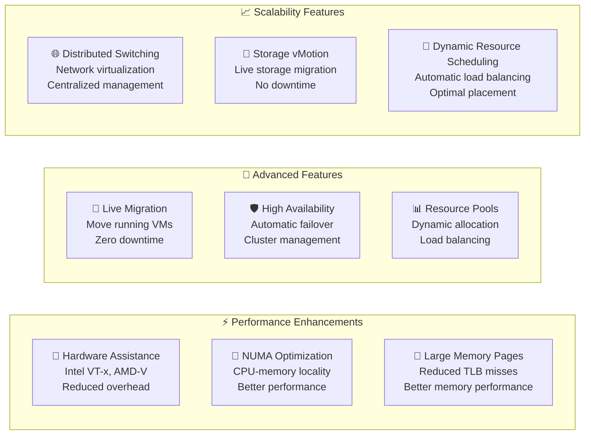
```mermaid
flowchart LR
    subgraph "⚡ Performance Enhancements"
        hardware_assist["🚀 Hardware Assistance<br/>Intel VT-x, AMD-V<br/>Reduced overhead"]
        numa_aware["🧮 NUMA Optimization<br/>CPU-memory locality<br/>Better performance"]
        large_pages["📄 Large Memory Pages<br/>Reduced TLB misses<br/>Better memory performance"]
    end
    
    subgraph "🔧 Advanced Features"
        live_migration["🔄 Live Migration<br/>Move running VMs<br/>Zero downtime"]
        high_availability["🛡️ High Availability<br/>Automatic failover<br/>Cluster management"]
        resource_pools["📊 Resource Pools<br/>Dynamic allocation<br/>Load balancing"]
    end
    
    subgraph "📈 Scalability Features"
        distributed_switch["🌐 Distributed Switching<br/>Network virtualization<br/>Centralized management"]
        storage_vmotion["💾 Storage vMotion<br/>Live storage migration<br/>No downtime"]
        drs["🎯 Dynamic Resource Scheduling<br/>Automatic load balancing<br/>Optimal placement"]
    end
```

* 🎯 **Hypervisor Performance Tuning**:
  * **📊 Right-sizing VMs**: Allocate appropriate resources based on workload
  * **🔄 CPU Affinity**: Pin VMs to specific CPU cores for consistent performance
  * **💾 Memory Reservation**: Guarantee minimum memory for critical VMs
  * **📈 Resource Limits**: Prevent any VM from consuming excessive resources
  * **🎛️ Advanced Settings**: Tune hypervisor parameters for specific workloads
* ⚠️ **Common Architecture Pitfalls**:
  * **🎈 Memory Overcommitment**: Too aggressive can cause swapping and performance issues
  * **📊 CPU Oversubscription**: Too many vCPUs can cause scheduling delays
  * **💿 Storage Bottlenecks**: Shared storage can become performance bottleneck
  * **🌐 Network Congestion**: Virtual switches can limit network performance
  * **🔒 Security Misconfigurations**: Improper isolation can create vulnerabilities

---

### 🎭 **Interactive Break: "Hypervisor Battle Royale"**

**⚔️ Choose Your Champion!**

*Time for a fun hypervisor showdown! Let's debate the pros and cons of different hypervisors in various scenarios.*

**🏆 Battle Scenarios:**
1. **🏢 Corporate Email Server**: VMware ESXi vs Microsoft Hyper-V vs XCP-ng
2. **👨‍💻 Developer Laptop**: VirtualBox vs VMware Workstation vs Parallels
3. **🎮 Gaming VM Setup**: Which hypervisor for running Windows games on Linux?
4. **🏠 Home Lab**: Best budget option for learning virtualization?
5. **☁️ Cloud Migration**: Moving from physical servers to virtual - which path?

**🤔 Discussion Questions:**
1. Would you trust a free hypervisor with your company's main database?
2. What's more important: performance or ease of use? Why?
3. If you could design the perfect hypervisor, what features would it have?
4. Have you ever had a "hypervisor moment" - where virtualization saved the day?

**🎯 Quick Poll:**
- Raise your hand if you've used VirtualBox! 📦
- Who's brave enough to try VMware in production? 🚀
- Anyone running multiple hypervisors? (Why?!) 🤹

*Remember: There's no "best" hypervisor - only the best fit for your specific needs!* 😄

---

🔗 **Resources:**
* [Intel Virtualization Technology Guide](https://www.intel.com/content/www/us/en/virtualization/virtualization-technology/intel-virtualization-technology.html)
* [Hypervisor Architecture Whitepaper](https://www.vmware.com/content/dam/digitalmarketing/vmware/en/pdf/techpaper/vmware-vsphere-cpu-sched-performance-white-paper.pdf)
* [Advanced Memory Management](https://docs.vmware.com/en/VMware-vSphere/7.0/com.vmware.vsphere.resmgmt.doc/GUID-49917C28-D8D9-43BE-BC3C-B5CFD9DE2F9B.html)
* [Hardware-Assisted Virtualization](https://software.intel.com/content/www/us/en/develop/articles/intel-virtualization-technology-for-directed-io-vt-d-enhancing-intel-platforms-for-efficient-virtualization-of-io-devices.html)

---

## 📍 Slide 11 – 🐳 Container Revolution - Docker, Podman, containerd

* 🐳 **Containers** = lightweight virtualization using OS-level isolation instead of hardware virtualization.
* ⚡ **Key Advantage**: Share host kernel, start in milliseconds, minimal resource overhead.
* 📦 **Container vs VM**: Containers virtualize the OS, VMs virtualize the hardware.
* 🔄 **Modern Reality**: 87% of organizations use containers in production (2024 CNCF survey).

**Container Architecture vs Traditional VMs**
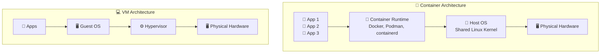
```mermaid
flowchart TD
    subgraph "🐳 Container Architecture"
        c_apps["📱 App 1<br/>📱 App 2<br/>📱 App 3"]
        c_runtime["🐳 Container Runtime<br/>Docker, Podman, containerd"]
        c_os["🐧 Host OS<br/>Shared Linux Kernel"]
        c_hardware["🖥️ Physical Hardware"]
        
        c_apps --> c_runtime
        c_runtime --> c_os
        c_os --> c_hardware
    end
    
    subgraph "💻 VM Architecture"
        v_apps["📱 Apps"]
        v_os["🖥️ Guest OS"]
        v_hypervisor["⚙️ Hypervisor"]
        v_hardware["🖥️ Physical Hardware"]
        
        v_apps --> v_os
        v_os --> v_hypervisor
        v_hypervisor --> v_hardware
    end
```

* 🏆 **Major Container Runtimes**:
  * **🐳 Docker**: Most popular, user-friendly, comprehensive ecosystem
  * **🔴 Podman**: Daemonless, rootless, Red Hat-backed, Docker-compatible
  * **⚙️ containerd**: Industry standard, CNCF project, used by Kubernetes
  * **🚀 CRI-O**: Kubernetes-native, lightweight, OCI-compliant
* 📊 **Performance Comparison**: Containers start 10-100x faster than VMs, use 60% less memory.

---

### 🏃‍♂️ **Interactive Break: "Container vs VM Speed Challenge"**

**⏱️ Let's Race! Guess the Startup Times:**

*Scenario: Starting a simple web server*

**🤔 Your Predictions:**
1. **🐳 Container (nginx)**: _____ seconds?
2. **💻 VM (nginx on Ubuntu)**: _____ seconds?
3. **☁️ Serverless Function**: _____ milliseconds?

**🏆 Actual Results:**
- 🐳 **Container**: 0.5 seconds
- 💻 **VM**: 45 seconds  
- ☁️ **Serverless**: 100ms (warm) / 2000ms (cold)

**🎯 Discussion:**
- When would you still choose VMs over containers?
- What's the trade-off for this speed?
- Have you seen containers fail where VMs succeed?

---

🔗 **Resources:**
* [Docker Official Documentation](https://docs.docker.com/)
* [Podman Documentation](https://podman.io/)
* [CNCF Container Runtime Landscape](https://landscape.cncf.io/)

---

## 📍 Slide 12 – ⚖️ VMs vs Containers - Architecture & Use Cases

* 🏗️ **Isolation Level**: VMs provide hardware-level isolation, containers share OS kernel.
* 📊 **Resource Usage**: Containers use 60% less memory, 10x faster startup.
* 🛡️ **Security Model**: VMs offer stronger isolation, containers need careful security configuration.
* 🎯 **Best Fit**: VMs for different OS needs, containers for microservices and scalability.

**When to Choose What**
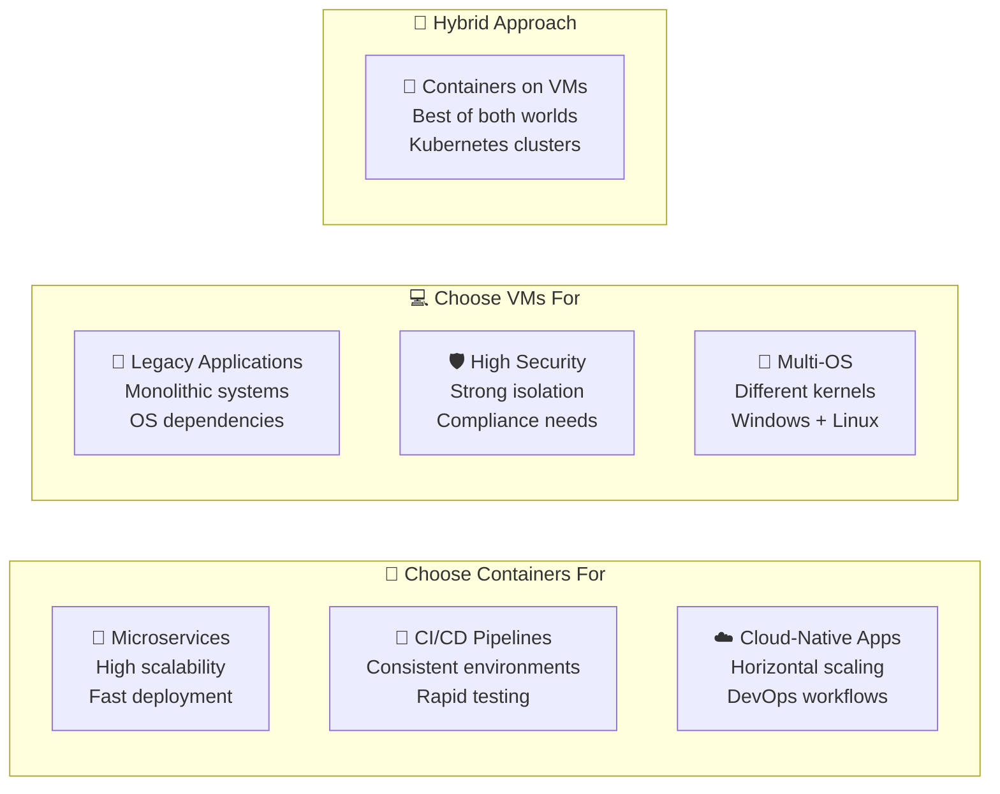
```mermaid
flowchart LR
    subgraph "🐳 Choose Containers For"
        c_micro["🔗 Microservices<br/>High scalability<br/>Fast deployment"]
        c_cicd["🚀 CI/CD Pipelines<br/>Consistent environments<br/>Rapid testing"]
        c_cloud["☁️ Cloud-Native Apps<br/>Horizontal scaling<br/>DevOps workflows"]
    end
    
    subgraph "💻 Choose VMs For"
        v_legacy["🏢 Legacy Applications<br/>Monolithic systems<br/>OS dependencies"]
        v_security["🛡️ High Security<br/>Strong isolation<br/>Compliance needs"]
        v_multi["🔀 Multi-OS<br/>Different kernels<br/>Windows + Linux"]
    end
    
    subgraph "🔄 Hybrid Approach"
        h_both["🎯 Containers on VMs<br/>Best of both worlds<br/>Kubernetes clusters"]
    end
```

* 📈 **Industry Adoption (2024)**:
  * **Containers**: 87% of orgs, primarily microservices and web apps
  * **VMs**: 95% of orgs, legacy systems and high-security workloads
  * **Hybrid**: 73% run both, using VMs to host container clusters
* ⚡ **Performance Reality**: Containers ~5% overhead, VMs ~10-15% overhead

---

### 🕵️ **Interactive Break: "Architecture Detective Game"**

**🔍 Mystery Workloads - What Would You Choose?**

**Case 1**: Banking application handling financial transactions
- 🛡️ High security requirements
- 🏢 Regulatory compliance (PCI-DSS)
- 🔒 Need strong isolation
**Your choice**: VM 💻 or Container 🐳?

**Case 2**: Modern e-commerce website
- 🚀 Need to scale rapidly during sales
- 🔗 Microservices architecture  
- ⚡ Fast deployment cycles
**Your choice**: VM 💻 or Container 🐳?

**Case 3**: Data analytics pipeline
- 📊 Windows-based analytics tools
- 🐧 Linux-based processing engines
- 🔄 Need both environments
**Your choice**: VM 💻 or Container 🐳?

**🎯 Reveal & Discuss!**

---

🔗 **Resources:**
* [Container vs VM Performance Study](https://www.usenix.org/conference/lisa16/technical-sessions/presentation/sharma)
* [NIST Container Security Guide](https://nvlpubs.nist.gov/nistpubs/SpecialPublications/NIST.SP.800-190.pdf)

---

## 📍 Slide 13 – 🌐 WebAssembly (WASM) - Server-Side Revolution

* 🌐 **WebAssembly (WASM)** = portable binary instruction format, originally for web browsers, now revolutionizing server-side computing.
* ⚡ **Key Benefits**: Near-native performance, language-agnostic, smaller than containers, enhanced security.
* 🚀 **WASI (WebAssembly System Interface)**: Enables WASM to run outside browsers with system access.
* 📦 **WASM Containers**: Combine container workflows with WASM efficiency - startup in microseconds.

**WASM in the Server Landscape**
```mermaid
flowchart TD
    subgraph "Traditional Stack"
        t_lang["🐍 Python/JS/Go<br/>Source Code"]
        t_container["🐳 Container<br/>OS dependencies"]
        t_runtime["⚙️ Container Runtime<br/>Docker/Podman"]
        t_time["⏱️ Seconds to start"]
    end
    
    subgraph "WASM Stack"
        w_lang["🐍 Python/JS/Go<br/>Compile to WASM"]
        w_binary["⚡ WASM Binary<br/>Portable bytecode"]
        w_runtime["🌐 WASM Runtime<br/>Wasmtime/Wasmer"]
        w_time["⚡ Microseconds to start"]
    end
    
    t_lang --> t_container --> t_runtime --> t_time
    w_lang --> w_binary --> w_runtime --> w_time
```

* 🔥 **Hot Trends (2024-2025)**:
  * **☁️ Serverless Functions**: Faster cold starts than traditional containers
  * **🌐 Edge Computing**: Lightweight runtime perfect for CDN edge nodes
  * **🔌 Plugin Systems**: Safe, sandboxed plugins for applications
  * **🐳 WASM Containers**: Docker can now run WASM workloads
* 📊 **Performance**: 10-100x faster startup, 50% smaller binaries than containers

---

### 🚀 **Interactive Break: "WASM Performance Showdown"**

**⚡ Speed Test Challenge!**

*Guess the performance metrics for a simple "Hello World" HTTP server:*

| Metric | 🐳 Container | 🌐 WASM | 💻 VM |
|--------|-------------|---------|-------|
| **Startup Time** | ??? | ??? | ??? |
| **Memory Usage** | ??? | ??? | ??? |
| **Binary Size** | ??? | ??? | ??? |

**🏆 Actual Results:**
- **Startup**: Container 500ms, WASM 1ms, VM 30s
- **Memory**: Container 30MB, WASM 8MB, VM 512MB  
- **Size**: Container 50MB, WASM 2MB, VM 2GB

**🤔 But wait... what's the catch?**
- Limited system access
- Newer ecosystem
- Not all languages supported

---

🔗 **Resources:**
* [WebAssembly.org](https://webassembly.org/)
* [WASI Documentation](https://wasi.dev/)
* [Docker WASM Integration](https://docs.docker.com/desktop/wasm/)

---

## 📍 Slide 14 – 🔬 Unikernels & Microkernels - Specialized Virtualization

* 🔬 **Unikernels** = single-address-space operating system compiled with application into standalone VM image.
* ⚡ **Key Concept**: Remove OS layers, include only needed system calls, ultra-lightweight VMs.
* 🛡️ **Security Advantage**: Minimal attack surface, no shell access, immutable infrastructure.
* 📏 **Size**: Unikernel VMs can be <10MB vs traditional Linux VMs >1GB.

**Unikernel vs Traditional Architecture**
```mermaid
flowchart LR
    subgraph "🏢 Traditional VM"
        t_app["📱 Application"]
        t_libs["📚 Libraries"]
        t_os["🐧 Full OS<br/>(Kernel + Userspace)"]
        t_hypervisor["⚙️ Hypervisor"]
        t_size["📏 Size: 1GB+"]
        
        t_app --> t_libs --> t_os --> t_hypervisor --> t_size
    end
    
    subgraph "🔬 Unikernel"
        u_combined["📦 App + Minimal OS<br/>Single binary"]
        u_hypervisor["⚙️ Hypervisor"]
        u_size["📏 Size: <10MB"]
        
        u_combined --> u_hypervisor --> u_size
    end
```

* 🏆 **Popular Unikernel Projects**:
  * **🐪 MirageOS**: OCaml-based, networking focus, 5MB typical size
  * **💡 IncludeOS**: C++ framework, high performance, cloud-native
  * **🦀 Hermit**: Rust-based, research project, HPC applications
* 🎯 **Best Use Cases**: IoT devices, serverless functions, high-security microservices, embedded systems

---

🔗 **Resources:**
* [Unikernel.org](http://unikernel.org/)
* [MirageOS Documentation](https://mirage.io/)
* [IncludeOS Project](https://www.includeos.org/)

---

## 📍 Slide 15 – ⚡ Serverless Computing - Functions-as-a-Service Evolution

* ⚡ **Serverless** = execute code without managing servers, pay per execution, automatic scaling.
* 🔥 **Function-as-a-Service (FaaS)**: Upload functions, cloud provider handles infrastructure completely.
* 📈 **2024 Growth**: 25% year-over-year growth, $9.8B market size.
* 🌐 **Modern Runtimes**: WebAssembly, custom containers, edge computing integration.

**Serverless Evolution Timeline**
```mermaid
flowchart LR
    subgraph "2014-2018: Gen 1"
        gen1["☁️ AWS Lambda<br/>Limited runtimes<br/>15min max execution"]
    end
    
    subgraph "2019-2022: Gen 2"
        gen2["🚀 Multiple Providers<br/>Container support<br/>Better performance"]
    end
    
    subgraph "2023-2025: Gen 3"
        gen3["🌐 WASM Functions<br/>Edge computing<br/>Micro cold starts"]
    end
    
    gen1 --> gen2 --> gen3
```

* 🏆 **Major Serverless Platforms**:
  * **⚡ AWS Lambda**: Market leader, 1000+ concurrent executions
  * **🔥 Google Cloud Functions**: Fast scaling, integrated with GCP services  
  * **🌐 Cloudflare Workers**: Edge-first, V8 isolates, <1ms cold starts
  * **🐳 Knative**: Kubernetes-native, open-source serverless
* ⚠️ **Cold Start Challenge**: Traditional containers 1-5s, WASM functions <100ms

---

### 🥶 **Interactive Break: "Cold Start Horror Stories"**

**👻 Share Your Serverless Nightmares!**

*Let's hear about serverless gone wrong - these are learning opportunities!*

**🎯 Common Horror Stories:**
- **💸 "The $50K Bill"**: Infinite recursion in Lambda functions
- **🐌 "The 30-Second Hello World"**: Java cold starts killing user experience  
- **🔄 "The Timeout Terror"**: Function timing out during critical payment processing
- **🌊 "The Thundering Herd"**: All functions cold starting during traffic spike

**🤔 Discussion Questions:**
1. When would you NOT use serverless?
2. How do you handle serverless monitoring and debugging?
3. What's your serverless backup plan?

**💡 Modern Solutions:**
- Provisioned concurrency
- WASM-based functions  
- Edge computing
- Hybrid architectures

---

🔗 **Resources:**
* [Serverless Framework](https://www.serverless.com/)
* [AWS Lambda Documentation](https://docs.aws.amazon.com/lambda/)
* [Cloudflare Workers](https://workers.cloudflare.com/)
* [CNCF Serverless Whitepaper](https://github.com/cncf/wg-serverless/blob/master/whitepapers/serverless-overview/cncf_serverless_whitepaper_v1.0.pdf)
---

## 📍 Slide 16 – 🛡️ Security-Focused Virtualization - Firecracker, gVisor, Kata

* 🔒 **Security-First Approach**: New virtualization technologies designed with security as primary concern, not performance afterthought.
* 🏭 **Microvm Revolution**: Ultra-lightweight VMs combining container speed with VM security isolation.
* 🛡️ **Sandboxing Evolution**: Enhanced isolation techniques protecting against container escape and side-channel attacks.
* 🌟 **2024 Adoption**: 34% increase in secure container adoption, driven by zero-trust architecture requirements.

**Security-Focused Virtualization Spectrum**
```mermaid
flowchart LR
    subgraph "🔒 Security Level (Low to High)"
        containers["🐳 Standard Containers<br/>Shared kernel<br/>Process isolation"]
        gvisor["🛡️ gVisor<br/>User-space kernel<br/>Syscall interception"]
        kata["⚡ Kata Containers<br/>Lightweight VMs<br/>Hardware isolation"]
        firecracker["🔥 Firecracker<br/>MicroVMs<br/>AWS Lambda backend"]
    end
    
    subgraph "🚀 Performance Level (High to Low)"
        perf_containers["🏃 Fastest<br/>5-10ms startup"]
        perf_gvisor["🚶 Fast<br/>100ms startup"]
        perf_kata["🐢 Moderate<br/>500ms startup"]
        perf_firecracker["⚡ Lightning<br/>125ms startup"]
    end
    
    containers --> perf_containers
    gvisor --> perf_gvisor
    kata --> perf_kata
    firecracker --> perf_firecracker
```

* 🔥 **AWS Firecracker**: Powers AWS Lambda and Fargate, 125ms boot time, <5MB memory overhead
* 🛡️ **Google gVisor**: User-space kernel, intercepts syscalls, used in Google Cloud Run
* ⚡ **Kata Containers**: Hardware-assisted isolation, OCI-compatible, CNCF graduated project
* 🔐 **Intel TDX**: Trust Domain Extensions, confidential computing at hardware level

---

🔗 **Resources:**
* [AWS Firecracker](https://firecracker-microvm.github.io/)
* [Google gVisor](https://gvisor.dev/)
* [Kata Containers](https://katacontainers.io/)
* [NIST Container Security](https://nvlpubs.nist.gov/nistpubs/SpecialPublications/NIST.SP.800-190.pdf)

---

## 📍 Slide 17 – 📊 Performance Optimization - Modern Hardware Features

* ⚡ **Hardware-Assisted Security**: Intel TDX, AMD SEV-SNP enabling confidential computing without performance penalty.
* 🚀 **Next-Gen CPU Features**: Intel VT-x improvements, AMD-V enhancements, ARM virtualization extensions.
* 🧠 **AI-Accelerated Optimization**: ML-driven resource allocation, predictive scaling, intelligent workload placement.
* 📈 **2024 Performance Gains**: 40% improvement in VM startup times, 25% reduction in memory overhead.

**Modern Virtualization Performance Stack**
```mermaid
flowchart LR
    subgraph "🔬 Hardware Layer"
        intel_tdx["🔐 Intel TDX<br/>Trust domains<br/>Confidential VMs"]
        amd_sev["🛡️ AMD SEV-SNP<br/>Secure memory<br/>Encrypted VMs"]
        arm_realm["💪 ARM Realm<br/>Confidential compute<br/>Mobile & edge"]
    end
    
    subgraph "⚙️ Hypervisor Layer"
        kvm_improvements["🐧 KVM 2024<br/>Better NUMA<br/>Live migration"]
        hyperv_gen3["🔷 Hyper-V Gen3<br/>GPU partitioning<br/>Nested improvements"]
        vmware_8["🚀 vSphere 8<br/>DPU offloading<br/>Project Monterey"]
    end
    
    subgraph "🤖 AI/ML Optimization"
        predictive["🔮 Predictive Scaling<br/>ML workload analysis<br/>Proactive allocation"]
        placement["🎯 Smart Placement<br/>NUMA-aware scheduling<br/>Workload affinity"]
        tuning["⚙️ Auto-tuning<br/>Performance knobs<br/>Real-time optimization"]
    end
    
    intel_tdx --> kvm_improvements
    amd_sev --> hyperv_gen3
    arm_realm --> vmware_8
    
    kvm_improvements --> predictive
    hyperv_gen3 --> placement
    vmware_8 --> tuning
```

* 🔐 **Confidential Computing**: Encrypt data in use, protect against privileged access, 15% performance overhead (vs 60% in 2020)
* 📊 **Performance Monitoring**: eBPF-based observability, real-time metrics, ML-driven anomaly detection
* 🎯 **Optimization Techniques**: CPU pinning automation, memory ballooning 2.0, smart NUMA placement
* ⚡ **Edge Optimizations**: ARM-based virtualization, power-efficient designs, 5G edge integration

---

🔗 **Resources:**
* [Intel TDX Documentation](https://www.intel.com/content/www/us/en/developer/tools/trust-domain-extensions/documentation.html)
* [AMD SEV-SNP](https://www.amd.com/en/processors/amd-secure-memory-encryption)
* [CNCF Cloud Native Performance](https://www.cncf.io/blog/2024/01/15/cloud-native-performance-optimization/)

---

## 📍 Slide 18 – 🔧 Hybrid Architectures - Best of All Worlds

* 🏗️ **Containers on VMs**: Most popular approach - VM isolation with container efficiency, 73% of enterprises use this model.
* 🕸️ **Service Mesh Integration**: Istio, Linkerd providing secure communication between virtualized and containerized workloads.
* 🔄 **Multi-Runtime Platforms**: Single clusters running VMs, containers, and serverless functions simultaneously.
* 🌊 **2024 Trend**: 67% adoption of hybrid container-VM architectures, driven by security and compliance needs.

**Modern Hybrid Architecture**
```mermaid
flowchart LR
    subgraph "🌐 Edge Tier"
        cdn["🌍 CDN  Edge Functions<br/>Cloudflare Workers<br/>WASM runtime"]
        edge_vm["⚡ Edge VMs<br/>Firecracker<br/>Regional processing"]
    end
    
    subgraph "☸️ Kubernetes Cluster (on VMs)"
        control_plane["🎛️ Control Plane<br/>etcd, API server<br/>VM-based for stability"]
        
        subgraph "Worker Nodes (VMs)"
            standard_pods["🐳 Standard Pods<br/>Web services<br/>APIs"]
            kata_pods["⚡ Kata Pods<br/>Sensitive workloads<br/>Multi-tenant"]
            wasm_pods["🌐 WASM Pods<br/>Edge functions<br/>Micro cold starts"]
        end
    end
    
    subgraph "🏢 Legacy Tier"
        legacy_vm["💼 Legacy VMs<br/>Monolithic apps<br/>Database servers"]
        bare_metal["🔧 Bare Metal<br/>High-performance<br/>GPU workloads"]
    end
    
    subgraph "🕸️ Service Mesh"
        mesh["🔗 Istio/Linkerd<br/>mTLS everywhere<br/>Traffic management"]
    end
    
    cdn --> control_plane
    edge_vm --> standard_pods
    
    standard_pods --> mesh
    kata_pods --> mesh
    wasm_pods --> mesh
    legacy_vm --> mesh
    
    mesh --> bare_metal
```

* 🎯 **Runtime Selection Strategy**: Choose runtime based on workload requirements, not technology preference
* 🔐 **Security Boundaries**: VMs for tenant isolation, containers for application isolation, WASM for plugin isolation
* 📊 **Operational Consistency**: Unified monitoring, logging, and deployment across all runtime types
* 🚀 **Performance Optimization**: Right runtime for right job - serverless for spikes, VMs for steady state

---

🔗 **Resources:**
* [CNCF Runtime Landscape](https://landscape.cncf.io/card-mode?category=container-runtime)
* [Istio Service Mesh](https://istio.io/)
* [Kubernetes Multi-Runtime](https://kubernetes.io/blog/2024/01/10/cri-o-multi-runtime/)

---

## 📍 Slide 19 – 🌐 Edge & IoT Virtualization - 5G Revolution

* 🌍 **Edge Computing Explosion**: 175% growth in edge virtualization, driven by 5G, IoT, and real-time applications.
* ⚡ **Ultra-Low Latency**: <1ms requirements pushing virtualization to network edge, revolutionizing application architecture.
* 📱 **Massive Scale**: Billions of IoT devices requiring lightweight, efficient virtualization at the edge.
* 🔋 **Power Constraints**: ARM-based edge computing, energy-efficient virtualization, battery-powered edge nodes.

**Edge Virtualization Ecosystem**
```mermaid
flowchart LR
    subgraph "🌐 Network Edge"
        cell_tower["📡 5G Cell Tower<br/>MEC (Multi-access Edge)<br/>Ultra-low latency"]
        smart_city["🏙️ Smart City Hub<br/>Traffic, sensors<br/>Real-time processing"]
        factory["🏭 Industrial Edge<br/>IoT, robotics<br/>Deterministic computing"]
    end
    
    subgraph "⚡ Edge Virtualization"
        lightweight_vm["🪶 Lightweight VMs<br/>Firecracker, NEMU<br/>Fast boot, low overhead"]
        wasm_edge["🌐 WASM at Edge<br/>Fastly Compute<br/>Microsecond startup"]
        container_edge["🐳 Edge Containers<br/>K3s, MicroK8s<br/>Kubernetes at edge"]
    end
    
    subgraph "📊 Management Layer"
        orchestration["☸️ Edge Orchestration<br/>KubeEdge, Akri<br/>Cloud-to-edge deployment"]
        monitoring["📈 Edge Monitoring<br/>Lightweight agents<br/>Intermittent connectivity"]
        security["🔐 Zero-Trust Edge<br/>Certificate-based auth<br/>Encrypted everything"]
    end
    
    cell_tower --> lightweight_vm
    smart_city --> wasm_edge
    factory --> container_edge
    
    lightweight_vm --> orchestration
    wasm_edge --> monitoring
    container_edge --> security
```

* 🤖 **AI at the Edge**: TensorFlow Lite, ONNX runtime, GPU virtualization for edge AI workloads
* 🔌 **Device Integration**: Virtual network functions, software-defined everything, edge-cloud continuum
* 🌊 **Stream Processing**: Real-time data processing, event-driven architectures, edge analytics
* 🛡️ **Security Challenges**: Certificate management, secure boot, attestation, zero-trust networking

---

🔗 **Resources:**
* [ETSI Multi-Access Edge Computing](https://www.etsi.org/technologies/multi-access-edge-computing)
* [KubeEdge Documentation](https://kubeedge.io/)
* [5G Edge Computing Whitepaper](https://www.cncf.io/blog/2024/02/20/5g-edge-computing-kubernetes/)

---

## 📍 Slide 20 – 🔮 Emerging Technologies - The Next Decade

* 🧠 **Neuromorphic Computing**: Brain-inspired architectures requiring new virtualization paradigms, Intel Loihi, IBM TrueNorth.
* ⚛️ **Quantum Computing**: Quantum cloud services (IBM, Google, AWS), quantum-safe cryptography, hybrid quantum-classical workflows.
* 🌱 **Sustainable Computing**: Carbon-aware scheduling, renewable energy integration, circular economy principles.
* 🔬 **2025-2030 Predictions**: Photonic computing, DNA storage virtualization, biocomputing interfaces.

**Future Virtualization Landscape (2025-2030)**
```mermaid
flowchart LR
    subgraph "🌱 Green Computing"
        carbon_aware["♻️ Carbon-Aware<br/>Schedule on renewables<br/>Dynamic power scaling"]
        liquid_cooling["❄️ Immersion Cooling<br/>Liquid cooling systems<br/>Heat recovery"]
        efficient_chips["⚡ Efficient Silicon<br/>ARM, RISC-V<br/>Purpose-built chips"]
    end
    
    subgraph "⚛️ Quantum Integration"
        quantum_cloud["☁️ Quantum Cloud<br/>IBM Quantum, AWS Braket<br/>Hybrid workflows"]
        quantum_crypto["🔐 Post-Quantum Crypto<br/>Quantum-safe algorithms<br/>Migration strategies"]
        quantum_sim["🔬 Quantum Simulation<br/>Virtual quantum systems<br/>Algorithm development"]
    end
    
    subgraph "🧠 Neuromorphic & Bio"
        neuro_chips["🧠 Neuromorphic<br/>Intel Loihi, BrainChip<br/>Event-driven computing"]
        bio_computing["🧬 Bio-Computing<br/>DNA storage<br/>Protein folding"]
        brain_interface["🔗 Brain-Computer<br/>Neuralink-style<br/>Direct neural control"]
    end
    
    subgraph "🔮 Emerging Paradigms"
        photonic["💡 Photonic Computing<br/>Light-based processing<br/>Ultra-fast networking"]
        molecular["⚗️ Molecular Computing<br/>Chemical computation<br/>Nano-scale processing"]
        space_compute["🚀 Space Computing<br/>Orbital data centers<br/>Zero-latency global"]
    end
    
    carbon_aware --> quantum_cloud
    liquid_cooling --> quantum_crypto
    efficient_chips --> quantum_sim
    
    quantum_cloud --> neuro_chips
    quantum_crypto --> bio_computing
    quantum_sim --> brain_interface
    
    neuro_chips --> photonic
    bio_computing --> molecular
    brain_interface --> space_compute
```

* 📊 **Industry Predictions**:
  * **2025**: 50% of workloads carbon-optimized, quantum-safe crypto mandatory for finance
  * **2027**: Neuromorphic edge computing mainstream, DNA storage for archival workloads
  * **2030**: Photonic interconnects, space-based computing, biocomputing interfaces
* 🎯 **Skills for Future**: Quantum algorithms, sustainable architecture, bio-computing concepts, ethical AI

---

🔗 **Resources:**
* [CNCF Technology Radar](https://radar.cncf.io/)
* [IBM Quantum Experience](https://quantum-computing.ibm.com/)
* [Intel Neuromorphic Computing](https://www.intel.com/content/www/us/en/research/neuromorphic-computing.html)
* [Green Software Foundation](https://greensoftware.foundation/)