# 📌 Lecture 6 - Containers: Docker & Kubernetes

## 📍 Slide 1 – 🐳 What are Containers?

* 📦 **Container** = a lightweight, standalone, executable package that includes everything needed to run a piece of software (code, runtime, system tools, libraries, settings).
* 🧩 **Key Concept**: Containers package an application and its dependencies together, ensuring it runs consistently across different computing environments.
* 🏗️ **Isolation without full virtualization**: Containers share the host operating system kernel but run in isolated user spaces.
* ⚡ **Benefits**: Fast startup (milliseconds), minimal resource overhead, high density (hundreds of containers on one host).
* 🎯 **Simple Analogy**: Like shipping containers 📦 - standardized, stackable, portable; you don't care what's inside, just that it fits the standard.

**Container Architecture Overview**
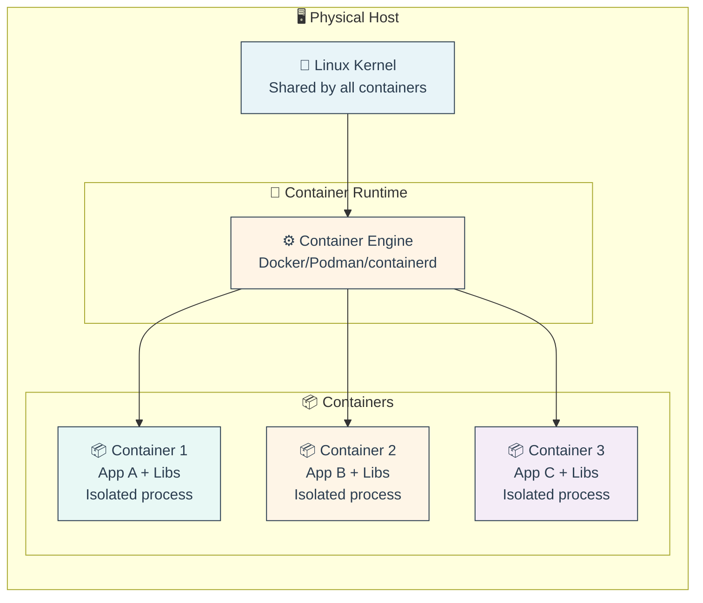

* 🔑 **Core Components**:
  * 📸 **Image** = read-only template with application code and dependencies
  * 📦 **Container** = running instance of an image
  * 🗄️ **Registry** = storage and distribution system for images (Docker Hub, Quay.io, GHCR = GitHub Container Registry)
* 💡 **Real-World Impact**: Netflix runs hundreds of thousands of containers, Spotify deploys 10,000+ containers daily
* 🌍 **Industry Adoption**: 87% of organizations use containers in production (CNCF = Cloud Native Computing Foundation Survey 2024)

🔗 **Resources:**
* [Docker: What is a Container?](https://www.docker.com/resources/what-container/)
* [CNCF Cloud Native Glossary - Container](https://glossary.cncf.io/container/)
* [Linux Containers (LXC) Overview](https://linuxcontainers.org/)

---

## 📍 Slide 2 – 📜 History of Containers (1979 → 2024)

* 🏛️ **1979 - The Beginning**: Unix V7 introduces `chroot` (change root) - isolates file system view for processes
* 📦 **2000 - FreeBSD Jails**: First "true" container technology with process and network isolation
* 🐧 **2001 - Linux VServer**: Partition resources on Linux, early resource isolation
* 📦 **2004 - Solaris Zones**: Oracle/Sun's enterprise container solution
* 🔧 **2006 - Process Containers**: Google creates cgroups (control groups) for Linux kernel
* 📦 **2008 - LXC (Linux Containers)**: First complete Linux container manager using cgroups + namespaces
* 🐳 **2013 - Docker Revolution**: Solomon Hykes releases Docker, makes containers accessible to everyone
* ☸️ **2014 - Kubernetes Born**: Google open-sources Kubernetes based on Borg/Omega experience
* 🎯 **2015 - OCI (Open Container Initiative)**: Industry standardizes container formats and runtimes
* 🚀 **2016-2024 - Cloud Native Era**: Containers become the standard for cloud deployments

**Evolution Timeline**
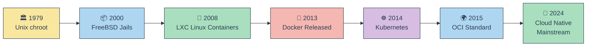

* 🎭 **Fun Historical Facts**:
  * 💡 Docker was originally a PaaS (Platform as a Service) company called dotCloud; containers were their internal tool
  * 🐳 The Docker whale logo carries shipping containers because of the shipping container analogy
  * ☸️ "Kubernetes" (κυβερνήτης) is Greek for "helmsman" or "pilot" - hence the ship wheel logo
  * 🏆 Google was running 2+ billion containers per week in 2014 (before Kubernetes public release)
  * 📦 The first container in Docker Hub was "hello-world" (still exists today!)
* 🔄 **Key Paradigm Shifts**:
  * **2000s**: Containers were complex, expert-only tools
  * **2013-2015**: Docker made containers developer-friendly
  * **2016-2020**: Kubernetes standardized orchestration
  * **2020+**: Containers are now default for cloud-native applications

🔗 **Resources:**
* [Docker History Timeline](https://www.docker.com/company/)
* [Kubernetes Origin Story](https://kubernetes.io/blog/2015/04/borg-predecessor-to-kubernetes/)
* [A Brief History of Containers](https://blog.aquasec.com/a-brief-history-of-containers-from-1970s-chroot-to-docker-2016)
* [OCI Announcement](https://www.opencontainers.org/about/overview/)

---

## 📍 Slide 3 – 💡 Why Containers Matter in DevOps

* ⚡ **Speed**: Applications start in milliseconds vs minutes for VMs (Virtual Machines)
* 🔄 **Consistency**: "Works on my machine" problem solved - same container runs everywhere
* 📦 **Portability**: Run the same container on laptop, data center, any cloud provider
* 🎯 **Efficiency**: 10-100x higher density than VMs, better resource utilization
* 🚀 **Scalability**: Spin up/down instances in seconds to handle traffic spikes
* 🧪 **Development Speed**: Developers can replicate production environments locally

**Problems Containers Solve**
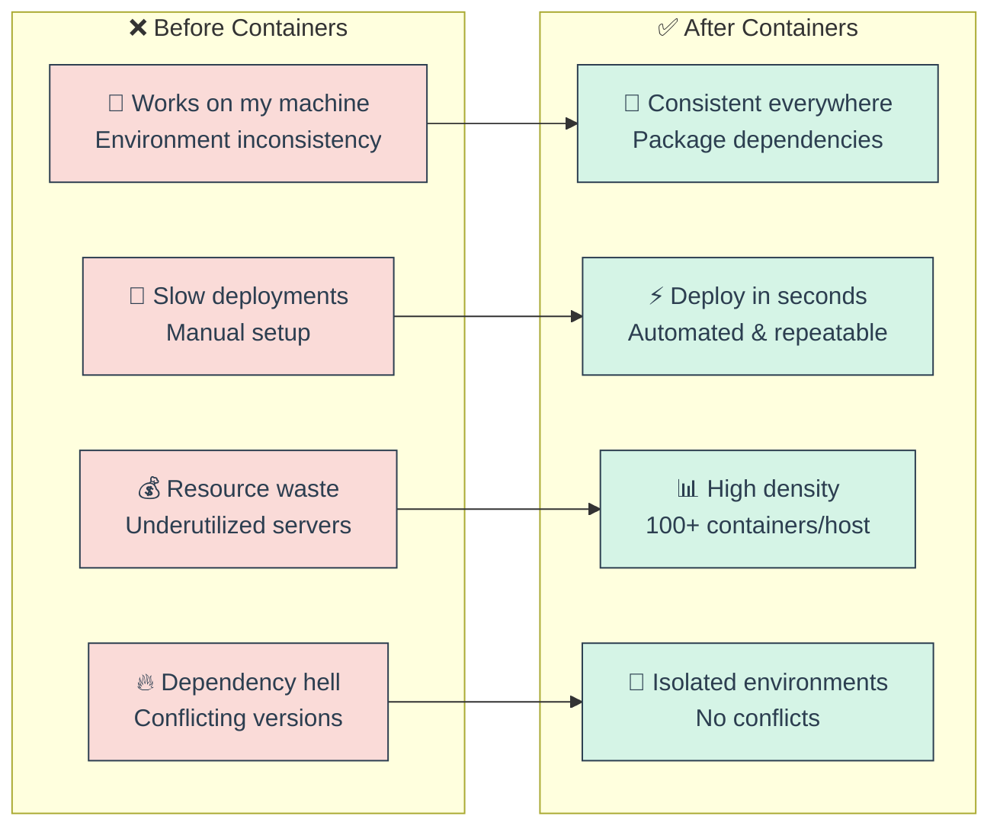

* 📊 **Real-World Impact Statistics**:
  * ⚡ **Deployment Speed**: Netflix reduced deployment time from 45 minutes to under 60 seconds
  * 💰 **Cost Savings**: Airbnb cut infrastructure costs by 40% after containerization
  * 📈 **Scale**: Twitter runs 100,000+ containers across their infrastructure
  * 🚀 **Developer Productivity**: GitHub reduced onboarding time from days to hours
  * 🔄 **Release Frequency**: Companies deploying containers ship code 200x more frequently
* 🎯 **DevOps Workflow Benefits**:
  * **🧪 Testing**: Identical environments for dev, staging, production
  * **🔄 CI/CD (Continuous Integration/Continuous Deployment)**: Fast, repeatable builds
  * **🌍 Multi-cloud**: Avoid vendor lock-in, run anywhere
  * **🔧 Microservices**: Natural fit for distributed architectures
  * **📦 Dependency Management**: Bundle everything needed, no host conflicts

**Container-Driven DevOps Pipeline**
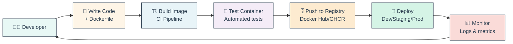

🔗 **Resources:**
* [Why Containers? (Red Hat)](https://www.redhat.com/en/topics/containers)
* [Container Benefits (AWS)](https://aws.amazon.com/containers/)
* [State of Container Adoption Report (Datadog)](https://www.datadoghq.com/container-report/)

---

## 📍 Slide 4 – ⚖️ Containers vs Virtual Machines (VMs)

* 🏗️ **Architecture Difference**: VMs virtualize hardware, containers virtualize the operating system
* ⚡ **Startup Time**: Containers = milliseconds, VMs = minutes
* 💾 **Size**: Container images = MBs (megabytes), VM images = GBs (gigabytes)
* 🧠 **Resource Overhead**: Containers ~1-5% overhead, VMs ~10-20% overhead
* 🔒 **Isolation Level**: VMs = stronger (separate kernels), Containers = good (shared kernel, namespace isolation)
* 🎯 **Best Use**: VMs for different OSes/strong isolation, Containers for microservices/scalability

**Side-by-Side Comparison**
```mermaid
flowchart TD
    subgraph "🖥️ Virtual Machine Architecture"
        VM_Apps["📱 App A | 📱 App B | 📱 App C"]
        VM_Guest["🖥️ Guest OS | 🖥️ Guest OS | 🖥️ Guest OS"]
        VM_Hyper["⚙️ Hypervisor<br/>ESXi, Hyper-V, KVM"]
        VM_Host["💻 Host Operating System"]
        VM_HW["🖥️ Physical Hardware"]
        
        VM_Apps --> VM_Guest
        VM_Guest --> VM_Hyper
        VM_Hyper --> VM_Host
        VM_Host --> VM_HW
    end
    
    subgraph "🐳 Container Architecture"
        C_Apps["📱 App A | 📱 App B | 📱 App C"]
        C_Runtime["🐳 Container Runtime<br/>Docker, Podman, containerd"]
        C_Host["💻 Host Operating System"]
        C_HW["🖥️ Physical Hardware"]
        
        C_Apps --> C_Runtime
        C_Runtime --> C_Host
        C_Host --> C_HW
    end
    
    style VM_Apps fill:#fdebd0,stroke:#2c3e50,color:#2c3e50
    style VM_Guest fill:#fadbd8,stroke:#2c3e50,color:#2c3e50
    style VM_Hyper fill:#e8f4f8,stroke:#2c3e50,color:#2c3e50
    style C_Apps fill:#fdebd0,stroke:#2c3e50,color:#2c3e50
    style C_Runtime fill:#d5f4e6,stroke:#2c3e50,color:#2c3e50
```

* 📊 **Performance Comparison Table**:

| **Aspect** | **🐳 Containers** | **💻 Virtual Machines** |
|------------|------------------|------------------------|
| **Startup Time** | ⚡ 50-500ms | 🐌 1-5 minutes |
| **Disk Space** | 📦 10-200 MB | 💿 2-20 GB |
| **Memory Usage** | 💾 MBs per container | 💾 GBs per VM |
| **Performance** | 🚀 Near-native | 📉 5-20% overhead |
| **Density** | 📊 100+ per host | 📊 10-20 per host |
| **Boot Process** | ⚡ Process start | 🔄 Full OS boot |
| **Isolation** | 🧩 Process-level | 🔒 Hardware-level |
| **Portability** | 🌍 Highly portable | 🌐 Less portable |

* 🎯 **When to Choose What**:
  * **🐳 Choose Containers For**:
    * 🔗 Microservices architectures
    * ⚡ Rapid scaling requirements
    * 🚀 CI/CD pipelines
    * 🌍 Multi-cloud deployments
    * 💰 Cost-sensitive workloads
  * **💻 Choose VMs For**:
    * 🖥️ Different OS requirements (Windows + Linux)
    * 🔒 Strong security isolation needs
    * 🏢 Legacy monolithic applications
    * 🛡️ Compliance/regulatory requirements
    * 🎮 Workloads needing specific kernels

* 🔄 **Hybrid Approach - Best of Both Worlds**:
  * 🏗️ **Containers on VMs**: Most common pattern - run containers inside VMs for additional isolation layer
  * ☸️ **Kubernetes Nodes**: VMs running container orchestration platforms
  * 🌐 **Cloud Providers**: AWS Fargate, Google Cloud Run use VMs to isolate customer containers

**Hybrid Architecture Example**
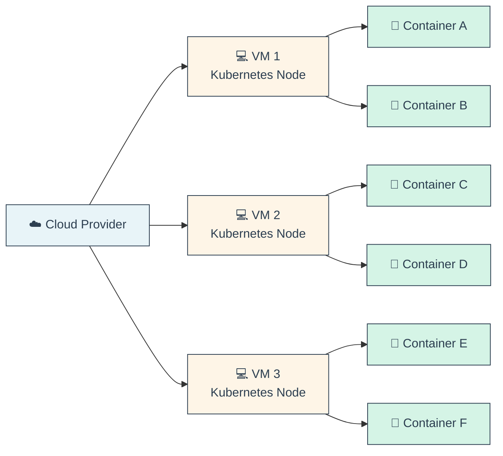

🔗 **Resources:**
* [Containers vs VMs (Docker)](https://www.docker.com/resources/what-container/)
* [Understanding the Differences (Red Hat)](https://www.redhat.com/en/topics/containers/containers-vs-vms)
* [Container Performance Study (IBM Research)](https://domino.research.ibm.com/library/cyberdig.nsf/papers/0929052195DD819C85257D2300681E7B)

---

## 📍 Slide 5 – 🧩 Container Components (Images, Layers, Registries)

* 📸 **Container Image** = read-only template containing application code, runtime, libraries, dependencies, and configuration
* 📦 **Container** = running instance of an image (process with isolated namespace)
* 🗄️ **Registry** = centralized repository for storing and distributing container images
* 🎂 **Layers** = images are built from layers stacked on top of each other (copy-on-write filesystem)
* 🏷️ **Tags** = version labels for images (e.g., `nginx:1.25`, `nginx:latest`)

**Container Image Anatomy**
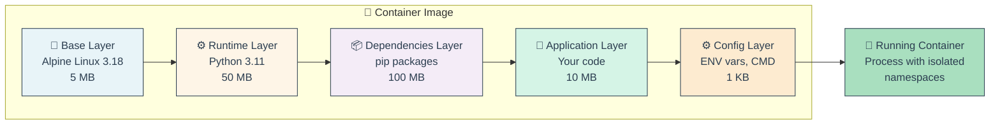

* 🎂 **Layer System Explained**:
  * 🧱 **Base Layer**: Usually minimal OS (Alpine, Ubuntu, scratch)
  * ⚙️ **Intermediate Layers**: Runtime, system dependencies
  * 📦 **Dependency Layers**: Application dependencies
  * 📱 **Application Layer**: Your source code
  * ⚙️ **Config Layer**: Metadata (ENV, CMD, ENTRYPOINT, EXPOSE)
* 💡 **Layer Benefits**:
  * 🔄 **Reusability**: Shared layers across images save disk space
  * ⚡ **Fast Builds**: Cached layers speed up rebuilds
  * 📦 **Efficient Distribution**: Only changed layers transferred
  * 💾 **Storage Optimization**: Copy-on-write filesystem

**Image to Container Lifecycle**
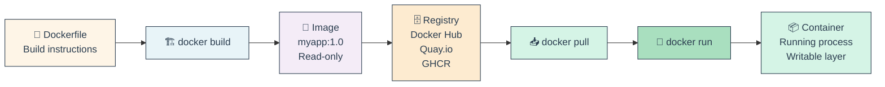

* 🗄️ **Popular Container Registries**:
  * 🐳 **Docker Hub**: Public and private images (hub.docker.com)
  * 📦 **Quay.io**: Red Hat's registry with security scanning
  * 🐙 **GHCR (GitHub Container Registry)**: Integrated with GitHub repos
  * 🌐 **AWS ECR (Elastic Container Registry)**: Amazon's private registry
  * ☁️ **Google Artifact Registry**: Google Cloud's unified repository
  * 🔷 **Azure Container Registry**: Microsoft's registry service

* 🏷️ **Image Naming Convention**:
  * 📝 Format: `[registry/][namespace/]repository[:tag]`
  * 🌐 Examples:
    * `nginx` → Docker Hub official image
    * `nginx:1.25` → Specific version
    * `nginx:alpine` → Alpine Linux variant
    * `ghcr.io/user/app:latest` → GitHub Container Registry
    * `myregistry.com:5000/team/api:v2.1.0` → Private registry

🔗 **Resources:**
* [Docker Image Specification](https://github.com/moby/moby/blob/master/image/spec/v1.2.md)
* [Docker Hub Registry](https://hub.docker.com/)
* [Understanding Container Images (Red Hat)](https://www.redhat.com/en/topics/containers/what-is-a-container-image)
* [Image Layer Visualization](https://github.com/wagoodman/dive)

---

## 📍 Slide 6 – 🛠️ Container Engine Differences (Docker vs Podman vs containerd vs CRI-O)

* 🐳 **Docker** = Complete platform with daemon, CLI, build tools, networking, orchestration (swarm)
* 🦭 **Podman** = Daemonless, rootless alternative to Docker; CLI-compatible, no central daemon
* ⚙️ **containerd** = Industry-standard container runtime, core component of Docker and Kubernetes
* 🎯 **CRI-O (Container Runtime Interface - Open Container Initiative)** = Lightweight runtime designed specifically for Kubernetes

**Container Engine Ecosystem**
```mermaid
flowchart TD
    subgraph "🐳 Docker Engine"
        D_CLI["💻 Docker CLI"] --> D_Daemon["🔧 dockerd<br/>Central daemon"]
        D_Daemon --> D_containerd["⚙️ containerd"]
        D_containerd --> D_runc["🏃 runc<br/>OCI runtime"]
    end
    
    subgraph "🦭 Podman"
        P_CLI["💻 podman CLI"] --> P_Direct["⚡ Direct to<br/>No daemon"]
        P_Direct --> P_runc["🏃 runc/crun<br/>OCI runtime"]
    end
    
    subgraph "☸️ Kubernetes"
        K_kubelet["🎯 kubelet"] --> K_CRI["🔌 CRI Plugin"]
        K_CRI --> K_containerd["⚙️ containerd"]
        K_CRI --> K_CRIO["🎯 CRI-O"]
        K_containerd --> K_runc["🏃 runc"]
        K_CRIO --> K_runc2["🏃 runc/crun"]
    end
    
    style D_CLI fill:#e8f4f8,stroke:#2c3e50,color:#2c3e50
    style D_Daemon fill:#fdebd0,stroke:#2c3e50,color:#2c3e50
    style P_CLI fill:#e8f4f8,stroke:#2c3e50,color:#2c3e50
    style P_Direct fill:#d5f4e6,stroke:#2c3e50,color:#2c3e50
    style K_kubelet fill:#f4ecf7,stroke:#2c3e50,color:#2c3e50
```

* 🔍 **Detailed Comparison**:

| **Feature** | **🐳 Docker** | **🦭 Podman** | **⚙️ containerd** | **🎯 CRI-O** |
|-------------|--------------|---------------|------------------|--------------|
| **Architecture** | Client-server daemon | Daemonless | Core runtime | Kubernetes-focused |
| **Root Required** | ⚠️ Yes (by default) | ✅ No (rootless mode) | ⚠️ Depends | ✅ Rootless support |
| **Systemd Integration** | 🔧 Via daemon | ✅ Native systemd | 🔧 Via plugins | ✅ Native systemd |
| **Kubernetes Use** | 🔄 Via containerd | ✅ Direct CRI support | ✅ Native K8s runtime | ✅ Built for K8s |
| **Build Support** | ✅ docker build | ✅ podman build | ❌ Needs buildkit | ❌ External builder |
| **Docker Compose** | ✅ Native | ✅ podman-compose | ❌ No | ❌ No |
| **Swarm Mode** | ✅ Built-in | ❌ No (use K8s) | ❌ No | ❌ No |
| **OCI Compliant** | ✅ Yes | ✅ Yes | ✅ Yes | ✅ Yes |
| **Registry** | 🐳 Docker Hub default | 🌐 Multiple defaults | 🌐 Configurable | 🌐 Configurable |

* 🐳 **Docker Engine**:
  * 🏢 **Market Leader**: Most widely adopted, extensive documentation
  * 🔧 **Components**: dockerd (daemon), containerd (runtime), runc (OCI)
  * 📦 **Extras**: Docker Compose, Docker Desktop, Docker Hub integration
  * ⚠️ **Considerations**: Requires root/daemon, single point of failure
  * 🎯 **Best For**: Development, legacy systems, comprehensive tooling

* 🦭 **Podman (Pod Manager)**:
  * 🔒 **Security First**: No daemon = smaller attack surface, rootless by default
  * 🔄 **Docker Compatible**: Drop-in replacement (`alias docker=podman`)
  * 🏗️ **Pod Support**: Native pod concept (group of containers), like Kubernetes
  * 🧩 **Systemd Integration**: Generate systemd units for containers
  * 🎯 **Best For**: Rootless containers, systemd integration, security-focused

* ⚙️ **containerd**:
  * 🧱 **Core Runtime**: Extracted from Docker, donated to CNCF
  * ☸️ **K8s Standard**: Default runtime for Kubernetes 1.24+
  * 🔌 **CRI (Container Runtime Interface) Compatible**: Direct K8s integration
  * 🎯 **Minimal**: No build tools, focused on runtime operations
  * 🎯 **Best For**: Kubernetes clusters, production workloads, minimal overhead

* 🎯 **CRI-O**:
  * ☸️ **Kubernetes Native**: Built specifically for K8s, implements CRI spec
  * 🪶 **Lightweight**: Minimal dependencies, fast startup
  * 🔒 **Security Focused**: SELinux/AppArmor support, user namespaces
  * 🎯 **OCI First**: Direct OCI implementation without legacy code
  * 🎯 **Best For**: Production Kubernetes, OpenShift, security-critical workloads

* 🔄 **Evolution & Industry Trends**:
  * 📉 **Docker Deprecation in K8s**: Kubernetes removed dockershim in v1.24 (2022)
  * 📈 **containerd Rise**: Now default for most managed Kubernetes services
  * 🦭 **Podman Growth**: Adopted by Red Hat, Fedora, security-conscious orgs
  * 🎯 **CRI-O Adoption**: Standard in OpenShift, growing in enterprise K8s
  * 🌐 **OCI Standardization**: All engines converging on OCI specs

🔗 **Resources:**
* [Docker Engine Overview](https://docs.docker.com/engine/)
* [Podman Documentation](https://docs.podman.io/)
* [containerd Website](https://containerd.io/)
* [CRI-O Documentation](https://cri-o.io/)
* [Don't Panic: Kubernetes and Docker](https://kubernetes.io/blog/2020/12/02/dont-panic-kubernetes-and-docker/)

---

## 📍 Slide 7 – 🔍 OCI (Open Container Initiative) Standards

* 📜 **OCI = Open Container Initiative** - Linux Foundation project to create open industry standards for container formats and runtimes
* 🎯 **Mission**: Ensure containers built with one tool can run with any OCI-compliant runtime
* 📦 **Founded**: June 2015 by Docker, CoreOS, Google, Microsoft, Red Hat, and others
* 🧩 **Three Core Specifications**: Image-spec, Runtime-spec, Distribution-spec
* ✅ **Compliance**: Prevents vendor lock-in, enables interoperability across container ecosystems

**OCI Standards Architecture**
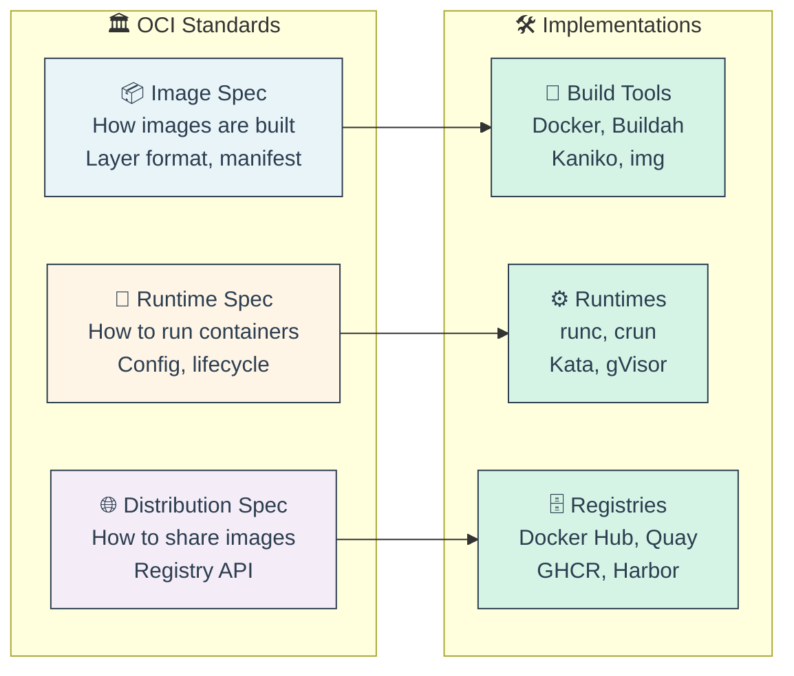

* 📦 **Image Specification (image-spec)**:
  * 🎂 **Layer Format**: How filesystem layers are stored and stacked
  * 📋 **Manifest**: JSON document describing image contents
  * ⚙️ **Configuration**: Image config (ENV, CMD, exposed ports)
  * 🏷️ **Content Addressing**: Images identified by SHA-256 digest
  * 📁 **Layout**: Directory structure for OCI image on disk

* 🏃 **Runtime Specification (runtime-spec)**:
  * 🗂️ **Filesystem Bundle**: Container root filesystem + config.json
  * ⚙️ **Configuration**: Runtime parameters (process, mounts, namespaces)
  * 🔄 **Lifecycle**: Operations (create, start, kill, delete)
  * 🧩 **Hooks**: Prestart, poststart, poststop customization
  * 🐧 **Platform-Specific**: Linux, Windows, Solaris support

* 🌐 **Distribution Specification (distribution-spec)**:
  * 🚀 **Registry API**: HTTP API for pushing/pulling images
  * 📦 **Manifest Format**: How to describe multi-platform images
  * 🔐 **Authentication**: Token-based auth for registries
  * 🏷️ **Tag Operations**: Listing, deletion, manifest retrieval
  * 🌍 **Content Discovery**: Finding and retrieving image layers

* ✅ **OCI Compliance Benefits**:
  * 🔄 **Interoperability**: Build with Docker, run with Podman or CRI-O
  * 🚫 **No Vendor Lock-in**: Switch runtimes without rebuilding images
  * 🛡️ **Security**: Standardized security model and audit surface
  * 📈 **Innovation**: Multiple competing implementations improve ecosystem
  * 🧪 **Testing**: Standard conformance tests ensure compatibility

**OCI Ecosystem Flow**
```mermaid
flowchart LR
    Dev["👨‍💻 Developer"] --> Build["🔨 Build Tool<br/>Docker/Buildah"]
    Build --> Image["📦 OCI Image<br/>Standard format"]
    Image --> Registry["🗄️ OCI Registry<br/>Harbor/Quay"]
    Registry --> Pull["📥 Pull Image"]
    Pull --> Runtime["🏃 OCI Runtime<br/>runc/crun"]
    Runtime --> Container["📦 Running Container<br/>Standard behavior"]
    
    style Dev fill:#e8f4f8,stroke:#2c3e50,color:#2c3e50
    style Build fill:#fef5e7,stroke:#2c3e50,color:#2c3e50
    style Image fill:#f4ecf7,stroke:#2c3e50,color:#2c3e50
    style Registry fill:#fdebd0,stroke:#2c3e50,color:#2c3e50
    style Pull fill:#d5f4e6,stroke:#2c3e50,color:#2c3e50
    style Runtime fill:#a9dfbf,stroke:#2c3e50,color:#2c3e50
    style Container fill:#d5f4e6,stroke:#2c3e50,color:#2c3e50
```

* 🏛️ **Founding Members & Governance**:
  * 🐳 Docker (contributed original container format)
  * 🔴 Red Hat / CoreOS (contributed rkt container format)
  * ☁️ Google (Kubernetes integration)
  * 🪟 Microsoft (Windows container support)
  * 🍎 AWS, Google Cloud, Azure (cloud provider backing)
  * 🧱 Governance: Technical Oversight Board + maintainers

🔗 **Resources:**
* [OCI Official Website](https://opencontainers.org/)
* [OCI Image Specification](https://github.com/opencontainers/image-spec)
* [OCI Runtime Specification](https://github.com/opencontainers/runtime-spec)
* [OCI Distribution Specification](https://github.com/opencontainers/distribution-spec)

---

## 📍 Slide 8 – ⚙️ Container Runtime Internals (runc, crun, Kata Containers, gVisor)

* 🏃 **Container Runtime** = low-level software that creates and runs containers according to OCI runtime specification
* 🧱 **runc** = reference implementation of OCI runtime spec, written in Go, used by Docker/containerd/CRI-O
* ⚡ **crun** = Fast, lightweight OCI runtime written in C, used by Podman and CRI-O
* 🛡️ **Kata Containers** = Secure runtime using lightweight VMs (Virtual Machines) for stronger isolation
* 🔒 **gVisor** = Google's sandboxed runtime using user-space kernel (defense in depth)

**Runtime Stack Layers**
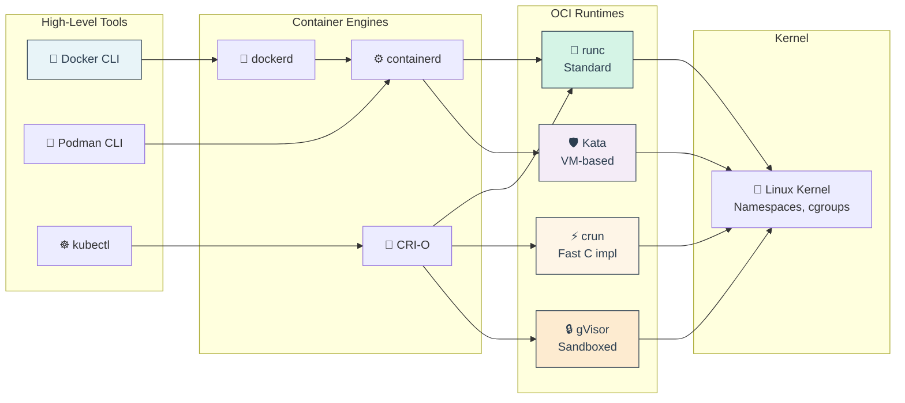

* 🏃 **runc - The Standard Runtime**:
  * 📦 **Origin**: Extracted from Docker libcontainer, donated to OCI
  * 🧬 **Written in**: Go language
  * 🎯 **Features**: Full OCI spec implementation, battle-tested
  * ⚡ **Performance**: Good balance of speed and features
  * 🔧 **Usage**: Default for Docker, containerd, many Kubernetes clusters
  * 📊 **Market Share**: ~80% of container runtimes

* ⚡ **crun - The Fast Runtime**:
  * ⚙️ **Written in**: C language (vs Go for runc)
  * 🚀 **Speed**: 2x faster startup, 30% less memory than runc
  * 🔒 **Security**: Smaller codebase = smaller attack surface
  * 🧩 **Features**: Full OCI compliance, cgroups v2 support
  * 🎯 **Adoption**: Default in Podman, optional in CRI-O
  * 📊 **Benchmarks**: 50ms startup vs 100ms for runc

* 🛡️ **Kata Containers - VM-Isolated Runtime**:
  * 🖥️ **Architecture**: Each container runs in lightweight VM (Qemu/Firecracker)
  * 🔒 **Isolation**: Hardware virtualization = stronger security boundary
  * ⚖️ **Trade-off**: More overhead than runc (~125MB memory), but VM-level isolation
  * 🎯 **Use Cases**: Multi-tenant environments, untrusted code, compliance
  * ☸️ **K8s Integration**: RuntimeClass for mixed workloads

**Kata Containers Architecture**
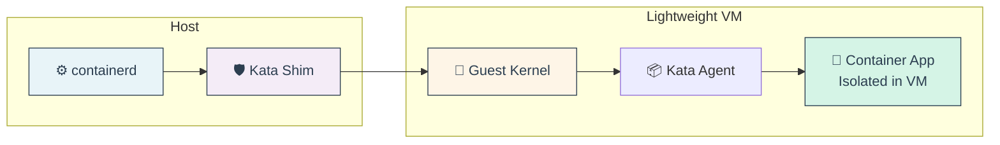

* 🔒 **gVisor - Sandboxed Runtime**:
  * 🧱 **Architecture**: User-space kernel (Sentry) intercepts syscalls
  * 🛡️ **Isolation**: Application doesn't directly access host kernel
  * 📉 **Trade-off**: 10-15% performance overhead vs runc
  * 🎯 **Use Cases**: Serverless platforms (Google Cloud Run), multi-tenant SaaS
  * 🧪 **Compatibility**: ~70% syscall coverage (not all apps work)

**gVisor Architecture**
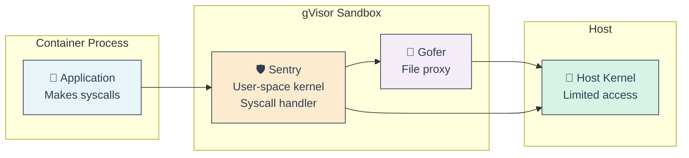

* 📊 **Runtime Comparison Table**:

| **Runtime** | **🏃 runc** | **⚡ crun** | **🛡️ Kata** | **🔒 gVisor** |
|-------------|------------|-----------|------------|-------------|
| **Language** | Go | C | Go/Rust | Go |
| **Startup** | 100ms | 50ms | 500ms | 150ms |
| **Memory** | 30MB | 20MB | 150MB | 40MB |
| **Performance** | Baseline | 102% | 70% | 85% |
| **Isolation** | Namespace | Namespace | VM | Syscall filter |
| **Security** | Good | Good | Excellent | Excellent |
| **Compatibility** | 100% | 100% | 95% | 70% |
| **Use Case** | General | Performance | Security | Sandboxing |

🔗 **Resources:**
* [runc GitHub](https://github.com/opencontainers/runc)
* [crun GitHub](https://github.com/containers/crun)
* [Kata Containers](https://katacontainers.io/)
* [gVisor Documentation](https://gvisor.dev/)

---

## 📍 Slide 9 – 🏗️ Linux Kernel Features (Namespaces, cgroups, Capabilities, SELinux/AppArmor)

* 🐧 **Linux Kernel = Container Foundation** - Containers are NOT a kernel feature; they're built from combining multiple kernel primitives
* 🧩 **Namespaces** = Isolation of system resources (what a process can see)
* 📊 **cgroups (Control Groups)** = Resource limiting and accounting (what a process can use)
* 🔑 **Capabilities** = Fine-grained privilege control (what a process can do)
* 🛡️ **Security Modules** = SELinux/AppArmor for Mandatory Access Control (MAC = Mandatory Access Control)

**Kernel Features Building Blocks**
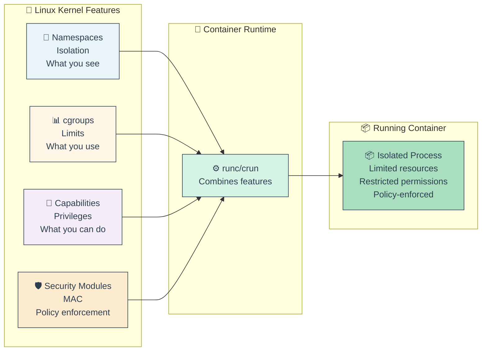

* 🧩 **Namespaces - Process Isolation (7 Types)**:
  * 🆔 **PID (Process ID)**: Isolated process tree, PID 1 inside container
  * 🌐 **Network**: Separate network stack (interfaces, routes, firewall rules)
  * 🏔️ **Mount**: Isolated filesystem mount points
  * 🔤 **UTS (Unix Timesharing System)**: Hostname and domain name isolation
  * 📬 **IPC (Inter-Process Communication)**: Separate message queues, semaphores
  * 👤 **User**: Map container root to non-root host user (rootless containers)
  * ⏰ **Time**: Isolated system clock (Linux 5.6+, for time-sensitive apps)

* 📊 **cgroups - Resource Control (Control Groups)**:
  * 🧠 **CPU**: Limit CPU shares, cores, throttling
  * 💾 **Memory**: Set memory limits, swap, OOM (Out Of Memory) behavior
  * 💿 **I/O**: Disk read/write limits, IOPS (Input/Output Operations Per Second)
  * 🌐 **Network**: Bandwidth limiting (via tc = traffic control)
  * 🎯 **Accounting**: Track resource usage per container
  * 🔄 **Versions**: cgroups v1 (legacy) vs v2 (unified hierarchy, modern)

**cgroups Hierarchy**
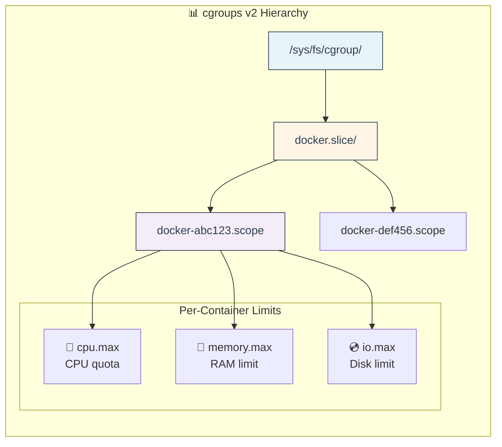

* 🔑 **Capabilities - Fine-Grained Privileges**:
  * 🛡️ **Concept**: Split root privileges into discrete units
  * 📋 **Examples**: CAP_NET_BIND_SERVICE (bind port <1024), CAP_SYS_ADMIN (mount), CAP_CHOWN (change file owner)
  * 🚫 **Default Drop**: Containers drop dangerous capabilities by default
  * ✅ **Add Selectively**: Only grant needed capabilities (principle of least privilege)
  * 🔒 **Rootless**: Run containers as non-root user with limited capabilities

```bash
# 🔍 View default container capabilities
docker run --rm alpine sh -c 'cat /proc/self/status | grep Cap'

# 🚫 Drop all capabilities, add only specific ones
docker run --rm \
  --cap-drop=ALL \
  --cap-add=NET_BIND_SERVICE \
  nginx

# 🧪 Try to use dropped capability (will fail)
docker run --rm \
  --cap-drop=CHOWN \
  alpine chown nobody:nobody /tmp  # ❌ Operation not permitted
```

* 🛡️ **SELinux/AppArmor - Mandatory Access Control**:
  * 🔐 **Purpose**: Enforce security policies beyond traditional permissions
  * 🏢 **SELinux (Security-Enhanced Linux)**: Label-based, used by RHEL/CentOS/Fedora
  * 🍎 **AppArmor**: Path-based, used by Ubuntu/Debian/SUSE
  * 🧩 **Container Policies**: Restrict syscalls, file access, network operations
  * ⚠️ **Modes**: Enforcing (block violations), Permissive (log only), Disabled

* 🧠 **How They Work Together**:
  * 🧩 **Namespaces**: Container sees separate system
  * 📊 **cgroups**: Container limited to allocated resources
  * 🔑 **Capabilities**: Container has restricted permissions
  * 🛡️ **MAC (Mandatory Access Control)**: Kernel enforces security policy

**Complete Isolation Stack**
```mermaid
flowchart LR
    App["📱 App Process"] --> Namespaces["🧩 Namespaces<br/>Isolated view"]
    Namespaces --> Capabilities["🔑 Capabilities<br/>Limited privileges"]
    Capabilities --> cgroups["📊 cgroups<br/>Resource limits"]
    cgroups --> SELinux["🛡️ SELinux/AppArmor<br/>Policy enforcement"]
    SELinux --> Kernel["🐧 Linux Kernel<br/>System calls"]
    
    style App fill:#e8f4f8,stroke:#2c3e50,color:#2c3e50
    style Namespaces fill:#fef5e7,stroke:#2c3e50,color:#2c3e50
    style Capabilities fill:#f4ecf7,stroke:#2c3e50,color:#2c3e50
    style cgroups fill:#fdebd0,stroke:#2c3e50,color:#2c3e50
    style SELinux fill:#d5f4e6,stroke:#2c3e50,color:#2c3e50
    style Kernel fill:#a9dfbf,stroke:#2c3e50,color:#2c3e50
```

* 💡 **Fun Fact**: Containers are just processes with fancy kernel features - you can create a "container" manually using `unshare`, `cgroups`, and `chroot`!

🔗 **Resources:**
* [Linux Namespaces Documentation](https://man7.org/linux/man-pages/man7/namespaces.7.html)
* [cgroups v2 Documentation](https://www.kernel.org/doc/html/latest/admin-guide/cgroup-v2.html)
* [Linux Capabilities](https://man7.org/linux/man-pages/man7/capabilities.7.html)
* [Container Security Best Practices](https://cheatsheetseries.owasp.org/cheatsheets/Docker_Security_Cheat_Sheet.html)

---
## 📍 Slide 10 – 🐋 Docker Architecture (Client-Server, Daemon, CLI, Engine)

* 🏗️ **Docker Architecture** = Client-server model with Docker daemon (dockerd) managing containers
* 💻 **Docker Client** = CLI tool (`docker` command) that talks to daemon via REST API
* 🔧 **Docker Daemon (dockerd)** = Background service managing images, containers, networks, volumes
* ⚙️ **Docker Engine** = Complete package: daemon + containerd + runc
* 🌐 **Remote Access** = Can control remote Docker hosts via TCP/SSH/socket

**Docker Architecture Components**
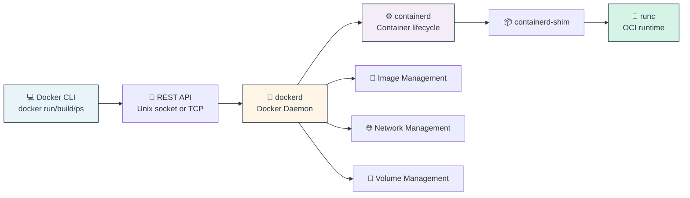

* 🔑 **Key Components**:
  * 🖥️ **Docker Desktop**: GUI app for Mac/Windows (includes Docker Engine)
  * 🐳 **Docker Hub**: Default public registry for images
  * 🔌 **Docker API**: RESTful interface for automation
  * 🧩 **Docker Compose**: Multi-container orchestration tool

```bash
# 🔍 Docker architecture inspection
docker version              # Shows client and server versions
docker info                 # Detailed system information
docker system df            # Disk usage by images/containers/volumes

# 🌐 Connect to remote Docker host
docker -H ssh://user@remote.host ps
docker -H tcp://192.168.1.10:2375 ps
```

🔗 **Resources:**
* [Docker Architecture Overview](https://docs.docker.com/get-started/overview/)
* [Docker Engine API](https://docs.docker.com/engine/api/)

---

## 📍 Slide 11 – 📦 Docker Images & Layers (Build Process, Caching, Multi-stage)

* 🎂 **Image Layers** = Read-only filesystem layers stacked using Union FS (UnionFS = Union File System)
* 🔄 **Layer Caching** = Unchanged layers reused in builds (speeds up rebuilds)
* 🏗️ **Build Context** = Files sent to Docker daemon during build
* 🎯 **Multi-stage Builds** = Use multiple FROM statements to reduce final image size
* 📏 **Best Practice** = Order Dockerfile commands from least to most frequently changing

**Image Layer Stack**


🔗 **Resources:**
* [Dockerfile Best Practices](https://docs.docker.com/develop/develop-images/dockerfile_best-practices/)
* [Multi-stage Builds](https://docs.docker.com/build/building/multi-stage/)

---

## 📍 Slide 12 – 🎯 Dockerfile Best Practices (Optimization, Security, Size)

* 📏 **Order Matters** = Place frequently changing commands last (maximize cache hits)
* 🪶 **Minimize Layers** = Combine RUN commands with `&&` to reduce layers
* 🧹 **Clean Up** = Remove temporary files in same RUN command
* 🔒 **Security** = Use non-root user, scan for vulnerabilities, minimal base images
* 📦 **Size Optimization** = Use Alpine Linux, multi-stage builds, .dockerignore
* 🔑 **Key Optimizations**:
  * 📁 **.dockerignore**: Exclude unnecessary files from build context
  * 🏗️ **Layer Ordering**: Dependencies before code (better caching)
  * 🧹 **Cleanup in Same Layer**: `RUN apt-get update && apt-get install && rm -rf /var/lib/apt/lists/*`
  * 🔒 **Non-root User**: Create and switch to unprivileged user
  * 🎯 **Minimal Base**: Alpine (5MB) vs Ubuntu (77MB)

🔗 **Resources:**
* [Docker Security Best Practices](https://snyk.io/blog/10-docker-image-security-best-practices/)
* [Dockerfile Optimization](https://docs.docker.com/develop/dev-best-practices/)

---

## 📍 Slide 13 – 🌐 Docker Networking (Bridge, Host, Overlay, Container Communication)

* 🌉 **Bridge Network** = Default, isolated network for containers on single host
* 🏠 **Host Network** = Container uses host's network stack directly (no isolation)
* 🌐 **Overlay Network** = Multi-host networking for Docker Swarm/services
* 🔗 **Container Links** = Deprecated; use user-defined networks instead
* 🔌 **Port Mapping** = `-p host:container` exposes container ports to host

**Docker Network Types**
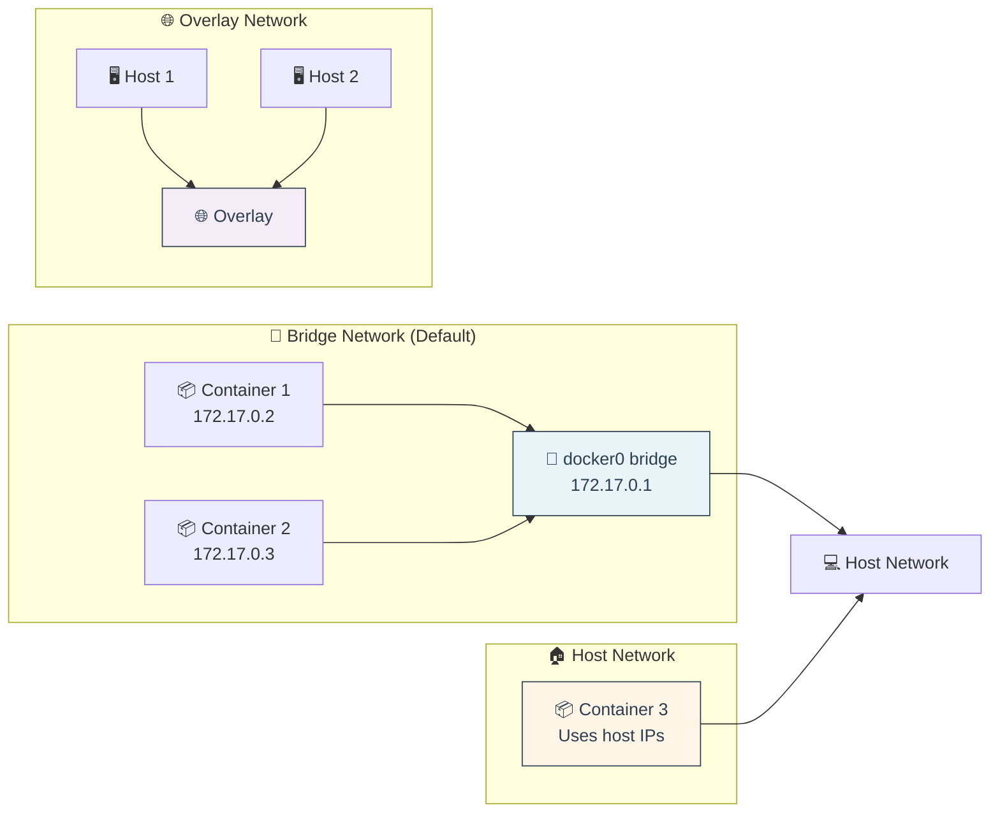

* 📊 **Network Drivers**:
  * 🌉 **bridge**: Default, single host
  * 🏠 **host**: No isolation, best performance
  * 🔌 **none**: No networking
  * 🌐 **overlay**: Multi-host (Swarm)
  * 🔗 **macvlan**: Assign MAC address to container

🔗 **Resources:**
* [Docker Networking Overview](https://docs.docker.com/network/)
* [Container Networking Deep Dive](https://www.youtube.com/watch?v=bKFMS5C4CG0)

---

## 📍 Slide 14 – 💾 Docker Storage (Volumes, Bind Mounts, tmpfs, Drivers)

* 💾 **Volumes** = Managed by Docker, best for persistent data
* 📁 **Bind Mounts** = Mount host directory into container
* ⚡ **tmpfs** = In-memory storage, fast but ephemeral
* 🗄️ **Storage Drivers** = overlay2 (default), btrfs, zfs, devicemapper
* 🔄 **Container Layer** = Writable layer on top of read-only image layers

**Storage Options Comparison**
```mermaid
flowchart LR
    subgraph "💾 Docker Volume"
        Vol["🗄️ Managed by Docker<br/>/var/lib/docker/volumes/<br/>Best practice"]
    end
    
    subgraph "📁 Bind Mount"
        Bind["📂 Host directory<br/>/home/user/data<br/>Development use"]
    end
    
    subgraph "⚡ tmpfs"
        Tmp["💨 RAM-based<br/>Temporary data<br/>Fast, ephemeral"]
    end
    
    Container["📦 Container"] --> Vol
    Container --> Bind
    Container --> Tmp
    
    style Vol fill:#e8f4f8,stroke:#2c3e50,color:#2c3e50
    style Bind fill:#fef5e7,stroke:#2c3e50,color:#2c3e50
    style Tmp fill:#f4ecf7,stroke:#2c3e50,color:#2c3e50
```

* 🎯 **When to Use**:
  * 💾 **Volumes**: Databases, application data, production
  * 📁 **Bind Mounts**: Development, config files, logs
  * ⚡ **tmpfs**: Sensitive data, temporary processing

🔗 **Resources:**
* [Docker Storage Overview](https://docs.docker.com/storage/)
* [Volume vs Bind Mount](https://docs.docker.com/storage/volumes/)

---

### 🎭 **Interactive Break #1: "Container Horror Stories"**

**👻 Share Your Container Nightmares!**

*Time for some fun! Let's hear about container disasters - learning from mistakes is the best education!*

**🔥 Common Horror Stories:**

1. **💣 "The 300GB Log File"**
   * Developer ran container without volume
   * App logged to container filesystem
   * Filled up entire host disk
   * All containers crashed
   * **Lesson**: Always use volumes for logs! 📝

2. **🐳 "The Zombie Container Army"**
   * CI/CD pipeline didn't clean up
   * `docker ps -a` showed 10,000+ stopped containers
   * Host ran out of disk space
   * **Lesson**: Use `--rm` flag or cleanup scripts! 🧹

3. **🔒 "The Exposed Database"**
   * Accidentally used `-p 5432:5432` on public server
   * PostgreSQL open to internet
   * Got hacked in 3 hours
   * **Lesson**: Never expose databases directly! 🛡️

4. **🏷️ "The Latest Tag Disaster"**
   * Production used `image:latest`
   * Latest changed overnight
   * Production broke at 3 AM
   * **Lesson**: Pin specific versions! 📌

5. **💾 "The Lost Data Tragedy"**
   * Database container without volume
   * `docker-compose down`
   * All customer data gone
   * **Lesson**: Volumes for stateful apps! 💾

**🤔 Discussion Questions:**
1. What's the weirdest container issue you've encountered?
2. Ever accidentally deleted production data?
3. What's your container backup strategy?
4. How do you prevent container sprawl?

**🎯 Quick Quiz:**
* Q: What happens to data when you delete a container without volumes?
* A: 💀 It's gone forever!

*Remember: Every expert was once a beginner who didn't give up after their first container disaster!* 😄

---

## 📍 Slide 15 – ☸️ Introduction to Kubernetes (What, Why, Architecture)

* ☸️ **Kubernetes (K8s)** = Open-source container orchestration platform for automating deployment, scaling, and management
* 🎯 **Born at Google** = Based on 15+ years of running containers (Borg/Omega systems)
* 🌐 **CNCF Project** = Donated to Cloud Native Computing Foundation in 2015
* 🚀 **Problem It Solves** = Managing hundreds/thousands of containers across multiple hosts
* 📊 **Market Dominance** = De facto standard for container orchestration (78% adoption)

**Kubernetes solves Container Orchestration Challenges**
```mermaid
flowchart LR
    subgraph "❌ Without Kubernetes"
        P1["🤯 Manual scaling<br/>SSH to each host"]
        P2["💔 No self-healing<br/>Manual restart"]
        P3["🌐 Complex networking<br/>Manual load balancing"]
        P4["📦 Hard deployments<br/>Downtime required"]
    end
    
    subgraph "✅ With Kubernetes"
        S1["⚡ Auto-scaling<br/>Based on metrics"]
        S2["🔄 Self-healing<br/>Auto restart/replace"]
        S3["🌉 Service discovery<br/>Built-in load balancing"]
        S4["🚀 Rolling updates<br/>Zero-downtime deploys"]
    end
    
    P1 --> S1
    P2 --> S2
    P3 --> S3
    P4 --> S4
    
    style P1 fill:#fadbd8,stroke:#2c3e50,color:#2c3e50
    style S1 fill:#d5f4e6,stroke:#2c3e50,color:#2c3e50
```

* 🎯 **Core Capabilities**:
  * 📦 **Service Discovery & Load Balancing**: Automatic DNS and traffic distribution
  * 💾 **Storage Orchestration**: Auto-mount cloud/local storage
  * 🔄 **Automated Rollouts/Rollbacks**: Gradual deployment with health checks
  * 📊 **Automatic Bin Packing**: Optimal container placement based on resources
  * 🔒 **Secret & Config Management**: Secure handling of sensitive data
  * 🔧 **Self-Healing**: Restart failed containers, replace/reschedule

🔗 **Resources:**
* [Kubernetes Official Docs](https://kubernetes.io/docs/home/)
* [Kubernetes the Hard Way](https://github.com/kelseyhightower/kubernetes-the-hard-way)
* [CNCF Kubernetes Overview](https://www.cncf.io/projects/kubernetes/)

---

## 📍 Slide 16 – 🧩 Kubernetes Core Components (Control Plane, Nodes, etcd)

* 🎯 **Control Plane** = Manages the cluster, makes decisions, detects/responds to events
* 🖥️ **Worker Nodes** = Run containerized applications (Pods)
* 🗄️ **etcd** = Distributed key-value store for all cluster data
* 🔄 **Declarative Model** = Describe desired state, K8s makes it happen
* 🌐 **Highly Available** = Control plane can run on multiple nodes

**Kubernetes Cluster Architecture**
```mermaid
flowchart LR
    subgraph "🎯 Control Plane (Master)"
        API["🌐 API Server<br/>kubectl endpoint"]
        Sched["📅 Scheduler<br/>Assigns pods to nodes"]
        CM["🎛️ Controller Manager<br/>Reconciliation loops"]
        etcd["🗄️ etcd<br/>Cluster state DB"]
    end
    
    subgraph "🖥️ Worker Node 1"
        kubelet1["🤖 kubelet<br/>Node agent"]
        proxy1["🌉 kube-proxy<br/>Network rules"]
        runtime1["🐳 Container Runtime<br/>containerd"]
        pod1["📦 Pods"]
    end
    
    subgraph "🖥️ Worker Node 2"
        kubelet2["🤖 kubelet"]
        proxy2["🌉 kube-proxy"]
        runtime2["🐳 Container Runtime"]
        pod2["📦 Pods"]
    end
    
    API --> etcd
    API --> Sched
    API --> CM
    
    kubelet1 --> API
    kubelet2 --> API
    
    kubelet1 --> runtime1
    runtime1 --> pod1
    
    kubelet2 --> runtime2
    runtime2 --> pod2
    
    style API fill:#e8f4f8,stroke:#2c3e50,color:#2c3e50
    style etcd fill:#fef5e7,stroke:#2c3e50,color:#2c3e50
    style kubelet1 fill:#f4ecf7,stroke:#2c3e50,color:#2c3e50
    style pod1 fill:#d5f4e6,stroke:#2c3e50,color:#2c3e50
```

* 🎯 **Control Plane Components**:
  * 🌐 **kube-apiserver**: Front-end REST API, only component that talks to etcd
  * 📅 **kube-scheduler**: Watches for new pods, assigns to nodes based on resources
  * 🎛️ **kube-controller-manager**: Runs controller loops (node, replication, endpoints, service accounts)
  * ☁️ **cloud-controller-manager**: Integrates with cloud providers (optional)

* 🖥️ **Worker Node Components**:
  * 🤖 **kubelet**: Agent that ensures containers are running in pods
  * 🌉 **kube-proxy**: Network proxy, maintains network rules, enables service communication
  * 🐳 **Container Runtime**: Runs containers (containerd, CRI-O, Docker deprecated)

🔗 **Resources:**
* [Kubernetes Components](https://kubernetes.io/docs/concepts/overview/components/)
* [Understanding etcd](https://etcd.io/docs/)

---

## 📍 Slide 17 – 🎯 Kubernetes Objects (Pods, Deployments, Services, ConfigMaps, Secrets)

* 📦 **Pod** = Smallest deployable unit, one or more containers sharing network/storage
* 🚀 **Deployment** = Manages replica pods, rolling updates, rollbacks
* 🌐 **Service** = Stable network endpoint for accessing pods (load balancing)
* ⚙️ **ConfigMap** = Configuration data (non-sensitive)
* 🔒 **Secret** = Sensitive data (passwords, tokens, keys)

**Kubernetes Object Hierarchy**
```mermaid
flowchart LR
    User["👨‍💻 User"] --> Deployment["🚀 Deployment<br/>Desired replicas: 3"]
    Deployment --> RS["📋 ReplicaSet<br/>Manages pods"]
    RS --> Pod1["📦 Pod 1<br/>Container(s)"]
    RS --> Pod2["📦 Pod 2<br/>Container(s)"]
    RS --> Pod3["📦 Pod 3<br/>Container(s)"]
    
    Service["🌐 Service<br/>Load balancer"] --> Pod1
    Service --> Pod2
    Service --> Pod3
    
    Pod1 --> CM["⚙️ ConfigMap<br/>Config data"]
    Pod1 --> Secret["🔒 Secret<br/>Passwords"]
    
    style Deployment fill:#e8f4f8,stroke:#2c3e50,color:#2c3e50
    style Service fill:#fef5e7,stroke:#2c3e50,color:#2c3e50
    style Pod1 fill:#d5f4e6,stroke:#2c3e50,color:#2c3e50
```

🔗 **Resources:**
* [Kubernetes Objects Overview](https://kubernetes.io/docs/concepts/overview/working-with-objects/)
* [Pod Lifecycle](https://kubernetes.io/docs/concepts/workloads/pods/pod-lifecycle/)

---

## 📍 Slide 18 – 🌐 Kubernetes Networking (CNI, Services, Ingress, NetworkPolicies)

* 🔌 **CNI (Container Network Interface)** = Plugin architecture for pod networking
* 🌉 **Service Types** = ClusterIP (internal), NodePort (external), LoadBalancer (cloud)
* 🌐 **Ingress** = HTTP/HTTPS routing to services (reverse proxy)
* 🛡️ **NetworkPolicy** = Firewall rules for pod communication
* 📡 **DNS** = Automatic service discovery via CoreDNS

**Kubernetes Networking Model**
```mermaid
flowchart LR
    Internet["🌍 Internet"] --> Ingress["🌐 Ingress<br/>nginx/traefik<br/>HTTP routing"]
    Ingress --> Service1["🌉 Service<br/>web-service<br/>ClusterIP"]
    Ingress --> Service2["🌉 Service<br/>api-service<br/>ClusterIP"]
    
    Service1 --> Pod1["📦 Pod 1<br/>10.244.1.5"]
    Service1 --> Pod2["📦 Pod 2<br/>10.244.2.7"]
    Service2 --> Pod3["📦 Pod 3<br/>10.244.1.8"]
    
    NP["🛡️ NetworkPolicy<br/>Allow/Deny rules"] --> Pod1
    
    style Ingress fill:#e8f4f8,stroke:#2c3e50,color:#2c3e50
    style Service1 fill:#fef5e7,stroke:#2c3e50,color:#2c3e50
    style Pod1 fill:#d5f4e6,stroke:#2c3e50,color:#2c3e50
```

* 🔌 **Popular CNI Plugins**:
  * 🌐 **Calico**: Network policies, BGP routing
  * 🌊 **Cilium**: eBPF-based, high performance
  * 🔗 **Flannel**: Simple, overlay network
  * 🌉 **Weave Net**: Mesh networking

🔗 **Resources:**
* [Kubernetes Networking Model](https://kubernetes.io/docs/concepts/services-networking/)
* [Ingress Controllers](https://kubernetes.io/docs/concepts/services-networking/ingress-controllers/)

---

## 📍 Slide 19 – 💾 Kubernetes Storage (PersistentVolumes, PVCs, StorageClasses)

* 💾 **PersistentVolume (PV)** = Cluster storage resource (admin-provisioned or dynamic)
* 📋 **PersistentVolumeClaim (PVC)** = Request for storage by a pod
* 🏗️ **StorageClass** = Dynamic provisioning profile (cloud disks, NFS, etc.)
* 🔄 **Volume Lifecycle** = Provisioning → Binding → Using → Reclaiming
* 📦 **Access Modes** = ReadWriteOnce (RWO), ReadOnlyMany (ROX), ReadWriteMany (RWX)

**Storage Architecture**
```mermaid
flowchart LR
    Pod["📦 Pod<br/>Needs storage"] --> PVC["📋 PVC<br/>Request: 10GB"]
    PVC --> PV["💾 PV<br/>Cloud disk/NFS<br/>Bound to PVC"]
    
    SC["🏗️ StorageClass<br/>Dynamic provisioner"] --> PV
    
    Cloud["☁️ Cloud Provider<br/>AWS EBS/GCP PD"] --> PV
    
    style Pod fill:#e8f4f8,stroke:#2c3e50,color:#2c3e50
    style PVC fill:#fef5e7,stroke:#2c3e50,color:#2c3e50
    style PV fill:#f4ecf7,stroke:#2c3e50,color:#2c3e50
    style SC fill:#d5f4e6,stroke:#2c3e50,color:#2c3e50
```

* 🎯 **Access Modes**:
  * **RWO (ReadWriteOnce)**: Single node read-write (most common)
  * **ROX (ReadOnlyMany)**: Multiple nodes read-only
  * **RWX (ReadWriteMany)**: Multiple nodes read-write (NFS, CephFS)

🔗 **Resources:**
* [Kubernetes Storage](https://kubernetes.io/docs/concepts/storage/)
* [Persistent Volumes](https://kubernetes.io/docs/concepts/storage/persistent-volumes/)

---
