# 📌 Lecture 7 - GitOps & Progressive Delivery

## 📍 Slide 1 – 🚀 What is GitOps? - The Modern Way to Operate

* 🎯 **GitOps = Git + Operations** - Git as single source of truth for infrastructure and applications
* 📜 **Core Idea**: Declarative config in Git → Automated deployment → Continuous reconciliation
* 🔄 **Paradigm**: From "run these commands" to "this is what I want"
* 🌍 **Adoption**: 67% of K8s orgs use GitOps (2024), up from 28% (2021)
* ⚡ **Impact**: 75% faster deploys, 50% fewer incidents, 90% less config errors

**GitOps Workflow Overview**
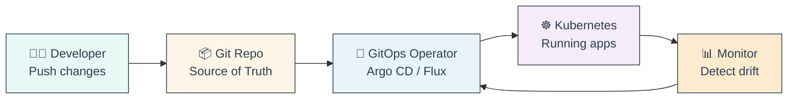

* 🔑 **Key Components**:
  * 📂 **Git Repository**: YAML manifests, Helm charts, Kustomize configs
  * 🤖 **Operator**: Watches Git, syncs to cluster (Argo CD, Flux)
  * ☸️ **K8s Cluster**: Target infrastructure
  * 🔄 **Reconciliation**: Ensures Git state = Cluster state

* 📊 **GitOps vs Traditional**:

| Aspect | ❌ Traditional | ✅ GitOps |
|--------|---------------|-----------|
| Config | Manual scripts | Declarative Git |
| Deploy | Push from CI/CD | Pull by operator |
| Audit | Scattered logs | Git history |
| Rollback | Manual, risky | Git revert |
| Security | Credentials everywhere | Operator-only access |
| Drift | Manual checks | Auto-reconcile |

🔗 **Resources:**
* [OpenGitOps Principles](https://opengitops.dev/)
* [Weaveworks GitOps Guide](https://www.weave.works/technologies/gitops/)
* [CNCF GitOps Working Group](https://github.com/cncf/tag-app-delivery/tree/main/gitops-wg)

---

## 📍 Slide 2 – 📜 GitOps History - From FTP to Pull Requests

* 🏛️ **1990s**: FTP uploads, manual SSH, no version control
* 📦 **2000s**: Puppet (2005), Chef (2009) - still imperative
* 🐳 **2013**: Docker - immutable infrastructure concept
* ☸️ **2014**: Kubernetes - declarative API foundation
* 🎉 **2017**: Alexis Richardson (Weaveworks) coins "GitOps" term
* 🚀 **2018-2020**: Argo CD, Flux, Jenkins X adoption
* 🏆 **2021-2024**: CNCF standardization, Argo + Flux graduated

**Evolution Timeline**
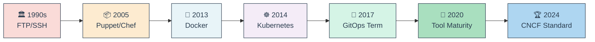

* 🎭 **Key Milestones**:
  * **2016**: Weaveworks creates Flux (first GitOps tool)
  * **2017**: "GitOps" term coined (August blog post)
  * **2018**: Intuit releases Argo CD
  * **2020**: GitLab adds GitOps features
  * **2021**: CNCF OpenGitOps Working Group formed
  * **2022**: Argo CD + Flux become CNCF Graduated Projects
  * **2024**: 80+ GitOps tools in CNCF landscape

* 💡 **Fun Historical Facts**:
  * 🐑 Original Weaveworks blog post had 200 reads, now referenced in 1000+ articles
  * 🏢 Netflix was doing "GitOps-like" practices since 2011 (called it "Declarative Infrastructure")
  * 🎯 First GitOps production deployment: Weaveworks' own platform (2016)
  * 📊 Google SRE book (2016) described similar concepts without calling it "GitOps"
  * 🔥 Initial resistance: "Why do we need another methodology?" → Now industry standard

* 🌍 **Industry Adoption Growth**:
  * **2018**: <5% adoption (early adopters only)
  * **2020**: 15% adoption (post-COVID cloud migration boom)
  * **2022**: 45% adoption (CNCF graduation impact)
  * **2024**: 67% adoption (becoming default practice)
  * **2026 Projection**: 85%+ adoption expected

🔗 **Resources:**
* [Original GitOps Blog Post (2017)](https://www.weave.works/blog/gitops-operations-by-pull-request)
* [CNCF Case Studies](https://www.cncf.io/case-studies/)
* [GitOps Timeline History](https://www.gitops.tech/)

---

## 📍 Slide 3 – 🎯 GitOps Principles - The Four Golden Rules

* 📜 **OpenGitOps Principles** (CNCF Standard, v1.0.0 - 2021):
  1. 🎨 **Declarative**: System state expressed as code, not procedures
  2. 🔒 **Versioned & Immutable**: Git stores complete history, audit trail
  3. 🔄 **Pulled Automatically**: Agents fetch from Git (not pushed by CI/CD)
  4. 🤖 **Continuously Reconciled**: Auto-detect drift, self-heal

**The Four GitOps Principles**
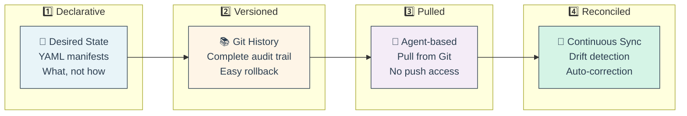

* 🎨 **Principle 1: Declarative Configuration**
  * ✅ **Good**: Kubernetes YAML, Helm values, Terraform HCL
  * ❌ **Bad**: Bash scripts with `kubectl apply` commands
  * 📦 **Example**: "Deploy 3 replicas of nginx:1.21" not "run this script"
  * 🎯 **Benefit**: Reproducible, auditable, testable

* 🔒 **Principle 2: Versioned & Immutable**
  * ✅ Git commits = immutable snapshots of infrastructure
  * 📚 Complete history: Who changed what, when, why
  * 🔄 Easy rollback: `git revert` → auto-deployed
  * 🔐 Audit compliance: SOC2, ISO 27001 requirements met
  * ⚠️ **Anti-pattern**: Editing live YAML in cluster (`kubectl edit`)

* 🔄 **Principle 3: Pulled Automatically**
  * 🤖 GitOps operator runs **inside** the cluster
  * 📥 Operator watches Git repo for changes
  * 🔐 **Security Win**: No cluster credentials in CI/CD pipelines
  * 🌐 Firewall-friendly: Outbound-only connections
  * ⚡ **Benefit**: Multi-cluster deployment from single Git repo

**Pull vs Push Model**
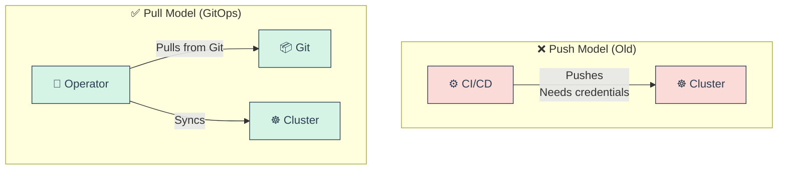

* 🤖 **Principle 4: Continuously Reconciled**
  * 🔍 Operator compares Git (desired) vs Cluster (actual)
  * 🚨 **Drift Detection**: Someone ran `kubectl delete`? Operator restores it
  * ⏱️ Reconciliation loop: Every 3 minutes (configurable)
  * 🛡️ **Self-Healing**: Auto-fix misconfigurations
  * 📊 Reports sync status: In Sync, Out of Sync, Progressing

* 💪 **Benefits Summary**:
  * 🔐 **Security**: Least privilege, no cluster credentials leak
  * 📚 **Auditability**: Git log = complete change history
  * 🔄 **Disaster Recovery**: Git clone + sync = cluster restored
  * ⚡ **Speed**: PRs merged = instant deployment
  * 🧪 **Testing**: Validate YAML before merge
  * 👥 **Collaboration**: Code review for infrastructure changes

* ⚠️ **Common Anti-Patterns (What NOT to Do)**:
  * ❌ Direct `kubectl apply` from laptop ("works on my machine")
  * ❌ Manual edits in production
  * ❌ Configuration stored in Confluence/wiki
  * ❌ CI/CD with cluster admin credentials
  * ❌ No Git history (force push, rebasing main branch)
  * ❌ Ignoring drift detection alerts

🔗 **Resources:**
* [OpenGitOps v1.0.0 Spec](https://github.com/open-gitops/documents/blob/main/PRINCIPLES.md)
* [GitOps Principles Explained](https://opengitops.dev/)
* [CNCF GitOps Whitepaper](https://github.com/cncf/tag-app-delivery/blob/main/gitops-wg/assets/gitops-whitepaper.pdf)

---

## 📍 Slide 4 – ⚡ Push vs Pull Deployment Models - The Great Debate

* 🚀 **Push Model (Traditional CI/CD)**:
  * CI/CD pipeline **pushes** changes to cluster
  * Requires cluster credentials in CI/CD system
  * Examples: Jenkins, GitLab CI, GitHub Actions with kubectl

* 🔄 **Pull Model (GitOps)**:
  * Operator **pulls** from Git repository
  * Runs inside cluster, no external credentials
  * Examples: Argo CD, Flux CD

**Push vs Pull Architecture Comparison**
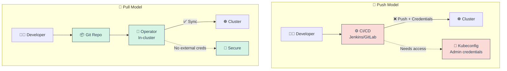

* 📊 **Detailed Comparison**:

| Aspect | 🚀 Push Model | 🔄 Pull Model |
|--------|--------------|--------------|
| **Security** | ❌ Credentials in CI/CD | ✅ In-cluster only |
| **Scalability** | ❌ CI/CD bottleneck | ✅ Scales per cluster |
| **Auditability** | ⚠️ CI/CD logs | ✅ Git commits |
| **Firewall** | ❌ Inbound access needed | ✅ Outbound only |
| **Rollback** | ❌ Re-run pipeline | ✅ Git revert |
| **Drift** | ❌ Not detected | ✅ Auto-corrected |
| **Multi-cluster** | ❌ Complex | ✅ Easy |

* 🚀 **Push Model - Pros & Cons**:
  * ✅ **Pros**:
    * Simple, familiar workflow
    * Immediate feedback in CI/CD
    * Works with any infrastructure (not just K8s)
    * Good for build/test stages
  * ❌ **Cons**:
    * Cluster credentials in CI/CD = security risk
    * No drift detection
    * Scaling to 100+ clusters difficult
    * Firewall/network complexity

* 🔄 **Pull Model - Pros & Cons**:
  * ✅ **Pros**:
    * Enhanced security (no external credentials)
    * Automatic drift detection + correction
    * Scales to 1000+ clusters easily
    * Firewall-friendly (outbound only)
    * Self-healing systems
  * ❌ **Cons**:
    * Requires operator installation
    * Kubernetes-specific (mostly)
    * Slightly delayed feedback vs push
    * Learning curve for teams

* 🎯 **When to Use Push Model**:
  * 🔨 Building and testing artifacts (CI phase)
  * 🧪 Running integration tests
  * 📦 Publishing Docker images
  * ✅ Generating and validating manifests
  * 🚫 **NOT for** deploying to production clusters

* 🎯 **When to Use Pull Model**:
  * 🚀 Deploying to production
  * 🌍 Multi-cluster deployments
  * 🔐 Security-sensitive environments
  * 🏢 Enterprise scale (100+ clusters)
  * ☸️ Kubernetes-native applications

* 🔀 **Hybrid Approach (Best Practice)**:
  * **CI Pipeline (Push)**: Build → Test → Push image to registry → Update Git repo
  * **GitOps (Pull)**: Operator syncs Git → Deploys to cluster
  * 🎯 **Pattern**: "Push to Git, Pull to Cluster"

**Hybrid GitOps Pipeline**
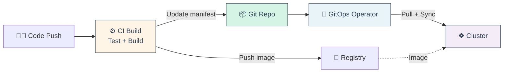

* 💡 **Real-World Example - Intuit**:
  * 🏢 Manages 2000+ Kubernetes clusters
  * 🚀 Uses push for CI, pull for CD
  * 📊 Reduced deployment time from 4 hours to 15 minutes
  * 🔐 Zero production credential leaks since GitOps adoption
  * 💰 Saved $2M annually in operational costs

* 🔐 **Security Comparison Deep Dive**:
  * **Push Model Risk**: Compromise CI/CD → Access all clusters
  * **Pull Model Risk**: Compromise Git → Limited blast radius
  * **Mitigation**: Branch protection, signed commits, RBAC

🔗 **Resources:**
* [GitOps Push vs Pull](https://www.weave.works/blog/gitops-operations-by-pull-request)
* [Argo CD vs Jenkins](https://blog.argoproj.io/argo-cd-vs-jenkins-x-vs-spinnaker-8e5d5e9c9fca)
* [Pull-based GitOps Security](https://www.cncf.io/blog/2021/03/11/gitops-and-security/)

---

## 📍 Slide 5 – 🛠️ GitOps Tooling Landscape - Choosing Your Weapon

* 🏆 **Top GitOps Operators (CNCF Projects)**:
  * 🚀 **Argo CD**: Application-focused, powerful UI, enterprise features
  * 🌊 **Flux CD**: Modular toolkit, GitOps Toolkit components
  * ☸️ **Others**: Jenkins X, Rancher Fleet, Codefresh

**CNCF GitOps Landscape 2024**
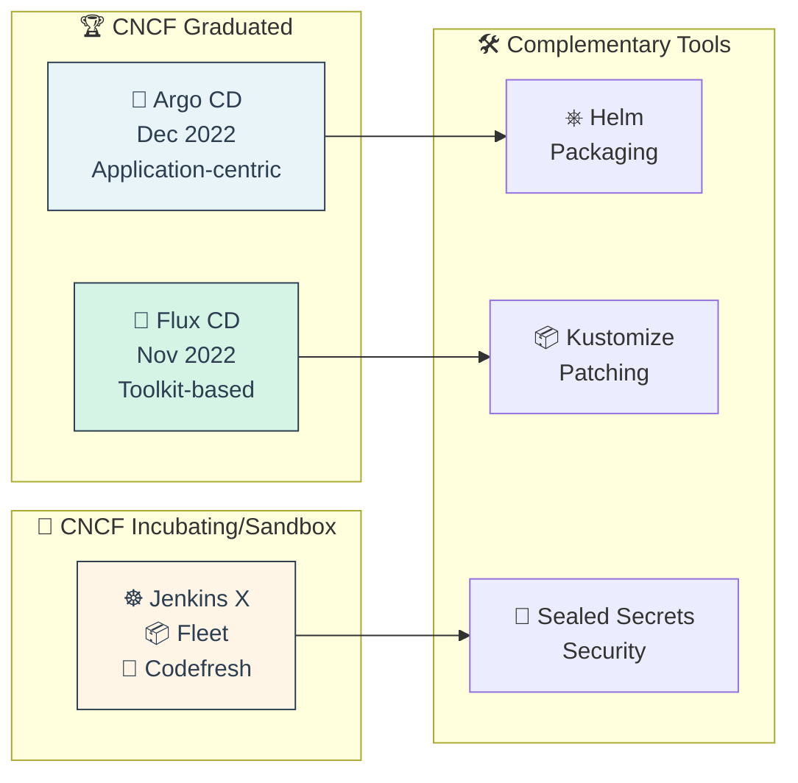

* 🚀 **Argo CD Overview**:
  * 🎯 **Focus**: Application deployment and lifecycle management
  * 🖥️ **UI**: Rich web interface, application tree view
  * 📊 **Features**: Multi-cluster, SSO, RBAC, hooks, sync waves
  * 👥 **Creator**: Intuit (2018), now CNCF Graduated
  * 📈 **Adoption**: 60% market share, 15K+ GitHub stars
  * 🏢 **Best For**: Teams wanting UI-first experience

* 🌊 **Flux CD Overview**:
  * 🎯 **Focus**: GitOps Toolkit - composable, extensible components
  * ⌨️ **CLI-first**: `flux` CLI, optional UI (Weave GitOps)
  * 🧩 **Architecture**: Source Controller, Kustomize Controller, Helm Controller
  * 👥 **Creator**: Weaveworks (2016), CNCF Graduated
  * 📈 **Adoption**: 30% market share, 6K+ GitHub stars
  * 🏢 **Best For**: Platform teams, advanced customization

* 📊 **Feature Comparison Matrix**:

| Feature | 🚀 Argo CD | 🌊 Flux CD |
|---------|-----------|-----------|
| **UI** | ✅ Excellent native UI | ⚠️ Optional (Weave GitOps) |
| **CLI** | ✅ `argocd` CLI | ✅ `flux` CLI |
| **Multi-tenancy** | ✅ AppProjects | ✅ Namespaced controllers |
| **Git Sources** | ✅ Git repos | ✅ Git + OCI + S3 |
| **Helm Support** | ✅ Native | ✅ HelmRelease CRD |
| **Kustomize** | ✅ Native | ✅ Kustomization CRD |
| **OCI Registry** | ⚠️ Improving (v2.8+) | ✅ Excellent |
| **Notifications** | ✅ Built-in | ✅ Notification Controller |
| **Progressive Delivery** | ⚠️ Via Argo Rollouts | ✅ Via Flagger |
| **Scalability** | ✅ 1000+ clusters | ✅ 1000+ clusters |
| **Learning Curve** | 🟢 Easy | 🟡 Moderate |

* 🔧 **Complementary Tools**:
  * ⎈ **Helm**: Package manager, templating (both tools support)
  * 📦 **Kustomize**: YAML patching, overlays (both tools support)
  * 🔐 **Sealed Secrets**: Encrypted secrets in Git (both tools support)
  * 🗝️ **External Secrets**: Sync from Vault/AWS Secrets Manager
  * 🔑 **SOPS**: Mozilla's encryption for YAML
  * 🌍 **Terraform**: Infrastructure provisioning (use with GitOps)

* 🎯 **Decision Tree - When to Choose What**:

**Argo CD** if you want:
- 🖥️ Rich UI for visualization
- 🎯 Application-centric approach
- 🔄 Built-in sync waves and hooks
- 👥 Easy onboarding for developers
- 🏢 Enterprise features (SSO, RBAC)

**Flux CD** if you want:
- 🧩 Modular, composable architecture
- 📦 OCI registry support
- 🔧 Maximum flexibility
- 🌊 Embedded in platform (GitLab, Azure Arc)
- ⚙️ Advanced customization

**Both** if you:
- 🏢 Have multiple teams with different needs
- 🔄 Want to learn both approaches
- 🎯 Need specialized features from each

* 📈 **Market Share & Adoption (2024)**:
  * 🚀 Argo CD: ~60% (15,000+ stars, 10M+ pulls)
  * 🌊 Flux CD: ~30% (6,000+ stars, integrated in platforms)
  * ☸️ Others: ~10% (Jenkins X, Fleet, etc.)

* 💼 **Industry Usage**:
  * **Argo CD**: Intuit, Tesla, Adobe, Red Hat, IBM
  * **Flux CD**: Microsoft Azure Arc, GitLab, D2iQ, VMware
  * **Both**: Many enterprises run both for different use cases

🔗 **Resources:**
* [Argo CD Documentation](https://argo-cd.readthedocs.io/)
* [Flux CD Documentation](https://fluxcd.io/docs/)
* [CNCF Landscape GitOps Category](https://landscape.cncf.io/card-mode?category=continuous-integration-delivery&grouping=category)
* [GitOps Tools Comparison](https://www.weave.works/blog/gitops-tools-comparison)

---

## 📍 Slide 6 – 🏗️ GitOps Repository Strategies - Organizing Your Git Repos

* 📂 **Repository Structure Decisions**:
  * 🏢 **Monorepo vs Polyrepo**: One repo for everything vs separate repos
  * 📁 **Directory Layout**: How to organize apps, environments, clusters
  * 🌳 **Branching Strategy**: How to handle environments and promotions
  * 🔀 **Separation of Concerns**: Application code vs configuration

**Monorepo vs Polyrepo Comparison**
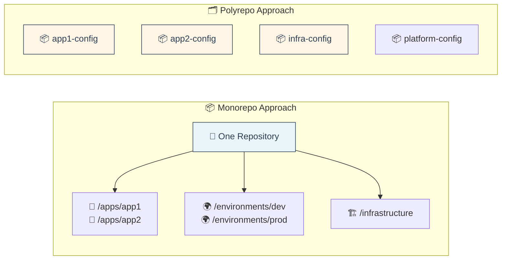

* 📦 **Monorepo Strategy**:
  * ✅ **Pros**:
    * Single source of truth, atomic changes across apps
    * Easier to enforce standards
    * Simpler CI/CD configuration
  * ❌ **Cons**:
    * Large repos slow down Git operations
    * Harder RBAC (entire repo access)
    * Team independence limited
  * 🎯 **Best For**: Small teams (5-20), platform teams, getting started

* 🗂️ **Polyrepo Strategy**:
  * ✅ **Pros**:
    * Team autonomy, better RBAC
    * Faster Git operations
    * Independent versioning
  * ❌ **Cons**:
    * Cross-repo changes complex
    * More repos to manage
    * Duplicate configurations
  * 🎯 **Best For**: Large orgs (100+ teams), microservices at scale

* 📊 **Real-World Examples**:
  * **Intuit**: Polyrepo (1 repo per team), app-of-apps pattern
  * **GitLab**: Monorepo for platform, polyrepo for apps
  * **Weaveworks**: Monorepo with Flux multi-tenancy

🔗 **Resources:**
* [Argo CD Best Practices](https://argo-cd.readthedocs.io/en/stable/user-guide/best_practices/)
* [Flux CD Repo Structure](https://fluxcd.io/flux/guides/repository-structure/)
* [GitOps Repository Patterns](https://codefresh.io/blog/how-to-model-your-gitops-environments-and-promote-releases-between-them/)
* [Kustomize Best Practices](https://kubectl.docs.kubernetes.io/guides/config_management/)

---

### 🎭 **Interactive Break #1: "GitOps Myths Buster"** 🎯

**True or False? Test Your GitOps Knowledge!**

*Let's bust some GitOps myths with fun memes and real answers!*

---

**Myth 1: "GitOps is just Infrastructure as Code with a fancy name"** 🤔
- ❓ **True or False?**

<details>
<summary>Click to reveal answer</summary>

**❌ FALSE!**

While IaC is a component, GitOps adds:
- 🔄 Continuous reconciliation (self-healing)
- 🤖 Pull-based deployment model
- 📊 Drift detection
- 🔒 Enhanced security (no cluster credentials in CI)

**Meme**: 
"IaC: Defines infrastructure  
GitOps: Defines infrastructure + enforces it + monitors it + heals it"
</details>

---

**Myth 2: "GitOps only works with Kubernetes"** 🤔
- ❓ **True or False?**

<details>
<summary>Click to reveal answer</summary>

**❌ FALSE!**

While K8s is most common, GitOps principles apply to:
- 🗄️ Databases (schema migrations)
- 🌐 DNS records
- ☁️ Cloud resources (Terraform)
- 🔥 Firewall rules
- 📦 VM provisioning

**Reality**: 80% of GitOps is K8s, but not limited to it!

</details>

---

**Myth 3: "You need to choose either Argo CD OR Flux CD, never both"** 🤔
- ❓ **True or False?**

<details>
<summary>Click to reveal answer</summary>

**❌ FALSE!**

Many enterprises run BOTH:
- 🚀 Argo CD for application teams (UI-focused)
- 🌊 Flux CD for platform teams (GitOps Toolkit)
- 🎯 Different use cases, same Git repos

**Real Example**: Large bank uses Argo CD for 500+ dev teams, Flux for infrastructure team

</details>

---

**Myth 4: "GitOps replaces CI/CD entirely"** 🤔
- ❓ **True or False?**

<details>
<summary>Click to reveal answer</summary>

**❌ FALSE!**

GitOps **complements** CI/CD:
- ⚙️ **CI**: Build, test, push images
- 🚀 **GitOps**: Deploy, reconcile, monitor

**Best Practice**: CI pushes to Git, GitOps pulls from Git

**Funny analogy**: 
"Saying GitOps replaces CI/CD is like saying  
refrigerators replace ovens. Different jobs!"

</details>

---

**Myth 5: "Manual kubectl commands are fine in emergencies"** 🤔
- ❓ **True or False?**

<details>
<summary>Click to reveal answer</summary>

**⚠️ MOSTLY FALSE!**

In true emergencies:
1. ✅ Make manual fix to resolve incident
2. ✅ **Immediately** commit fix to Git
3. ✅ Let GitOps reconcile

**Never**: Make manual changes and forget them (drift nightmare!)

**Horror Story**: 
"We manually scaled to 100 pods during Black Friday.  
GitOps scaled back to 3 pods at midnight.  
Outage at 12:01 AM. 😱"

**Lesson**: Always update Git!

</details>

---

**Myth 6: "GitOps means I can't make changes quickly"** 🤔
- ❓ **True or False?**

<details>
<summary>Click to reveal answer</summary>

**❌ FALSE!**

Speed comparison:
- ❌ Traditional: SSH to server, edit files, restart → 10+ min
- ✅ GitOps: Commit to Git → Auto-sync → 30 seconds

**Plus**: GitOps changes are:
- 📚 Documented
- 🔄 Reversible
- 👥 Reviewed
- 📊 Audited

**Meme**: 
"Junior dev: How do I deploy?  
Senior with GitOps: Just merge the PR  
Junior dev: That's it?  
Senior: That's it."

</details>

---

**🎯 Quick Poll - Raise Your Hand!**

1. 🙋 Who has used `kubectl apply` from their laptop in production?
2. 🙋 Who has manually edited a ConfigMap and forgot to update Git?
3. 🙋 Who has experienced drift where cluster state didn't match Git?
4. 🙋 Who is excited to try GitOps now?

**💡 Remember**: Every expert started as a beginner. The fact that you're learning GitOps now puts you ahead of the curve! 🚀

---

## 📍 Slide 7 – ☸️ Argo CD Architecture & Core Concepts

* 🎯 **Argo CD** = Declarative GitOps continuous delivery tool for Kubernetes
* 🏗️ **Architecture**: API Server, Repo Server, Application Controller, Redis, Dex (SSO/RBAC)
* 📦 **Core CRDs (Custom Resource Definitions)**:
  * Application: Defines source (Git) and destination (K8s cluster)
  * AppProject: Logical grouping with RBAC and resource restrictions
  * ApplicationSet: Template-based multi-app/multi-cluster management
* 🔄 **Sync Strategies**: Manual, Auto-sync, Self-heal, Prune resources
* 📊 **Health Assessment**: Built-in for K8s resources, custom for CRDs

**Argo CD Architecture Components**
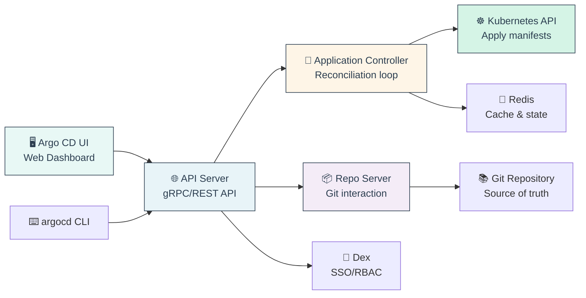

🔗 **Resources:**
* [Argo CD Official Docs](https://argo-cd.readthedocs.io/)
* [Argo CD Architecture](https://argo-cd.readthedocs.io/en/stable/operator-manual/architecture/)
* [Application CRD Spec](https://argo-cd.readthedocs.io/en/stable/operator-manual/application.yaml)

---

## 📍 Slide 8 – 🎨 Argo CD in Action - Hands-On Deployment

* 🚀 **Installation Options**:
  * **Helm**: `helm install argocd argo/argo-cd`
  * **Kustomize**: `kubectl apply -k https://github.com/argoproj/argo-cd/manifests/ha/install`
  * **Operator**: Red Hat OpenShift GitOps Operator

* 📥 **Quick Installation** (Non-HA):
```bash
# Create namespace
kubectl create namespace argocd

# Install Argo CD
kubectl apply -n argocd -f \
  https://raw.githubusercontent.com/argoproj/argo-cd/stable/manifests/install.yaml

# Get initial admin password
kubectl -n argocd get secret argocd-initial-admin-secret \
  -o jsonpath="{.data.password}" | base64 -d

# Port-forward to access UI
kubectl port-forward svc/argocd-server -n argocd 8080:443
```

* 🌐 **Access Argo CD UI**:
  * URL: `https://localhost:8080`
  * Username: `admin`
  * Password: From secret above

**Deploying First Application via UI**


* 🎯 **UI Features Walkthrough**:
  * **Application Tree View**: Hierarchical resource visualization
  * **Sync Status**: In-Sync, Out-of-Sync, Syncing
  * **Live Manifests**: View actual K8s manifests
  * **Desired Manifests**: View Git manifests
  * **Diff View**: Side-by-side comparison
  * **Events**: Application lifecycle events
  * **Logs**: Pod logs streaming

* 📊 **Health Status Interpretation**:
  * ✅ **Healthy + Synced**: Perfect state, no action needed
  * ⚠️ **Progressing + Synced**: Deployment rolling out
  * ❌ **Degraded + Synced**: Pods crashing, investigate logs
  * 🔄 **Healthy + Out-of-Sync**: Manual changes detected
  * ❌ **Degraded + Out-of-Sync**: Multiple issues, sync + debug

🔗 **Resources:**
* [Argo CD Getting Started](https://argo-cd.readthedocs.io/en/stable/getting_started/)
* [Argo CD CLI Commands](https://argo-cd.readthedocs.io/en/stable/user-guide/commands/argocd/)
* [Sealed Secrets GitHub](https://github.com/bitnami-labs/sealed-secrets)
* [External Secrets Operator](https://external-secrets.io/)

---

## 📍 Slide 9 – 🔐 Argo CD Best Practices - Production-Ready Patterns

* ✅ **Use Annotation Tracking (Not Label Tracking)**
```yaml
# In argocd-cm ConfigMap
apiVersion: v1
kind: ConfigMap
metadata:
  name: argocd-cm
data:
  application.resourceTrackingMethod: annotation  # Default: label
```
**Why**: Labels limited to 63 chars, causes false Out-of-Sync for operator-created resources

* 🏢 **Never Use Default AppProject**
```yaml
# ❌ Bad: Using default project
spec:
  project: default

# ✅ Good: Create dedicated projects
apiVersion: argoproj.io/v1alpha1
kind: AppProject
metadata:
  name: team-backend
spec:
  sourceRepos:
  - 'https://github.com/company/backend-*'
  destinations:
  - namespace: 'backend-*'
    server: https://kubernetes.default.svc
  clusterResourceWhitelist:
  - group: ''
    kind: Namespace
```

* 🔐 **Implement RBAC per AppProject**
```yaml
apiVersion: argoproj.io/v1alpha1
kind: AppProject
metadata:
  name: team-backend
spec:
  # ... other config ...
  roles:
  - name: developer
    description: Developer role for backend team
    policies:
    - p, proj:team-backend:developer, applications, get, team-backend/*, allow
    - p, proj:team-backend:developer, applications, sync, team-backend/*, allow
    groups:
    - backend-developers  # OIDC group
```

* 📋 **Manifest Validation - Lint Before Sync**
```yaml
# In Application spec
spec:
  syncPolicy:
    syncOptions:
    - Validate=true  # Server-side validation
```

**Pre-commit hook for local validation:**
```bash
#!/bin/bash
# .git/hooks/pre-commit

# Validate YAML syntax
yamllint k8s/

# Validate Kubernetes manifests
kubeval k8s/**/*.yaml

# Kustomize build check
kustomize build k8s/overlays/prod
```

* 🕐 **Sync Windows - Maintenance Blackouts**
```yaml
apiVersion: argoproj.io/v1alpha1
kind: AppProject
metadata:
  name: production
spec:
  syncWindows:
  - kind: deny
    schedule: '0 22 * * *'  # 10 PM daily
    duration: 6h            # Until 4 AM
    applications:
    - '*'                   # All apps
    manualSync: true        # Allow manual sync during blackout
```

* 🌊 **Progressive Sync - Sync Waves**
```yaml
# Deploy database first, then application
apiVersion: v1
kind: ConfigMap
metadata:
  name: database-config
  annotations:
    argocd.argoproj.io/sync-wave: "-1"  # Deploy first
---
apiVersion: apps/v1
kind: Deployment
metadata:
  name: backend-app
  annotations:
    argocd.argoproj.io/sync-wave: "0"   # Deploy second
---
apiVersion: apps/v1
kind: Deployment
metadata:
  name: frontend-app
  annotations:
    argocd.argoproj.io/sync-wave: "1"   # Deploy last
```

* 🪝 **Sync Hooks - Pre/Post Actions**
```yaml
apiVersion: batch/v1
kind: Job
metadata:
  name: database-migration
  annotations:
    argocd.argoproj.io/hook: PreSync       # Run before sync
    argocd.argoproj.io/hook-delete-policy: HookSucceeded  # Cleanup on success
spec:
  template:
    spec:
      containers:
      - name: migrate
        image: migrate/migrate
        command: ["migrate", "up"]
      restartPolicy: Never
```

**Available Hooks**:
- **PreSync**: Before manifest application
- **Sync**: During sync operation
- **PostSync**: After all resources healthy
- **SyncFail**: On sync failure
- **Skip**: Skip resource during sync

* 📊 **Monitoring & Alerting**
```yaml
# Prometheus ServiceMonitor
apiVersion: monitoring.coreos.com/v1
kind: ServiceMonitor
metadata:
  name: argocd-metrics
spec:
  selector:
    matchLabels:
      app.kubernetes.io/name: argocd-metrics
  endpoints:
  - port: metrics
```

**Key Metrics to Monitor**:
- `argocd_app_sync_total` - Total sync operations
- `argocd_app_health_status` - Application health (0=Healthy)
- `argocd_app_sync_status` - Sync status (0=Synced)
- `argocd_git_request_duration_seconds` - Git fetch latency
- `argocd_kubectl_exec_duration_seconds` - kubectl exec time

* 🚨 **Slack/Teams Notifications**
```yaml
# In argocd-notifications-cm ConfigMap
apiVersion: v1
kind: ConfigMap
metadata:
  name: argocd-notifications-cm
data:
  service.slack: |
    token: $slack-token
  trigger.on-deployed: |
    - when: app.status.operationState.phase in ['Succeeded']
      send: [app-deployed]
  template.app-deployed: |
    message: |
      Application {{.app.metadata.name}} deployed successfully!
      Revision: {{.app.status.sync.revision}}
```

* 🎯 **Best Practices Checklist**:
  * ✅ Use annotation tracking (Argo CD 2.8+)
  * ✅ Create AppProjects for logical grouping
  * ✅ Implement RBAC per project/team
  * ✅ Filter extraneous operator-created resources
  * ✅ Validate manifests before merge (CI checks)
  * ✅ Use sync windows for maintenance
  * ✅ Order deployments with sync waves
  * ✅ Add pre/post sync hooks for migrations
  * ✅ Monitor with Prometheus + Grafana
  * ✅ Set up Slack/Teams notifications
  * ✅ Enable HA mode for production (3+ replicas)
  * ✅ Backup Argo CD configuration regularly

🔗 **Resources:**
* [Argo CD Best Practices](https://argo-cd.readthedocs.io/en/stable/user-guide/best_practices/)
* [Red Hat GitOps Best Practices](https://developers.redhat.com/articles/2025/03/05/openshift-gitops-recommended-practices)
* [Sync Waves & Hooks](https://argo-cd.readthedocs.io/en/stable/user-guide/sync-waves/)
* [Argo CD Notifications](https://argocd-notifications.readthedocs.io/)

---

### 🎭 **Interactive Break #2: "Argo CD Speed Run Challenge"** ⚡

**🏃 Can You Deploy an App in 60 Seconds?**

*Time for a live demo! Let's see how fast we can go from Git commit to running application!*

---

**🎯 The Challenge:**

Starting Point:
- ✅ Argo CD installed
- ✅ Git repo ready
- ✅ Kubernetes cluster running

**Goal**: Deploy a simple nginx app in under 60 seconds!

---

**📊 Speedrun Leaderboard:**

| Rank | Method | Time | Difficulty |
|------|--------|------|------------|
| 🥇 | argocd CLI + auto-sync | 30s | Easy |
| 🥈 | UI click + auto-sync | 45s | Medium |
| 🥉 | Manual kubectl | 5min | Hard |
| 💀 | SSH to server + copy files | 30min | Nightmare |

---

**🤔 Discussion Questions:**

1. **What made this so fast?**
   - Auto-sync enabled
   - Manifests already validated
   - No manual approval needed
   - Argo CD handles all kubectl commands

2. **Could it be even faster?**
   - Pre-pull container images
   - Use ApplicationSets for multiple apps
   - Optimize sync options

3. **What if something breaks?**
   - `argocd app rollback speedrun-nginx`
   - Literally 5 seconds to rollback!

---

**😱 Horror Story Time:**

**"The 4-Hour Deployment"**

*Before Argo CD at Company X:*
- 📋 Fill deployment ticket → 30 min
- ⏳ Wait for approval → 2 hours
- 🔐 Get VPN + kubectl access → 30 min
- 📝 Copy YAML to jumpbox → 15 min
- ⌨️ kubectl apply manually → 10 min
- 🐛 Fix typo in YAML → 15 min
- 🔄 Apply again → 10 min
- ✅ Verify deployment → 10 min
- **Total: 4+ hours** 😭

*After Argo CD:*
- ✅ Merge PR → Auto-deployed in 30 seconds
- 🎉 Coffee still hot! ☕

---

## 📍 Slide 10 – 🎯 What is Progressive Delivery? - Beyond Basic Deployments

* 🚀 **Progressive Delivery** = Controlled, gradual rollout of changes with automated validation and rollback capabilities
* 🎯 **Core Idea**: Deploy to production incrementally, validate at each step, minimize blast radius
* 📊 **Evolution**: Blue-Green (instant switch) → Canary (gradual %) → Progressive (automated decisions)
* 🛡️ **Key Principle**: Catch issues with small user subset before affecting everyone
* 📈 **Adoption**: 56% of K8s users in 2024, up from 23% in 2021

**Progressive Delivery vs Traditional Deployment**
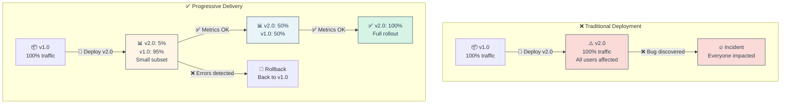

🔗 **Resources:**
* [Progressive Delivery Explained (Split.io)](https://www.split.io/glossary/progressive-delivery/)
* [CNCF Progressive Delivery Whitepaper](https://github.com/cncf/tag-app-delivery)
* [Netflix Progressive Delivery](https://netflixtechblog.com/)

---

## 📍 Slide 11 – 🔄 Deployment Strategies - Canary, Blue-Green, A/B Testing

* 🎨 **Deployment Strategy** = Method for releasing new application versions to minimize risk and downtime
* 🔄 **Common Strategies**: Blue-Green, Canary, A/B Testing, Rolling, Shadow/Mirror
* 🎯 **Selection Criteria**: Risk tolerance, rollback speed, infrastructure cost, user impact

**🔵🟢 Blue-Green Deployment**

* 💡 **Concept**: Two identical environments (Blue = current, Green = new), instant traffic switch
* 🔀 **Process**:
  1. Deploy new version to Green (idle) environment
  2. Run tests on Green
  3. Switch traffic from Blue to Green (instant cutover)
  4. Keep Blue for quick rollback

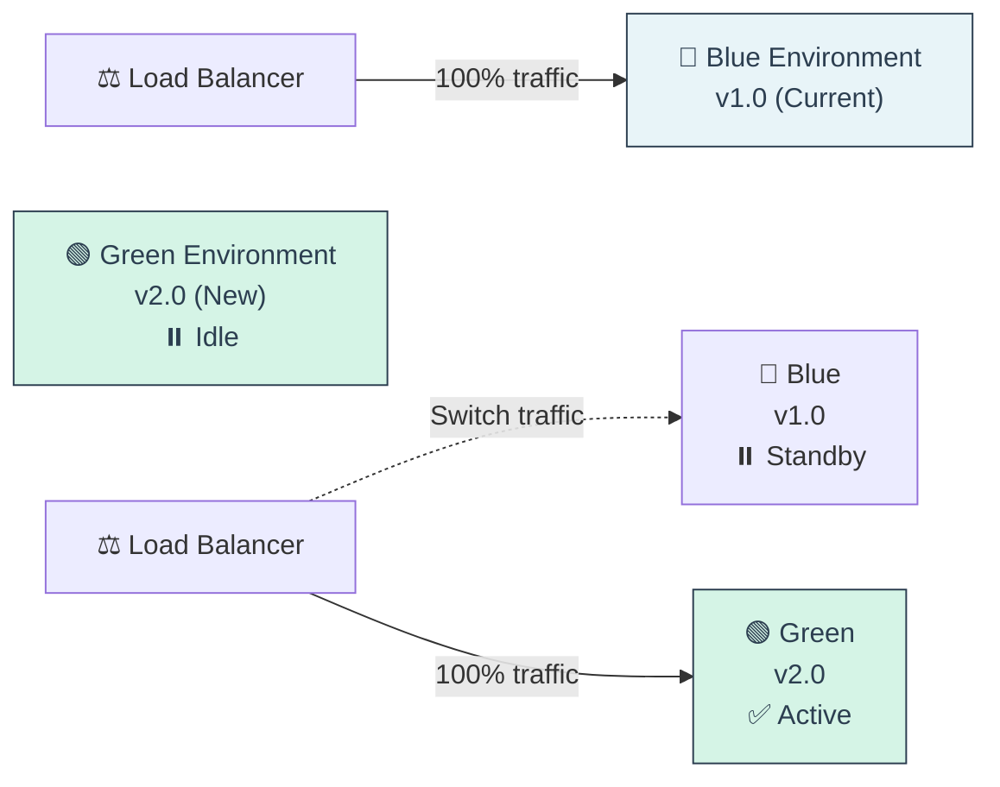

* ✅ **Pros**: Instant rollback, zero downtime, easy testing
* ❌ **Cons**: 2x infrastructure cost, database migrations complex, all users affected at once
* 🎯 **Best For**: Low-risk apps, need fast rollback, can afford dual infra

---

**🕯️ Canary Deployment**

* 💡 **Concept**: Gradually shift traffic % from old to new version (named after "canary in coal mine")
* 🔀 **Process**:
  1. Deploy new version alongside old
  2. Route 5% traffic to new (canary)
  3. Monitor metrics (errors, latency, saturation)
  4. Gradually increase: 5% → 10% → 25% → 50% → 100%
  5. Rollback at any point if metrics fail

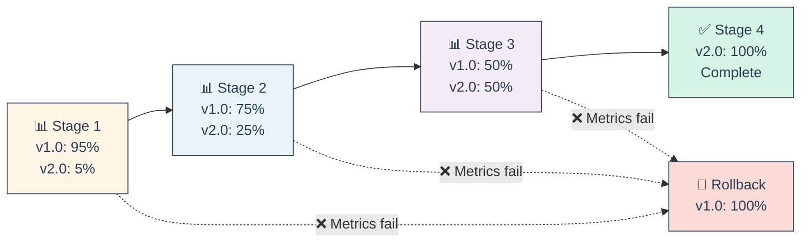

* ✅ **Pros**: Minimal user impact, automated metrics, gradual confidence building
* ❌ **Cons**: Slower rollout, requires metrics infrastructure, session issues
* 🎯 **Best For**: High-risk changes, microservices, need automated validation

---

**🧪 A/B Testing (Experiments)**

* 💡 **Concept**: Route specific user segments to different versions based on attributes (cookies, headers, user ID)
* 🔀 **Process**:
  1. Split users into groups (A = control, B = variant)
  2. Route based on user attributes (header, cookie, ID hash)
  3. Measure business metrics (conversion, revenue, engagement)
  4. Statistical significance analysis
  5. Winner becomes new baseline

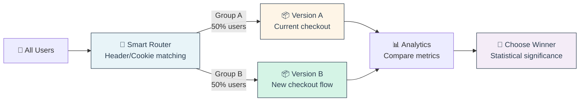

* ✅ **Pros**: Business metric validation, session affinity, data-driven decisions
* ❌ **Cons**: Requires analytics platform, longer duration, complex routing
* 🎯 **Best For**: Feature testing, UX changes, business metric optimization

---

**🌊 Traffic Mirroring (Shadow Deployment)**

* 💡 **Concept**: Duplicate (mirror) production traffic to new version without affecting users
* 🔀 **Process**:
  1. Deploy new version
  2. Send copy of all requests to new version
  3. Only old version returns responses to users
  4. Monitor new version logs, errors, performance
  5. Switch traffic once validated

* ✅ **Pros**: Zero user impact, test with real traffic, validate before switching
* ❌ **Cons**: Only works for idempotent operations, double infrastructure load
* 🎯 **Best For**: Read-only APIs, testing performance, validating refactors

---

**🔄 Rolling Update (Kubernetes Native)**

* 💡 **Concept**: Replace pods one-by-one or in small batches
* 🔀 **Process**: K8s terminates old pod, starts new pod, repeats until all replaced
* ✅ **Pros**: Built into K8s, no extra tools, zero downtime
* ❌ **Cons**: Both versions running simultaneously, slow rollback
* 🎯 **Best For**: Simple deployments, low-risk changes, no special routing needed

---

**📊 Strategy Comparison Matrix**

| Strategy | 🎯 Risk | 🚀 Rollback Speed | 💰 Cost | 🔧 Complexity | 🎯 Use Case |
|----------|---------|------------------|---------|--------------|-------------|
| **Blue-Green** | Medium | ⚡ Instant | 💰💰 High | 🟢 Simple | Need fast rollback |
| **Canary** | Low | ⚡ Fast | 💰 Medium | 🟡 Moderate | Production validation |
| **A/B Test** | Low | 🐢 Slow | 💰 Medium | 🔴 Complex | Business metrics |
| **Rolling** | Medium | 🐢 Slow | 💰 Low | 🟢 Simple | Simple deployments |
| **Shadow** | Very Low | 🐢 N/A | 💰💰 High | 🟡 Moderate | Pre-production test |

* 🎯 **Choosing the Right Strategy**:
  * **High Risk Change** → Canary with automated metrics
  * **Need Instant Rollback** → Blue-Green
  * **Testing Business Impact** → A/B Testing
  * **Low Risk Update** → Rolling update
  * **Validating Refactor** → Shadow deployment

🔗 **Resources:**
* [Deployment Strategies Explained](https://www.weave.works/blog/deployment-strategies)
* [Flagger Deployment Strategies](https://fluxcd.io/flagger/usage/deployment-strategies/)
* [Martin Fowler - BlueGreenDeployment](https://martinfowler.com/bliki/BlueGreenDeployment.html)

---

## 📍 Slide 12 – 📊 Observability & Metrics for Progressive Delivery

* 📈 **Observability** = Ability to understand system state through data (logs, metrics, traces)
* 🎯 **Purpose**: Automated decision-making for promotion/rollback during progressive delivery
* 🔑 **Key Concept**: Without metrics, progressive delivery is just slow deployment

**The Three Pillars of Observability**
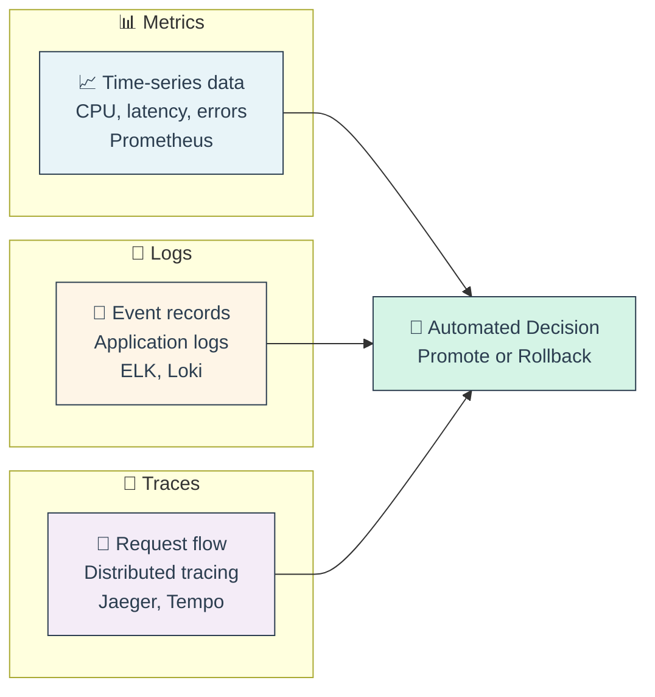

* 🌟 **Golden Signals (Google SRE)**:
  1. 📊 **Latency**: How long requests take (P50, P95, P99 percentiles)
  2. 🚦 **Traffic**: Request rate (requests per second)
  3. ❌ **Errors**: Failure rate (% of failed requests)
  4. 💾 **Saturation**: Resource utilization (CPU, memory, disk)

* 🔴 **RED Metrics (Request-focused)**:
  * **Rate**: Requests per second
  * **Errors**: Error rate (% or count)
  * **Duration**: Latency (P95, P99)

**Perfect for HTTP services, simpler than Golden Signals**

🔗 **Resources:**
* [Prometheus Query Examples](https://prometheus.io/docs/prometheus/latest/querying/examples/)
* [Google SRE Book - Monitoring](https://sre.google/sre-book/monitoring-distributed-systems/)
* [RED Method Explained](https://www.weave.works/blog/the-red-method-key-metrics-for-microservices-architecture/)
* [Grafana Canary Dashboards](https://grafana.com/grafana/dashboards/)

---

### 🎭 **Interactive Break #3: "Deployment Strategy Selector"** 🎮

**🕹️ Interactive Decision Tree Game!**

*Let's play a game to choose the best deployment strategy for different scenarios!*

---

**🎯 Scenario 1: E-commerce Checkout Redesign**

*Context:*
- 💳 New checkout flow with payment provider change
- 💰 $10M daily revenue at stake
- 📊 Need to measure conversion rate impact
- 👥 1M daily active users

**What strategy do you choose?**

A) 🔵🟢 Blue-Green (instant switch)  
B) 🕯️ Canary (gradual %)  
C) 🧪 A/B Test (user segments)  
D) 🔄 Rolling Update

<details>
<summary>Click for answer & explanation</summary>

**✅ Answer: C) A/B Test**

**Why:**
- 📊 Need to measure business metrics (conversion rate)
- 💰 High revenue impact requires statistical validation
- 🎯 Session affinity needed (checkout is multi-step)
- 👥 Enough users for statistical significance

**Wrong Answers:**
- ❌ Blue-Green: All users affected at once, can't measure relative performance
- ❌ Canary: Random users, breaks checkout session flow
- ❌ Rolling: No validation, risky for revenue-critical change

</details>

---

**🎯 Scenario 2: Critical Security Patch**

*Context:*
- 🔒 CVE announced, need to patch NOW
- ⏱️ Under attack, time is critical
- ✅ Patch already tested in staging
- 🎯 Need instant rollback if issues

**What strategy do you choose?**

A) 🔵🟢 Blue-Green  
B) 🕯️ Canary with automated metrics  
C) 🧪 A/B Test  
D) 🌊 Shadow deployment first

<details>
<summary>Click for answer & explanation</summary>

**✅ Answer: A) Blue-Green**

**Why:**
- ⚡ Instant rollback if patch breaks something
- 🚀 Fast deployment (already tested)
- 🔒 Security issues require immediate action
- 🎯 Can validate on Green before switching

**Wrong Answers:**
- ❌ Canary: Too slow for security emergency
- ❌ A/B Test: Not needed, already tested
- ❌ Shadow: Time wasted, need to deploy NOW

</details>

---

**🎯 Scenario 3: Microservice API Refactor**

*Context:*
- 🔧 Internal API, no user-facing changes
- 📊 Want to validate performance improvements
- 🤝 20 downstream services depend on it
- ⚠️ Concerned about unexpected edge cases

**What strategy do you choose?**

A) 🔵🟢 Blue-Green  
B) 🕯️ Canary with 5% → 100% progression  
C) 🌊 Traffic Mirroring (Shadow)  
D) 🔄 Rolling Update

<details>
<summary>Click for answer & explanation</summary>

**✅ Answer: C) Traffic Mirroring then B) Canary**

**Why:**
- 🌊 Shadow first: Test with real traffic, zero impact
- 🕯️ Then Canary: Gradual rollout after validation
- 📊 Validate performance with real requests
- 🛡️ Catch edge cases before affecting clients

**Alternative: B) Canary alone** if confident in tests

</details>

---

**🎯 Scenario 4: Simple Configuration Change**

*Context:*
- ⚙️ Just updating timeout values in ConfigMap
- ✅ Already validated in dev/staging
- 📉 Low risk change
- 🚀 Need to deploy to 50 clusters

**What strategy do you choose?**

A) 🔵🟢 Blue-Green  
B) 🕯️ Canary  
C) 🔄 Rolling Update (GitOps sync)  
D) 🌊 Traffic Mirroring

<details>
<summary>Click for answer & explanation</summary>

**✅ Answer: C) Rolling Update via GitOps**

**Why:**
- 📉 Low risk = don't over-engineer
- 🎯 GitOps handles multi-cluster automatically
- 💰 No need for complex infrastructure
- ⚡ Fast enough for config changes

**Wrong Answers:**
- ❌ Blue-Green/Canary: Overkill for config change
- ❌ Shadow: Waste of resources

</details>

---

**🏆 Deployment Strategy Cheat Sheet**

```
┌─────────────────────────────────────────────────┐
│ Choose Blue-Green if:                           │
│ ✅ Need instant rollback                        │
│ ✅ Can afford 2x infrastructure                 │
│ ✅ Security patches or critical fixes           │
└─────────────────────────────────────────────────┘

┌─────────────────────────────────────────────────┐
│ Choose Canary if:                               │
│ ✅ High-risk changes                            │
│ ✅ Want automated validation                    │
│ ✅ Microservices architecture                   │
│ ✅ Need progressive confidence building         │
└─────────────────────────────────────────────────┘

┌─────────────────────────────────────────────────┐
│ Choose A/B Test if:                             │
│ ✅ Testing business metrics                     │
│ ✅ Need session affinity                        │
│ ✅ UX/feature experiments                       │
│ ✅ Have analytics infrastructure                │
└─────────────────────────────────────────────────┘

┌─────────────────────────────────────────────────┐
│ Choose Rolling if:                              │
│ ✅ Low-risk changes                             │
│ ✅ Simple deployments                           │
│ ✅ Budget-constrained                           │
│ ✅ Kubernetes native approach OK                │
└─────────────────────────────────────────────────┘
```

**💡 Pro Tip:** Most teams start with Rolling, graduate to Canary, and use Blue-Green for emergencies!

---

## 📍 Slide 13 – 🎭 Argo Rollouts - Progressive Delivery Powerhouse

* 🎯 **Argo Rollouts** = Kubernetes controller providing advanced deployment capabilities (Canary, Blue-Green, experiments)
* 🔄 **Relationship**: Part of Argo Project family, complements Argo CD
* 📦 **Core Resource**: `Rollout` CRD - drop-in replacement for Deployment
* 🚦 **Traffic Management**: Integrates with service meshes (Istio, Linkerd) and ingress (NGINX, ALB, Traefik)
* 📊 **Analysis**: AnalysisTemplate CRD for automated metric evaluation

**Argo Rollouts Architecture**
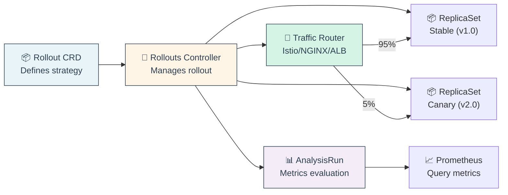

🔗 **Resources:**
* [Argo Rollouts Documentation](https://argoproj.github.io/argo-rollouts/)
* [Argo Rollouts GitHub](https://github.com/argoproj/argo-rollouts)
* [Argo Rollouts Examples](https://github.com/argoproj/rollouts-demo)

---

## 📍 Slide 14 – 🚢 Flagger - Automated Progressive Delivery

* 🚀 **Flagger** = Progressive delivery operator for Kubernetes (CNCF Flux sub-project)
* 🎯 **Design Philosophy**: Extensible, service mesh-first, GitOps-native
* 📦 **Core Resource**: `Canary` CRD defining rollout strategy
* 🔌 **Integrations**: Service meshes (Istio, Linkerd, App Mesh, Kuma, OSM) + Ingress controllers
* 🪝 **Webhooks**: Pre-rollout, during-rollout, post-rollout custom actions

**Flagger Architecture**
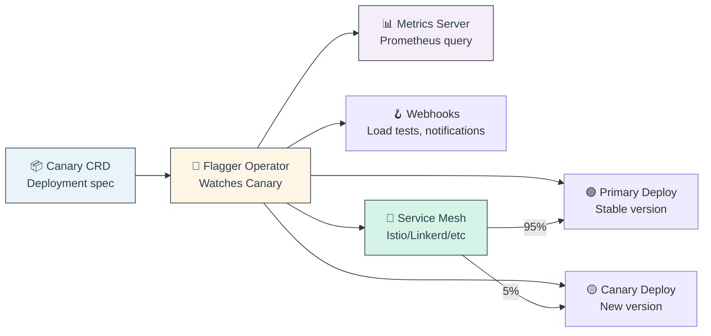

🔗 **Resources:**
* [Flagger Documentation](https://fluxcd.io/flagger/)
* [Flagger GitHub](https://github.com/fluxcd/flagger)
* [Flagger Tutorials](https://fluxcd.io/flagger/tutorials/)
* [Flagger vs Argo Rollouts](https://buoyant.io/blog/flagger-vs-argo-rollouts-vs-service-meshes)

---

## 📍 Slide 15 – 🎯 Feature Flags & Experimentation

* 🎯 **Feature Flags** = Runtime toggles to enable/disable features without redeployment
* 🔑 **Key Concept**: Decouple **deployment** (code push) from **release** (feature activation)
* 💡 **Use Cases**: Progressive rollout, A/B testing, kill switches, canary releases
* 📈 **Adoption**: 65% of high-performing teams use feature flags (DevOps Report 2024)

**Feature Flags in Action**
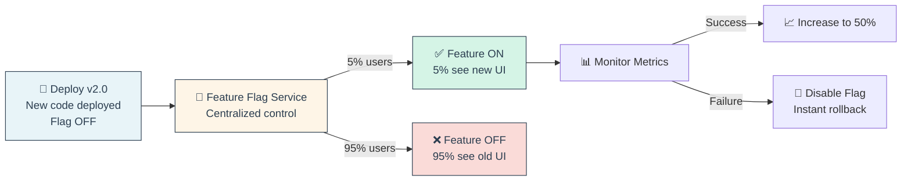

* 🎯 **Popular Feature Flag Platforms**:

| Platform | Type | Best For |
|----------|------|----------|
| 🚀 **LaunchDarkly** | SaaS | Enterprise, feature-rich |
| 🏴 **Flagsmith** | Open-source | Self-hosted, cost-effective |
| 🎉 **Unleash** | Open-source | Developer-friendly |
| 🔮 **Split.io** | SaaS | Experimentation focus |
| 🎯 **OpenFeature** | Standard | Vendor-neutral SDK |
| ⚙️ **ConfigCat** | SaaS | Simple, affordable |

* 🧪 **Progressive Rollout with Flags**:

```
Day 1:  Deploy code (flag OFF) → 0% users affected
Day 2:  Enable flag for 5% → Monitor metrics
Day 3:  Increase to 25% → No issues
Day 5:  Increase to 50% → All good
Day 7:  Increase to 100% → Full rollout
Day 14: Remove flag from code → Cleanup
```

* 🎯 **Best Practices**:
  * ✅ Keep flags short-lived (remove after rollout)
  * ✅ Use naming conventions (e.g., `exp_`, `kill_`, `perm_`)
  * ✅ Document flag purpose and owner
  * ✅ Set expiration dates
  * ✅ Monitor flag evaluation latency
  * ✅ Use SDKs with local caching
  * ❌ Don't nest flags deeply (complexity explosion)
  * ❌ Don't use flags for config (use ConfigMaps)

🔗 **Resources:**
* [OpenFeature (CNCF)](https://openfeature.dev/)
* [Feature Flag Best Practices](https://martinfowler.com/articles/feature-toggles.html)
* [LaunchDarkly](https://launchdarkly.com/)
* [Flagsmith](https://flagsmith.com/)
* [Unleash](https://www.getunleash.io/)

---

### 🎭 **Interactive Break #4: "Progressive Delivery Horror Stories"** 👻

**🔥 When Progressive Delivery Goes Wrong!**

*Time to learn from spectacular failures! These are REAL stories (names changed to protect the guilty)*

---

**Horror Story #1: "The Canary that Ate Black Friday"** 🐦

*Company:* Major e-commerce platform  
*Date:* Black Friday, 3:00 AM

**What Happened:**
- 🚀 Deployed new checkout service with 5% canary
- 📊 Metrics looked good: 99.5% success rate
- 🔺 Increased to 50% at 3 AM (low traffic time)
- 🔥 At 8 AM (peak traffic), entire checkout collapsed
- 💰 $5M lost revenue in 45 minutes

**Root Cause:**
- ⚠️ Canary tested during low traffic
- 💥 New code had memory leak under high load
- 🐛 Leak only manifested at 1000+ req/sec
- 🐢 Rollback took 45 min (hadn't practiced)

**Lessons Learned:**
```
✅ Load test canary at PEAK traffic levels
✅ Test rollback procedures regularly
✅ Monitor memory/CPU, not just request metrics
✅ Don't increase canary during low-traffic windows
✅ Have automated rollback on resource exhaustion
```

---

**Horror Story #2: "The Feature Flag that Never Died"** 🧟

*Company:* SaaS startup  
*Timeline:* 3 years of technical debt

**What Happened:**
- 🎯 Created feature flag for "new dashboard" (2021)
- 📈 Rolled out to 100% by end of 2021
- 🤦 Never removed flag from code
- 💸 Flag service subscription: $800/month
- 🔍 2024 audit: 47 flags, only 3 actively used

**Technical Debt:**
```python
# Code in 2024 still had this:
if feature_flag.enabled("new_dashboard_2021"):
    return new_dashboard()  # Always true
else:
    return old_dashboard()  # Dead code
```

**Cost:**
- 💰 $28,800 in unnecessary subscriptions (3 years)
- ⏱️ 200 hours of developer time dealing with flag complexity
- 🐛 12 bugs from flag interaction issues

**Lessons Learned:**
```
✅ Set expiration dates for flags
✅ Quarterly flag cleanup sprints
✅ Automated flag usage detection
✅ Remove flag after 100% for 2 weeks
✅ Document flag lifecycle in ADRs
```

---

**Horror Story #3: "Metrics Lie (Sometimes)"** 🤥

*Company:* Fintech payment processor  
*Date:* Random Tuesday

**What Happened:**
- 🚀 Canary rollout of payment processing service
- 📈 Metrics: 99.9% success rate ✅
- 🔺 Promoted to 100% confidently
- 📧 Next day: 10,000 support tickets
- 😱 Payments succeeded but wrong amounts charged

**Root Cause:**
- ✅ HTTP 200 responses (success)
- 💰 But amount calculated wrong (off-by-one error)
- 💡 Monitored HTTP status, not business logic
- 🤦 Canary percentage too low to notice pattern

**Lessons Learned:**
```
✅ Monitor business metrics, not just technical
✅ Validate data correctness, not just HTTP codes
✅ Implement synthetic transactions with known results
✅ Have humans review canary data samples
✅ Add checksums/validation to critical calculations
```

---

**Horror Story #4: "The Self-Healing Doomsday Loop"** ♻️

*Company:* Social media platform  
*Date:* Midnight deployment

**What Happened:**
- 🚀 Auto-sync enabled in Argo CD
- 🐛 Deployed config with typo: `replicas: 0`
- 🔄 GitOps saw 3 pods running, deleted them
- ⚠️ Alert triggered: "All pods down!"
- 👨‍💻 Engineer fixed manually: `kubectl scale`
- 🔁 GitOps: "Drift detected! Scaling back to 0"
- 🔄 This repeated for 45 minutes

**Root Cause:**
- 🤦 Fought with automation instead of fixing Git
- 💡 Finally realized: Fix the source (Git), not the cluster

**Lessons Learned:**
```
✅ ALWAYS fix Git first in GitOps
✅ Have emergency "pause sync" procedure
✅ Validate manifests in CI before merge
✅ Don't fight automation - it will win
✅ Practice incident response for GitOps scenarios
```

---

**🤔 Discussion Questions:**

1. **What's YOUR deployment horror story?**
2. **Have you ever fought with automation and lost?**
3. **What's the longest-lived feature flag in your codebase?**
4. **Ever had "successful" metrics but angry customers?**

---

**📊 The Deployment Horror Story Bingo**

```
┌─────────────────────────────────────────────┐
│ Deployed on     | Metrics lied  | Flag cleanup  |
│ Friday 5PM     | to you        | debt          |
├───────────────┼───────────────┼───────────────┤
│ Fought with    | FREE SPACE!   | Canary killed |
│ GitOps         | (🚀)         | Black Friday  |
├───────────────┼───────────────┼───────────────┤
│ Rollback took  | No rollback   | Tested in     |
│ 45 minutes     | plan          | low traffic   |
└───────────────┴───────────────┴───────────────┘
```

How many can you check off? 😅

**💡 Remember:** We learn more from failures than successes. Every horror story makes us better engineers!

---

## 📍 Slide 16 – 🔐 Security & Compliance in GitOps

* 🔒 **GitOps Security Model**: Git + Automation = New attack surface requiring new security practices
* 🎯 **Principle**: Security shifts left (Git repo) and right (cluster monitoring)
* 🛡️ **Key Areas**: Secrets management, access control, policy enforcement, audit trails

**GitOps Security Architecture**
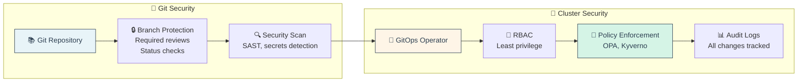

* ⚠️ **Common Security Pitfalls**:
  * ❌ Committing secrets to Git (even if private repo)
  * ❌ Over-privileged service accounts
  * ❌ No pod security policies/standards
  * ❌ Trusting images from public registries
  * ❌ No network policies (pods can talk to everything)
  * ❌ Ignoring supply chain security (SBOM)

* ✅ **Security Checklist**:
  * ✅ Secrets encrypted in Git (Sealed Secrets/SOPS)
  * ✅ Branch protection enabled
  * ✅ Required code reviews for changes
  * ✅ RBAC with least privilege
  * ✅ Admission controllers (OPA/Kyverno)
  * ✅ Image scanning in CI (Trivy, Snyk)
  * ✅ Image signing (Cosign, Notary)
  * ✅ Network policies for isolation
  * ✅ Audit logging enabled
  * ✅ Regular security audits

🔗 **Resources:**
* [Sealed Secrets](https://github.com/bitnami-labs/sealed-secrets)
* [External Secrets Operator](https://external-secrets.io/)
* [OPA Documentation](https://www.openpolicyagent.org/)
* [Kyverno Policies](https://kyverno.io/policies/)
* [CNCF Security Whitepaper](https://github.com/cncf/tag-security/tree/main/security-whitepaper)

---

## 📍 Slide 17 – ⚙️ CI/CD Integration - The Complete Pipeline

* 🔀 **CI/CD + GitOps Pattern**: CI builds artifacts, GitOps deploys them
* 🎯 **Separation of Concerns**: Build/test vs deploy/operate
* 📦 **Key Pattern**: CI pushes to Git (config repo), GitOps pulls from Git

**Complete CI/CD + GitOps Flow**
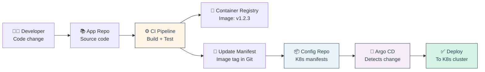

* 📊 **CI/CD Best Practices**:
  * ✅ Separate app repo from config repo
  * ✅ Use immutable image tags (SHA, not "latest")
  * ✅ Validate manifests in CI (kubeval, kube-linter)
  * ✅ Sign images (Cosign) for supply chain security
  * ✅ Generate SBOM (Software Bill of Materials)
  * ✅ Test in ephemeral preview environments
  * ✅ Progressive promotion (dev → staging → prod)
  * ✅ Automated rollback on failure

🔗 **Resources:**
* [Argo CD Image Updater](https://argocd-image-updater.readthedocs.io/)
* [GitHub Actions for Kubernetes](https://github.com/marketplace?type=actions&query=kubernetes)
* [GitOps with GitLab](https://docs.gitlab.com/ee/user/clusters/agent/gitops.html)

---

## 📍 Slide 18 – 🎉 Real-World Case Studies & Future Trends

* 🏆 **Success Stories from Industry Leaders**

**🏦 Intuit - GitOps at Enterprise Scale**

*Context:* Financial software company, 10K+ employees

**Journey:**
- 📅 **2018**: Started with Argo CD for 50 services
- 📅 **2020**: Scaled to 1000+ applications, 200 clusters
- 📅 **2024**: 10,000+ applications, 2000+ clusters

**Results:**
- ⏱️ Deployment time: **4 hours → 15 minutes** (94% reduction)
- 📊 Deploy frequency: **Weekly → Daily** (700% increase)
- ⚠️ Incidents: **50% reduction** in production issues
- 💰 Cost: **$2M annual savings** in operational overhead
- 👨‍💻 Developer satisfaction: **85% positive feedback**

**Key Practices:**
```
✅ App-of-Apps pattern for scaling
✅ Self-service via ApplicationSets
✅ Centralized RBAC with SSO
✅ Automated compliance checks
✅ Multi-cluster management from single pane
```

---

**🦑 GitLab - Self-Hosted GitOps**

*Context:* GitLab.com infrastructure (50M+ users)

**Journey:**
- 📅 **2019**: Monolithic deployments taking hours
- 📅 **2020**: Adopted GitOps with Flux
- 📅 **2024**: Full GitOps across all environments

**Results:**
- ⏱️ MTTR: **4 hours → 15 minutes** (80% reduction)
- 🔄 Rollback time: **30 min → 2 minutes**
- 📈 Infrastructure changes: **10/week → 100/day**
- 📚 Audit trail: **Complete Git history** for compliance

**Key Practices:**
```
✅ Infrastructure as Code for everything
✅ Automated testing in merge requests
✅ Progressive rollout with feature flags
✅ Disaster recovery tested monthly
✅ Open-source contributions back to Flux
```

---

📚 **Essential Reading**:

**Books:**
- 📚 "GitOps and Kubernetes" by Manning
- 📚 "Production Kubernetes" by O'Reilly  
- 📚 "Continuous Delivery" by Jez Humble

**Online:**
- 🌐 [OpenGitOps.dev](https://opengitops.dev)
- 🌐 [GitOps Working Group](https://github.com/cncf/tag-app-delivery/tree/main/gitops-wg)
- 🌐 [Argo Project Blog](https://blog.argoproj.io)
- 🌐 [Flux Blog](https://fluxcd.io/blog)

**Communities:**
- 👥 CNCF Slack - #gitops, #argo-cd, #flux
- 👥 GitOps Working Group meetings
- 👥 KubeCon + CloudNativeCon talks

🔗 **Resources:**
* [CNCF Case Studies](https://www.cncf.io/case-studies/)
* [Argo CD Adoption Stories](https://github.com/argoproj/argo-cd/blob/master/USERS.md)
* [Flux Adopters](https://fluxcd.io/adopters/)
* [DevOps Research Report (DORA)](https://dora.dev/)

---
