# 📌 Lecture 8 - SRE & Monitoring: System Metrics, SLAs & Reliability Engineering

## 📍 Slide 1 – 🛡️ What is SRE? - Engineering Approach to Operations

* 🎯 **SRE = Site Reliability Engineering** - Software engineering approach to IT operations
* 🔬 **Core Idea**: Treat operations as a software problem that can be solved with code
* 📊 **Goal**: Balance system reliability with feature velocity using data-driven decisions
* 🚀 **Origin**: Created at Google (2003) by Ben Treynor to scale operations engineering
* 📈 **Adoption**: 73% of enterprises use SRE practices (2024), up from 27% (2019)

**SRE Engineering Approach**
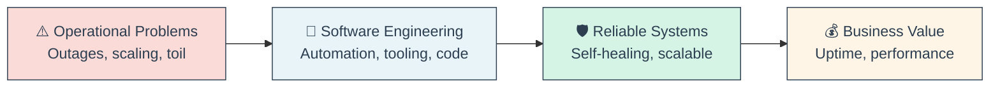

* 🎯 **Key Characteristics**:
  * 🤖 **Automation First**: Eliminate manual toil through code
  * 📊 **Data-Driven**: Decisions based on metrics, not gut feelings  
  * ⚖️ **Error Budgets**: Quantify acceptable downtime vs feature velocity
  * 🔄 **Continuous Learning**: Blameless postmortems and improvement
  * 🛠️ **Tooling Focus**: Build systems that scale operations

* 💡 **SRE vs Traditional Operations**:

| Aspect | ❌ Traditional Ops | ✅ SRE |
|--------|-------------------|--------|
| **Approach** | Manual processes | Automated solutions |
| **Skills** | System administration | Software engineering |
| **Metrics** | Uptime only | SLIs, SLOs, Error Budgets |
| **Incidents** | Firefighting | Preventive engineering |
| **Scaling** | Hire more people | Build better systems |
| **Mindset** | Keep things running | Improve reliability |

🔗 **Resources:**
* [Google SRE Book](https://sre.google/sre-book/)
* [Site Reliability Engineering Workbook](https://sre.google/workbook/)
* [SREcon Conferences](https://www.usenix.org/conferences/srecon)

---

## 📍 Slide 2 – 📜 History of SRE - From Google's Need to Industry Standard

* 🏛️ **2003**: Ben Treynor joins Google, creates SRE discipline
* 📈 **Problem**: Google's rapid growth (100 engineers → 1000+ engineers in 2 years)
* ⚠️ **Challenge**: Traditional ops couldn't scale with exponential user growth
* 💡 **Solution**: Hire software engineers to solve operational problems

**SRE Evolution Timeline**
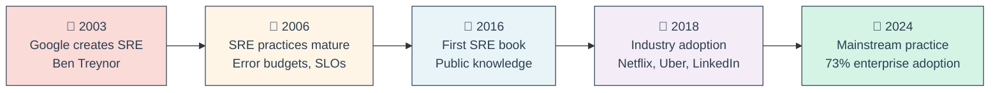

* 🎭 **Historical Context**:
  * **Pre-2003**: Operations = "Keep servers running, don't touch anything"
  * **2003-2010**: SRE develops at Google (secret sauce)
  * **2016**: Google publishes SRE book (knowledge becomes public)
  * **2017-2020**: Mass adoption by tech companies
  * **2021-2024**: Enterprise and traditional industries adopt SRE

* 📊 **Key Milestones**:
  * **2004**: First error budget concept implemented
  * **2006**: SLI/SLO framework standardized
  * **2010**: Chaos engineering practices begin
  * **2016**: "Site Reliability Engineering" book published
  * **2018**: SREcon conferences launch globally
  * **2020**: COVID-19 accelerates SRE adoption (reliability critical)
  * **2024**: AI/ML integration in SRE practices

* 🏢 **Industry Impact**:
  * **Netflix**: 99.97% uptime while deploying 4000+ times/day
  * **Uber**: Reduced incidents by 75% after SRE adoption
  * **LinkedIn**: Improved page load times by 50% through SRE
  * **Spotify**: Achieved 99.95% uptime serving 400M+ users

* 💡 **Fun Historical Facts**:
  * 🎯 Ben Treynor's background: Software engineer, not traditional ops
  * 📈 Google's first SRE team: 7 people managing services for 100M+ users
  * 🤖 Original SRE motto: "Hope is not a strategy"
  * 📚 SRE book took 3 years to write, 50+ Google SREs contributed
  * 🌍 First SREcon had 200 attendees, now 2000+ per event

🔗 **Resources:**
* [Ben Treynor's Original SRE Talk](https://www.youtube.com/watch?v=n4Wf14e2jxQ)
* [History of SRE at Google](https://sre.google/sre-book/introduction/)
* [SRE Timeline Infographic](https://sre.google/resources/)

---

## 📍 Slide 3 – 🤝 SRE vs DevOps vs Platform Engineering - Clarifying the Roles

* 🎯 **The Confusion**: Three overlapping disciplines with similar goals but different approaches
* 🔍 **Key Difference**: Focus area and primary responsibility
* 👥 **Reality**: Most organizations blend these practices rather than pure implementations

**Role Comparison Matrix**
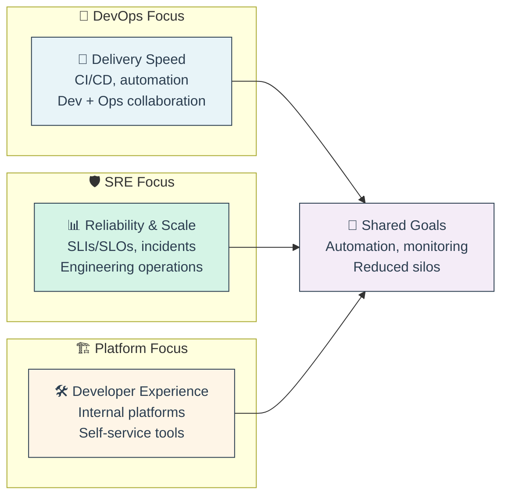

* 📊 **Detailed Comparison**:

| Aspect | 🚀 DevOps | 🛡️ SRE | 🏗️ Platform Engineering |
|--------|----------|---------|------------------------|
| **Primary Goal** | Faster delivery | System reliability | Developer productivity |
| **Key Metrics** | Deployment frequency, lead time | SLOs, error budgets, MTTR | Developer satisfaction, adoption |
| **Focus Area** | CI/CD pipelines | Production systems | Internal tooling |
| **Background** | Dev + Ops hybrid | Software engineering | Infrastructure + UX |
| **Responsibility** | Entire delivery pipeline | Service reliability | Platform services |
| **Tools** | Jenkins, GitLab, Ansible | Prometheus, Grafana, K8s | Backstage, internal APIs |
| **Team Size** | 5-10 per product team | 1 SRE per 10-20 devs | 1 platform per 50-100 devs |

* 🎯 **When to Use What**:

**Choose DevOps when:**
- 🚀 Need to improve deployment speed
- 🔄 Breaking down Dev/Ops silos  
- 📦 Implementing CI/CD practices
- 🌱 Starting digital transformation

**Choose SRE when:**
- 📊 Reliability is critical business requirement
- ⚖️ Need to balance features vs stability
- 🔥 Experiencing frequent production issues
- 📈 Operating at significant scale (millions of users)

**Choose Platform Engineering when:**
- 🛠️ Developers spending too much time on infrastructure
- 🔁 Lots of repeated manual work across teams
- 📚 Need standardized development practices
- 🏢 Large engineering organization (100+ developers)

* 💼 **Real-World Examples**:
  * **Netflix**: Strong SRE + Platform engineering (Spinnaker, Zuul)
  * **Spotify**: DevOps culture + Platform teams (Backstage)
  * **Google**: Pure SRE model with some platform teams
  * **Amazon**: "You build it, you run it" DevOps + SRE practices
  * **Microsoft**: Azure DevOps + SRE + Platform engineering hybrid

* 🤔 **Common Misconceptions**:
  * ❌ "SRE replaces DevOps" → ✅ SRE implements DevOps principles
  * ❌ "You need separate teams" → ✅ These are practices, not org charts
  * ❌ "Pick one approach" → ✅ Most successful companies blend all three
  * ❌ "Platform engineering is just DevOps" → ✅ Platform is product-focused

🔗 **Resources:**
* [DevOps vs SRE vs Platform Engineering](https://www.cncf.io/blog/2022/09/26/devops-vs-sre-vs-platform-engineering/)
* [Team Topologies Book](https://teamtopologies.com/)
* [Platform Engineering Landscape](https://platformengineering.org/)

---

## 📍 Slide 4 – 🎨 SRE Principles - Reliability, Scalability, and Toil Reduction

* 🎯 **SRE Principles** = Core concepts that guide Site Reliability Engineering practices
* 📏 **Quantified Reliability**: Use math and engineering to define and achieve reliability
* ⚖️ **Balance**: Reliability vs feature velocity through error budgets
* 🤖 **Toil Elimination**: Automate repetitive operational work

**Core SRE Principles Framework**
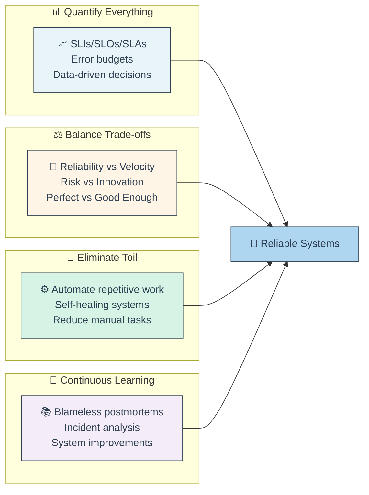

* 📊 **Principle 1: Quantify Reliability**
  * 🎯 Define reliability mathematically (99.9%, 99.99%, etc.)
  * 📏 Use Service Level Indicators (SLIs) to measure what matters
  * 🎯 Set Service Level Objectives (SLOs) as targets
  * 💰 Calculate error budgets = allowed unreliability
  * 📈 Example: 99.9% uptime = 8.77 hours downtime/year allowed

* ⚖️ **Principle 2: Balance Reliability vs Velocity**
  * 🚫 **100% reliability is wrong target** → No new features ever shipped
  * 💡 **Sweet Spot**: High enough reliability for users, low enough for innovation
  * 💰 **Error Budget Principle**: Can "spend" downtime on new features
  * 📊 **Example**: If uptime is 99.95% (better than 99.9% target), can take more risks

* 🤖 **Principle 3: Eliminate Toil**
  * 📜 **Toil Definition**: Manual, repetitive, automatable work with no lasting value
  * 🎯 **50% Rule**: SREs should spend <50% time on toil, >50% on engineering
  * ⚙️ **Automation Focus**: Build systems that operate themselves
  * 🔄 **Self-Healing**: Systems detect and fix common problems automatically

**Toil vs Engineering Work**
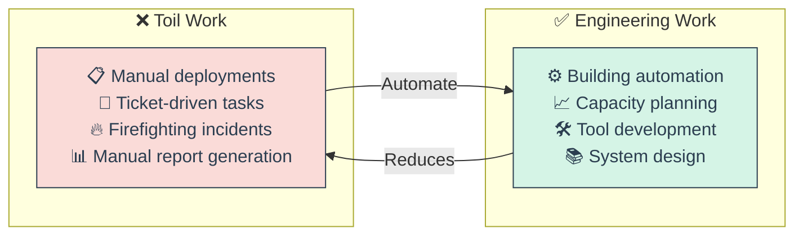

* 🔄 **Principle 4: Learn from Failure**
  * 📚 **Blameless Postmortems**: Focus on systems, not people
  * 🔍 **Root Cause Analysis**: Why did the system allow this failure?
  * 🛠️ **Action Items**: Concrete engineering tasks to prevent recurrence
  * 📈 **Failure as Teacher**: Each incident improves system reliability

* 📈 **Principle 5: Scale Through Engineering**
  * 🚫 **Anti-Pattern**: Hire more people to handle more load
  * ✅ **SRE Pattern**: Build systems that scale without human intervention
  * 🤖 **Linear Team Growth**: As services 10x, SRE team grows 2x max
  * 🛠️ **Focus**: Tooling, automation, and system design

* 💡 **Practical Examples**:
  * **Netflix**: 99.97% uptime with 4000+ daily deployments
  * **Google**: 1 SRE manages services for 100M+ users
  * **Spotify**: Auto-scaling systems handle 400M+ users with minimal ops overhead

* ⚠️ **Common Anti-Patterns**:
  * ❌ Making SRE team "the ops team in disguise"
  * ❌ Focusing only on uptime, ignoring performance/latency  
  * ❌ Manual processes disguised as "automation"
  * ❌ Blame-focused incident reviews
  * ❌ Setting 100% reliability targets

* ✅ **SRE Success Indicators**:
  * 📊 Clear SLIs/SLOs with business alignment
  * 💰 Error budgets actively used for decision making
  * 🤖 <50% time spent on toil, >50% on engineering projects
  * 📚 Blameless postmortems leading to system improvements
  * 📈 Reliability improving while feature velocity increases

🔗 **Resources:**
* [Google SRE Principles](https://sre.google/sre-book/part-I-introduction/)
* [Eliminating Toil](https://sre.google/sre-book/eliminating-toil/)
* [Error Budgets](https://sre.google/workbook/error-budget-policy/)
* [SRE Principles at Scale](https://www.usenix.org/system/files/login/articles/login_summer17_07_treynor.pdf)

## 📍 Slide 5 – 🌟 Golden Signals of Monitoring - The Four Pillars of Observability

* 🎯 **Golden Signals** = Four key metrics that reveal the health of any system (Google SRE)
* 📊 **Purpose**: Focus monitoring on what actually matters to users
* 🔑 **Principle**: Monitor user-facing behavior, not just technical metrics
* ⚡ **Benefit**: Catch issues before users complain, faster incident detection

**The Four Golden Signals**
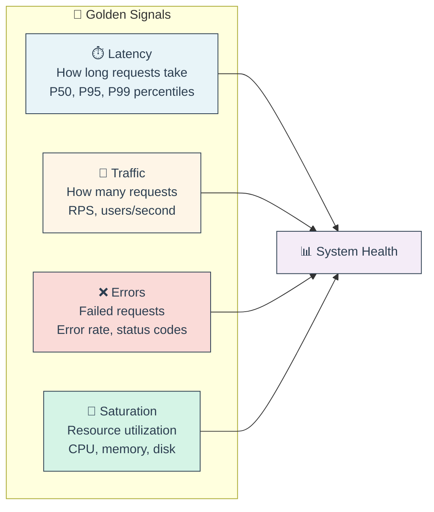

* ⏱️ **1. Latency (Response Time)**
  * 📏 **What**: How long requests take to complete
  * 📊 **Measure**: P50 (median), P95, P99 percentiles (not averages!)
  * 🎯 **Why Percentiles**: Average hides outliers that affect user experience
  * 🚨 **Alert**: P95 latency > threshold (e.g., 500ms for web apps)
  * 💡 **Example**: P95 = 200ms means 95% of requests complete in <200ms

* 🚦 **2. Traffic (Request Volume)**
  * 📏 **What**: How much demand your system is handling
  * 📊 **Measure**: Requests per second (RPS), transactions per minute
  * 📈 **Pattern Recognition**: Traffic spikes, daily/weekly cycles
  * 🚨 **Alert**: Sudden traffic drops (system down) or spikes (load issues)
  * 💡 **Example**: Normal traffic 1000 RPS, Black Friday spike to 10,000 RPS

* ❌ **3. Errors (Failure Rate)**
  * 📏 **What**: Percentage of requests that fail
  * 📊 **Measure**: HTTP 5xx errors, exceptions, timeouts
  * 🔍 **Categories**: Client errors (4xx) vs server errors (5xx)
  * 🚨 **Alert**: Error rate > 1% (or whatever your SLO allows)
  * 💡 **Example**: 99% success rate = 1% error rate = 1 failed request per 100

* 💾 **4. Saturation (Resource Usage)**
  * 📏 **What**: How "full" your service is (capacity utilization)
  * 📊 **Measure**: CPU %, memory %, disk space, database connections
  * ⚠️ **Early Warning**: Saturation increases before failures occur
  * 🚨 **Alert**: CPU > 80%, Memory > 85%, Disk > 90%
  * 💡 **Example**: Database connection pool 90% full → soon to hit limits

* 🎯 **Why These Four?**
  * ✅ **User-Centric**: Directly impact user experience
  * ✅ **Comprehensive**: Cover most failure modes
  * ✅ **Actionable**: Clear relationship to problems
  * ✅ **Universal**: Apply to any service/system

* 📊 **Golden Signals vs Other Metrics**:

| Type | 🌟 Golden Signals | ⚪ Other Metrics |
|------|------------------|------------------|
| **Focus** | User experience | Technical details |
| **Actionability** | Direct alerts | Context only |
| **Coverage** | Most incidents | Specific issues |
| **Examples** | Latency, errors | JVM heap, thread count |

* ⚠️ **Common Mistakes**:
  * ❌ Using averages instead of percentiles for latency
  * ❌ Monitoring technical metrics without business context
  * ❌ Too many alerts → alert fatigue
  * ❌ Ignoring saturation until it's too late

🔗 **Resources:**
* [Google SRE Book - Monitoring](https://sre.google/sre-book/monitoring-distributed-systems/)
* [Prometheus Golden Signals](https://prometheus.io/docs/practices/instrumentation/#the-four-golden-signals)
* [Grafana Golden Signal Dashboards](https://grafana.com/grafana/dashboards/)

---

## 📍 Slide 6 – 📏 SLI (Service Level Indicators) - What to Measure

* 🎯 **SLI = Service Level Indicator** - Quantitative measure of service behavior
* 📊 **Purpose**: Define "good" vs "bad" user experience with numbers
* 🔑 **Key Principle**: Measure what users care about, not what's easy to measure
* 📈 **Foundation**: SLIs feed into SLOs, which feed into SLAs

**SLI Categories and Examples**
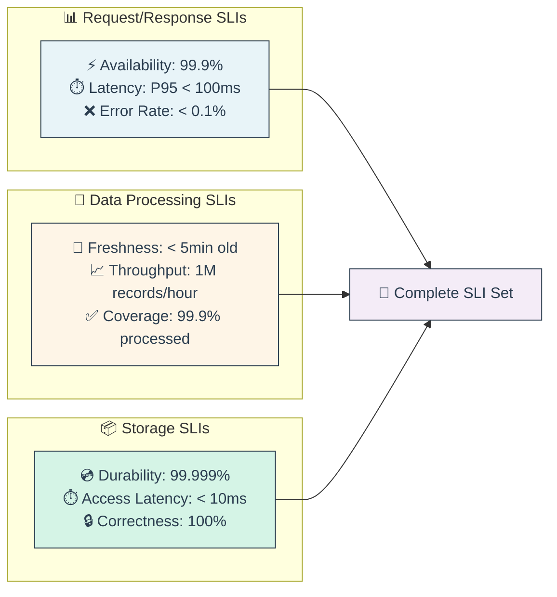

* 📊 **SLI Structure**: SLI = Good Events / Total Events
  * ✅ **Good Events**: Requests that meet quality criteria
  * 📊 **Total Events**: All requests in time period
  * 📈 **Result**: Percentage (0-100%) representing quality

* 🌐 **Web Application SLI Examples**:
```
Availability SLI = Successful HTTP responses / Total HTTP responses
Latency SLI = Fast responses (< 100ms) / Total responses  
Quality SLI = Responses with correct content / Total responses
```

* 📱 **Different Service Types Need Different SLIs**:

| Service Type | Key SLIs | Example |
|--------------|----------|---------|
| **🌐 Web Service** | Availability, Latency, Error Rate | 99.9% uptime, P95 < 200ms |
| **📊 Data Pipeline** | Freshness, Throughput, Coverage | Data < 5min old, 1M/hour |
| **💾 Storage** | Durability, Latency, Availability | 99.999% durability |
| **🔍 Search** | Relevance, Latency, Coverage | 95% relevant results |
| **📱 Mobile API** | Latency, Battery Impact, Crash Rate | P95 < 100ms, <0.1% crashes |

* 🎯 **Good SLI Characteristics**:
  * ✅ **User-Centric**: Measures user-visible behavior
  * ✅ **Measurable**: Can be calculated from metrics
  * ✅ **Understandable**: Business stakeholders grasp meaning
  * ✅ **Controllable**: Team can influence the SLI value

* ⚠️ **Bad SLI Examples**:
  * ❌ **CPU utilization < 80%** (users don't care about CPU)
  * ❌ **Zero bugs in backlog** (not user-visible)
  * ❌ **Code coverage > 90%** (internal quality metric)
  * ❌ **All servers responding to ping** (too technical)

* 📏 **SLI Specification Template**:
```yaml
SLI Name: API Availability
Description: Percentage of API requests that return successful responses
Good Events: HTTP responses with status codes 2xx and 3xx
Bad Events: HTTP responses with status codes 4xx and 5xx, timeouts
Total Events: All HTTP requests to API endpoints
Time Window: Rolling 30-day period
Measurement: (Good Events / Total Events) * 100%
```

* 🛠️ **Implementing SLIs**:
  * 📊 **Prometheus Example**:
```prometheus
# Availability SLI
sum(rate(http_requests_total{status!~"5.."}[5m])) 
/ 
sum(rate(http_requests_total[5m]))

# Latency SLI (% of requests < 100ms)
sum(rate(http_request_duration_seconds_bucket{le="0.1"}[5m]))
/
sum(rate(http_request_duration_seconds_count[5m]))
```

* 💡 **Real-World SLI Examples**:
  * **Netflix**: 99.99% stream start success rate
  * **Google Search**: 99.9% of queries return in <100ms  
  * **Spotify**: 99.95% of songs start playing within 1 second
  * **Uber**: 99% of ride requests matched with driver in <30 seconds

🔗 **Resources:**
* [SLI Menu - Google SRE](https://sre.google/workbook/sli-menu/)
* [Implementing SLIs](https://sre.google/workbook/implementing-slis/)
* [SLI/SLO Workshop](https://sre.google/resources/practices-and-processes/slo-workshop/)

---

## 📍 Slide 7 – 🎯 SLO (Service Level Objectives) - Setting Realistic Targets

* 🎯 **SLO = Service Level Objective** - Target value for your SLI over time period
* 📊 **Structure**: SLO = SLI target + Time Window (e.g., "99.9% availability over 30 days")
* ⚖️ **Goldilocks Principle**: Not too high (blocks innovation), not too low (bad UX)
* 🎪 **Boundary**: What you promise internally vs externally (SLA)

**SLO Target Setting Framework**
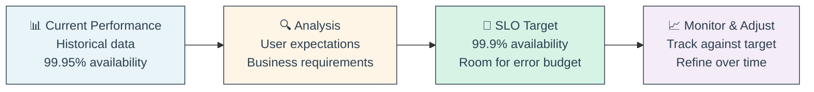

* 📊 **SLO Components**:
  * 📏 **SLI**: What you're measuring (availability, latency)
  * 🎯 **Target**: Acceptable performance level (99.9%, <100ms)
  * ⏰ **Time Window**: Period for measurement (30 days, quarterly)
  * 📍 **Scope**: What's included (all users, specific endpoints)

* 🎯 **Setting SLO Targets - The Art & Science**:
  * 📈 **Start with Current Performance**: If you're at 99.95%, don't set 99.99%
  * 👥 **Ask Users**: What's "good enough" for your use case?
  * 💰 **Consider Cost**: Higher reliability = more expensive infrastructure
  * 🚀 **Leave Room for Innovation**: Perfect reliability kills feature velocity

* 📊 **SLO Examples by Service Type**:

| Service | SLI | SLO Target | Time Window |
|---------|-----|------------|-------------|
| **🌐 Web API** | Availability | 99.9% | 30 days rolling |
| **🌐 Web API** | Latency | 95% of requests < 100ms | 30 days rolling |
| **📱 Mobile App** | Crash Rate | <0.1% sessions crash | Weekly |
| **💾 Database** | Query Latency | P99 < 10ms | Monthly |
| **📊 Data Pipeline** | Freshness | 95% of data < 1 hour old | Daily |
| **🔍 Search** | Relevance | 90% users click first 3 results | Quarterly |

* 🔢 **The Math Behind SLOs**:
  * **99.9% availability** = 43.8 minutes downtime/month allowed
  * **99.99% availability** = 4.38 minutes downtime/month allowed  
  * **99.999% availability** = 26.3 seconds downtime/month allowed

**Downtime Allowances by SLO**
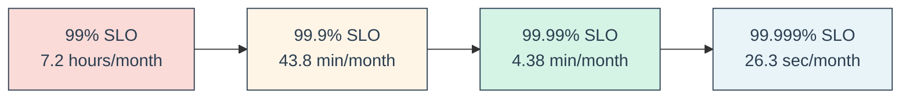

* ⚠️ **Common SLO Mistakes**:
  * ❌ **Too Ambitious**: Setting 99.99% when current performance is 99.5%
  * ❌ **Too Many SLOs**: 20+ SLOs nobody can track
  * ❌ **Vanity Metrics**: SLOs that don't impact users
  * ❌ **No Error Budget Policy**: What happens when SLO is missed?
  * ❌ **Set and Forget**: Never reviewing or adjusting targets

* ✅ **SLO Best Practices**:
  * 📊 **3-5 SLOs maximum** per service (focus on what matters)
  * 📈 **Start conservative** and tighten over time
  * 👥 **Involve stakeholders** in target setting
  * 📝 **Document rationale** for each SLO choice
  * 🔄 **Review quarterly** and adjust based on data
  * 🚨 **Have error budget policies** defining actions when missed

* 🛠️ **SLO Implementation Example**:
```yaml
Service: User Authentication API
SLO 1:
  Name: "API Availability"
  Description: "Percentage of authentication requests that succeed"
  Target: "99.9% over rolling 30-day window"
  Alert: "< 99.5% availability triggers incident response"
  
SLO 2:
  Name: "API Latency" 
  Description: "Speed of authentication responses"
  Target: "95% of requests complete in < 200ms over 7 days"
  Alert: "P95 > 300ms for 10 minutes"
```

* 💼 **Industry Benchmarks**:
  * **🏦 Banking**: 99.99% (regulatory requirements)
  * **🛒 E-commerce**: 99.9% (revenue impact)
  * **🎮 Gaming**: 99.5% (less critical than payments)
  * **📰 Content Sites**: 99% (acceptable for most users)
  * **🧪 Internal Tools**: 95% (lower user expectations)

🔗 **Resources:**
* [SLO Implementation Guide](https://sre.google/workbook/implementing-slos/)
* [Error Budget Policies](https://sre.google/workbook/error-budget-policy/)
* [SLO Calculator](https://uptime.is/)

---

## 📍 Slide 8 – 📋 SLA (Service Level Agreements) - Business Commitments and Consequences

* 📋 **SLA = Service Level Agreement** - External promise to customers with consequences
* ⚖️ **Legal Contract**: What you promise publicly + penalties for failure
* 🎯 **Relationship**: SLA ≤ SLO (promise less than internal target for safety margin)
* 💰 **Business Impact**: SLA violations = refunds, credits, reputation damage

**SLA vs SLO Relationship**
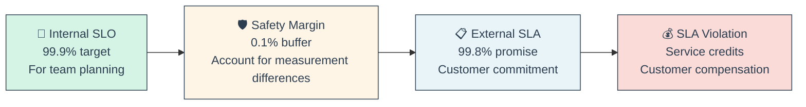

* 📊 **SLA Structure Components**:
  * 🎯 **Scope**: What services/features are covered
  * 📏 **Metrics**: How performance is measured (same as SLI)
  * 🎚️ **Targets**: Minimum acceptable performance levels
  * ⏰ **Measurement Period**: How often compliance is calculated
  * 💰 **Remedies**: Compensation for violations (credits, refunds)
  * 🚫 **Exclusions**: What doesn't count (planned maintenance, force majeure)

* 💰 **SLA Violation Consequences**:

| Violation Severity | Typical Remedy | Example |
|-------------------|----------------|---------|
| **Minor (99.0-99.8%)** | 10% service credit | AWS gives 10% monthly credit |
| **Moderate (95-99%)** | 25% service credit | Azure gives 25% credit |
| **Major (<95%)** | 100% service credit | Full month refund |
| **Critical (total outage)** | Contract termination rights | Customer can exit without penalty |

* 🏢 **Real-World SLA Examples**:

**AWS EC2 SLA:**
- 🎯 **Target**: 99.99% monthly uptime
- 💰 **Credits**: 10% (99.0-99.99%), 30% (<99.0%)
- 🚫 **Exclusions**: Maintenance windows, customer misuse

**Google Workspace SLA:**
- 🎯 **Target**: 99.9% monthly uptime
- 💰 **Credits**: 3 days (99.0-99.9%), 7 days (95-99%), 15 days (<95%)
- 📊 **Measurement**: 5-minute intervals

**Stripe Payment Processing:**
- 🎯 **Target**: 99.99% API availability
- 💰 **Credits**: Based on excess downtime minutes
- 📈 **Transparency**: Public status page with real-time metrics

* ⚠️ **SLA Gotchas & Fine Print**:
  * 📝 **Measurement Differences**: Your monitoring ≠ vendor's monitoring
  * 🚫 **Exclusions Galore**: Maintenance, DDoS, customer errors don't count
  * 📅 **Credit Process**: Must file claims within 30 days
  * 💸 **Credits vs Refunds**: Service credits expire, not cash back
  * 📊 **Aggregation**: Monthly averages hide daily outages

* 🎯 **Why Safety Margin Between SLO and SLA?**
  * 🔍 **Measurement Variance**: Different tools may show different results
  * ⚡ **Response Time**: Need buffer to fix issues before SLA breach
  * 🛡️ **Risk Management**: Avoid costly SLA violations
  * 📊 **Confidence**: Account for statistical uncertainty

**Example Safety Margin Calculation:**
```
Internal SLO: 99.9% (team targets this)
Measurement uncertainty: ±0.05%
Response time buffer: 0.05%
Safety margin total: 0.1%
External SLA: 99.8% (promise to customers)
```

* 💼 **Creating Your First SLA**:
  1. 📊 **Start with proven SLOs** (6+ months of data)
  2. 🎯 **Add safety margin** (0.1-0.2% typically)
  3. 💰 **Define compensation** that hurts but won't bankrupt you
  4. 🚫 **List exclusions** clearly (maintenance, external dependencies)
  5. 📝 **Make measurement transparent** (status page, metrics)
  6. ⚖️ **Get legal review** before publishing

* 🔄 **SLA Lifecycle Management**:
  * 📈 **Quarterly Reviews**: Are targets still appropriate?
  * 📊 **Violation Analysis**: Why did we miss targets?
  * 💰 **Cost Impact**: How much are we paying in credits?
  * 🎯 **Target Adjustments**: Tighten SLAs as reliability improves

* ⚠️ **Common SLA Antipatterns**:
  * ❌ **SLA = Marketing Tool**: Overpromising to win deals
  * ❌ **No Internal SLOs**: Publishing SLA without internal targets
  * ❌ **Unrealistic Targets**: 99.99% when you've never achieved 99.9%
  * ❌ **Hidden Exclusions**: Fine print that excludes everything
  * ❌ **No Monitoring**: Can't measure what you promise

🔗 **Resources:**
* [SLA Examples Collection](https://sla-tools.com/sla-examples)
* [AWS Service Level Agreements](https://aws.amazon.com/legal/service-level-agreements/)
* [Google Cloud SLAs](https://cloud.google.com/terms/sla)
* [SLA Best Practices Guide](https://sre.google/sre-book/service-level-objectives/)

---

## 📍 Slide 9 – 💰 Error Budgets - Balancing Innovation and Reliability

* 💰 **Error Budget = Allowed Amount of Unreliability** in a time period
* ⚖️ **Purpose**: Balance between shipping features fast vs keeping systems stable
* 📊 **Math**: Error Budget = (1 - SLO) × Total Time (e.g., 99.9% SLO = 0.1% error budget)
* 🎯 **Innovation Currency**: Can "spend" error budget on risky deployments

**Error Budget Concept**
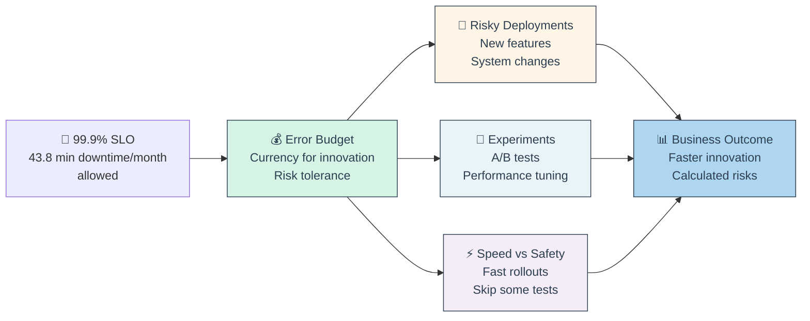

* 🧮 **Error Budget Calculation Examples**:

| SLO Target | Monthly Downtime Budget | Error Budget % |
|------------|------------------------|----------------|
| **99%** | 7.2 hours | 1% |
| **99.9%** | 43.8 minutes | 0.1% |
| **99.95%** | 21.9 minutes | 0.05% |
| **99.99%** | 4.38 minutes | 0.01% |

**Translation:** 99.9% SLO = You can be "down" 43.8 minutes/month without violating your promise

* 💸 **How to "Spend" Error Budget**:
  * 🚀 **Aggressive Deployments**: Deploy on Friday, skip some testing
  * 🧪 **Experiments**: Try new architectures, databases, frameworks
  * ⚡ **Performance Tuning**: Risky optimizations that might break things
  * 🔄 **Rapid Iteration**: Multiple deploys per day vs careful weekly releases
  * 🎯 **Feature Flags**: Test new features with subset of users

* ⚖️ **Error Budget as Negotiation Tool**:
  * 👥 **Product Manager**: "We need this feature shipped ASAP!"
  * 🛡️ **SRE**: "We can deploy faster, but it'll use 20% of our error budget"
  * 💰 **Trade-off Discussion**: Speed vs reliability, quantified
  * 🎯 **Data-Driven Decision**: Not gut feeling, but math

* 🚨 **When Error Budget is Exhausted**:
  * 🛑 **Feature Freeze**: No new features until reliability improves
  * 🔍 **Focus on Toil**: Eliminate manual processes causing outages
  * 🛠️ **Infrastructure Work**: Improve monitoring, alerting, automation
  * 📚 **Postmortems**: Deep analysis of what's causing unreliability
  * ⏰ **Wait**: Budget resets next measurement period

* 💡 **Real-World Error Budget Stories**:

**Google Gmail:**
- 🎯 99.9% SLO means 8.77 hours/year error budget
- 📊 Spent 4 hours on planned outage for major upgrade
- 💰 Remaining 4.77 hours for unplanned issues
- 🎯 Allows aggressive feature development within budget

**Netflix:**
- 💰 Uses error budget to justify chaos engineering
- 🐒 Chaos Monkey failures "cost" error budget
- 🎯 Trade-off: Controlled failures vs uncontrolled outages
- 📈 Result: Higher overall reliability through testing

* ⚠️ **Error Budget Pitfalls**:
  * ❌ **Treat as Target**: Error budget is ceiling, not goal
  * ❌ **Game the System**: Artificially triggering errors to "use" budget
  * ❌ **Ignore User Impact**: Some errors hurt users more than others
  * ❌ **No Enforcement**: Policy exists but teams ignore it
  * ❌ **Wrong Measurement**: Not aligned with user experience

* ✅ **Error Budget Best Practices**:
  * 📝 **Clear Policy**: Document what happens at each budget level
  * 🤖 **Automated Tracking**: Don't rely on manual calculations
  * 👥 **Stakeholder Buy-in**: Product, engineering, and business alignment
  * 📊 **Regular Reviews**: Weekly check-ins during budget consumption
  * 🔄 **Continuous Adjustment**: Refine policy based on experience

* 🎯 **Success Metrics for Error Budgets**:
  * 📈 **Feature Velocity**: Are teams shipping faster when budget allows?
  * 🛡️ **Reliability**: Is system actually more reliable over time?
  * ⚖️ **Balance**: Good mix of innovation and stability?
  * 👥 **Team Health**: Less conflict between dev and ops teams?

🔗 **Resources:**
* [Error Budget Policy Examples](https://sre.google/workbook/error-budget-policy/)
* [Implementing Error Budgets](https://sre.google/workbook/implementing-slos/)
* [Error Budget Calculator](https://uptime.is/)

---

### 🎭 **Interactive Break #1: "SLO Horror Stories & War Stories"** 💀

**🔥 Real Tales from the SRE Trenches!**

*Time to learn from spectacular SLI/SLO/SLA failures and amazing wins!*

---

**Horror Story #1: "The 99.99% Promise of Doom"** 💀

*Company:* Startup trying to win enterprise deal  
*Date:* Black Friday 2023

**What Happened:**
- 🎯 Sales team promised 99.99% uptime to win $2M contract
- 🛡️ SRE team was currently achieving 99.2% (several outages/month)
- 📋 Signed SLA with 50% refund penalty for missing target
- 💥 System crashed for 6 hours on Black Friday
- 💰 Had to refund $1M + customer sued for additional damages

**The Math:**
```
99.99% SLA = 4.38 minutes downtime/month allowed
Actual outage = 360 minutes (6 hours)
Miss by = 8200% over budget 💀
```

**Root Causes:**
- ❌ No historical SLO tracking
- ❌ Sales promised without engineering input  
- ❌ No error budget policy in place
- ❌ Infrastructure couldn't support the promise

**Lessons Learned:**
```
✅ NEVER promise better SLA than current SLO performance
✅ Sales and engineering MUST align on commitments
✅ Track reliability for 6+ months before making SLAs
✅ Have technical review of all customer SLAs
✅ Start conservative, improve over time
```

---

**Horror Story #2: "The Vanity Metric SLO Trap"** 🎪

*Company:* Social media platform  
*Timeline:* 8 months of wrong priorities

**What Happened:**
- 📊 Set SLO: "Server CPU < 70%" (seemed important!)
- 🎯 Spent 8 months optimizing CPU usage
- 💰 Bought expensive servers, rewrote algorithms  
- 📈 Achieved 45% CPU utilization (crushing the SLO!)
- 😡 Users still complained about slow page loads
- 🔍 Investigation: Network latency was the real issue

**The Problem:**
- 🎯 CPU usage ≠ User experience
- 📊 Measured what was easy, not what mattered
- 👥 Users care about page speed, not server internals

**Real SLO Should Have Been:**
```
❌ Bad SLO:  Server CPU utilization < 70%
✅ Good SLO: Page load time P95 < 2 seconds  
✅ Good SLO: 99.5% of pages load successfully
```

**Lessons Learned:**
```
✅ SLIs must correlate with user happiness
✅ Measure outcomes, not outputs
✅ Ask "would users notice if this SLI was bad?"
✅ Start with Golden Signals, then add specifics
```

---

**War Story #1: "The Error Budget That Saved Christmas"** 🎄

*Company:* E-commerce giant  
*Date:* December 2023

**The Setup:**
- 🎯 99.9% availability SLO (43.8 min/month error budget)
- 🛒 December 15th: Major sale feature ready to deploy
- 📊 Current error budget status: 80% remaining (35 min left)
- ⚖️ Decision time: Deploy risky feature or wait until January?

**The Decision Matrix:**
```
Option A: Deploy now
- Risk: Could use 20-30 min of error budget if bugs found
- Reward: $5M additional revenue from Christmas sales

Option B: Wait until January  
- Risk: Lose $5M revenue opportunity
- Reward: Preserve error budget, safer reliability
```

**What They Did:**
- 💰 **Used error budget as currency**: "We can afford 20 min of downtime"
- 🚀 **Deployed with extra monitoring**: 24/7 team ready to rollback
- 📊 **Result**: 15 minutes of issues during rollout, fixed quickly
- 🎉 **Outcome**: $5M revenue, used 34% error budget, everyone happy

**Key Success Factors:**
```
✅ Error budget gave permission to take calculated risk
✅ Had rollback plan ready (used 5 min to rollback)
✅ Business value justified the risk
✅ Team was prepared for problems
✅ Made data-driven decision, not fear-based
```

---

**War Story #2: "The SLO That United Dev and Ops"** 🤝

*Company:* Fintech startup  
*Problem:* Constant fighting between teams

**The Conflict:**
- 👨‍💻 **Developers**: "Ops team blocks every deployment!"
- 🛡️ **Operations**: "Developers break production constantly!"  
- 📈 **CEO**: "Why are we shipping so slowly but still having outages?"

**The Solution - Shared SLOs:**
```yaml
Shared Responsibility SLO:
- Target: 99.5% API availability  
- Error Budget: 3.6 hours/month
- Policy: Dev owns code quality, Ops owns infrastructure
- Agreement: Both teams measured on same SLO
```

**Implementation:**
- 📊 **Shared Dashboard**: Both teams see same metrics
- 💰 **Shared Error Budget**: Must negotiate how to "spend" it
- 🤝 **Joint On-Call**: Dev and ops rotate together
- 📚 **Blameless Postmortems**: Focus on systems, not people

**Results (6 months later):**
- 📈 Availability improved: 98.2% → 99.7%
- 🚀 Deploy frequency: 2/week → 10/week  
- 😊 Team satisfaction up 40%
- 💰 Incident cost down 60%

**Magic Words:**
"We have 2.8 hours of error budget left this month. Should we use 30 minutes to deploy this feature?"

---

**🤔 Interactive Discussion Questions:**

1. **🙋 Raise your hand if you've ever:**
   - Made promises about uptime without checking current performance?
   - Spent time optimizing metrics that users don't care about?
   - Had dev vs ops fights about "risky" deployments?

2. **💰 Error Budget Scenarios - What would you do?**

   **Scenario A:** You have 10% error budget left, and marketing wants to launch Black Friday feature tomorrow.
   
   **Scenario B:** You've used 0% error budget this month. Product team says "be extra careful with deployments."

3. **📊 SLO Challenge:** 
   Your mobile app currently crashes for 0.5% of users. What SLO would you set?
   - A) 0% crash rate (perfection!)
   - B) 0.1% crash rate (5x better)  
   - C) 0.4% crash rate (slightly better)
   - D) 0.6% crash rate (room for growth)

<details>
<summary>💡 Discussion Answers</summary>

**Scenario A**: Use data to decide. How much error budget would the launch "cost"? Can you do staged rollout to limit risk? What's the business impact of waiting?

**Scenario B**: This is wrong! Unused error budget = missed innovation opportunity. Should be deploying MORE, not less.

**SLO Challenge**: Answer C (0.4%). Start with achievable target better than current, improve over time. A is impossible, B is too aggressive, D doesn't drive improvement.

</details>

---

**🎯 Key Takeaways:**
- 📊 **Measure what users care about**, not what's easy to measure
- 💰 **Error budgets enable innovation** when used correctly  
- 🤝 **Shared SLOs unite teams** around common goals
- ⚖️ **Balance is everything**: Not too high, not too low targets
- 📈 **Start conservative**, improve over time with data

## 📍 Slide 10 – 📈 Prometheus & Grafana - The Open Source Monitoring Stack

* 📊 **Prometheus** = Time-series database + metric collection system (CNCF graduated)
* 📈 **Grafana** = Visualization platform + alerting engine (works with any data source)
* 🔄 **Pull Model**: Prometheus scrapes metrics from targets every 15 seconds
* 🎯 **Industry Standard**: 65% of K8s users run Prometheus (CNCF Survey 2024)

**Prometheus + Grafana Architecture**
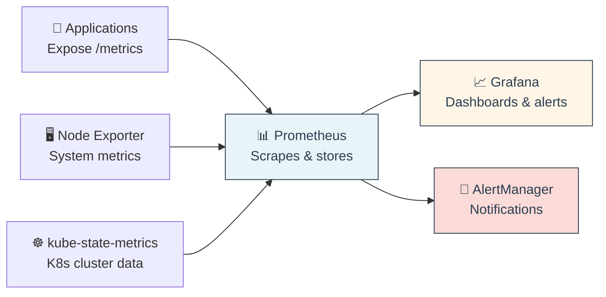

* 📊 **Prometheus Key Features**:
  * ⏱️ **Time Series**: Metrics with timestamps, perfect for trends
  * 🔍 **PromQL**: Powerful query language for complex analysis
  * 🎯 **Service Discovery**: Auto-discovers targets in K8s, AWS, etc.
  * 💾 **Local Storage**: No external dependencies, simple deployment

* 📈 **Grafana Key Features**:
  * 📱 **Rich Dashboards**: Interactive charts, heatmaps, gauges
  * 🔌 **Multi-Source**: Prometheus, InfluxDB, MySQL, CloudWatch
  * 🚨 **Alerting**: Visual alert rules with multiple notification channels
  * 👥 **Teams & Auth**: RBAC, SSO integration

* 🎯 **Production Setup Checklist**:
  * ✅ **High Availability**: Multiple Prometheus instances + Thanos
  * ✅ **Retention**: Configure storage retention (default 15 days)
  * ✅ **Security**: Basic auth, TLS, network policies
  * ✅ **Backup**: Regular snapshots of TSDB
  * ✅ **Resource Limits**: CPU/memory limits in K8s

* ⚠️ **Common Pitfalls**:
  * ❌ **High Cardinality**: Metrics with too many unique label combinations
  * ❌ **No Retention Policy**: Disk fills up, Prometheus crashes
  * ❌ **Missing Labels**: Can't filter/aggregate properly
  * ❌ **Scrape Failures**: Targets down, missing metrics

🔗 **Resources:**
* [Prometheus Docs](https://prometheus.io/docs/)
* [Grafana Dashboards](https://grafana.com/grafana/dashboards/)
* [PromQL Tutorial](https://prometheus.io/docs/prometheus/latest/querying/basics/)

---

## 📍 Slide 11 – 🖥️ System Monitoring - Infrastructure Metrics (CPU, Memory, Disk, Network)

* 🎯 **System Monitoring** = Track hardware/OS performance to prevent resource exhaustion
* 📊 **USE Method**: Utilization, Saturation, Errors for every resource
* 🚨 **Goal**: Alert before resources become bottlenecks affecting applications

**Infrastructure Monitoring Stack**
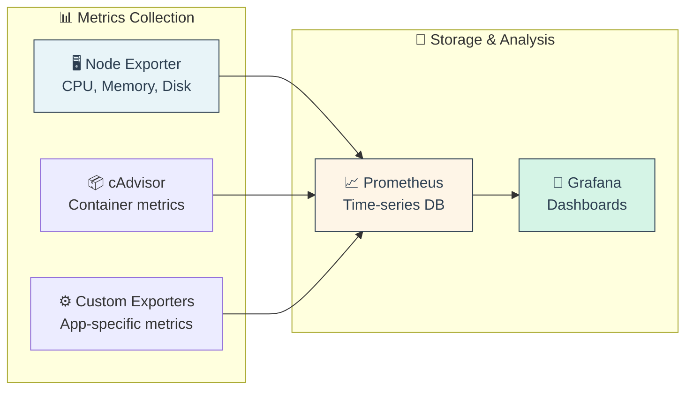

* 🖥️ **CPU Monitoring**:
  * 📊 **Key Metrics**: Usage %, Load Average, Context Switches
  * 🚨 **Alerts**: CPU > 80% for 5 minutes, Load > CPU cores
  * 🔍 **Breakdown**: User, System, IOWait, Idle time


* 💾 **Memory Monitoring**:
  * 📊 **Key Metrics**: Used %, Available, Swap usage, Cache/Buffers
  * 🚨 **Alerts**: Memory > 85%, Swap > 10%
  * ⚠️ **Linux Gotcha**: "Used" memory includes cache (use "Available")

* 💿 **Disk Monitoring**:
  * 📊 **Key Metrics**: Space used %, IOPS, Read/Write latency, Queue depth
  * 🚨 **Alerts**: Disk > 90%, IOWait > 20%, Queue depth > 32
  * 📈 **Growth Tracking**: Predict when disk will be full

* 🌐 **Network Monitoring**:
  * 📊 **Key Metrics**: Bandwidth utilization, Packet loss, Errors, Connections
  * 🚨 **Alerts**: Bandwidth > 80%, Error rate > 0.01%, Drops > 0
  * 🔍 **TCP States**: ESTABLISHED, TIME_WAIT, CLOSE_WAIT connections

* 📊 **Essential Infrastructure Dashboard**:

| Panel | Metric | Alert Threshold |
|-------|---------|----------------|
| **🖥️ CPU Usage** | `100 - (avg(idle) * 100)` | > 80% for 5min |
| **💾 Memory** | `(1 - Available/Total) * 100` | > 85% |
| **💿 Disk Space** | `(1 - Avail/Size) * 100` | > 90% |
| **💿 Disk IOPS** | `rate(reads + writes)` | > 1000 IOPS |
| **🌐 Network** | `rate(bytes) * 8` | > 80% capacity |
| **⚡ Load Average** | `load1 / cpu_count` | > 0.8 |

* ⚠️ **Monitoring Pitfalls**:
  * ❌ **Alert Fatigue**: Too many low-priority alerts
  * ❌ **Wrong Thresholds**: 95% CPU might be normal for batch jobs
  * ❌ **Missing Context**: High CPU without knowing what's causing it
  * ❌ **No Trend Analysis**: Only current values, no growth predictions

🔗 **Resources:**
* [Node Exporter Docs](https://github.com/prometheus/node_exporter)
* [USE Method](http://www.brendangregg.com/usemethod.html)
* [Infrastructure Monitoring Guide](https://sre.google/sre-book/monitoring-distributed-systems/)

---

## 📍 Slide 12 – 🌐 Application Performance Monitoring (APM) - Code-Level Observability

* 🔍 **APM = Application Performance Monitoring** - Deep visibility into application behavior
* 🎯 **Purpose**: Find bottlenecks, errors, and performance issues in your code
* 🧵 **Three Pillars**: Metrics (what), Logs (when), Traces (how)
* 📊 **Level**: Goes deeper than infrastructure - method calls, database queries, external APIs

**APM Data Flow**
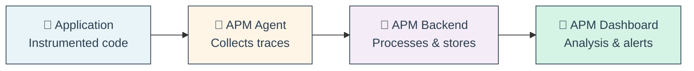

* 🛠️ **Popular APM Tools**:

| Tool | Type | Best For |
|------|------|----------|
| **🔍 Jaeger** | Open source | Microservices tracing |
| **📊 New Relic** | SaaS | Full-stack monitoring |
| **🌊 Datadog** | SaaS | Infrastructure + APM |
| **⚡ Elastic APM** | Open source | ELK stack integration |
| **🌐 Honeycomb** | SaaS | High-cardinality events |
| **🔥 Grafana Tempo** | Open source | Traces + Grafana |

* 🧵 **Distributed Tracing**:
  * 🎯 **Trace**: Complete request journey across services
  * 📏 **Span**: Single operation (database query, HTTP call)
  * 🔗 **Context**: Correlates spans across service boundaries
```
Trace: User Login Request
├── Frontend (50ms)
├── Auth Service (25ms)  
│   ├── Database Query (15ms)
│   └── Redis Cache (5ms)
├── User Service (30ms)
└── Notification Service (10ms)
Total: 115ms
```


* 🔥 **Performance Bottleneck Detection**:
  * ⏱️ **Slow Transactions**: P95 latency > threshold
  * 💾 **Database Issues**: Long-running queries, connection pool exhaustion  
  * 🌐 **External APIs**: Third-party service latency spikes
  * 🧠 **Memory Leaks**: Gradual memory increase over time
  * 🗑️ **Garbage Collection**: GC pauses affecting response time

* 📈 **APM Value Proposition**:
  * 🎯 **Mean Time to Detection (MTTD)**: From hours to minutes
  * 🔧 **Mean Time to Resolution (MTTR)**: Faster root cause analysis
  * 💰 **Cost Optimization**: Find expensive operations, optimize them
  * 👥 **Developer Experience**: Understand code performance impact
  * 📊 **Business Insights**: Correlate performance with user behavior

* ⚠️ **APM Implementation Pitfalls**:
  * ❌ **Performance Overhead**: Too much instrumentation slows app
  * ❌ **Sampling Issues**: Missing critical traces due to low sampling rate
  * ❌ **Tool Sprawl**: Different APM tools for different services
  * ❌ **No Business Context**: Technical metrics without user impact
  * ❌ **Alert Fatigue**: Too many low-value performance alerts

🔗 **Resources:**
* [OpenTelemetry](https://opentelemetry.io/)
* [Jaeger Documentation](https://www.jaegertracing.io/docs/)
* [APM Best Practices](https://sre.google/sre-book/monitoring-distributed-systems/)

---

## 📍 Slide 13 – 🌍 Website Monitoring with Checkly - Synthetic & API Monitoring

* 🤖 **Synthetic Monitoring** = Proactive testing of user journeys using automated scripts
* 🌍 **Checkly** = Modern monitoring platform for APIs & web apps (Playwright-powered)
* 🎯 **Purpose**: Catch issues before real users do, validate user experience
* ⚡ **Real-time**: Run checks every minute from multiple global locations

* 📊 **Key Monitoring Metrics**:
  * ⏱️ **Response Time**: Page load, API latency from global locations
  * ✅ **Availability**: Success rate % over time  
  * 🌍 **Geographic Performance**: Speed variations by region
  * 🧭 **User Journey Success**: Complete workflow testing (signup → purchase)
  * 📈 **Core Web Vitals**: LCP, FID, CLS for SEO impact

* 🎯 **What to Monitor**:
```yaml
Critical User Journeys:
- Homepage loads < 2 seconds
- User signup flow completes successfully  
- Shopping cart → checkout → payment works
- Login → dashboard loads
- Search returns results < 1 second
- Mobile experience works on key devices

API Endpoints:
- /health returns 200 OK
- Authentication endpoints work  
- Core business logic APIs respond < 200ms
- Database connections succeed
- Third-party integrations respond
```

* 🚨 **Smart Alerting Setup**:
```yaml
Alert Conditions:
- Page fails to load (5xx errors)
- Response time > 5 seconds for 2 consecutive checks  
- User journey fails (checkout broken)
- API returns error rate > 1%
- Geographic performance degrades (one region slow)
- SSL certificate expires in 30 days

Notification Channels:
- Slack #alerts channel
- PagerDuty for critical issues
- Email for non-critical warnings
- Webhook to incident management system
```

* 🌍 **Global Monitoring Locations**:
  * 🇺🇸 **US**: N. Virginia, Oregon, N. California
  * 🇪🇺 **Europe**: Ireland, Frankfurt, London
  * 🌏 **Asia**: Tokyo, Singapore, Mumbai
  * 🌊 **Others**: Sydney, São Paulo, Toronto

* 💡 **Checkly Best Practices**:
  * ✅ **Test Real User Journeys**: Not just homepage, full workflows
  * ✅ **Multiple Locations**: Catch regional performance issues
  * ✅ **Realistic Data**: Use production-like test data
  * ✅ **Mobile Testing**: Test responsive design, mobile performance
  * ✅ **Authentication Testing**: Login flows, protected pages
  * ✅ **Third-party Dependencies**: Monitor external APIs you depend on

* ⚠️ **Synthetic Monitoring Limitations**:
  * ❌ **Not Real Users**: Synthetic traffic ≠ actual user behavior
  * ❌ **Script Maintenance**: Browser tests break when UI changes
  * ❌ **Cost at Scale**: Expensive for high-frequency checking
  * ❌ **Limited Scenarios**: Can't test every possible user path
  * ❌ **Geographic Bias**: Probes from limited locations

* 📈 **ROI of Synthetic Monitoring**:
  * 🎯 **Early Detection**: Find issues before customer complaints
  * 💰 **Revenue Protection**: Prevent lost sales from broken checkout
  * 📊 **Performance Insights**: Understand global user experience  
  * 🔍 **Root Cause Analysis**: Pinpoint exact failure points
  * ⚡ **Faster MTTR**: Detailed failure context speeds resolution

🔗 **Resources:**
* [Checkly Documentation](https://www.checklyhq.com/docs/)
* [Playwright Testing Guide](https://playwright.dev/docs/intro)
* [Synthetic Monitoring Best Practices](https://www.checklyhq.com/learn/headless/)
* [Core Web Vitals](https://web.dev/vitals/)

---

### 🎭 **Interactive Break #2: "Monitoring Tool Death Match"** ⚔️

**🥊 Battle of the Monitoring Stacks!**

*Time to pick sides and defend your monitoring tool choices!*

---

**Round 1: "Prometheus vs. Paid APM" Fight** 🥊

**Team Prometheus** 😤:
- 💪 "Open source, no vendor lock-in!"
- 🏠 "Run on your own infrastructure, no data privacy concerns"
- 💰 "Free forever, scales infinitely"  
- 🔧 "Highly customizable, integrate with anything"
- 📊 "PromQL is the most powerful query language"

**Team Paid APM** 🤑:
- ⚡ "5-minute setup vs 5-day Prometheus config"
- 🧠 "AI-powered anomaly detection, smart alerts"
- 📱 "Beautiful dashboards out of the box"
- 🆘 "24/7 support when your monitoring breaks"
- 🔍 "Code-level insights Prometheus can't provide"

**🤔 Audience Poll Time:**
*Raise your hand for your choice!*

1. 🙋 **Team Prometheus** - DIY monitoring freedom!
2. 🙋 **Team Paid APM** - Just works, worth the cost!  
3. 🙋 **Team Hybrid** - Both, for different use cases!

---

**Round 2: "Alert Fatigue Horror Stories"** 🔔💀

**The Competition**: Who has the WORST alert fatigue story?

**Story Candidate #1**: 
*"Our Slack got 500 alerts/hour. We created #alert-spam channel and ignored it. Missed 6-hour production outage because we trained ourselves to ignore alerts."* 😵

**Story Candidate #2**:
*"Set CPU alert at 50%. Got woken up every night for 3 months. Eventually just turned off phone. Slept through actual outage where servers literally caught fire."* 🔥

**Story Candidate #3**:
*"Disk space alert every time it hit 80%. Happened 20 times/day. Auto-increased disk size via script. Spent $50k on unused storage before anyone noticed."* 💸

**🏆 Voting Categories**:
- 🤦 Most Facepalm-worthy
- 💸 Most Expensive Mistake  
- 😴 Best Sleep Deprivation Story
- 🔥 Closest to Actual Disaster

**🎯 Bonus Points:**
- 📞 Vendor called you during an outage to "check how things are going"
- 🤖 AI flagged your planned maintenance as "anomalous behavior"  
- 💳 Got charged extra for "premium metrics" that used to be free
- 📊 Dashboard looked amazing in sales demo, ugly in production

---

**Round 4: "Quick-Fire Monitoring Decisions"** ⚡

**Scenario 1**: You have 30 seconds to choose monitoring for a new startup with 2 developers and $500/month budget.

A) 📊 Full Prometheus + Grafana setup
B) 🌊 Datadog (will cost $2000/month)  
C) 📈 Basic CloudWatch + Pingdom
D) 🤞 printf debugging + hope

**Scenario 2**: Enterprise with 1000+ services, compliance requirements, and unlimited budget.

A) 📊 Keep using Prometheus (it's working!)
B) 🌊 All-in on Datadog for everything
C) 🔍 Best-of-breed: Prometheus + New Relic + Checkly  
D) 🏢 Build internal monitoring platform

**Scenario 3**: Your monitoring system is down and you need to monitor the monitoring system.

A) 👁️ External monitoring service (who monitors the monitor?)
B) 📱 Simple uptime check from your phone  
C) 🤝 Ask another team to monitor you
D) 🧘 Embrace the chaos, go monitoring-free

<details>
<summary>💡 Our Spicy Takes</summary>

**Scenario 1**: C - Start simple, add complexity as you grow and have money
**Scenario 2**: C - Use right tool for each job, you can afford integration complexity  
**Scenario 3**: A - It's turtles all the way down, but at least you know about it

</details>

---

**🎯 The Great Monitoring Truth**:

> *"The best monitoring system is the one your team actually looks at when things break."*

**Corollary**: 
> *"The worst monitoring system is the one that alerts so much you ignore it, or so little you don't trust it."*

**Final Wisdom**:
```
┌─────────────────────────────────────────────┐
│ Monitoring Hierarchy of Needs:              │
│                                             │
│     🧘 Advanced Analytics & AI             │
│   📊 Pretty Dashboards & Correlations      │ 
│ 🚨 Reliable Alerting That People Trust     │
│🖥️ Basic System Metrics That Actually Work  │
└─────────────────────────────────────────────┘
```

**Remember**: Start with the bottom layer and work your way up. Skipping steps leads to fancy dashboards that nobody trusts! 📊💀

---

**🤝 Monitoring Peace Treaty**:

All monitoring tools are valid choices depending on:
- 💰 **Budget**: Open source vs SaaS cost
- 👥 **Team Size**: DIY vs managed complexity  
- 🏢 **Company Stage**: Startup vs enterprise needs
- 🔧 **Expertise**: Available skills and time
- 📊 **Requirements**: Compliance, scale, features

*Choose tools that fit YOUR context, not what's trendy!* ✨


## 📍 Slide 14 – 🔔 Smart Alerting Strategies - When and How to Alert

* 🎯 **Smart Alerting** = Right alert, right person, right time (no alert fatigue)
* 📊 **Golden Rule**: Only alert if human action required + urgency justified
* ⚖️ **Balance**: Catch real issues vs overwhelming teams with noise
* 🧠 **Philosophy**: Alerts are interrupts - use them wisely

**Alert Priority Framework**
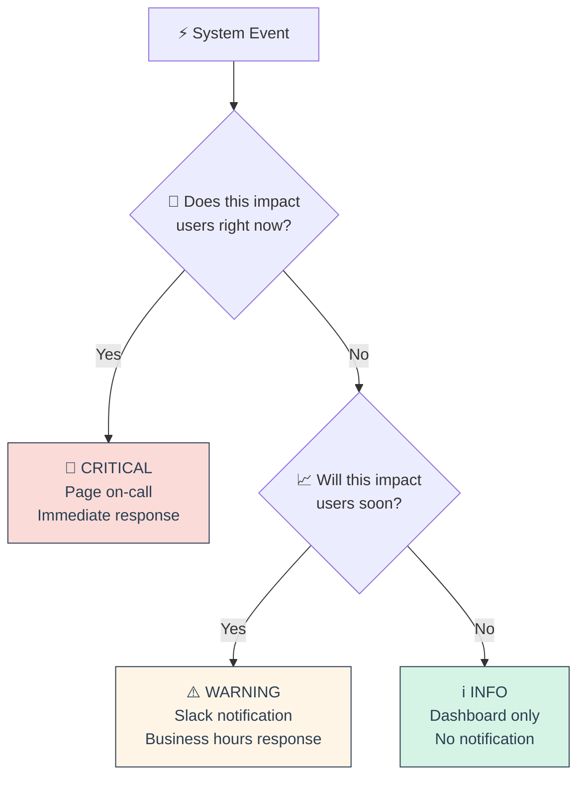

* 🚨 **Alert Severity Levels**:

| Level | When to Use | Response | Example |
|-------|-------------|----------|---------|
| **🔥 Critical** | Users affected NOW | Page immediately | API down, payment failures |
| **⚠️ Warning** | Will affect users soon | Slack during hours | Disk 90% full, high latency |
| **ℹ️ Info** | FYI, no action needed | Dashboard only | Deploy completed, cache miss |

* 🧠 **Alert Fatigue Prevention**:
  * ⏰ **Time-based**: Don't alert at 3 AM for non-critical issues
  * 📊 **Threshold Tuning**: Start high, lower based on real incidents
  * 🔕 **Suppression**: Group related alerts, avoid duplicate notifications
  * 📈 **Trending**: Alert on rate of change, not static values
  * 🤖 **Auto-resolution**: Clear alerts when conditions improve

* 🔄 **Alert Lifecycle Management**:
  * 🎯 **Fire**: Condition threshold breached
  * ⏰ **Pending**: Waiting for `for` duration to confirm
  * 🚨 **Firing**: Active alert, notifications sent
  * ✅ **Resolved**: Condition returned to normal
  * 🔕 **Silenced**: Temporarily muted (maintenance, known issues)

* ⚠️ **Common Alerting Antipatterns**:
  * ❌ **Boy Who Cried Wolf**: Too many false positives
  * ❌ **Alert on Everything**: Monitoring ≠ alerting
  * ❌ **No Context**: "Something is wrong" without details
  * ❌ **Single Metric**: Alert on symptoms, not just CPU/memory
  * ❌ **No Escalation**: Same urgency for everything

🔗 **Resources:**
* [Alerting Best Practices](https://prometheus.io/docs/practices/alerting/)
* [SRE Book - Monitoring](https://sre.google/sre-book/monitoring-distributed-systems/)
* [Alert Fatigue Research](https://www.pagerduty.com/blog/alert-fatigue/)

---

## 📍 Slide 15 – 📱 Notification Systems - Slack, PagerDuty, Email Integration

* 📢 **Notification Systems** = How alerts reach humans through multiple channels
* 🎯 **Escalation Path**: Email → Slack → Phone → Manager (based on severity)
* 🔄 **Integration Pattern**: AlertManager → Notification Service → Human
* ⚡ **Response Time**: Critical alerts reach humans in <2 minutes

**Multi-Channel Notification Flow**
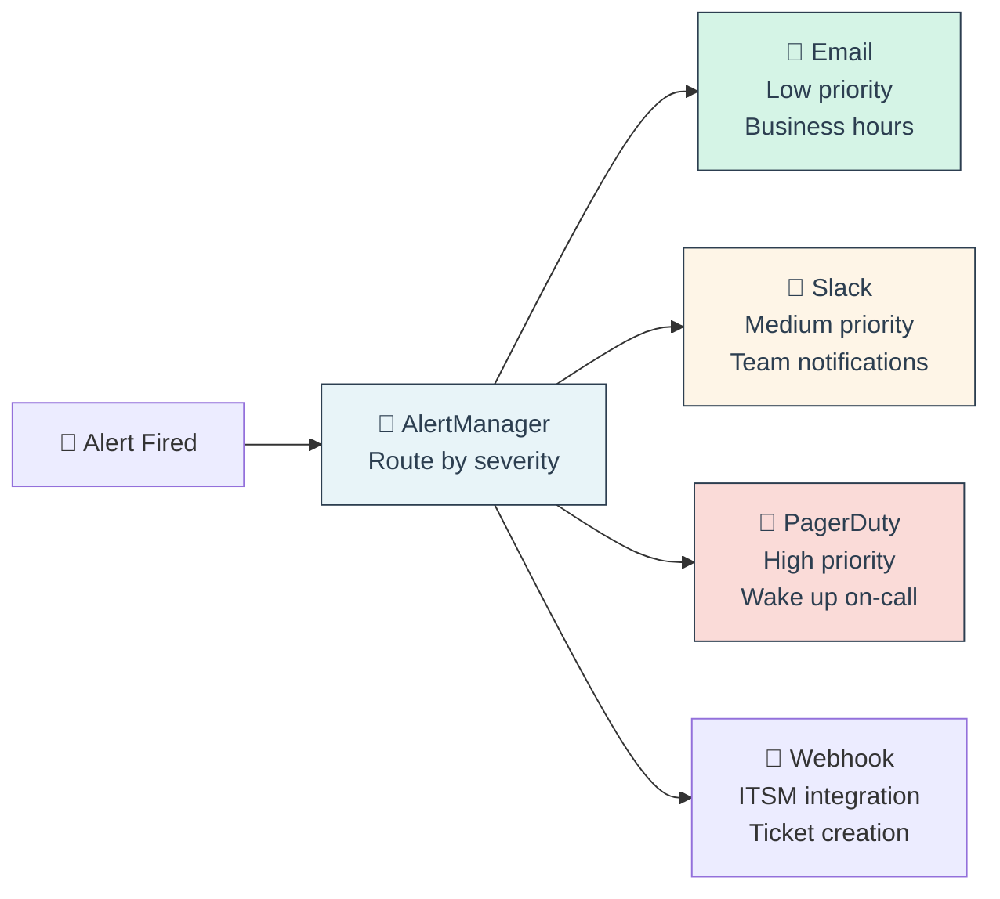

* 📊 **Notification Channel Comparison**:

| Channel | Response Time | Cost | Best For |
|---------|---------------|------|----------|
| **📧 Email** | 5-30 minutes | Free | Non-urgent, audit trail |
| **💬 Slack** | 1-5 minutes | $8/user/month | Team coordination |
| **📱 PagerDuty** | 30 seconds | $21/user/month | Critical 24/7 alerts |
| **📞 Phone Call** | 10 seconds | High stress | Emergency only |
| **📱 SMS** | 30 seconds | $0.01/message | Simple alerts |

* 🔄 **Escalation Policy Example**:
```
Alert: Payment API Down
├── T+0min: PagerDuty → On-call Engineer
├── T+5min: SMS backup → Secondary Engineer  
├── T+15min: Phone call → Engineering Manager
├── T+30min: Email → CTO
└── T+60min: All hands alert
```

* 🤖 **Advanced Integrations**:
  * 🎫 **JIRA**: Auto-create tickets for warnings
  * 📊 **Teams**: Microsoft Teams for enterprise
  * 🔗 **Webhook**: Custom integrations, ChatOps
  * 📱 **Mobile Apps**: Custom push notifications
  * 🎙️ **Conference Bridge**: Auto-dial war room

* ⚠️ **Notification Pitfalls**:
  * ❌ **Alert Storms**: 100+ notifications at once
  * ❌ **Wrong Audience**: Database alerts to frontend team
  * ❌ **No Escalation**: Alert fired but nobody responded
  * ❌ **Timezone Issues**: Waking up wrong continent
  * ❌ **Single Point of Failure**: Only Slack, what if Slack is down?

🔗 **Resources:**
* [AlertManager Documentation](https://prometheus.io/docs/alerting/latest/alertmanager/)
* [PagerDuty Integration Guide](https://www.pagerduty.com/docs/guides/prometheus-integration-guide/)
* [Slack AlertManager Integration](https://grafana.com/docs/grafana/latest/alerting/notifications/)

---

## 📍 Slide 16 – 🚨 Incident Response - From Detection to Resolution

* 🎯 **Incident Response** = Structured process to minimize impact and restore service
* ⏱️ **Goal**: Reduce MTTR (Mean Time to Resolution) through standardized procedures
* 👥 **Roles**: Incident Commander, Communications, Subject Matter Experts
* 📚 **Process**: Detect → Respond → Mitigate → Resolve → Learn

**Incident Response Lifecycle**
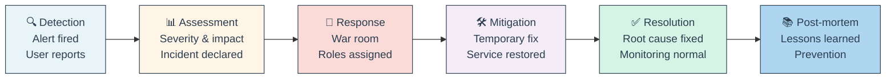

* 📊 **Incident Severity Levels**:

| Level | Impact | Response | Example |
|-------|--------|----------|---------|
| **🔥 SEV-1** | Complete outage | All hands, 24/7 | Payment system down |
| **⚠️ SEV-2** | Degraded service | Business hours team | Slow API responses |
| **ℹ️ SEV-3** | Minor issue | Single engineer | Non-critical feature bug |

* 👥 **Incident Response Roles**:
```yaml
Incident Commander (IC):
  - Overall incident leadership
  - Coordinate response efforts  
  - Make key decisions
  - Communicate with stakeholders

Communications Lead:
  - External status updates
  - Customer communications
  - Stakeholder notifications
  - Social media management

Subject Matter Experts (SMEs):
  - Technical diagnosis
  - Implement fixes
  - Provide domain knowledge
  - Execute recovery procedures
```

* 🔄 **Incident War Room Setup**:
  * 📞 **Bridge Line**: Dedicated conference bridge
  * 💬 **Slack Channel**: #incident-YYYYMMDD-summary
  * 📊 **Dashboard**: Key metrics visible to all
  * 📝 **Timeline**: Shared document for chronology
  * 🎥 **Screen Share**: Show debugging/fixes to team

* 📝 **Incident Communication Template**:
```markdown
# Incident Update - Payment API Outage

**Status:** INVESTIGATING  
**Severity:** SEV-1  
**Started:** 2024-01-15 14:30 UTC  
**Impact:** Customers cannot complete purchases  

**Current Actions:**
- Engineering team investigating database connection issues
- Rolled back recent deployment at 14:45 UTC
- Payment provider confirmed their systems operational

**Next Update:** 15:15 UTC (30 minutes)  
**Status Page:** https://status.company.com
```

* 🛠️ **Common Mitigation Strategies**:
  * 🔄 **Rollback**: Revert to last known good state
  * ⚖️ **Load Balancing**: Route traffic away from problem area
  * 📊 **Rate Limiting**: Reduce load on struggling systems
  * 🔄 **Circuit Breaking**: Fail fast, prevent cascading failures
  * 💾 **Failover**: Switch to backup systems/regions
  * 🎯 **Feature Flags**: Disable problematic features

* 📚 **Post-Incident Process**:
```yaml
Immediate (24 hours):
  - Service restored and stable
  - Preliminary timeline documented
  - Customer communications sent

Short-term (1 week):  
  - Blameless post-mortem conducted
  - Root cause analysis completed
  - Action items identified and assigned

Long-term (1 month):
  - Action items implemented
  - Preventive measures deployed
  - Runbooks updated
  - Team training completed
```

* 📊 **Incident Metrics to Track**:
  * ⏱️ **MTTD**: Mean Time to Detection (alert to awareness)
  * ⚡ **MTTI**: Mean Time to Investigation (awareness to diagnosis)
  * 🛠️ **MTTM**: Mean Time to Mitigation (diagnosis to temporary fix)
  * ✅ **MTTR**: Mean Time to Resolution (start to full resolution)
  * 📈 **Incident Frequency**: Number of incidents per month
  * 🔄 **Repeat Incidents**: Same root cause recurring

* 🎯 **Incident Response Best Practices**:
  * ✅ **Stay Calm**: Panic makes everything worse
  * ✅ **Communicate Often**: Over-communicate during incidents
  * ✅ **Fix First, Debug Later**: Restore service, then find root cause
  * ✅ **Document Everything**: Timeline, actions, decisions
  * ✅ **Learn Always**: Every incident is learning opportunity
  * ✅ **Practice Regularly**: Game days, fire drills

* ⚠️ **Incident Response Antipatterns**:
  * ❌ **Blame Culture**: Focus on who, not what
  * ❌ **Hero Engineering**: One person fixes everything alone
  * ❌ **Analysis Paralysis**: Spending too long investigating
  * ❌ **Poor Communication**: Stakeholders left in dark
  * ❌ **No Follow-through**: Action items never completed

🔗 **Resources:**
* [Google SRE - Incident Response](https://sre.google/sre-book/managing-incidents/)
* [PagerDuty Incident Response Guide](https://response.pagerduty.com/)
* [Atlassian Incident Management](https://www.atlassian.com/incident-management)

---

### 🎭 **Interactive Break #3: "Incident Response Simulation"** 🚨

**🔥 BREAKING: Production is Down!**

*It's 2:30 PM on a Tuesday. Alerts are firing. Customers are complaining. CEO is asking questions. Let's see how you handle it!*

---

**📱 ALERT: Payment API Outage** 
```
🚨 CRITICAL: PaymentAPI down
Time: 2024-01-15 14:30:00 UTC
Error Rate: 100% (was 0.1%)  
Status: HTTP 500 - Internal Server Error
Impact: All customers cannot complete purchases
Revenue Impact: $5,000/minute
```

**🎯 Quick Decision Time - What's Your First Action?**

A) 🔍 **Investigate logs** to find root cause  
B) 🔄 **Rollback** the deployment from 30 minutes ago
C) 📢 **Post status update** "We're investigating"  
D) 📞 **Call everyone** into emergency meeting

<details>
<summary>🎯 Best Answer</summary>

**B) Rollback first!** 

Why: Restore service immediately, investigate later. The deployment timing is suspicious (30 min ago = likely cause). Customers don't care about root cause analysis while they can't pay.

Timeline:
1. **0-5min**: Rollback deployment
2. **5-10min**: Post status update  
3. **10min+**: Investigate root cause
4. **Later**: Call post-mortem meeting
</details>

---

**📊 Mid-Incident Plot Twist!** 

*Rollback completed but service still down. New information arrives:*

```  
Database team: "Primary DB is responding normally"
Network team: "No network issues detected"  
Payment vendor: "Our systems show 90% error rate from your API"
Customer support: "50 complaints in last 10 minutes"
```

**🤔 What's Your Next Move?**

A) 🔄 **Rollback further** - maybe it's an older change
B) 📊 **Check monitoring dashboards** for patterns
C) 🏃 **Failover to backup region** immediately  
D) 📞 **Escalate to senior engineer** who wrote the payment code

<details>
<summary>🎯 Strategic Thinking</summary>

**C) Failover to backup region**

Why: You need service restored ASAP. If primary region has issues (not just your code), failover gives you breathing room to debug. Revenue loss is $5k/minute - act fast, debug later.

However, **B is also valid** if failover takes too long to execute.
</details>

---

**🎭 Role-Playing Exercise: "Who Says What?"**

*Match the role to the most appropriate statement during the incident:*

**The Statements:**
1. 💬 "I'm seeing database connection timeouts in the logs"
2. 📢 "We've identified the issue and expect resolution in 15 minutes"  
3. 🎯 "Should we enable feature flag to bypass payment validation?"
4. 📞 "How much revenue are we losing per minute?"
5. 🔄 "Rollback completed, monitoring for recovery"

**The Roles:**
- A) 👨‍💼 **CEO**
- B) 📢 **Communications Lead**  
- C) 🎯 **Incident Commander**
- D) 👨‍💻 **Software Engineer** 
- E) 🛡️ **SRE**

<details>
<summary>🎯 Role Matching</summary>

1. 👨‍💻 **Software Engineer** - Technical diagnosis
2. 📢 **Communications Lead** - External messaging
3. 🎯 **Incident Commander** - Strategic decisions
4. 👨‍💼 **CEO** - Business impact focus
5. 🛡️ **SRE** - System operations

**Pro Tip**: Each role has different concerns. IC coordinates, doesn't do everything!
</details>

---

**🤔 Bonus Questions:**
- How many action items will never get completed? (Over/under: 3)
- Who will be blamed despite "blameless" post-mortem?
- What obvious solution was overlooked during the incident?

---

**🎯 Incident Response Wisdom**

**The Three Laws of Incident Response:**
1. **🔥 Law of Fire**: Your first priority is putting out the fire, not finding who started it
2. **📢 Law of Communication**: The absence of information is filled with imagination (usually bad)
3. **🧠 Law of Learning**: Every incident is a gift that teaches you about your system

**The Incident Commander's Serenity Prayer:**
> *"Grant me the serenity to accept the outages I cannot prevent,  
> The courage to fix the ones I can,  
> And the wisdom to know the difference between  
> A symptom and a root cause."*

---

**💡 Real Incident War Stories (30 seconds each)**

**"The Monitoring System That Monitored Itself Down"**  
*Alert: "Prometheus is down"... sent from Prometheus. 🤯*

**"The Load Balancer of Irony"**  
*Health check was so heavy it brought down healthy servers. Only failing servers looked "healthy."*

**"The Timezone Incident"**  
*Maintenance scheduled for 2 AM... but which timezone? Three different teams had three different answers.*

**"The Successful Failure"**  
*Error rate: 100%. Customer complaints: 0. Reason: Error was "success, but faster" - caching bug made everything return instantly.*

---

**🎯 Key Takeaways:**
- 🔥 **Restore service first**, investigate second
- 📢 **Communicate early and often**, even without full info  
- 🤝 **Practice incident response** before you need it
- 📚 **Learn from every incident**, even "small" ones
- 🧘 **Stay calm** - your team looks to you for leadership

**Remember**: Every senior engineer has a collection of incident war stories. Today's disaster is tomorrow's conference talk! 🎤

## 📍 Slide 17 – 🧪 Chaos Engineering - Testing Failure Scenarios

* 🎯 **Chaos Engineering** = Intentionally breaking systems to find weaknesses before they cause outages
* 💡 **Philosophy**: "What breaks when X fails?" vs waiting to find out in production
* 🐒 **Netflix Origins**: Chaos Monkey randomly kills EC2 instances to test resilience
* 📊 **Result**: Systems that gracefully handle failure instead of cascading collapse

**Chaos Engineering Cycle**
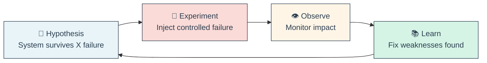

* 🛠️ **Chaos Experiments**:
  * 💀 **Infrastructure**: Kill servers, network partitions, DNS failures
  * ⏱️ **Latency**: Inject delays, slow database queries
  * 💾 **Resource**: Fill disks, exhaust memory, CPU spikes
  * 🌐 **Dependencies**: Block external APIs, database failover

* 🐒 **Popular Chaos Tools**:
  * **Chaos Monkey** (Netflix) - Random EC2 instance termination
  * **Litmus** (CNCF) - Kubernetes-native chaos experiments
  * **Gremlin** - SaaS chaos engineering platform
  * **Chaos Toolkit** - Open-source experiment orchestration

* 📊 **Chaos Engineering Maturity**:
  * **Level 1**: Manual experiments in dev/staging
  * **Level 2**: Automated experiments in production
  * **Level 3**: Continuous chaos, part of CI/CD
  * **Level 4**: Business-aware chaos (avoid Black Friday)

* ⚠️ **Safety Guidelines**:
  * ✅ Start small (dev environment first)
  * ✅ Have rollback plan ready
  * ✅ Monitor during experiments
  * ✅ Business hours only initially
  * ❌ Never experiment on critical business events

🔗 **Resources:**
* [Principles of Chaos](https://principlesofchaos.org/)
* [Netflix Chaos Engineering](https://netflix.github.io/chaosmonkey/)
* [CNCF Litmus](https://litmuschaos.io/)

---

## 📍 Slide 18 – 🔄 Capacity Planning - Scaling for Growth

* 📈 **Capacity Planning** = Ensuring systems can handle expected load growth
* 🎯 **Goal**: Right-size infrastructure for performance + cost optimization
* 📊 **Method**: Analyze trends, predict growth, test limits, scale proactively
* 💰 **Balance**: Over-provisioning wastes money, under-provisioning causes outages

**Capacity Planning Process**
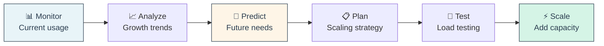

* 📊 **Key Metrics to Track**:
  * 🚦 **Traffic**: RPS growth rate, peak vs average load
  * 💾 **Resources**: CPU, memory, disk, network utilization trends
  * 👥 **Users**: Active users, geographic distribution
  * 💰 **Business**: Revenue per user, seasonal patterns

* 📈 **Growth Prediction Models**:
```
Linear: Next month = Current + (Growth rate × Time)
Exponential: Next month = Current × (1 + Growth rate)^Time  
Seasonal: Account for holidays, business cycles
Event-driven: Product launches, marketing campaigns
```

* 🧪 **Load Testing Strategy**:
  * **Baseline**: Current production capacity
  * **Target**: Expected peak load (2x-5x current)
  * **Breaking Point**: Find system limits
  * **Sustained**: Long-duration tests (memory leaks)

* ⚡ **Scaling Strategies**:
  * **Vertical (Scale Up)**: Bigger servers (faster, expensive)
  * **Horizontal (Scale Out)**: More servers (complex, cost-effective)
  * **Auto-scaling**: Dynamic based on metrics
  * **Geographic**: Multi-region for global users

* 💰 **Cost Optimization**:
  * 📊 Right-size instances based on actual usage
  * ⏰ Schedule scaling for predictable patterns
  * 💾 Reserved instances for baseline capacity
  * 🌐 Spot instances for batch workloads

🔗 **Resources:**
* [Google SRE - Capacity Planning](https://sre.google/sre-book/software-engineering-in-sre/)
* [AWS Auto Scaling](https://aws.amazon.com/autoscaling/)
* [Load Testing Tools](https://k6.io/)

---

## 📍 Slide 19 – 📝 Runbooks & Playbooks - Standardizing Operations

* 📚 **Runbooks** = Step-by-step procedures for operational tasks and incident response
* 🎯 **Goal**: Anyone can execute complex procedures safely and consistently
* ⏱️ **Value**: Reduce MTTR, minimize human error, enable team scaling
* 🧠 **Philosophy**: If it needs tribal knowledge, it needs a runbook

**Runbook Categories**
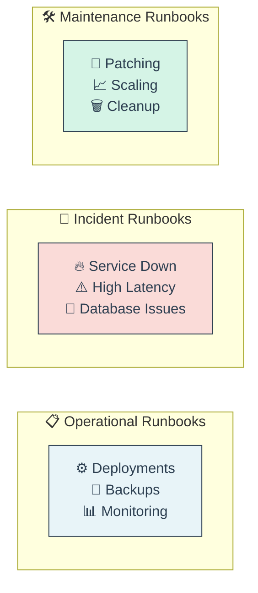

* 📝 **Good Runbook Structure**:
```markdown
# Runbook: High API Latency

## Overview
- **Purpose**: Diagnose and fix API response time issues
- **When to use**: P95 latency > 500ms for 5+ minutes  
- **Expected time**: 15-30 minutes

## Prerequisites
- Access to monitoring dashboards
- kubectl access to production cluster
- Database read-only access

## Diagnosis Steps
1. Check application metrics dashboard
2. Verify database connection pool health
3. Review recent deployments (last 2 hours)
4. Check external dependency status

## Resolution Steps  
1. If database issue → Scale connection pool
2. If recent deployment → Consider rollback
3. If external dependency → Enable circuit breaker

## Escalation
- If not resolved in 30 min → Page senior engineer
- Emergency contact: @oncall-sre
```

* 🎯 **Runbook Best Practices**:
  * ✅ **Actionable**: Clear commands, not theory
  * ✅ **Tested**: Verify procedures work regularly
  * ✅ **Updated**: Keep current with system changes
  * ✅ **Accessible**: Easy to find during incidents
  * ✅ **Linked**: Reference from alerts and dashboards

* 🤖 **Automation Integration**:
```yaml
# ChatOps runbook execution
/runbook database-failover --environment=prod
/playbook scale-api --replicas=10 --confirm=yes
/incident create --severity=critical --runbook=api-down
```

* 📚 **Playbook vs Runbook**:
  * **Runbook**: Specific technical procedures
  * **Playbook**: Higher-level response strategies
  * **Example**: Runbook = "Restart service X", Playbook = "Incident response process"

* ⚠️ **Common Runbook Problems**:
  * ❌ **Outdated**: Steps don't work anymore
  * ❌ **Too Generic**: "Check logs" without specifics
  * ❌ **Missing Context**: No explanation of why steps work
  * ❌ **Untested**: Written but never validated

🔗 **Resources:**
* [SRE Runbook Examples](https://github.com/SkeltonThatcher/run-book-template)
* [PagerDuty Runbook Guide](https://www.pagerduty.com/resources/learn/what-is-a-runbook/)
* [Incident Response Documentation](https://response.pagerduty.com/oncall/being_oncall/)

---

## 📍 Slide 20 – 📊 SRE in Practice - Real-World Case Studies and Lessons

* 🏆 **Success Stories**: How major companies implement SRE at scale
* 📈 **Key Metrics**: Improved reliability, faster feature delivery, reduced costs
* 💡 **Common Patterns**: Error budgets, automated toil reduction, blameless culture
* ⚠️ **Lessons Learned**: What works, what doesn't, how to get started

**SRE Adoption Journey**
```mermaid
flowchart LR
    Traditional["🔥 Traditional Ops<br/>Manual processes<br/>Reactive firefighting"] --> Transition["🔄 SRE Adoption<br/>Tooling & culture<br/>6-12 months"]
    Transition --> Mature["🚀 Mature SRE<br/>Automated operations<br/>Proactive reliability"]
    
    style Traditional fill:#fadbd8,stroke:#2c3e50,color:#2c3e50
    style Transition fill:#fef5e7,stroke:#2c3e50,color:#2c3e50
    style Mature fill:#d5f4e6,stroke:#2c3e50,color:#2c3e50
```

* 🏢 **Google (SRE Originator)**:
  * 📊 **Scale**: 1 SRE per 100+ developers
  * 💰 **Error Budgets**: Balance velocity vs reliability
  * 🤖 **Automation**: 50% rule - max 50% time on toil
  * **Result**: 99.99% uptime while shipping thousands of changes

* 🎬 **Netflix (Chaos Pioneer)**:
  * 🐒 **Chaos Engineering**: Continuous resilience testing
  * ☁️ **Cloud-Native**: Microservices, auto-scaling
  * 📈 **Metrics**: 99.97% uptime with 4000+ daily deploys
  * **Result**: Handles 230M+ users globally

* 🚗 **Uber (Hypergrowth SRE)**:
  * 📊 **Scaling**: 0 to billions of requests in 5 years
  * 🌍 **Multi-region**: Global real-time systems
  * 🛠️ **Platform**: Internal tools for developer productivity
  * **Result**: 75% reduction in incidents after SRE adoption

* 💼 **Enterprise Adoption Patterns**:
  * **Phase 1**: Monitoring & alerting improvements (3-6 months)
  * **Phase 2**: SLI/SLO implementation (6-12 months)  
  * **Phase 3**: Error budgets & automation (12+ months)
  * **Phase 4**: Advanced practices (chaos, capacity planning)

* 🎯 **SRE Success Metrics**:
```
Reliability Metrics:
- MTTR: 4 hours → 15 minutes (typical improvement)
- Incident frequency: 50% reduction year-over-year
- SLO compliance: 99%+ achievement rate

Velocity Metrics:  
- Deploy frequency: 2x-10x increase
- Lead time: Days → Hours
- Change failure rate: <5%

Team Metrics:
- On-call burden: Reduced alert fatigue
- Toil reduction: <50% time on manual work
- Job satisfaction: Higher engineer retention
```

* ⚠️ **Common SRE Failures**:
  * ❌ **SRE Team in Name Only**: Just renamed ops team
  * ❌ **No Management Support**: SRE practices not prioritized
  * ❌ **Wrong Incentives**: Still measuring uptime, not error budgets
  * ❌ **Tool-Only Focus**: Technology without culture change

* 🚀 **Getting Started with SRE**:
  1. **📊 Start Measuring**: Implement basic monitoring
  2. **🎯 Define SLOs**: Pick 3-5 user-facing metrics
  3. **💰 Try Error Budgets**: Use for deployment decisions
  4. **🤖 Automate Toil**: Identify repetitive manual work
  5. **📚 Blameless Culture**: Focus on systems, not people

🔗 **Resources:**
* [Google SRE Books](https://sre.google/books/)
* [Netflix Tech Blog](https://netflixtechblog.com/)
* [SRE Weekly Newsletter](https://sreweekly.com/)
* [USENIX SREcon Talks](https://www.usenix.org/conferences/srecon)

---

### 🎭 **Final Interactive Break: "SRE Career Path Quiz"** 🚀

**🎯 Which SRE Superpower Do You Want?**

*Based on your answers, discover your ideal SRE specialization!*

---

**Question 1: It's 3 AM and production is down. What's your first thought?**

A) 🔍 "Let me dig into these logs and find the root cause!"
B) 🤖 "Why isn't our automation handling this already?"
C) 📊 "How is this affecting our error budget?"
D) 🧪 "We should have tested this failure scenario!"

---

**Question 2: Your favorite part of the job is:**

A) 🕵️ **Debugging complex distributed systems**
B) 🛠️ **Building tools that eliminate manual work**  
C) 📈 **Analyzing metrics and predicting trends**
D) 💥 **Breaking things to make them stronger**

---

**Question 3: When explaining downtime to executives:**

A) 🔬 "Here's the detailed technical root cause analysis"
B) ⚙️ "Here's how we automated prevention going forward"
C) 💰 "This used 20% of our monthly error budget"
D) 🧪 "This validates our chaos engineering investment"

---

**Question 4: Your dream project is:**

A) 🔍 **Building the ultimate observability platform**
B) 🤖 **Creating self-healing infrastructure**
C) 📊 **Predicting and preventing all outages**  
D) 🐒 **Implementing company-wide chaos engineering**

---

**🎭 Your SRE Archetype:**

**A Majority - "The Detective" 🕵️**
- Loves deep technical analysis
- Expert at debugging complex issues  
- Specializes in observability and monitoring
- **Career path**: Senior SRE, Principal Engineer
- **Superpower**: Can find needles in haystacks of logs

**B Majority - "The Automator" 🤖**  
- Passionate about eliminating toil
- Builds tools and platforms
- Focuses on developer productivity
- **Career path**: Platform Engineering, SRE Manager
- **Superpower**: Makes manual work disappear

**C Majority - "The Strategist" 📊**
- Data-driven decision maker
- Masters SLOs and error budgets
- Excellent at capacity planning
- **Career path**: Staff SRE, Engineering Manager  
- **Superpower**: Predicts the future with math

**D Majority - "The Chaos Agent" 🧪**
- Embraces controlled destruction  
- Builds resilient systems
- Champions reliability testing
- **Career path**: Chaos Engineer, Resilience Architect
- **Superpower**: Breaks things for the greater good

---

**💡 Universal SRE Skills (Regardless of Archetype):**
- 📊 **Data Analysis**: Everything is measurable
- 🛠️ **Programming**: Automation requires code
- 🤝 **Communication**: Explain technical concepts simply
- 📚 **Continuous Learning**: Technology never stops changing
- 🧘 **Stress Management**: On-call requires zen mindset

---

**🚀 Final SRE Wisdom:**

> *"SRE is not about preventing all failures.  
> It's about failing fast, recovering quickly,  
> and learning continuously."*

**The SRE Mindset:**
- 🔧 **Everything is fixable** (with enough automation)
- 📊 **Everything is measurable** (with enough instrumentation)  
- 🧪 **Everything is testable** (with enough creativity)
- 📚 **Everything is learnable** (with enough curiosity)

**Remember**: The best SREs are not those who never have incidents, but those who learn the most from each one! 🌟

---