# 📌 Lecture 9 - Introduction to DevSecOps: Security as Code

## 📍 Slide 1 – 🛡️ What is DevSecOps? - Security as Code

* 🎯 **DevSecOps = Development + Security + Operations** - Integrating security practices into DevOps lifecycle
* 🔐 **Core Principle**: "Shift Left" - Test security early, fix issues before production
* 🤖 **Key Approach**: Automate security checks, embed in CI/CD pipelines
* 📊 **Impact**: 70% fewer vulnerabilities in production (Forrester 2024)
* ⚡ **Goal**: Ship secure code fast without slowing down development

**DevSecOps Integration Model**
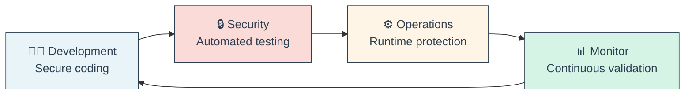

* 💡 **DevOps vs DevSecOps**:

| Aspect | ❌ Traditional DevOps | ✅ DevSecOps |
|--------|---------------------|-------------|
| **Security Testing** | End of cycle | Every commit |
| **Vulnerability Fixes** | Days/weeks | Minutes/hours |
| **Security Team** | Separate silo | Embedded in teams |
| **Compliance** | Manual audits | Automated validation |
| **Cost of Fix** | High (production) | Low (development) |

🔗 **Resources:**
* [OWASP DevSecOps Guideline](https://owasp.org/www-project-devsecops-guideline/)
* [NIST Secure Software Development Framework](https://csrc.nist.gov/Projects/ssdf)
* [DevSecOps Manifesto](https://www.devsecops.org/)

---

## 📍 Slide 2 – 📜 History of DevSecOps - From Afterthought to Built-in

* 🏛️ **2000s**: Security as bottleneck - security team approves at the end (weeks delay)
* 🚀 **2009**: DevOps movement begins - but security still separate
* 🔐 **2012**: "Rugged DevOps" term coined - first attempt at integration
* 🎯 **2015**: "DevSecOps" term popularized by Gartner
* 📈 **2020+**: Mainstream adoption - 65% of organizations use DevSecOps practices

**DevSecOps Evolution Timeline**
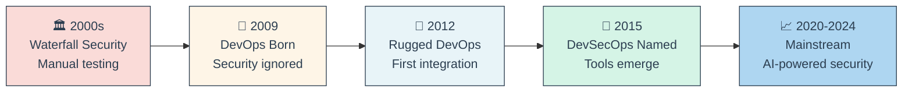

* 💥 **Famous Breaches that Changed Security**:
  * **2013**: Target breach - 40M credit cards stolen ($18M settlement)
  * **2017**: Equifax breach - 147M records exposed (outdated Apache Struts)
  * **2021**: Log4Shell - Critical vulnerability in logging library used everywhere
  * **2023**: MOVEit breach - 2000+ organizations affected

* 📊 **Industry Adoption**:
  * **2015**: 8% adoption (early adopters)
  * **2020**: 35% adoption (COVID accelerated digital transformation)
  * **2024**: 65% adoption (becoming standard practice)

🔗 **Resources:**
* [DevSecOps History Timeline](https://www.devsecops.org/blog/history)
* [Gartner DevSecOps Report](https://www.gartner.com/en/documents/devsecops)

---

## 📍 Slide 3 – 🎯 Why DevSecOps Matters - The Security Crisis

* 💰 **Cost of Breaches**: Average data breach costs $4.45M (IBM 2024)
* ⏱️ **Speed Impact**: Fixing vulnerabilities in production is **100x more expensive** than in development
* 🚨 **Rising Threats**: 493% increase in ransomware attacks (2023 vs 2020)
* 📜 **Compliance**: GDPR fines up to €20M or 4% revenue (whichever is higher)

**Cost of Security Fix by Stage**
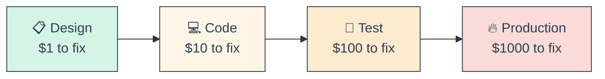

* ⚖️ **Speed vs Security - The False Choice**:
  * ❌ **Traditional Mindset**: "Security slows us down"
  * ✅ **DevSecOps Reality**: Automation makes security faster
  * 🎯 **Example**: Netflix deploys 4000+ times/day with automated security

* 📊 **Compliance Requirements**:
  * 🏦 **PCI-DSS**: Payment card industry security (annual audits)
  * 🏥 **HIPAA**: Healthcare data protection ($50k fine per violation)
  * 🌍 **GDPR**: EU data privacy (72-hour breach disclosure)
  * 🔒 **SOC2**: Trust service criteria for SaaS companies

🔗 **Resources:**
* [IBM Cost of Data Breach Report](https://www.ibm.com/security/data-breach)
* [OWASP Top 10](https://owasp.org/www-project-top-ten/)

---

## 📍 Slide 4 – 🔑 Core DevSecOps Principles - The Security Mindset

* 🎯 **Shift Left**: Test security as early as possible in development lifecycle
* 📜 **Security as Code**: Treat security policies like application code (version control, testing, automation)
* 🤖 **Automation First**: Remove human error, ensure consistency
* 🔄 **Continuous Monitoring**: Security never stops after deployment
* 👥 **Shared Responsibility**: Everyone on the team owns security

**Shift Left Visualization**
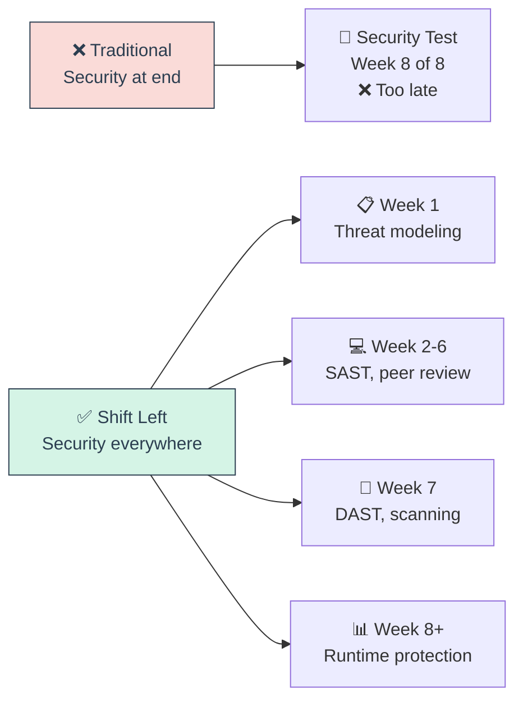

* 🤖 **Automation Benefits**:
  * ✅ Consistency - same checks every time
  * ✅ Speed - instant feedback vs days waiting
  * ✅ Scale - check 1000s of repos automatically
  * ✅ Accuracy - no human oversight

* 🔄 **Continuous Security**:
  * 📊 Monitor for new vulnerabilities (CVEs published daily)
  * 🔄 Automated dependency updates (Dependabot)
  * 🚨 Runtime threat detection (Falco, Aqua)
  * 📈 Security metrics and dashboards

🔗 **Resources:**
* [NIST Shift Left Principles](https://www.nist.gov/itl/ssd/software-quality-group/shift-left)
* [Security as Code Best Practices](https://owasp.org/www-community/Security_by_Design_Principles)

---

## 📍 Slide 5 – 🛡️ Threat Modeling - Understanding Attack Surfaces

* 🎯 **Threat Modeling** = Systematic approach to identify security risks in design phase
* 🔍 **Goal**: Find vulnerabilities before writing code
* 📊 **Process**: Identify assets → Find threats → Prioritize risks → Mitigate

**STRIDE Threat Framework**
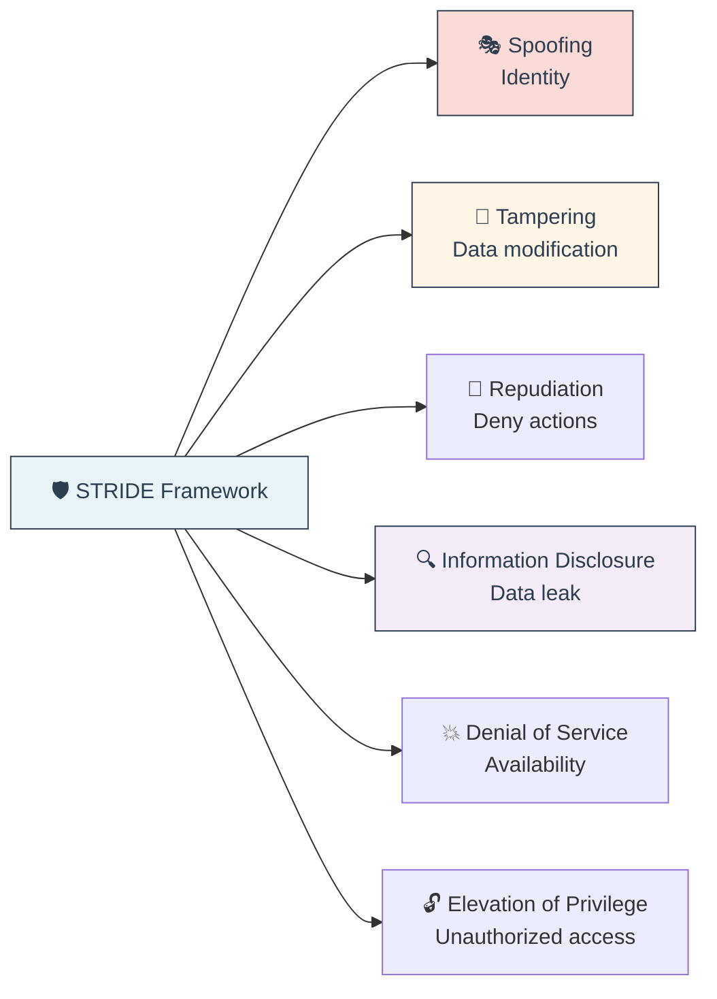

* 🎯 **When to Threat Model**:
  * 📋 New feature design
  * 🔄 Architecture changes
  * 🔐 Before handling sensitive data
  * 🌐 Exposing new APIs

* 🛠️ **Practical Steps**:
  1. 📊 Draw data flow diagram
  2. 🎯 Identify trust boundaries
  3. 🔍 Apply STRIDE to each component
  4. ⚠️ Rank risks (likelihood × impact)
  5. 🛡️ Document mitigations

🔗 **Resources:**
* [Microsoft Threat Modeling Tool](https://www.microsoft.com/en-us/securityengineering/sdl/threatmodeling)
* [OWASP Threat Modeling](https://owasp.org/www-community/Threat_Modeling)

---

## 📍 Slide 6 – ⚠️ Common Security Vulnerabilities - OWASP Top 10

* 📊 **OWASP Top 10** = Most critical web application security risks (updated every 3-4 years)
* 🎯 **2021 Edition** added new categories: Insecure Design, Software/Data Integrity Failures

**Top 5 Critical Vulnerabilities**

| Rank | Vulnerability | Description | Example |
|------|--------------|-------------|---------|
| **1** | 🔓 **Broken Access Control** | Users access unauthorized resources | Viewing other users' accounts |
| **2** | 🔐 **Cryptographic Failures** | Sensitive data exposed | Passwords stored in plaintext |
| **3** | 💉 **Injection** | Untrusted data in commands | SQL injection, command injection |
| **4** | 🎨 **Insecure Design** | Missing security controls | No rate limiting on API |
| **5** | ⚙️ **Security Misconfiguration** | Insecure default configs | Open S3 buckets, default passwords |

* 💉 **Injection Attack Example**:
```sql
-- Vulnerable code
query = "SELECT * FROM users WHERE username = '" + userInput + "'"

-- Attacker input: admin' OR '1'='1
-- Result: SELECT * FROM users WHERE username = 'admin' OR '1'='1'
-- ❌ Returns ALL users!
```

* 🛡️ **Prevention**:
  * ✅ Use parameterized queries
  * ✅ Input validation and sanitization
  * ✅ Principle of least privilege
  * ✅ Security testing in CI/CD

* 💥 **Real Impact**:
  * **Log4Shell (2021)**: Remote code execution in logging library
  * **SQL Injection**: #1 attack vector for data breaches
  * **Equifax (2017)**: Unpatched Struts vulnerability → 147M records stolen

🔗 **Resources:**
* [OWASP Top 10 (2021)](https://owasp.org/www-project-top-ten/)
* [OWASP Cheat Sheet Series](https://cheatsheetseries.owasp.org/)

---

## 📍 Slide 7 – 🔐 Security in the SDLC - Integrating at Every Stage

* 🔄 **Secure SDLC** = Security activities embedded in every development phase
* 🎯 **Goal**: Prevent vulnerabilities from reaching production

**Security Activities by Phase**
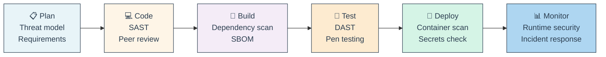

* 📋 **Phase 1: Plan**
  * 🛡️ Threat modeling sessions
  * 📜 Define security requirements
  * 🎯 Identify compliance needs

* 💻 **Phase 2: Code**
  * 🔍 SAST (Static Application Security Testing)
  * 👥 Security-focused code reviews
  * 📚 Secure coding guidelines

* 🔨 **Phase 3: Build**
  * 📦 Software Composition Analysis (SCA)
  * 🏷️ Generate SBOM (Software Bill of Materials)
  * 🔐 Sign artifacts with Cosign

* 🧪 **Phase 4: Test**
  * 🌐 DAST (Dynamic Application Security Testing)
  * 🎯 Penetration testing
  * 🔍 API security testing

* 🚀 **Phase 5: Deploy**
  * 🐳 Container image scanning
  * 🔑 Secrets detection (no hardcoded credentials)
  * 📜 Policy enforcement (OPA)

* 📊 **Phase 6: Monitor**
  * 🚨 Runtime Application Self-Protection (RASP)
  * 📈 Security metrics and alerts
  * 🔄 Incident response playbooks

🔗 **Resources:**
* [Microsoft Security Development Lifecycle](https://www.microsoft.com/en-us/securityengineering/sdl)
* [NIST Secure Software Development Framework](https://csrc.nist.gov/Projects/ssdf)

---

### 🎭 **Interactive Break #1: "Security Myths Buster"** 🎯

**True or False? Let's test your security knowledge!**

---

**Myth 1: "Security slows down development"** 🤔

<details>
<summary>Click for answer</summary>

**❌ FALSE!**

- 🤖 **Automated security** runs in seconds during builds
- ⚡ **Shift Left** catches issues early = faster fixes
- 📊 **Data**: Teams with DevSecOps deploy 50% more frequently (DORA 2024)

**Real slowdown**: Finding vulnerabilities in production!
</details>

---

**Myth 2: "DevSecOps is only for large enterprises"** 🤔

<details>
<summary>Click for answer</summary>

**❌ FALSE!**

- 💰 **Free tools available**: OWASP ZAP, Semgrep, Trivy, Dependabot
- ☁️ **Built into platforms**: GitHub Advanced Security, GitLab Security
- 🚀 **Startups benefit most**: Security from day 1 = no technical debt

**Example**: Startups use free Dependabot to scan dependencies automatically
</details>

---

**Myth 3: "Automated tools find all vulnerabilities"** 🤔

<details>
<summary>Click for answer</summary>

**❌ FALSE!**

- 🔍 **SAST catches**: ~40-60% of vulnerabilities
- 🌐 **DAST catches**: Different 40-60% (runtime issues)
- 👥 **Humans needed**: Business logic flaws, authentication issues
- 🎯 **Best approach**: Automated tools + manual reviews

**Reality**: Tools are assistants, not replacements for security expertise
</details>

---

**Myth 4: "Open source software is insecure"** 🤔

<details>
<summary>Click for answer</summary>

**⚠️ NUANCED!**

- ✅ **Advantages**: Many eyes reviewing code, fast patches
- ❌ **Challenges**: Unmaintained packages, supply chain attacks
- 🎯 **Key**: Use SCA tools to track vulnerabilities

**Stats**: 
- 88% of codebases contain outdated open source components
- But most critical CVEs are patched within days

**Best Practice**: Monitor dependencies, update regularly
</details>

---

**Myth 5: "Compliance = Security"** 🤔

<details>
<summary>Click for answer</summary>

**❌ FALSE!**

- 📜 **Compliance**: Minimum legal requirements (PCI-DSS, SOC2, GDPR)
- 🛡️ **Security**: Actual protection against threats
- 💥 **Example**: Target was PCI-DSS compliant when breached

**Reality**: Compliance is baseline, security is continuous improvement

**Both needed**: Compliance for legal, security for actual protection
</details>

---

**🏆 Score Yourself:**
- **5/5**: 🌟 Security Champion!
- **3-4/5**: 💪 On the right track
- **1-2/5**: 📚 Time to learn more!

---

## 📍 Slide 8 – 🔍 SAST (Static Application Security Testing) - Code Analysis

* 🎯 **SAST** = Automated source code analysis for security vulnerabilities
* ⏱️ **When**: During development, before code compilation
* 🔍 **How**: Analyzes code patterns, data flow, taint analysis
* ✅ **Finds**: SQL injection, XSS, hardcoded secrets, buffer overflows

**SAST in CI/CD Pipeline**
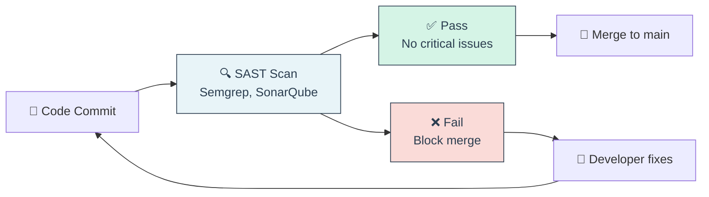

* 🛠️ **Popular SAST Tools**:

| Tool | Type | Best For | Language Support |
|------|------|----------|-----------------|
| **🔍 Semgrep** | Open-source | Fast, customizable | 30+ languages |
| **📊 SonarQube** | Open-source/Commercial | Code quality + security | 25+ languages |
| **🔒 Snyk Code** | Commercial | Developer-friendly | JavaScript, Python, Java |
| **🎯 Checkmarx** | Enterprise | Deep analysis | 25+ languages |

* ✅ **SAST Strengths**:
  * ⚡ Fast feedback (runs in minutes)
  * 🔍 Covers 100% of codebase
  * 📚 Finds issues early (before runtime)
  * 💰 Integrates with IDE (fix while coding)

* ❌ **SAST Limitations**:
  * 🚨 False positives (20-30% typical)
  * ❌ Misses runtime issues (auth logic, config)
  * 🤔 Can't analyze third-party dependencies
  * 📊 Requires tuning for accuracy

* 🎯 **Best Practices**:
  * ✅ Start with critical severity only
  * ✅ Tune rules to reduce false positives
  * ✅ Break build on high/critical issues
  * ✅ Educate developers on fixing patterns
  * ✅ Run on every pull request

🔗 **Resources:**
* [Semgrep Playground](https://semgrep.dev/playground)
* [SonarQube Community Edition](https://www.sonarqube.org/downloads/)
* [OWASP SAST Comparison](https://owasp.org/www-community/Source_Code_Analysis_Tools)

---

## 📍 Slide 9 – 🌐 DAST (Dynamic Application Security Testing) - Runtime Testing

* 🎯 **DAST** = Black-box testing of running applications
* ⏱️ **When**: In staging/QA environment (never production!)
* 🔍 **How**: Sends malicious requests, observes responses
* ✅ **Finds**: XSS, SQL injection, authentication bypass, misconfigurations

**DAST Testing Approach**
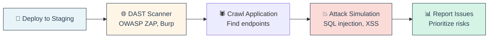

* 🛠️ **Popular DAST Tools**:
  * 🕷️ **OWASP ZAP** - Free, automation-friendly
  * 🔐 **Burp Suite** - Manual testing + automation
  * 🌐 **Acunetix** - Commercial, comprehensive scanning
  * ⚡ **Nuclei** - Fast, template-based scanning

* 📊 **SAST vs DAST**:

| Aspect | 🔍 SAST | 🌐 DAST |
|--------|---------|---------|
| **Analysis Type** | White-box (code) | Black-box (runtime) |
| **Speed** | Fast (minutes) | Slow (hours) |
| **Coverage** | All code paths | Only accessible endpoints |
| **False Positives** | High | Low |
| **Finds** | Code-level issues | Runtime vulnerabilities |
| **When** | During development | In staging |

* 🎯 **Best Practices**:
  * ✅ Run DAST in staging, not production
  * ✅ Combine with SAST for coverage
  * ✅ Use authenticated scans (logged-in user)
  * ✅ Schedule nightly scans (they're slow)
  * ✅ Integrate with bug tracking

🔗 **Resources:**
* [OWASP ZAP Docker](https://www.zaproxy.org/docs/docker/)
* [DAST Automation Guide](https://owasp.org/www-community/Vulnerability_Scanning_Tools)

---

## 📍 Slide 10 – 📦 Software Composition Analysis (SCA) - Dependency Scanning

* 🎯 **SCA** = Identify vulnerabilities in third-party libraries and dependencies
* 📊 **Reality**: 80%+ of modern code is open-source dependencies
* 💥 **Risk**: Log4Shell (2021) affected 35,000+ packages

**Dependency Risk Chain**
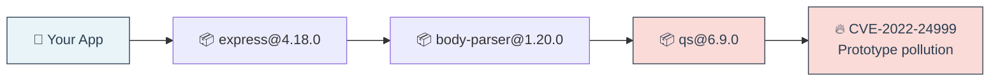

* 🛠️ **SCA Tools**:
  * 🤖 **Dependabot** - GitHub native, auto-PRs
  * 📊 **Snyk** - Comprehensive, fix guidance
  * 🔍 **OWASP Dependency-Check** - Free, Java/JS/.NET
  * 🎯 **Grype** - Fast, container-focused

* 🏷️ **SBOM (Software Bill of Materials)**:
  * 📋 **What**: Complete inventory of components
  * 🎯 **Why**: Required for compliance (Executive Order 14028)
  * 📊 **Formats**: CycloneDX, SPDX
  * 🛠️ **Tools**: Syft, SPDX Tools

* ⚠️ **Famous Supply Chain Attacks**:
  * 💥 **Log4Shell (2021)**: Log4j RCE vulnerability
  * 🎯 **event-stream (2018)**: Bitcoin wallet stealer in npm
  * 🔐 **SolarWinds (2020)**: Nation-state supply chain compromise

* 🎯 **Best Practices**:
  * ✅ Scan dependencies on every commit
  * ✅ Auto-update non-breaking changes
  * ✅ Review high-severity CVEs immediately
  * ✅ Generate and archive SBOMs
  * ✅ Monitor for new vulnerabilities (not just at build time)

🔗 **Resources:**
* [Dependabot Documentation](https://docs.github.com/en/code-security/dependabot)
* [Snyk Open Source](https://snyk.io/product/open-source-security-management/)
* [SBOM Guide](https://www.cisa.gov/sbom)

---

## 📍 Slide 11 – 🐳 Container & Image Security - Securing the Runtime

* 🎯 **Container Security** = Scanning images, runtime protection, minimal attack surface
* 📊 **Reality**: 80% of container images have known vulnerabilities (Snyk 2024)
* 🔒 **Layers**: Image security + Registry security + Runtime security

**Container Security Layers**
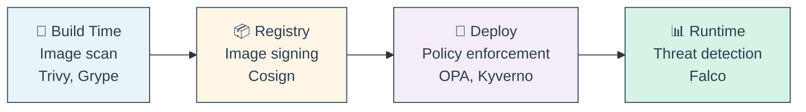

* 🔍 **Image Scanning Tools**:
  * 🛡️ **Trivy** - Fast, accurate, easy to use
  * 🔎 **Grype** - Fast, integrates with Syft
  * 🏢 **Snyk Container** - Commercial, comprehensive
  * ☁️ **AWS ECR Scanning** - Native to AWS

* 🏗️ **Secure Base Images**:
```dockerfile
# ❌ Bad: Full OS (1GB+, many vulnerabilities)
FROM ubuntu:latest

# ✅ Better: Alpine (5MB, minimal)
FROM alpine:3.18

# ✅ Best: Distroless (2MB, no shell!)
FROM gcr.io/distroless/static-debian11
```

* 🔐 **Image Signing with Cosign**:
```bash
# Sign image
cosign sign --key cosign.key myimage:v1

# Verify signature
cosign verify --key cosign.pub myimage:v1
```

* 🚨 **Runtime Security**:
  * 🔍 **Falco** - Detect suspicious behavior
  * 🛡️ **Aqua Security** - Comprehensive runtime protection
  * 📊 Monitor: Unexpected network connections, file access, privilege escalation

* ☸️ **Kubernetes Security**:
  * 🔒 Pod Security Standards (Restricted, Baseline, Privileged)
  * 🚫 NetworkPolicies (isolate pods)
  * 🔐 RBAC (least privilege)
  * 🛡️ Admission controllers (OPA Gatekeeper, Kyverno)

🔗 **Resources:**
* [Trivy Documentation](https://aquasecurity.github.io/trivy/)
* [Cosign Quick Start](https://docs.sigstore.dev/cosign/overview/)
* [Falco Rules](https://falco.org/docs/rules/)
* [Kubernetes Security Best Practices](https://kubernetes.io/docs/concepts/security/security-checklist/)

---

## 📍 Slide 12 – 🔐 Secrets Management - Never Commit Credentials

* 🚨 **The Problem**: Hardcoded credentials in Git = permanent security breach
* 💥 **Reality**: 6M+ secrets leaked on GitHub (GitGuardian 2024)
* 🎯 **Solution**: Centralized secrets management + automated detection

**Secrets Management Architecture**
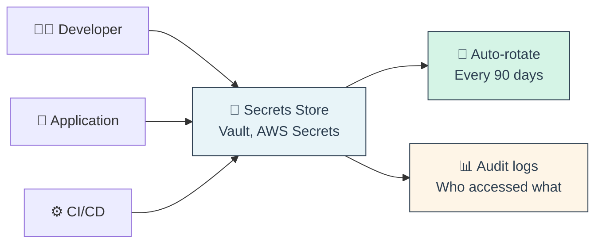

* 🛠️ **Secrets Management Tools**:

| Tool | Type | Best For |
|------|------|----------|
| **🔒 HashiCorp Vault** | Self-hosted | Enterprise, multi-cloud |
| **☁️ AWS Secrets Manager** | Cloud-native | AWS workloads |
| **🔵 Azure Key Vault** | Cloud-native | Azure workloads |
| **🔐 Sealed Secrets** | Kubernetes | GitOps-friendly |
| **🗝️ External Secrets Operator** | Kubernetes | Sync from external stores |

* 🔍 **Secrets Detection Tools**:
  * 🐶 **TruffleHog** - Scans Git history for secrets
  * 🛡️ **GitGuardian** - Real-time GitHub monitoring
  * 🔐 **git-secrets** - Pre-commit hook (AWS)
  * 🎯 **Gitleaks** - Fast, configurable scanner

* ❌ **What NOT to Do**:
```bash
# ❌ NEVER DO THIS!
export DB_PASSWORD="MyP@ssw0rd123"
git commit -m "Add database config"

# ❌ NEVER THIS EITHER!
API_KEY = "sk-proj-abc123xyz" # in source code
```

* ✅ **Best Practices**:
```bash
# ✅ Use environment variables from secrets store
DB_PASSWORD=$(vault kv get -field=password secret/db)

# ✅ Or use Kubernetes secrets (from External Secrets)
kubectl create secret generic db-creds \
  --from-literal=password='value-from-vault'
```

* 🔄 **Secrets Lifecycle**:
  1. 🔐 Store in centralized vault
  2. 🎯 Grant least-privilege access
  3. 📊 Audit all access
  4. 🔄 Rotate regularly (90 days)
  5. 🗑️ Revoke when no longer needed

🔗 **Resources:**
* [HashiCorp Vault Tutorial](https://learn.hashicorp.com/vault)
* [Sealed Secrets Guide](https://github.com/bitnami-labs/sealed-secrets)
* [TruffleHog Documentation](https://github.com/trufflesecurity/trufflehog)

---

### 🎭 **Interactive Break #2: "Spot the Vulnerability"** 🔍

**Code Review Game! Find the security issues in these snippets**

---

**Challenge 1: User Authentication** 🔐

```python
def login(username, password):
    # Check if user exists
    query = f"SELECT * FROM users WHERE username='{username}' AND password='{password}'"
    user = db.execute(query)
    
    if user:
        session['user_id'] = user.id
        return "Login successful!"
    return "Invalid credentials"
```

<details>
<summary>🕵️ What's wrong? Click to reveal</summary>

**🚨 Vulnerabilities Found:**

1. **💉 SQL Injection** - String concatenation in query
   ```python
   # Attacker input: username = "admin' --"
   # Query becomes: SELECT * FROM users WHERE username='admin' --' AND password='...'
   # Comment out password check!
   ```

2. **🔐 Plaintext Passwords** - Password stored without hashing
   ```python
   # Should be: WHERE password_hash = hash(password + salt)
   ```

3. **🎯 No Rate Limiting** - Brute force attacks possible

**✅ Fixed Version:**
```python
def login(username, password):
    # Use parameterized query
    query = "SELECT * FROM users WHERE username=? AND password_hash=?"
    user = db.execute(query, (username, hash_password(password)))
    
    if user:
        session['user_id'] = user.id
        session.regenerate_id()  # Prevent session fixation
        return "Login successful!"
    return "Invalid credentials"
```
</details>

---

**Challenge 2: File Upload** 📁

```javascript
app.post('/upload', (req, res) => {
    const file = req.files.document;
    const filename = file.name;
    
    // Save file
    file.mv(`./uploads/${filename}`, (err) => {
        if (err) return res.status(500).send(err);
        res.send('File uploaded!');
    });
});
```

<details>
<summary>🕵️ What's wrong? Click to reveal</summary>

**🚨 Vulnerabilities Found:**

1. **📂 Path Traversal** - No validation on filename
   ```javascript
   // Attacker uploads file named: "../../etc/passwd"
   // File saved to: ./uploads/../../etc/passwd
   // = Overwriting system files!
   ```

2. **🎯 No File Type Validation** - Can upload malicious files
   ```javascript
   // Attacker uploads: shell.php, malware.exe
   ```

3. **💾 No Size Limit** - DoS via massive files

**✅ Fixed Version:**
```javascript
const path = require('path');
const uuid = require('uuid');

app.post('/upload', (req, res) => {
    const file = req.files.document;
    
    // Validate file type
    const allowedTypes = ['image/jpeg', 'image/png', 'application/pdf'];
    if (!allowedTypes.includes(file.mimetype)) {
        return res.status(400).send('Invalid file type');
    }
    
    // Validate size (5MB max)
    if (file.size > 5 * 1024 * 1024) {
        return res.status(400).send('File too large');
    }
    
    // Generate safe filename
    const ext = path.extname(file.name);
    const safeFilename = `${uuid.v4()}${ext}`;
    const uploadPath = path.join(__dirname, 'uploads', safeFilename);
    
    file.mv(uploadPath, (err) => {
        if (err) return res.status(500).send('Upload failed');
        res.send('File uploaded!');
    });
});
```
</details>

---

**Challenge 3: API Endpoint** 🌐

```python
@app.route('/api/user/<user_id>')
def get_user(user_id):
    # Get user data
    user = User.query.get(user_id)
    
    # Return all user data
    return jsonify({
        'id': user.id,
        'username': user.username,
        'email': user.email,
        'password_hash': user.password_hash,
        'ssn': user.ssn,
        'credit_card': user.credit_card
    })
```

<details>
<summary>🕵️ What's wrong? Click to reveal</summary>

**🚨 Vulnerabilities Found:**

1. **🔓 No Authentication** - Anyone can access any user
   ```bash
   # Attacker tries: GET /api/user/1, /api/user/2, etc.
   # = Access to all users!
   ```

2. **📊 Broken Access Control** - User can access other users' data

3. **💳 Sensitive Data Exposure** - Returning password hash, SSN, credit card!

**✅ Fixed Version:**
```python
@app.route('/api/user/<user_id>')
@require_authentication
def get_user(user_id):
    # Check authorization
    if current_user.id != user_id and not current_user.is_admin:
        return jsonify({'error': 'Unauthorized'}), 403
    
    user = User.query.get_or_404(user_id)
    
    # Return only safe fields
    return jsonify({
        'id': user.id,
        'username': user.username,
        'email': user.email if current_user.id == user_id else None
        # NEVER return: password_hash, ssn, credit_card
    })
```
</details>

---

**🏆 Security Review Checklist:**

When reviewing code, always check:
- ✅ **Input Validation**: Is user input sanitized?
- ✅ **Authentication**: Is user identity verified?
- ✅ **Authorization**: Can user access this resource?
- ✅ **Sensitive Data**: Are credentials/PII exposed?
- ✅ **Error Handling**: Do errors leak information?
- ✅ **Rate Limiting**: Can endpoint be abused?

---

## 📍 Slide 13 – 🤖 CI/CD Security Integration - Automated Security Gates

* 🎯 **Security Gates** = Automated checks that block insecure code from reaching production
* 🚦 **Quality Gates**: Define thresholds (e.g., "Block if critical vulnerabilities found")
* ⚖️ **Balance**: Security vs velocity (fail on critical, warn on medium)

**Secure CI/CD Pipeline**
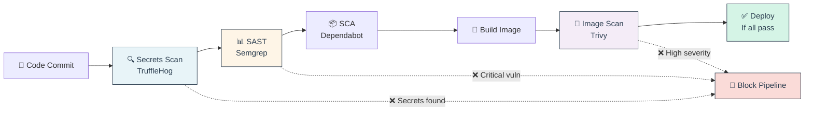

* 🎯 **GitHub Actions Security Example**:
```yaml
name: Security Checks

on: [push, pull_request]

jobs:
  security:
    runs-on: ubuntu-latest
    steps:
      # Secrets scanning
      - name: TruffleHog Scan
        uses: trufflesecurity/trufflehog@main
        with:
          path: ./
          
      # SAST
      - name: Semgrep Scan
        uses: returntocorp/semgrep-action@v1
        
      # Dependency scanning
      - name: Dependency Check
        uses: dependency-check/Dependency-Check_Action@main
        
      # Container scanning
      - name: Trivy Scan
        uses: aquasecurity/trivy-action@master
        with:
          image-ref: 'myapp:latest'
          severity: 'HIGH,CRITICAL'
          exit-code: '1'  # Fail pipeline on issues
```

* 🚦 **Quality Gate Configuration**:

| Severity | Action | Rationale |
|----------|--------|-----------|
| **🔴 Critical** | ❌ Block deployment | Exploitable remotely |
| **🟠 High** | ⚠️ Warn + require approval | Serious but not immediate |
| **🟡 Medium** | ℹ️ Log only | Fix in next sprint |
| **🟢 Low/Info** | ✅ Pass | Track for cleanup |

* 🎯 **Policy as Code (OPA)**:
```rego
# Block images with critical vulnerabilities
deny[msg] {
    input.vulnerabilities[_].severity == "CRITICAL"
    msg = "Critical vulnerability found - deployment blocked"
}

# Require image signing
deny[msg] {
    not input.image.signed
    msg = "Image must be signed with Cosign"
}
```

🔗 **Resources:**
* [GitHub Security Features](https://github.com/features/security)
* [GitLab Security Scanning](https://docs.gitlab.com/ee/user/application_security/)
* [Semgrep CI](https://semgrep.dev/docs/semgrep-ci/)

---

## 📍 Slide 14 – 📜 Infrastructure as Code Security - IaC Scanning

* 🎯 **IaC Security** = Scan Terraform, CloudFormation, K8s YAML for misconfigurations
* 💥 **Common Issues**: Open S3 buckets, default passwords, overly permissive security groups
* 🔍 **Scan Before Deploy**: Catch issues in code review, not production

**IaC Security Scanning**
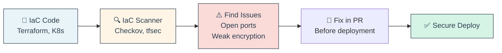

* 🛠️ **IaC Security Tools**:
  * ✅ **Checkov** - Multi-cloud (Terraform, K8s, Dockerfile)
  * 🔒 **tfsec** - Terraform-focused, fast
  * 🌐 **Terrascan** - Compliance policies
  * ☸️ **kubesec** - Kubernetes YAML analyzer

* 💥 **Example Misconfigurations**:

```hcl
# ❌ Bad: S3 bucket publicly accessible
resource "aws_s3_bucket" "data" {
  bucket = "my-data"
  acl    = "public-read"  # 🚨 EXPOSED!
}

# ✅ Good: Private with encryption
resource "aws_s3_bucket" "data" {
  bucket = "my-data"
  acl    = "private"
  
  server_side_encryption_configuration {
    rule {
      apply_server_side_encryption_by_default {
        sse_algorithm = "AES256"
      }
    }
  }
}
```

* ☸️ **Kubernetes Security Issues**:
```yaml
# ❌ Bad: Running as root with host network
apiVersion: v1
kind: Pod
metadata:
  name: unsafe-pod
spec:
  hostNetwork: true  # 🚨 Access to host network
  containers:
  - name: app
    image: myapp
    securityContext:
      privileged: true  # 🚨 Full host access!

# ✅ Good: Least privilege
apiVersion: v1
kind: Pod
metadata:
  name: safe-pod
spec:
  containers:
  - name: app
    image: myapp
    securityContext:
      runAsNonRoot: true
      runAsUser: 1000
      readOnlyRootFilesystem: true
      allowPrivilegeEscalation: false
      capabilities:
        drop: ["ALL"]
```

* 🎯 **CI Integration**:
```bash
# Scan Terraform before apply
checkov -d . --framework terraform --quiet

# Scan Kubernetes manifests
kubesec scan k8s/*.yaml
```

🔗 **Resources:**
* [Checkov Documentation](https://www.checkov.io/1.Welcome/Quick%20Start.html)
* [tfsec](https://aquasecurity.github.io/tfsec/)
* [kubesec](https://kubesec.io/)

---

## 📍 Slide 15 – 🔒 Security Policy as Code - Automated Enforcement

* 🎯 **Policy as Code** = Define security rules as code, enforce automatically
* 🛡️ **OPA (Open Policy Agent)** = CNCF graduated policy engine
* 🔍 **Use Cases**: Admission control, API authorization, data filtering

**OPA Architecture in Kubernetes**
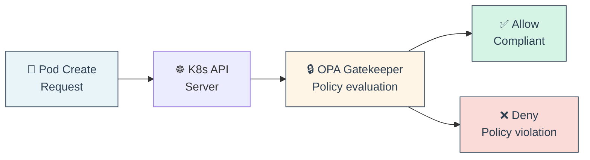

* 📜 **Example OPA Policy (Rego)**:
```rego
# Require all containers to have resource limits
package k8s.admission

deny[msg] {
    input.request.kind.kind == "Pod"
    container := input.request.object.spec.containers[_]
    not container.resources.limits
    msg = sprintf("Container %v must have resource limits", [container.name])
}

# Block images from untrusted registries
deny[msg] {
    input.request.kind.kind == "Pod"
    container := input.request.object.spec.containers[_]
    not startswith(container.image, "myregistry.com/")
    msg = sprintf("Image %v from untrusted registry", [container.image])
}
```

* 🛠️ **Policy Enforcement Tools**:
  * 🔒 **OPA Gatekeeper** - Kubernetes admission controller
  * 🎯 **Kyverno** - Kubernetes-native, YAML policies
  * 📜 **Sentinel** - HashiCorp's policy framework
  * ☁️ **Cloud Custodian** - Cloud resource policies

* 🎯 **Common Policies**:
  * 🚫 Block privileged containers
  * 🏷️ Require labels (owner, environment)
  * 🔐 Enforce resource limits
  * 🌐 Require network policies
  * 🔒 Block latest image tags
  * 📊 Enforce naming conventions

🔗 **Resources:**
* [OPA Gatekeeper](https://open-policy-agent.github.io/gatekeeper/)
* [Kyverno Policies](https://kyverno.io/policies/)
* [OPA Playground](https://play.openpolicyagent.org/)

---

## 📍 Slide 16 – 🚨 Security Monitoring & Incident Response

* 🎯 **Runtime Security** = Detect and respond to threats in production
* 📊 **Monitoring Layers**: Application, container, network, host
* 🚨 **Goal**: Detect attacks in real-time, respond automatically

**Security Monitoring Stack**
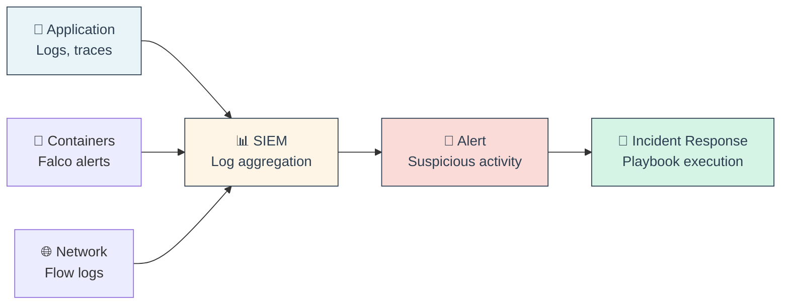

* 🔍 **What to Monitor**:
  * 🚪 Failed authentication attempts
  * 🔓 Privilege escalation
  * 📂 Unexpected file access
  * 🌐 Suspicious network connections
  * 💉 SQL injection attempts
  * 🔧 Shell spawned in container

* 🛠️ **Security Monitoring Tools**:
  * 🦅 **Falco** - Runtime threat detection for K8s
  * 📊 **ELK Stack** - Log aggregation and analysis
  * 🔍 **Splunk** - Enterprise SIEM
  * 🌊 **Datadog Security** - Unified monitoring

* 🚨 **Example Falco Rule**:
```yaml
- rule: Shell spawned in container
  desc: Detect shell execution in container
  condition: >
    spawned_process and
    container and
    proc.name in (sh, bash, zsh)
  output: >
    Shell spawned in container 
    (user=%user.name container=%container.name image=%container.image.repository)
  priority: WARNING
```

* 📋 **Incident Response Playbook**:
  1. 🚨 **Detect**: Alert triggered
  2. 🔍 **Investigate**: Gather logs, context
  3. 🛡️ **Contain**: Isolate affected systems
  4. 🔧 **Remediate**: Patch vulnerability
  5. 📚 **Learn**: Postmortem, improve detection

🔗 **Resources:**
* [Falco Documentation](https://falco.org/docs/)
* [NIST Incident Response Guide](https://nvlpubs.nist.gov/nistpubs/SpecialPublications/NIST.SP.800-61r2.pdf)

---

## 📍 Slide 17 – ✅ Compliance & Audit in DevSecOps

* 📜 **Compliance** = Meeting legal/regulatory security requirements
* 🤖 **DevSecOps Approach**: Continuous compliance vs point-in-time audits
* 🎯 **Goal**: Automate evidence collection, reduce audit burden

**Common Compliance Frameworks**
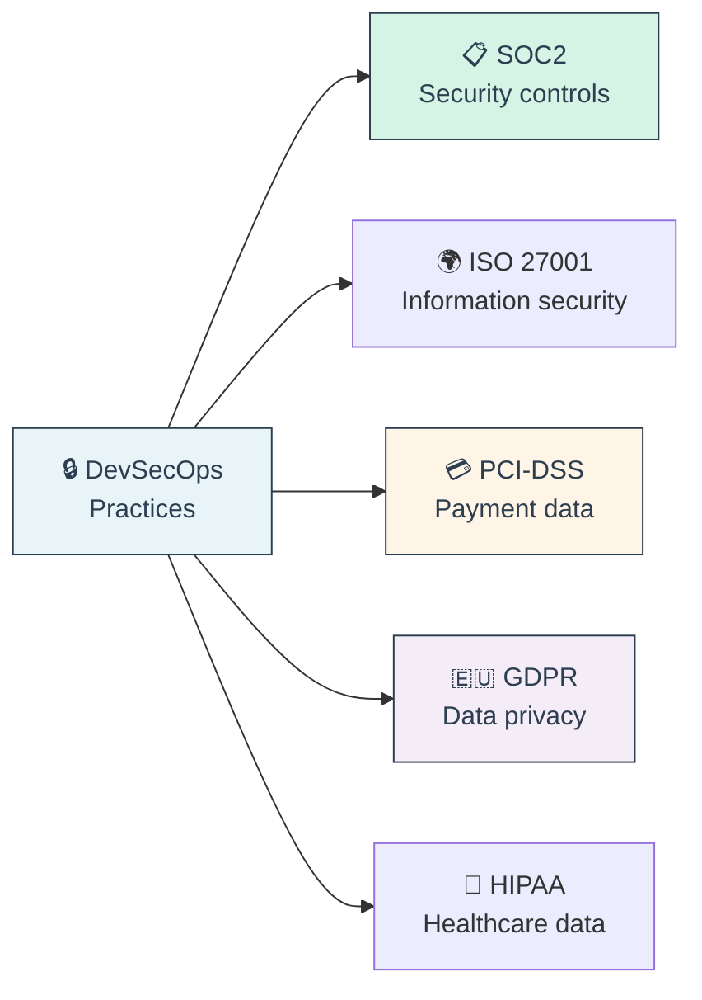

* 📊 **Compliance Requirements**:

| Framework | Key Requirements | Automation Opportunity |
|-----------|-----------------|----------------------|
| **SOC2** | Access control, monitoring, incident response | Automated access logs, SIEM alerts |
| **ISO 27001** | Risk assessment, security policies | Policy as Code, continuous scanning |
| **PCI-DSS** | Network segmentation, encryption | NetworkPolicies, encryption at rest |
| **GDPR** | Data protection, breach notification | Data discovery, audit logs |

* 🤖 **Automated Compliance**:
  * ✅ Continuous security scanning (SAST, DAST, SCA)
  * ✅ Policy enforcement (OPA Gatekeeper)
  * ✅ Audit log collection (all Git commits, deployments)
  * ✅ Compliance dashboards (real-time posture)
  * ✅ Evidence generation (automated reports)

* 📈 **Compliance as Code**:
```yaml
# Example: Automated SOC2 evidence collection
compliance:
  soc2:
    access_control:
      - evidence: "RBAC policies in Git"
      - evidence: "MFA enabled for all users"
      - evidence: "Access logs in SIEM"
    
    change_management:
      - evidence: "All changes via Git PRs"
      - evidence: "Peer review required"
      - evidence: "CI/CD audit logs"
    
    monitoring:
      - evidence: "Security alerts configured"
      - evidence: "Incident response playbooks"
      - evidence: "Monthly security metrics"
```

🔗 **Resources:**
* [SOC2 Compliance Guide](https://www.aicpa.org/interestareas/frc/assuranceadvisoryservices/sorhome)
* [GDPR Compliance Checklist](https://gdpr.eu/checklist/)
* [PCI-DSS Requirements](https://www.pcisecuritystandards.org/)

---

### 🎭 **Interactive Break #3: "Tool Selection Challenge"** 🛠️

**Choose the right security tool for each scenario!**

---

**Scenario 1: Startup with 3 Developers** 🚀

*Context:*
- 💰 Limited budget (prefer free)
- ⚡ Need fast feedback
- 🌐 Python/JavaScript web app
- ☸️ Deploying to Kubernetes

**What tools would you choose?**

A) Enterprise suite (Checkmarx + Snyk + Aqua) - $50k/year  
B) All manual code reviews - $0  
C) Free open-source stack  
D) Wait until Series A funding

<details>
<summary>Click for answer</summary>

**✅ Answer: C) Free open-source stack**

**Recommended Stack:**
- 🔍 **SAST**: Semgrep (free)
- 📦 **SCA**: Dependabot (GitHub native, free)
- 🐳 **Container**: Trivy (free, fast)
- 🔐 **Secrets**: TruffleHog (free)
- 🔒 **IaC**: Checkov (free)
- 📊 **Monitoring**: Falco (free)

**Why:**
- 💰 $0 cost, perfect for startups
- ⚡ Fast, integrates with GitHub Actions
- 📈 Can scale to enterprise later
- 🎓 Industry-standard tools

**Wrong Answers:**
- ❌ A: Overkill and unaffordable for startup
- ❌ B: Doesn't scale, misses automated checks
- ❌ D: Security debt compounds, harder to fix later
</details>

---

**Scenario 2: Financial Services Company** 🏦

*Context:*
- 📜 Strict compliance (PCI-DSS, SOC2)
- 💰 Budget available
- 🔒 Handling payment data
- 👥 100+ developers

**What's your priority?**

A) Speed of deployment  
B) Compliance and audit trails  
C) Developer experience  
D) Latest trendy tools

<details>
<summary>Click for answer</summary>

**✅ Answer: B) Compliance and audit trails**

**Recommended Approach:**
- 📊 **SIEM**: Splunk or ELK (complete audit logs)
- 🔒 **Secrets**: HashiCorp Vault (audit + rotation)
- 📜 **Policy**: OPA Gatekeeper (enforce policies)
- 🛡️ **Commercial Tools**: Checkmarx, Snyk (support + compliance reports)
- 📈 **Dashboards**: Compliance posture tracking

**Why:**
- 📜 Compliance is non-negotiable (fines up to millions)
- 📊 Audit trails required for PCI-DSS
- 🔐 Payment data requires strong controls
- 👥 Scale needed for 100+ developers

**Trade-off**: Slightly slower, but necessary for industry
</details>

---

**Scenario 3: Open Source Project** 🌐

*Context:*
- 👥 Global contributors
- 💰 $0 budget
- 🔓 Public GitHub repo
- 🎯 Need to build trust

**What security measures?**

A) None - it's open source, community will find issues  
B) Automated scanning on every PR  
C) Manual security team review  
D) Only security scanning before releases

<details>
<summary>Click for answer</summary>

**✅ Answer: B) Automated scanning on every PR**

**Recommended Setup:**
- 🔍 **GitHub Advanced Security** (free for public repos!)
  - CodeQL (SAST)
  - Dependabot (SCA)
  - Secret scanning
- 🏆 **OpenSSF Best Practices Badge**
- 📜 **Security Policy** (SECURITY.md)
- 🔒 **Signed Commits** (Sigstore)

**Why:**
- 💰 Free for public repos
- 🤖 Automated = scales with contributors
- 🏆 Shows security commitment (builds trust)
- 📊 Transparency (security posture visible)

**Why not A**: Community finds issues, but slowly and inconsistently
</details>

---

**Scenario 4: Microservices at Scale** ☸️

*Context:*
- 🏢 200+ microservices
- ☸️ Kubernetes across 50+ clusters
- 👥 20 development teams
- 🚀 100+ deployments/day

**Biggest challenge to address?**

A) Finding vulnerabilities  
B) Inconsistent security practices across teams  
C) Alert fatigue (too many tools)  
D) Compliance reporting

<details>
<summary>Click for answer</summary>

**✅ Answer: B) Inconsistent security practices**

**Recommended Solution:**
- 📜 **Policy as Code**: OPA Gatekeeper across all clusters
- 🏗️ **Platform Team**: Centralized security standards
- 📦 **Golden Paths**: Secure-by-default templates
- 🎓 **Security Champions**: One per team
- 📊 **Centralized Dashboard**: Aggregated security posture

**Why:**
- 👥 20 teams = 20 different approaches without standards
- 🔒 Policy enforcement ensures consistency
- 📚 Golden paths make "secure" the easy choice
- 📊 Centralized view for management

**Key Principle**: Make secure defaults easier than insecure choices!
</details>

---

**🎯 Key Lessons:**

- 💰 **Budget matters**: Free tools for startups, commercial for enterprise
- 📜 **Compliance drives decisions**: Financial/healthcare have different needs
- 🤖 **Automate everything**: Scales better than humans
- 📊 **Centralize observability**: Especially at scale
- 🎯 **Context is king**: No one-size-fits-all solution

---

## 📍 Slide 18 – 🏢 DevSecOps Culture & Team Structure

* 👥 **Culture First**: Tools enable, but people implement security
* 🎯 **Security Champions**: Developers who champion security in their teams
* 🤝 **Shared Responsibility**: Not "security team's job" - everyone owns it

**DevSecOps Team Model**
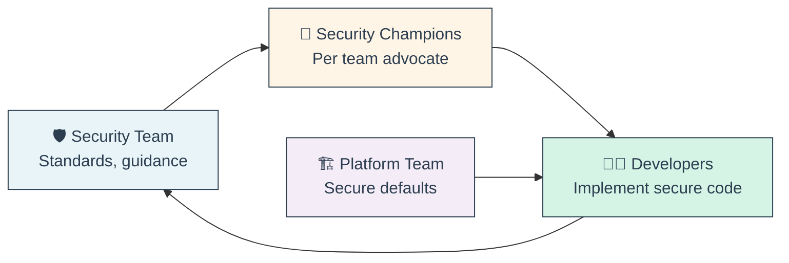

* 🌟 **Security Champions Program**:
  * 🎯 **Role**: Developer passionate about security in their team
  * 📚 **Training**: Regular security workshops
  * 🤝 **Liaison**: Between security team and developers
  * ⏱️ **Time**: 20% time for security activities

* 🔄 **Blameless Security Culture**:
  * ✅ Focus on systems, not individuals
  * 📚 Every vulnerability is learning opportunity
  * 🤝 Safe to report security issues
  * 📊 Metrics track trends, not people

* 📈 **Measuring Success**:

| Metric | Good Trend | Why It Matters |
|--------|-----------|----------------|
| **Mean Time to Fix** | ⬇️ Decreasing | Faster vulnerability remediation |
| **Security Scan Coverage** | ⬆️ Increasing | More code analyzed |
| **Critical Vulns in Production** | ⬇️ Decreasing | Better shift-left |
| **Developer Training Hours** | ⬆️ Increasing | More security awareness |
| **Security Champions** | ⬆️ Increasing | Better distribution |

* ⚠️ **Common Pitfalls**:
  * ❌ Security team as gatekeeper (bottleneck)
  * ❌ Blaming developers for vulnerabilities
  * ❌ Tools without training
  * ❌ Too many alerts = alert fatigue
  * ❌ Security as checkbox compliance

* ✅ **Best Practices**:
  * 🎓 Invest in security training (monthly sessions)
  * 🤖 Make secure defaults the easy path
  * 📊 Share security metrics transparently
  * 🏆 Celebrate security wins
  * 🔄 Regular security game days

🔗 **Resources:**
* [Security Champions Playbook](https://owasp.org/www-project-security-champions-playbook/)
* [Building a Security Culture](https://www.sans.org/white-papers/building-security-culture/)

---

### 🎭 **Final Interactive: DevSecOps Readiness Assessment** 🎯

**Quiz: How mature is YOUR DevSecOps practice?**

*Answer honestly for each category:*

---

**1. Security in Development** 💻

- 🔴 **Level 0**: Security tested after development complete
- 🟡 **Level 1**: Occasional security code reviews
- 🟢 **Level 2**: SAST runs in CI/CD
- 🔵 **Level 3**: SAST + peer review + security training

---

**2. Dependency Management** 📦

- 🔴 **Level 0**: No tracking of dependencies
- 🟡 **Level 1**: Manual dependency updates
- 🟢 **Level 2**: Automated scanning (Dependabot)
- 🔵 **Level 3**: Automated scanning + SBOM + policy enforcement

---

**3. Secrets Management** 🔐

- 🔴 **Level 0**: Secrets in code/env files
- 🟡 **Level 1**: Secrets in environment variables
- 🟢 **Level 2**: Centralized secrets manager
- 🔵 **Level 3**: Secrets manager + rotation + audit logs

---

**4. Container Security** 🐳

- 🔴 **Level 0**: No container scanning
- 🟡 **Level 1**: Manual image checks
- 🟢 **Level 2**: Automated image scanning
- 🔵 **Level 3**: Scanning + signing + runtime protection

---

**5. Incident Response** 🚨

- 🔴 **Level 0**: No security monitoring
- 🟡 **Level 1**: Basic logging
- 🟢 **Level 2**: SIEM + alerts
- 🔵 **Level 3**: SIEM + automated response + playbooks

---

**6. Culture & Training** 👥

- 🔴 **Level 0**: Security is "security team's problem"
- 🟡 **Level 1**: Annual security training
- 🟢 **Level 2**: Quarterly training + security champions
- 🔵 **Level 3**: Monthly training + champions + blameless culture

---

**📊 Calculate Your Score:**

- **Level 0** = 0 points
- **Level 1** = 1 point
- **Level 2** = 2 points
- **Level 3** = 3 points

**Total possible: 18 points**

---

**🎯 Your DevSecOps Maturity:**

**0-6 points: 🌱 Beginner**
- Focus: Start with free tools (Dependabot, Semgrep)
- Priority: Automate secret scanning, enable SAST
- Timeline: 3-6 months to reach Level 2

**7-12 points: 🌿 Intermediate**
- Focus: Expand coverage (DAST, container scanning)
- Priority: Security champions program, training
- Timeline: 6-12 months to reach Level 3

**13-18 points: 🌳 Advanced**
- Focus: Optimization, advanced automation
- Priority: Compliance automation, policy as code
- Timeline: Continuous improvement

---

**🎯 Your Action Plan (Next 30 Days):**

**Regardless of level, start with:**
1. ✅ Enable Dependabot (5 minutes)
2. ✅ Add TruffleHog to CI (15 minutes)
3. ✅ Set up Semgrep scan (30 minutes)
4. ✅ Create SECURITY.md policy (1 hour)
5. ✅ Security training session (2 hours)

**Total: <4 hours = Significant security improvement!**

---

**💡 Remember:**

> *"DevSecOps is a journey, not a destination.   
> Start small, automate early, improve continuously."*

**The best time to start was yesterday.  
The second best time is NOW! 🚀**

---

## 📍 Slide 19 – 🎉 DevSecOps Success Stories & Real-World Impact

**Real companies, real results**

---

**🎬 Netflix: Security at Scale**

* 📊 **Challenge**: 100K+ deployments/year, massive attack surface
* 🛡️ **Approach**: 
  * Automated security testing in every deployment
  * Chaos engineering includes security scenarios
  * Immutable infrastructure (eliminate drift)
* 📈 **Results**:
  * 99.99% uptime with zero major breaches
  * Security team of 50 supports 3000+ engineers
  * $0 spent on security incidents (2020-2024)

---

**🛒 Capital One: Cloud Security Pioneer**

* 💥 **Challenge**: 2019 breach (100M customers affected)
* 🔄 **Transformation**: Complete DevSecOps overhaul
* 🛠️ **Implementation**:
  * Cloud Custodian for policy enforcement
  * Automated compliance checks
  * Security champions in every team
* 📈 **Results** (2024):
  * 75% reduction in critical vulnerabilities
  * 90% of security checks automated
  * Zero breaches since transformation

---

**🏦 Goldman Sachs: Finance Meets DevSecOps**

* 📜 **Challenge**: Regulatory compliance + speed
* 🎯 **Approach**:
  * Security as Code (all policies in Git)
  * Automated compliance validation
  * Continuous monitoring of 30K+ applications
* 📈 **Results**:
  * Passed SOC2 audit with zero findings
  * Deployment time: 1 week → 4 hours
  * 50% cost reduction in security operations

---

**🎯 Key Success Factors:**

1. 🤖 **Automation First**: Can't scale security manually
2. 👥 **Culture Change**: Security as shared responsibility
3. 📊 **Metrics-Driven**: Track progress, celebrate wins
4. 🎓 **Continuous Learning**: Invest in training
5. 🛠️ **Right Tools**: Match tools to maturity level

---

**📚 Learn More:**

* 📖 [DevSecOps Best Practices - OWASP](https://owasp.org/www-project-devsecops/)
* 📖 [NIST Secure Software Development Framework](https://csrc.nist.gov/Projects/ssdf)
* 📖 [The Phoenix Project](https://itrevolution.com/the-phoenix-project/) (Book)
* 📖 [Accelerate](https://itrevolution.com/book/accelerate/) (DevOps metrics)

**Communities:**
* 💬 [OWASP DevSecOps Slack](https://owasp.org/slack/invite)
* 💬 [Cloud Native Security](https://www.cncf.io/online-programs/cncf-cloud-native-security-community/)

---

## 📍 Slide 20 – 🚀 Your DevSecOps Journey Starts Now

**🎯 Key Takeaways:**

* 🔐 **Security is Everyone's Job**: Not just the security team
* 🤖 **Automate Everything**: Tools catch what humans miss
* ⬅️ **Shift Left**: Fix issues early = 100x cheaper
* 📊 **Measure Progress**: Track metrics, improve continuously
* 🎓 **Never Stop Learning**: Security landscape constantly evolves

---

**🛠️ Your First Week Action Items:**

**Day 1-2: Quick Wins**
- ✅ Enable Dependabot on all repos (GitHub Settings → Security)
- ✅ Add TruffleHog to CI pipeline
- ✅ Create SECURITY.md file

**Day 3-4: Deeper Integration**
- ✅ Set up Semgrep for SAST
- ✅ Scan container images with Trivy
- ✅ Review and fix top 5 critical issues

**Day 5: Culture**
- ✅ Security team lunch & learn
- ✅ Identify security champion candidates
- ✅ Schedule monthly security reviews

---

**📚 Recommended Learning Path:**

1. **🎓 Foundations** (1-2 months)
   - OWASP Top 10
   - Secure coding practices
   - Basic DevSecOps tools

2. **🔧 Implementation** (3-6 months)
   - CI/CD security integration
   - Container security
   - Secrets management

3. **🏆 Advanced** (6-12 months)
   - Threat modeling
   - Compliance automation
   - Policy as Code

4. **🌟 Expert** (12+ months)
   - Security architecture
   - Zero Trust implementation
   - Security leadership

---

**🎯 Final Wisdom:**

> *"The goal is not perfect security (impossible).  
> The goal is continuous improvement in security posture  
> without sacrificing velocity."*

**Remember:**
- 🚀 **Start small**: Don't try to do everything at once
- 🔄 **Iterate**: Improve 1% every sprint
- 📊 **Measure**: Track progress with metrics
- 🤝 **Collaborate**: Security is team sport
- 🎉 **Celebrate**: Recognize security wins

---

**🌟 You now have the knowledge to:**
- ✅ Integrate security into CI/CD pipelines
- ✅ Choose appropriate security tools
- ✅ Implement security as code
- ✅ Build a security-aware culture
- ✅ Measure and improve security posture

**The journey to secure software starts with a single commit. 🚀**

---

**🔗 Quick Reference Links:**

* [OWASP DevSecOps Guideline](https://owasp.org/www-project-devsecops-guideline/)
* [NIST SSDF](https://csrc.nist.gov/Projects/ssdf)
* [Cloud Security Alliance](https://cloudsecurityalliance.org/)
* [SANS DevSecOps](https://www.sans.org/cyber-security-courses/dev-ops-security/)

**📧 Questions? Keep learning, stay secure! 🛡️**
